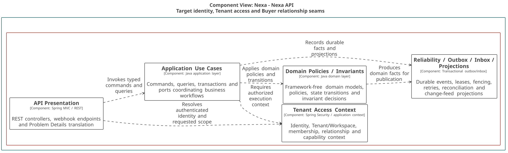
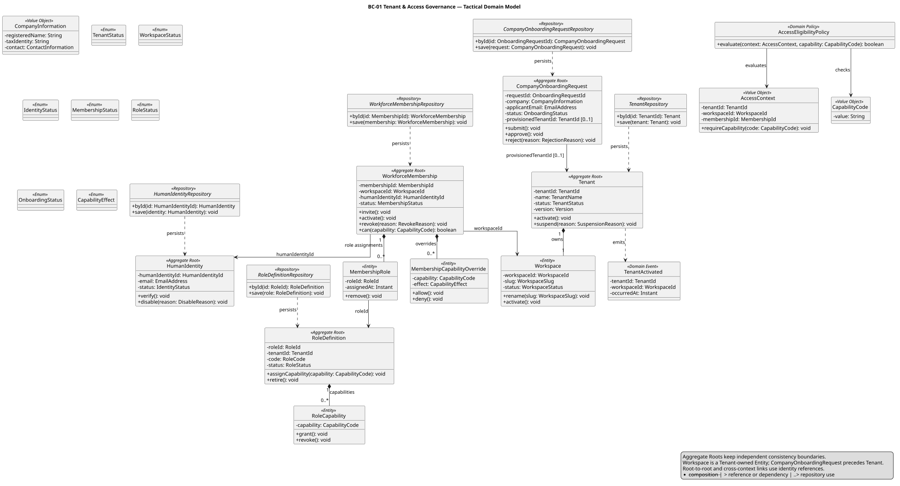
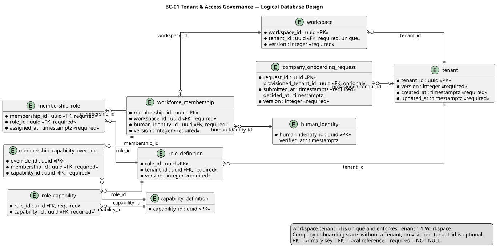

### 2.6.1. Bounded Context: Tenant & Access Governance

BC-01 conserva Tenant como frontera máxima de aislamiento, su Workspace 1:1,
identidad humana, membership laboral, roles y capacidades. Tenant no es
Workspace; HumanIdentity no es WorkforceMembership ni BuyerRelationship. Todo
comando tenant-scoped falla cerrado si alcance o autorización son ambiguos.

#### 2.6.1.1. Domain Layer

El dominio protege ciclos de vida y decisiones de acceso con valores ya
cargados. No realiza HTTP, criptografía de proveedor ni I/O de persistencia.

| Clase | Categoría | Propósito | Atributos / inputs clave | Operaciones principales | Relaciones / ownership |
| :--- | :--- | :--- | :--- | :--- | :--- |
| `Tenant` | Aggregate Root | Aislar organización y ciclo de vida. | `TenantId`, nombre, status, versión. | `activate`, `suspend`. | Compone un `Workspace`. |
| `Workspace` | Entity | Representar entorno operativo 1:1. | `WorkspaceId`, slug, status. | `rename`, `activate`. | Propiedad de `Tenant`; no es root. |
| `HumanIdentity` | Aggregate Root | Mantener identidad humana independiente de Tenant. | `HumanIdentityId`, email normalizado, status. | `verify`, `disable`. | Referenciada por ID desde membership y BC-02. |
| `WorkforceMembership` | Aggregate Root | Gobernar participación laboral en Workspace. | `MembershipId`, `WorkspaceId`, `HumanIdentityId`, roles, status. | `invite`, `activate`, `revoke`, `can`. | Referencias tipadas a Workspace, identidad y rol. |
| `RoleDefinition` | Aggregate Root | Mantener capacidades de un rol tenant-scoped. | `RoleId`, `TenantId`, código, status. | `assignCapability`, `retire`. | Compone `RoleCapability`. |
| `CompanyOnboardingRequest` | Aggregate Root | Mantener solicitud previa a provisión. | solicitud, contacto, status, `provisionedTenantId?`. | `submit`, `approve`, `reject`. | No existe Tenant al enviar; referencia sólo después de provisión. |
| `AccessEligibilityPolicy` | Domain Policy | Evaluar capacidad con contexto ya autorizado. | `AccessContext`, `CapabilityCode`. | `evaluate`, `requireCapability`. | Pura; no consulta repositorios. |
| `TenantRepository`, `HumanIdentityRepository` | Repository interfaces | Cargar y persistir roots con lifecycle propio. | IDs tipados y roots. | `byId`, `save`. | Contratos Domain; infraestructura los implementa. |
| `WorkforceMembershipRepository`, `RoleDefinitionRepository`, `CompanyOnboardingRequestRepository` | Repository interfaces | Acceder independientemente a gobernanza y onboarding. | IDs tipados y roots. | `byId`, `save`. | Ningún repository administra BuyerRelationship. |

#### 2.6.1.2. Interface Layer

La interfaz traduce HTTP autorizado a comandos y consultas. Rechaza alcance
ausente, actor no autorizado o versión obsoleta antes de llamar a Application.

| Clase | Categoría | Propósito | Inputs clave | Operaciones principales | Colaboradores |
| :--- | :--- | :--- | :--- | :--- | :--- |
| `CompanyOnboardingController` | REST Controller | Recibir solicitud y decisión de onboarding. | actor, payload, `Idempotency-Key`. | `submit`, `approve`, `reject`. | Handlers de onboarding. |
| `TenantAccessController` | REST Controller | Exponer activación, suspensión y evaluación de acceso. | actor autenticado, Tenant/Workspace, versión. | `activateTenant`, `suspendTenant`, `evaluateAccess`. | Handlers de Tenant y consulta. |
| `WorkforceMembershipController` | REST Controller | Gestionar membership laboral autorizada. | actor, `MembershipId`, rol, versión. | `invite`, `activate`, `revoke`. | Handlers de membership. |
| `RoleDefinitionController` | REST Controller | Gestionar roles y capacidades. | actor, `RoleId`, capabilities, versión. | `assignCapability`, `retireRole`. | Handler de roles. |

#### 2.6.1.3. Application Layer

Application coordina roots, contratos de repositorio, idempotencia y contexto
servidor explícito. No permite que un Tenant enviado por cliente otorgue acceso.

| Clase | Categoría | Propósito | Inputs clave | Operaciones principales | Colaboradores |
| :--- | :--- | :--- | :--- | :--- | :--- |
| `SubmitCompanyOnboardingCommandHandler` | Command Handler | Crear solicitud sin Tenant ni Workspace. | datos de empresa, actor, llave idempotente. | `handle`. | `CompanyOnboardingRequestRepository`. |
| `ApproveCompanyOnboardingCommandHandler` | Command Handler | Decidir solicitud aprobada o rechazada. | `OnboardingRequestId`, decisión, versión. | `handle`. | Onboarding root y repositorio. |
| `ProvisionTenantCommandHandler` | Command Handler | Proveer Tenant y Workspace tras aprobación. | solicitud aprobada, contexto sistema. | `handle`. | `TenantRepository`, onboarding repository. |
| `ActivateTenantCommandHandler` | Command Handler | Activar un Tenant ya provisionado con autorización y versión válidas. | `TenantId`, actor autorizado, versión. | `handle`. | `TenantRepository`, contexto servidor. |
| `AssignMembershipRoleCommandHandler` | Command Handler | Asignar membership y roles con scope validado. | identidad, Workspace, roles, versión. | `handle`. | Membership y role repositories. |
| `EvaluateAccessQueryHandler` | Query Handler | Devolver decisión de capability fail-closed. | `AccessContext`, capability. | `handle`. | `AccessEligibilityPolicy`, repositories cargados. |

#### 2.6.1.4. Infrastructure Layer

Infrastructure implementa repositories y soporte PostgreSQL scoped. Reconstruye
contexto de worker explícito; no concede permisos por un ID de cliente.

| Clase | Categoría | Propósito | Inputs / datos | Operaciones principales | Colaboradores |
| :--- | :--- | :--- | :--- | :--- | :--- |
| `PostgresTenantRepository` | Repository implementation | Persistir `Tenant` y Workspace compuesto. | registros de tenant/workspace. | `byId`, `save`. | `TenantRepository`, PostgreSQL. |
| `PostgresHumanIdentityRepository` | Repository implementation | Persistir identidad independiente. | identidad normalizada. | `byId`, `save`. | `HumanIdentityRepository`, PostgreSQL. |
| `PostgresWorkforceMembershipRepository` | Repository implementation | Persistir membership y asignaciones locales. | membership, roles, overrides. | `byId`, `save`. | `WorkforceMembershipRepository`. |
| `PostgresRoleDefinitionRepository` | Repository implementation | Persistir roles tenant-scoped. | rol y capacidades. | `byId`, `save`. | `RoleDefinitionRepository`. |
| `PostgresCompanyOnboardingRequestRepository` | Repository implementation | Persistir solicitud y referencia posterior de provisión. | onboarding record. | `byId`, `save`. | `CompanyOnboardingRequestRepository`. |
| `TenantScopePersistenceSupport` | Persistence support | Establecer predicados y scope transaccional fail-closed. | Tenant/Workspace de servidor. | `requireScope`, `applyScope`. | PostgreSQL/RLS y Application. |

#### 2.6.1.5. Bounded Context Software Architecture Component Level Diagrams

La lente C4 TARGET de Identity, Tenant & Customer sitúa los contratos de
scope, identidad y acceso de BC-01 dentro de responsabilidades técnicas
compartidas. No convierte BC-01 en un componente o Container C4.

*Nota. Export canónico generado desde Blueprint Wave 3.*

#### 2.6.1.6. Bounded Context Software Architecture Code Level Diagrams

Los diagramas detallan sólo Domain Layer y su persistencia lógica. Las
referencias a otros contexts permanecen como identidades tipadas.

##### 2.6.1.6.1. Bounded Context Domain Layer Class Diagrams

El UML muestra Workspace como Entity de Tenant y los roots independientes de
identidad, membership, rol y onboarding, incluyendo sus Repository interfaces.

*Nota. Elaboración propia.*

##### 2.6.1.6.2. Bounded Context Database Design Diagram

El modelo relacional conserva `workspace.tenant_id` único, relaciones locales y
referencias explícitas de onboarding; Tenant sigue siendo frontera de datos.

*Nota. Elaboración propia.*
