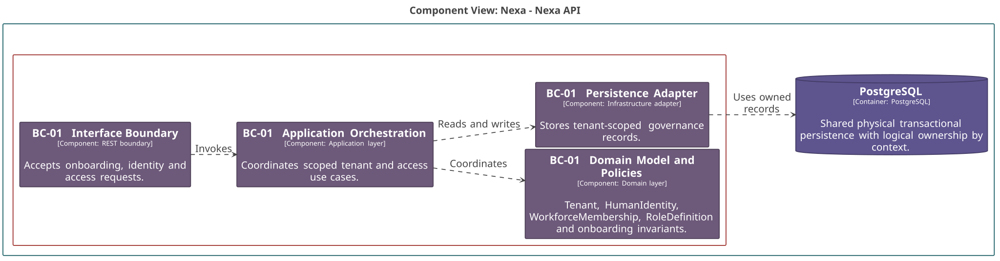

### 2.6.1. Bounded Context: Tenant & Access Governance

BC-01 conserva la frontera máxima de aislamiento: Tenant, Workspace, identidad
humana, membership, roles y capacidades. Tenant no es Workspace;
HumanIdentity no es WorkforceMembership ni BuyerRelationship.

#### 2.6.1.1. Canonical class dictionary

*Clases y responsabilidades de BC-01 por capa.*

| Layer | Class | Category | Purpose | Key Attributes / Inputs | Main Methods / Business Behavior | Relationships / Collaborators | Aggregate Owner / External References |
| :--- | :--- | :--- | :--- | :--- | :--- | :--- | :--- |
| Domain | `Tenant` | Aggregate Root | Aislamiento y ciclo de vida organizacional. | `TenantId`, status, version. | Activate, suspend and enforce tenant scope. | Owns one Workspace. | Owns `Workspace`. |
| Domain | `Workspace` | Entity | Espacio operativo 1:1 del Tenant. | `WorkspaceId`, slug, status. | Rename and change operational status. | Reside dentro de Tenant. | `Tenant`. |
| Domain | `HumanIdentity` | Aggregate Root | Identidad humana independiente del Tenant. | `HumanIdentityId`, normalized email, status. | Verify and disable identity. | Referenciada por ID desde membership y BC-02. | External typed reference for other contexts. |
| Domain | `WorkforceMembership` | Aggregate Root | Participación autorizada de una identidad en Workspace. | `MembershipId`, `WorkspaceId`, `HumanIdentityId`, status. | Invite, activate, revoke and evaluate assigned capabilities. | References Workspace, HumanIdentity and RoleDefinition by ID. | External references by typed ID. |
| Domain | `RoleDefinition` | Aggregate Root | Ciclo de vida de un rol y sus capacidades. | `RoleId`, `TenantId`, code, status. | Assign or retire capabilities. | Owns RoleCapability records. | Owns `RoleCapability`. |
| Domain | `CompanyOnboardingRequest` | Aggregate Root | Solicitud previa a Tenant y Workspace. | Request data, applicant contact, optional `provisionedTenantId`. | Submit, approve or reject. | References Tenant only after provision. | No Tenant exists at submission. |
| Domain | `AccessEligibilityPolicy` | Domain Policy | Evalúa alcance y capacidad con datos ya cargados. | AccessContext, CapabilityCode. | Require capability or deny access. | Pure policy; no provider I/O. | Uses value objects only. |
| Interface | `BC-01 Interface Boundary` | Interface component | Traduce entradas de onboarding y acceso. | Authenticated actor, request payload, idempotency data. | Rejects absent or ambiguous scope. | Calls application orchestration. | No client-supplied Tenant establishes authority. |
| Application | `BC-01 Application Orchestration` | Application component | Coordina activación, membership y evaluación de acceso. | Commands, Tenant/Workspace context, versions. | Restores server scope and publishes only committed facts. | Uses roots, repositories and scoped contracts. | Tenant/Workspace context is explicit. |
| Infrastructure | `BC-01 Persistence Adapter` | Infrastructure component | Persiste ownership lógico de gobernanza. | Tenant-scoped records and constraints. | Maps roots and enforces storage predicates. | PostgreSQL shared physically. | Does not own BC-02 data. |

Tenant es la frontera de datos. Un alcance ausente o ambiguo falla cerrado. La
solicitud de onboarding no contiene Tenant al enviarse; `provisionedTenantId`
aparece sólo después de la provisión aprobada. La restricción única sobre
`workspace.tenant_id` mantiene la relación 1:1.

#### 2.6.1.2. Component and code-level diagrams

*Vista C4 L3 de BC-01 Tenant & Access Governance.*

*Nota. Elaboración propia.*

*Modelo de dominio táctico de BC-01 Tenant & Access Governance.*

*Nota. Elaboración propia.*

*Diseño lógico de base de datos de BC-01 Tenant & Access Governance.*

*Nota. Elaboración propia.*
