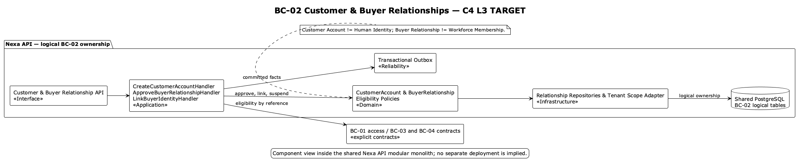
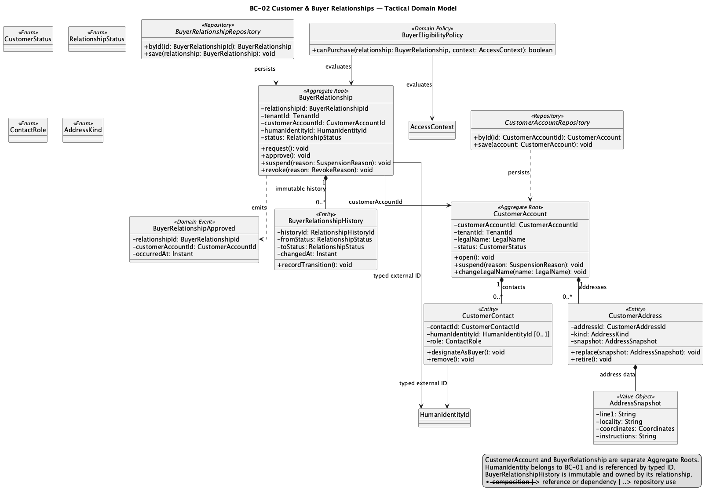
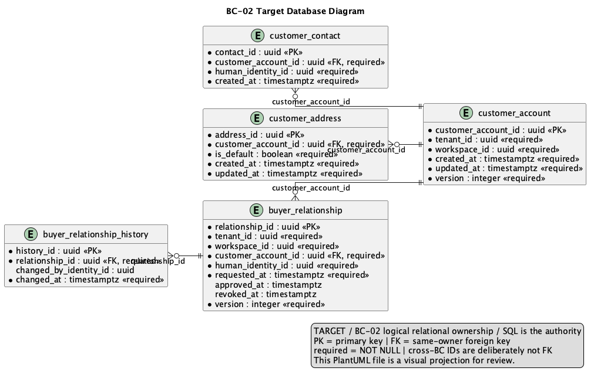

### 2.6.2. Bounded Context: Customer & Buyer Relationships

This context owns supplier-Tenant customer accounts, contacts, addresses and
Buyer Relationship lifecycle. Customer Account may exist without Portal
identity; Buyer Relationship is not Human Identity or Workforce Membership.

#### 2.6.2.1. Domain Layer

| Aggregate/root | Boundary and invariant |
| :--- | :--- |
| `CustomerAccount` | Account, contacts and addresses for a supplier Tenant |
| `BuyerRelationship` | Invitation, approval, suspension and revocation for one supplier Tenant |
| `BuyerRelationshipHistory` | Immutable lifecycle facts, not a mutable child graph |

`CustomerContact` and `CustomerAddress` compose into CustomerAccount.
`ContactInformation`, `Address`, `CustomerAccountId`, `RelationshipId`,
`SupplierTenantId` and `RelationshipStatus` are value objects/types of the model.
`BuyerEligibilityPolicy` evaluates status and Tenant scope. Repositories are
`CustomerAccountRepository` and `BuyerRelationshipRepository`. The accepted scope allows one
active principal Buyer Identity per Customer Account and preserves lifecycle
history.

#### 2.6.2.2. Interface Layer

La Interface Layer expone comandos y consultas versionados de cuenta, dirección y
Buyer Relationship. The exact URI is not invented. Authorization
comes from BC-01; Sales Commitment revalidates relationship eligibility when a
purchase is submitted. Portal/Mobile read projections cannot authorize by
themselves.

#### 2.6.2.3. Application Layer

La Application Layer crea cuentas, mantiene datos de contacto y dirección,
aprueba o suspende relaciones y vincula una identidad principal por referencia. Account and
relationship transitions are separate local consistency boundaries. Commands
carry idempotency/version semantics where retries or stale relationship state
could duplicate approval; committed facts may reach BC-11 through outbox.

#### 2.6.2.4. Infrastructure Layer

La Infrastructure Layer organiza la propiedad lógica en PostgreSQL compartido sobre `customer_account`,
`customer_contact`, `customer_address`, `buyer_relationship` and
`buyer_relationship_history`. Foreign keys to Tenant, Workspace and Human
Identity are stable references; no cross-BC aggregate graph or direct write to
BC-01 tables is implied. RLS/tenant predicates remain required where supported
by the canonical SQL.

#### 2.6.2.5. Bounded Context Software Architecture Component Level Diagrams

Las siguientes clases son especificaciones **TARGET**. Distinguen la cuenta del
cliente, la relación Buyer y la identidad humana; no inventan endpoints ni
trasladan la autorización a Portal o Mobile.

*Clases TARGET por capa de BC-02*

| Capa | Clase | Tipo | Responsabilidad y límite de consistencia |
| --- | --- | --- | --- |
| Interface | `CustomerAccountController` | Controller | Traduce comandos de cuenta, contacto y dirección autorizados por BC-01. |
| Interface | `BuyerRelationshipController` | Controller | Expone invitación, aprobación, suspensión y revocación de la relación Buyer, sin administrar Human Identity. |
| Interface | `CustomerAccountQueryConsumer` | Consumer | Entrega proyecciones autorizadas a Portal o Mobile; una proyección no autoriza una compra. |
| Application | `CreateCustomerAccountHandler` | Command handler | Crea la cuenta en el alcance Tenant/Workspace y protege su identidad comercial. |
| Application | `ManageCustomerAddressHandler` | Command handler | Mantiene direcciones y la invariante de dirección predeterminada dentro de `CustomerAccount`. |
| Application | `ApproveBuyerRelationshipHandler` | Command handler | Verifica autoridad, regla de Buyer principal y escribe historia/outbox tras el commit. |
| Application | `SuspendBuyerRelationshipHandler` | Command handler | Ejecuta transición versionada y obliga a que los consumidores revaliden elegibilidad. |
| Infrastructure | `CustomerAccountRepositoryAdapter` | Repository implementation | Persiste cuenta, contactos y direcciones en tablas de propiedad lógica BC-02. |
| Infrastructure | `BuyerRelationshipRepositoryAdapter` | Repository implementation | Persiste relación e historia inmutable, referenciando identidad por ID. |
| Infrastructure | `TenantAccessPort` | Contract adapter | Consulta el contexto/capacidad de BC-01 sin leer ni mutar sus agregados. |
| Infrastructure | `TraceabilityPublisher` | Outbox adapter | Publica el hecho comprometido para BC-11 mediante outbox durable. |

La vista C4 L3 **TARGET** muestra componentes conceptuales de este contexto dentro de Nexa API. No equivale a un Bounded Context adicional, una base de datos independiente ni una unidad de despliegue.

#### 2.6.2.6. Bounded Context Software Architecture Code Level Diagrams

##### 2.6.2.6.1. Bounded Context Domain Layer Class Diagrams

##### 2.6.2.6.2. Bounded Context Database Design Diagram

Shared PostgreSQL and logical ownership remain the design; no physical
database per context is asserted.
