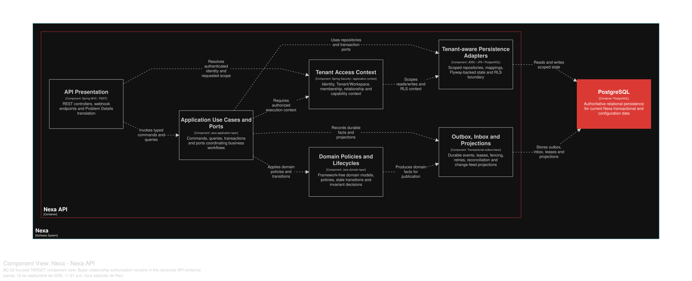

### 2.6.2. Bounded Context: Customer & Buyer Relationships

Este contexto posee cuentas de cliente, contactos, direcciones y el ciclo de
vida de Buyer Relationship para cada supplier-Tenant. Customer Account puede
existir sin identidad Portal; Buyer Relationship no es Human Identity ni
Workforce Membership.

#### 2.6.2.1. Domain Layer

*Agregados y límites invariantes de BC-02.*
| Aggregate/root | Boundary and invariant |
| :--- | :--- |
| `CustomerAccount` | Account, contacts and addresses for a supplier Tenant |
| `BuyerRelationship` | Invitation, approval, suspension and revocation for one supplier Tenant |
| `BuyerRelationshipHistory` | Immutable lifecycle facts, not a mutable child graph |

`CustomerContact` y `CustomerAddress` componen CustomerAccount.
`ContactInformation`, `Address`, `CustomerAccountId`, `RelationshipId`,
`SupplierTenantId` y `RelationshipStatus` son value objects/tipos del modelo.
`BuyerEligibilityPolicy` evalúa estado y alcance Tenant. Los Repository son
`CustomerAccountRepository` y `BuyerRelationshipRepository`. El alcance actual
permite una Buyer Identity principal activa por Customer Account y preserva el
historial de ciclo de vida.

#### 2.6.2.2. Interface Layer

La Interface Layer expone Command y consultas versionadas de cuenta, dirección
y Buyer Relationship. No se inventa la URI exacta. La autorización proviene de
BC-01; Sales Commitment revalida elegibilidad de relación al enviar una compra.
Las proyecciones de lectura Portal/Mobile no pueden autorizar por sí mismas.

#### 2.6.2.3. Application Layer

La Application Layer crea cuentas, mantiene datos de contacto y dirección,
aprueba o suspende relaciones y vincula una identidad principal por referencia.
Las transiciones de Account y Relationship son límites locales de consistencia
separados. Los Command llevan semántica de idempotency/version cuando reintentos
o estado obsoleto de relación podrían duplicar una aprobación; los hechos
comprometidos pueden llegar a BC-11 mediante outbox.

#### 2.6.2.4. Infrastructure Layer

La Infrastructure Layer organiza la propiedad lógica en PostgreSQL compartido sobre `customer_account`,
`customer_contact`, `customer_address`, `buyer_relationship` and
`buyer_relationship_history`. Las foreign keys hacia Tenant, Workspace y Human
Identity son referencias estables; no se infiere un grafo de Aggregate
inter-BC ni escritura directa en tablas de BC-01. Los predicados RLS/Tenant
siguen siendo necesarios donde los soporte el SQL canónico.

#### 2.6.2.5. Bounded Context Software Architecture Component Level Diagrams

Las siguientes clases son especificaciones **TARGET**. Distinguen la cuenta del
cliente, la relación Buyer y la identidad humana; no inventan endpoints ni
trasladan la autorización a Portal o Mobile.

*Clases TARGET por capa de BC-02*

| Capa | Clase | Tipo | Responsabilidad y límite de consistencia |
| --- | --- | --- | --- |
| Interface | `CustomerAccountController` | Controller | Traduce comandos de cuenta, contacto y dirección autorizados por BC-01. |
| Interface | `BuyerRelationshipController` | Controller | Expone invitación, aprobación, suspensión y revocación de la relación Buyer, sin administrar Human Identity. |
| Interface | `CustomerAccountQueryConsumer` | Consumer | Entrega proyecciones autorizadas a Portal o Mobile; una proyección no autoriza una compra. |
| Application | `CreateCustomerAccountHandler` | Command handler | Crea la cuenta en el alcance Tenant/Workspace y protege su identidad comercial. |
| Application | `ManageCustomerAddressHandler` | Command handler | Mantiene direcciones y la invariante de dirección predeterminada dentro de `CustomerAccount`. |
| Application | `ApproveBuyerRelationshipHandler` | Command handler | Verifica autoridad, regla de Buyer principal y escribe historia/outbox tras el commit. |
| Application | `SuspendBuyerRelationshipHandler` | Command handler | Ejecuta transición versionada y obliga a que los consumidores revaliden elegibilidad. |
| Infrastructure | `CustomerAccountRepositoryAdapter` | Repository implementation | Persiste cuenta, contactos y direcciones en tablas de propiedad lógica BC-02. |
| Infrastructure | `BuyerRelationshipRepositoryAdapter` | Repository implementation | Persiste relación e historia inmutable, referenciando identidad por ID. |
| Infrastructure | `TenantAccessPort` | Contract adapter | Consulta el contexto/capacidad de BC-01 sin leer ni mutar sus agregados. |
| Infrastructure | `TraceabilityPublisher` | Outbox adapter | Publica el hecho comprometido para BC-11 mediante outbox durable. |

La vista C4 L3 **TARGET** muestra componentes conceptuales de este contexto dentro de Nexa API. No equivale a un Bounded Context adicional, una base de datos independiente ni una unidad de despliegue.

*Vista C4 L3 TARGET de BC-02 Customer & Buyer Relationships.*

*Nota.* Exportación vectorial desde una vista Structurizr DSL enfocada en BC-02 Customer & Buyer Relationships, dentro del único contenedor Nexa API. Es evidencia de diseño TARGET; no acredita implementación, runtime ni una unidad de despliegue independiente.

#### 2.6.2.6. Bounded Context Software Architecture Code Level Diagrams

##### 2.6.2.6.1. Bounded Context Domain Layer Class Diagrams

*Modelo de dominio táctico de BC-02 Customer & Buyer Relationships.*

*Nota.* El diagrama se presenta como modelo de diseño, no como inventario de código.

##### 2.6.2.6.2. Bounded Context Database Design Diagram

*Proyección del diseño de base de datos de BC-02.*

*Nota.* PostgreSQL compartido y la propiedad lógica forman parte del diseño; no se afirma la existencia de una base de datos física por contexto.
