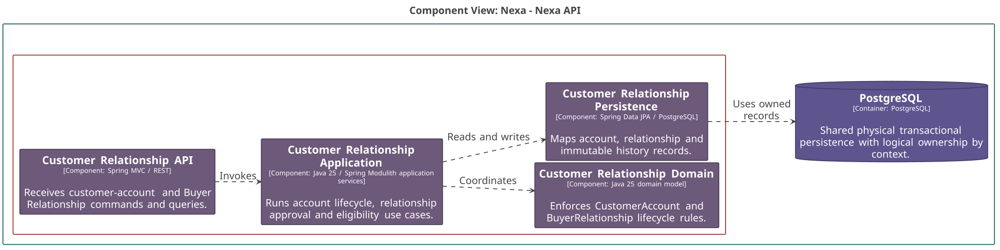
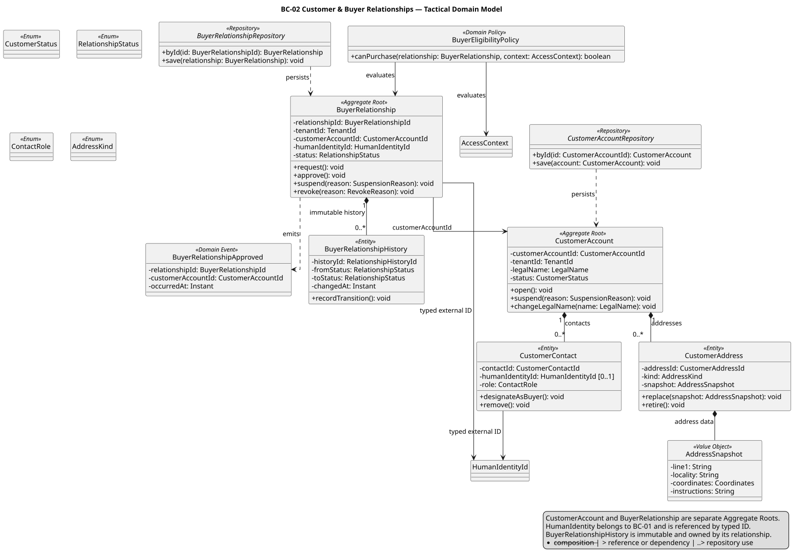
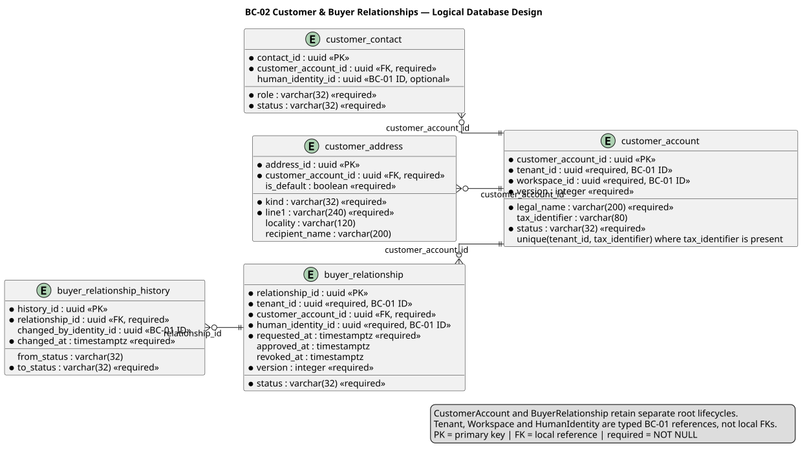

### 2.6.2. Bounded Context: Customer & Buyer Relationships

BC-02 conserva CustomerAccount y BuyerRelationship. Una relación comercial
puede existir sin identidad Portal; BuyerRelationship no es HumanIdentity ni
WorkforceMembership. Su autoridad responde quién puede actuar como Buyer para
un Tenant, sin administrar identidad humana.

#### 2.6.2.1. Domain Layer

El dominio protege el ciclo de cuenta, relación y su historia inmutable. Las
referencias a HumanIdentity, Tenant y Workspace son IDs de BC-01.

| Clase | Categoría | Propósito | Atributos / inputs clave | Operaciones principales | Relaciones / ownership |
| :--- | :--- | :--- | :--- | :--- | :--- |
| `CustomerAccount` | Aggregate Root | Mantener cuenta comercial de cliente. | `CustomerAccountId`, `TenantId`, razón social, status. | `open`, `suspend`, `changeLegalName`. | Compone contactos y direcciones. |
| `BuyerRelationship` | Aggregate Root | Mantener elegibilidad supplier-Buyer. | `BuyerRelationshipId`, `CustomerAccountId`, `HumanIdentityId`, status. | `request`, `approve`, `suspend`, `revoke`. | Compone historial inmutable; IDs externos. |
| `BuyerRelationshipHistory` | Entity | Registrar transición sin reescritura. | status previo/posterior, actor, momento. | `recordTransition`. | Propiedad de `BuyerRelationship`. |
| `AddressSnapshot` | Value Object | Congelar dirección autorizada. | líneas, localidad, instrucciones. | `validate`. | Usado por `CustomerAddress`. |
| `BuyerEligibilityPolicy` | Domain Policy | Evaluar capacidad de compra desde valores cargados. | relación, `AccessContext`. | `canPurchase`. | Pura; sin I/O ni identidad autoritativa. |
| `CustomerAccountRepository` | Repository interface | Cargar y guardar cuenta con lifecycle propio. | `CustomerAccountId`, root. | `byId`, `save`. | Implementado por PostgreSQL. |
| `BuyerRelationshipRepository` | Repository interface | Cargar y guardar relación independientemente. | `BuyerRelationshipId`, root. | `byId`, `save`. | No persiste `HumanIdentity`. |

#### 2.6.2.2. Interface Layer

La interfaz recibe comandos de cuenta y relación con autorización del servidor.
No administra ni persiste HumanIdentity de BC-01.

| Clase | Categoría | Propósito | Inputs clave | Operaciones principales | Colaboradores |
| :--- | :--- | :--- | :--- | :--- | :--- |
| `CustomerAccountController` | REST Controller | Exponer lifecycle de cuenta y perfil. | actor, scope, versión, cuenta. | `open`, `update`, `suspend`. | Handlers de cuenta. |
| `BuyerRelationshipController` | REST Controller | Exponer lifecycle de relación Buyer. | actor, account, `HumanIdentityId`, versión. | `request`, `approve`, `suspend`, `revoke`. | Handlers de relación. |

#### 2.6.2.3. Application Layer

Application coordina roots independientes y consulta de elegibilidad. La
identidad se recibe por contrato tipado; no se replica ni se vuelve propiedad
local.

| Clase | Categoría | Propósito | Inputs clave | Operaciones principales | Colaboradores |
| :--- | :--- | :--- | :--- | :--- | :--- |
| `OpenCustomerAccountCommandHandler` | Command Handler | Abrir cuenta en Tenant autorizado. | cuenta, Tenant/Workspace, llave idempotente. | `handle`. | `CustomerAccountRepository`. |
| `UpdateCustomerAccountCommandHandler` | Command Handler | Cambiar perfil autorizado de una cuenta vigente. | cuenta, legal name, versión. | `handle`. | `CustomerAccountRepository`. |
| `SuspendCustomerAccountCommandHandler` | Command Handler | Suspender cuenta sin borrar su historia comercial. | cuenta, razón, versión. | `handle`. | `CustomerAccountRepository`. |
| `RequestBuyerRelationshipCommandHandler` | Command Handler | Solicitar relación comercial. | account, identidad tipada, actor. | `handle`. | `BuyerRelationshipRepository`. |
| `ApproveBuyerRelationshipCommandHandler` | Command Handler | Aprobar relación pendiente. | relación, decisión, versión. | `handle`. | Relationship root e historial. |
| `SuspendBuyerRelationshipCommandHandler` | Command Handler | Suspender elegibilidad conservando historia. | relación, razón, versión. | `handle`. | `BuyerRelationshipRepository`. |
| `RevokeBuyerRelationshipCommandHandler` | Command Handler | Revocar relación de forma explícita. | relación, razón, versión. | `handle`. | `BuyerRelationshipRepository`. |
| `ResolveBuyerEligibilityQueryHandler` | Query Handler | Resolver elegibilidad para Catalog o Sales. | relación, `AccessContext`. | `handle`. | `BuyerEligibilityPolicy`. |

#### 2.6.2.4. Infrastructure Layer

Infrastructure implementa ambos contratos de repositorio dentro de registros
tenant-scoped y no crea persistencia autoritativa de HumanIdentity.

| Clase | Categoría | Propósito | Inputs / datos | Operaciones principales | Colaboradores |
| :--- | :--- | :--- | :--- | :--- | :--- |
| `PostgresCustomerAccountRepository` | Repository implementation | Mapear cuenta, contactos y direcciones. | records de customer. | `byId`, `save`. | `CustomerAccountRepository`, PostgreSQL. |
| `PostgresBuyerRelationshipRepository` | Repository implementation | Mapear relación e historial append-preserving. | relationship/history records. | `byId`, `save`. | `BuyerRelationshipRepository`, PostgreSQL. |

#### 2.6.2.5. Bounded Context Software Architecture Component Level Diagrams

La vista C4 L3 separa API de relaciones, casos de uso de cuentas/elegibilidad,
modelo y persistencia. BC-01 se consume como contrato de scope, no como tablas
compartidas.

*Nota. Elaboración propia.*

#### 2.6.2.6. Bounded Context Software Architecture Code Level Diagrams

Los diagramas hacen visibles roots separados, entidades poseídas y referencias
tipadas a BC-01.

##### 2.6.2.6.1. Bounded Context Domain Layer Class Diagrams

El UML muestra CustomerAccount y BuyerRelationship con repositories
independientes; HumanIdentity permanece fuera del ownership local.

*Nota. Elaboración propia.*

##### 2.6.2.6.2. Bounded Context Database Design Diagram

El modelo relacional usa FK sólo para entidades locales de cuenta y relación;
Tenant, Workspace y HumanIdentity permanecen como referencias BC-01 tipadas.

*Nota. Elaboración propia.*
