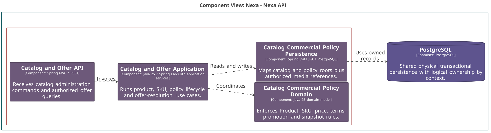
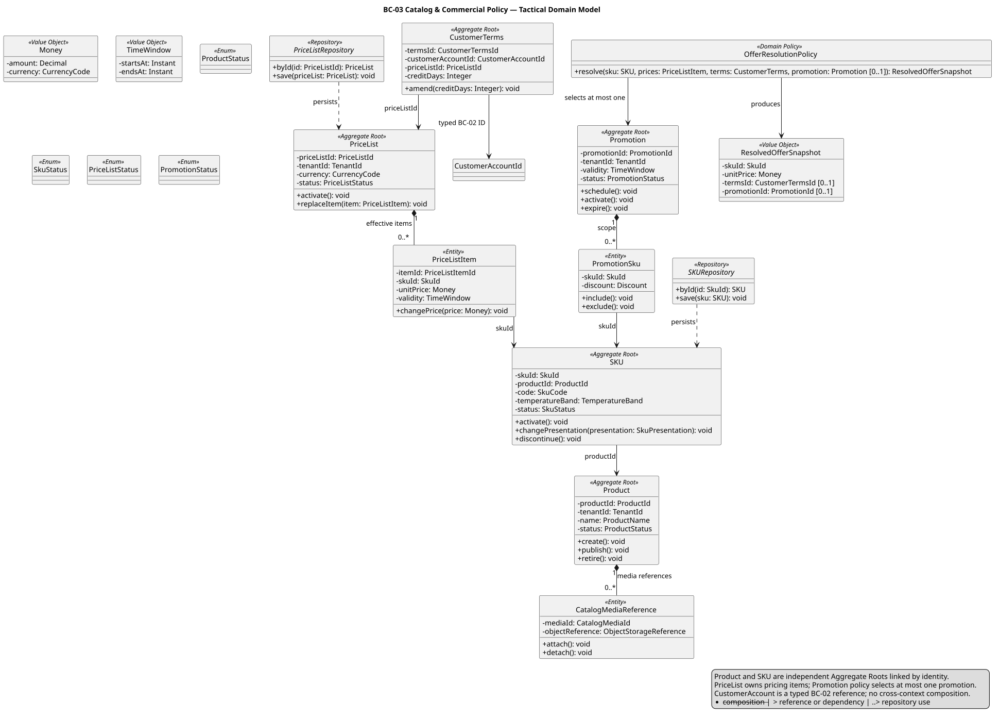
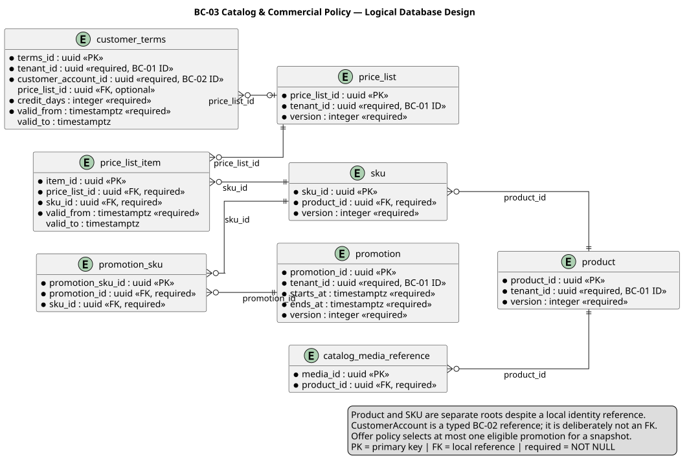

### 2.6.3. Bounded Context: Catalog & Commercial Policy

BC-03 conserva Product, SKU, precio, términos y promociones. Product y SKU
tienen ciclos de vida independientes; los demás contextos reciben IDs o un
Resolved Offer Snapshot, no un grafo de objetos de catálogo.

#### 2.6.3.1. Canonical class dictionary

*Clases y responsabilidades de BC-03 por capa.*

| Layer | Class | Category | Purpose | Key Attributes / Inputs | Main Methods / Business Behavior | Relationships / Collaborators | Aggregate Owner / External References |
| :--- | :--- | :--- | :--- | :--- | :--- | :--- | :--- |
| Domain | `Product` | Aggregate Root | Identidad y ciclo de vida comercial del producto. | `ProductId`, name, status. | Create, publish and retire. | Media reference records are local. | Owns `CatalogMediaReference`. |
| Domain | `SKU` | Aggregate Root | Unidad vendible y requisito de cadena de frío. | `SkuId`, `ProductId`, code, temperature band. | Activate, change presentation and discontinue. | References Product by ID. | Product is not its aggregate owner. |
| Domain | `PriceList` | Aggregate Root | Lista de precios con vigencia. | `PriceListId`, currency, validity. | Activate and maintain effective items. | Owns PriceListItem. | Owns `PriceListItem`. |
| Domain | `CustomerTerms` | Aggregate Root | Términos aplicables a un Customer Account. | `CustomerTermsId`, `CustomerAccountId`, `PriceListId`, credit days. | Amend terms and effective period. | References BC-02 account by ID. | External customer reference. |
| Domain | `Promotion` | Aggregate Root | Transformación comercial elegible. | `PromotionId`, scope, validity, status. | Schedule, activate and expire. | Owns PromotionSku scope. | Owns `PromotionSku`. |
| Domain | `OfferResolutionPolicy` | Domain Policy | Resuelve una oferta comercial reproducible. | SKU, customer reference, effective policies. | Produce ResolvedOfferSnapshot; applies at most one promotion. | Pure policy with loaded values. | No inventory or credit authority. |
| Domain | `ResolvedOfferSnapshot` | Value Object | Captura precio, términos y promoción aplicados. | SKU ID, money, terms, promotion outcome. | Preserve decision input. | Passed to BC-04 by Published Language. | External contract value. |
| Interface | `BC-03 Interface Boundary` | Interface component | Traduce administración y consulta de catálogo. | Actor, scope, version, catalog input. | Rejects unauthorized or stale requests. | Calls application orchestration. | Does not decide a Sales Order. |
| Application | `BC-03 Application Orchestration` | Application component | Coordina catálogo y resolución de oferta. | Catalog commands, customer reference, effective time. | Returns immutable resolved offer data. | Uses BC-02 eligibility contract when required. | Cross-context data stays typed. |
| Infrastructure | `BC-03 Persistence Adapter` | Infrastructure component | Persiste catálogo y política comercial. | Product, SKU, price and policy records. | Maps roots and their local entities. | PostgreSQL and authorized object references. | Does not own BC-04 or BC-05 data. |

Una consulta de precio no crea compromiso, reserva de inventario ni reserva de
crédito. La decisión comercial posterior vuelve a usar el snapshot autorizado.

#### 2.6.3.2. Component and code-level diagrams

*Vista C4 L3 de BC-03 Catalog & Commercial Policy.*

*Nota. Elaboración propia.*

*Modelo de dominio táctico de BC-03 Catalog & Commercial Policy.*

*Nota. Elaboración propia.*

*Diseño lógico de base de datos de BC-03 Catalog & Commercial Policy.*

*Nota. Elaboración propia.*
