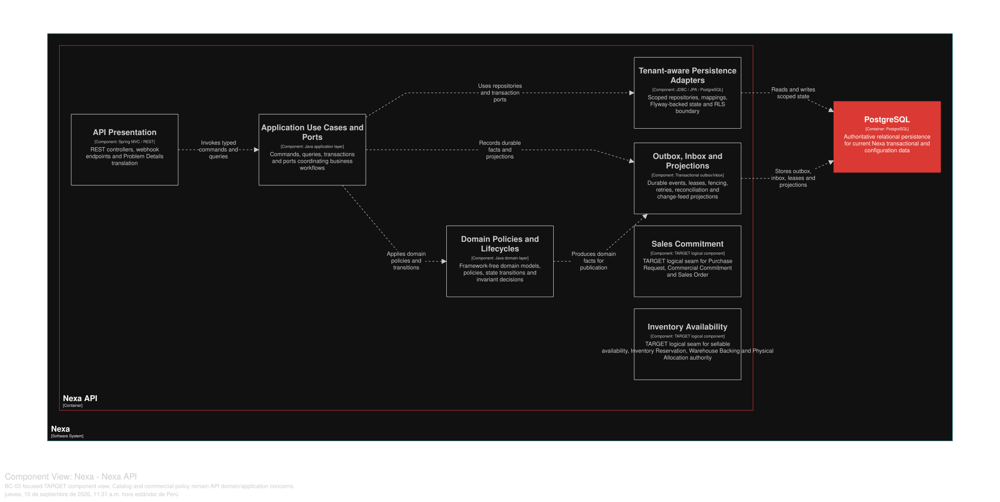

### 2.6.3. Bounded Context: Catalog & Commercial Policy

Product, SKU, price, terms and promotions remain distinct. Downstream contexts
reference SKU identity/snapshots, not a Product object graph.

#### 2.6.3.1. Domain Layer

| Aggregate/root | Boundary and invariant |
| :--- | :--- |
| `Product` | Merchandising identity and lifecycle; media/SKU references stay bounded |
| `SKU` | Independently addressable sellable identity, packaging and cold-chain policy |
| `PriceList` | Effective price items and validity windows |
| `CustomerTerms` | Terms eligibility for a referenced Customer Account |
| `Promotion` | One eligible transformation; promotions do not stack |

Los value objects de diseño incluyen `Money`, `Currency`, `SkuId`, `Visibility`,
`CommercialSnapshot` and `ColdChainRequirement`. `PriceResolver`,
`OfferResolutionPolicy` and `PromotionStackingPolicy` are domain policy seams;
`ProductRepository` and `SkuRepository` own only this context's roots.
Authoritative price resolution revalidates at PR/SO decision; previews do not
reserve inventory or credit. Product != SKU.

#### 2.6.3.2. Interface Layer

La Interface Layer cubre catalog product/SKU lifecycle, catalog query and effective
price/terms resolution. API responses are contracts, not persistence entities;
Mobile may cache safe projections but cannot establish price authority or cold
chain requirements. URI and DTO names beyond verified API evidence are left
open.

#### 2.6.3.3. Application Layer

La Application Layer gestiona Product, SKU, listas de precios, promociones y la
resolución autoritativa de ofertas. They validate Tenant scope, effective intervals and policy
precedence. Idempotency/version semantics protect concurrent catalog changes;
authoritative snapshots cross into Sales Commitment as immutable data.

#### 2.6.3.4. Infrastructure Layer

La Infrastructure Layer organiza la propiedad lógica en PostgreSQL compartido sobre `product`, `sku`, `catalog_media`,
`price_list`, `price_list_item`, `base_price`, `customer_terms`, `promotion`
and `promotion_sku`. Object Storage bytes remain behind an application port.
No Product/SKU table is directly owned by Sales or Inventory; cross-BC IDs and
snapshots are used.

#### 2.6.3.5. Bounded Context Software Architecture Component Level Diagrams

Las siguientes clases son especificaciones **TARGET**. Conservan `Product` y
`SKU` como conceptos distintos, y separan una consulta de precio de la decisión
comercial autoritativa posterior.

*Clases TARGET por capa de BC-03*

| Capa | Clase | Tipo | Responsabilidad y límite de consistencia |
| --- | --- | --- | --- |
| Interface | `CatalogManagementController` | Controller | Traduce altas y cambios de Product, SKU y política comercial autorizados. |
| Interface | `CatalogPricingController` | Controller | Expone una consulta de precio/términos; una respuesta previa no crea compromiso. |
| Interface | `CatalogProjectionConsumer` | Consumer | Proyecta catálogo seguro para Platform, Portal o Mobile sin conceder visibilidad por sí mismo. |
| Application | `ManageProductHandler` | Command handler | Mantiene ciclo de vida de Product y metadatos de media dentro de su límite. |
| Application | `ManageSkuHandler` | Command handler | Conserva la identidad independiente de SKU y su requisito de cadena de frío cuando corresponda. |
| Application | `ResolveCatalogPriceHandler` | Query/application service | Aplica precedencia Base Price, Price List, Customer Terms y una Promotion; distingue preview de snapshot autoritativo. |
| Application | `ManagePriceListHandler` | Command handler | Protege intervalos efectivos versionados para evitar precios activos solapados. |
| Infrastructure | `CatalogProductRepositoryAdapter` | Repository implementation | Persiste Product y media referenciada en PostgreSQL compartido. |
| Infrastructure | `CatalogPricingAdapter` | Query adapter | Ejecuta la consulta efectiva de precio sin trasladar la política al cliente. |
| Infrastructure | `ObjectStorageMediaPort` | Storage adapter | Mantiene bytes de media fuera de PostgreSQL y bajo autorización de aplicación. |
| Infrastructure | `CatalogAuthorizationPort` | Contract adapter | Revalida Tenant y capacidad con BC-01 antes de mutar catálogo. |

La vista C4 L3 **TARGET** muestra componentes conceptuales de este contexto dentro de Nexa API. No equivale a un Bounded Context adicional, una base de datos independiente ni una unidad de despliegue.

*Vista C4 L3 TARGET de BC-03 Catalog & Commercial Policy.*

*Nota.* Exportación vectorial desde una vista Structurizr DSL enfocada en BC-03 Catalog & Commercial Policy, dentro del único contenedor Nexa API. Es evidencia de diseño TARGET; no acredita implementación, runtime ni una unidad de despliegue independiente.

El diagrama se presenta como modelo de diseño y no como prueba de una
implementación en ejecución.

#### 2.6.3.6. Bounded Context Software Architecture Code Level Diagrams

##### 2.6.3.6.1. Bounded Context Domain Layer Class Diagrams

##### 2.6.3.6.2. Bounded Context Database Design Diagram

Diagram is a shared-PostgreSQL logical projection with constraints;
canonical SQL remains authority.
