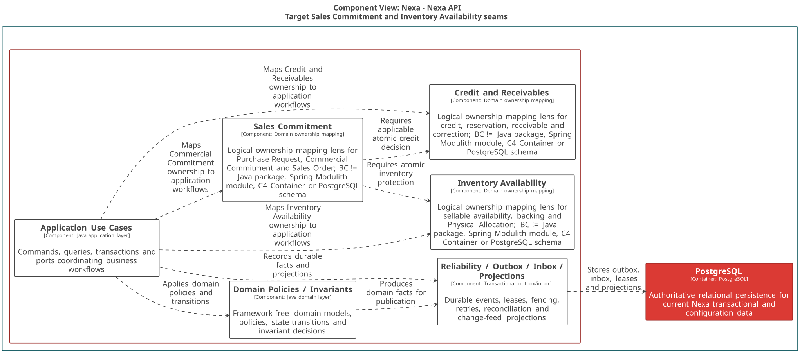

### 2.6.3. Bounded Context: Catalog & Commercial Policy

BC-03 conserva Product, SKU, precio, términos y promociones. Product y SKU
tienen ciclos de vida independientes. BC-03, y sólo BC-03, resuelve y produce
`ResolvedOfferSnapshot`; BC-04 lo recibe como input inmutable, nunca como
ownership compartido.

#### 2.6.3.1. Domain Layer

El dominio modela catálogo y política comercial. Una consulta de precio no crea
compromiso, reserva de inventario ni reserva de crédito.

| Clase | Categoría | Propósito | Atributos / inputs clave | Operaciones principales | Relaciones / ownership |
| :--- | :--- | :--- | :--- | :--- | :--- |
| `Product` | Aggregate Root | Mantener identidad y lifecycle comercial. | `ProductId`, `TenantId`, código, nombre, status. | `create`, `publish`, `retire`. | Compone `CatalogMediaReference`. |
| `SKU` | Aggregate Root | Mantener unidad vendible y requisito frío. | `SkuId`, `ProductId`, código, banda térmica, status. | `activate`, `changePresentation`, `discontinue`. | Referencia Product por ID; no es hijo. |
| `PriceList` | Aggregate Root | Mantener precios con vigencia. | `PriceListId`, moneda, status, items. | `activate`, `replaceItem`. | Compone `PriceListItem`. |
| `CustomerTerms` | Aggregate Root | Mantener términos aplicables por Customer. | `CustomerTermsId`, `CustomerAccountId`, `PriceListId`, crédito. | `amend`. | `CustomerAccountId` tipado de BC-02. |
| `Promotion` | Aggregate Root | Mantener transformación comercial elegible. | `PromotionId`, `TenantId`, código, vigencia, status. | `schedule`, `activate`, `expire`. | Compone `PromotionSku`. |
| `ResolvedOfferSnapshot` | Value Object | Capturar resultado de resolución. | SKU, precio, términos, promoción opcional. | preservación inmutable. | Producido por BC-03; contrato de input para BC-04. |
| `OfferResolutionPolicy` | Domain Policy | Aplicar Base Price, lista, términos y máximo una promoción. | valores comerciales cargados, tiempo efectivo. | `resolve`. | Pura; no conoce stock ni crédito. |
| `ProductRepository`, `SKURepository`, `PriceListRepository` | Repository interfaces | Cargar y guardar roots de catálogo independientes. | IDs tipados y roots. | `byId`, `save`. | Implementaciones PostgreSQL. |
| `CustomerTermsRepository`, `PromotionRepository` | Repository interfaces | Cargar y guardar policy roots. | IDs tipados y roots. | `byId`, `save`. | Sin acceso a BC-02 persistente. |

#### 2.6.3.2. Interface Layer

La interfaz separa administración de catálogo de resolución autorizada de
oferta; ambas requieren scope y relationship eligibility cuando corresponde.

| Clase | Categoría | Propósito | Inputs clave | Operaciones principales | Colaboradores |
| :--- | :--- | :--- | :--- | :--- | :--- |
| `CatalogAdministrationController` | REST Controller | Administrar Product, SKU, listas, términos y promociones. | actor, scope, versión, comandos. | `createProduct`, `activateSku`, `maintainPriceList`, `maintainPromotion`. | Handlers de catálogo. |
| `OfferResolutionController` | REST Controller | Resolver oferta para una relación elegible. | SKU, BuyerRelationship, tiempo efectivo. | `resolveOffer`. | Query handler y contrato BC-02. |

#### 2.6.3.3. Application Layer

Application orquesta lifecycle de cada root y carga los valores requeridos para
una resolución reproducible. Sólo devuelve snapshot autorizado e inmutable.

| Clase | Categoría | Propósito | Inputs clave | Operaciones principales | Colaboradores |
| :--- | :--- | :--- | :--- | :--- | :--- |
| `CreateProductCommandHandler` | Command Handler | Crear Product tenant-scoped. | producto, Tenant, actor. | `handle`. | `ProductRepository`. |
| `ActivateSkuCommandHandler` | Command Handler | Activar o descontinuar SKU independiente. | SKU, versión, presentación. | `handle`. | `SKURepository`. |
| `MaintainPriceListCommandHandler` | Command Handler | Mantener lista e items vigentes. | lista, items, tiempo efectivo. | `handle`. | `PriceListRepository`. |
| `MaintainCustomerTermsCommandHandler` | Command Handler | Cambiar términos de Customer autorizado. | CustomerAccount ID, terms, vigencia. | `handle`. | `CustomerTermsRepository`. |
| `MaintainPromotionCommandHandler` | Command Handler | Programar o retirar promoción. | promoción, scope SKU, vigencia. | `handle`. | `PromotionRepository`. |
| `ResolveOfferQueryHandler` | Query Handler | Producir `ResolvedOfferSnapshot`. | SKU, BuyerRelationship, tiempo. | `handle`. | `OfferResolutionPolicy`, contrato de elegibilidad BC-02. |

#### 2.6.3.4. Infrastructure Layer

Infrastructure implementa repositories de roots independientes y referencias de
media autorizadas; no contiene decisión de compromiso ni inventario.

| Clase | Categoría | Propósito | Inputs / datos | Operaciones principales | Colaboradores |
| :--- | :--- | :--- | :--- | :--- | :--- |
| `PostgresProductRepository` | Repository implementation | Mapear Product y media metadata. | product/media records. | `byId`, `save`. | `ProductRepository`, PostgreSQL. |
| `PostgresSkuRepository` | Repository implementation | Mapear SKU tenant-scoped. | SKU record. | `byId`, `save`. | `SKURepository`. |
| `PostgresPriceListRepository` | Repository implementation | Mapear PriceList e items. | price records. | `byId`, `save`. | `PriceListRepository`. |
| `PostgresCustomerTermsRepository` | Repository implementation | Mapear términos y vigencia. | customer terms records. | `byId`, `save`. | `CustomerTermsRepository`. |
| `PostgresPromotionRepository` | Repository implementation | Mapear Promotion y SKU scope. | promotion records. | `byId`, `save`. | `PromotionRepository`. |
| `CatalogMediaObjectReferenceAdapter` | Object-reference adapter | Validar y almacenar referencia autorizada de media. | metadata y object reference. | `attach`, `detach`. | `CatalogMediaReference`; no ownership de bytes. |

#### 2.6.3.5. Bounded Context Software Architecture Component Level Diagrams

La lente C4 TARGET de Commercial & Inventory sitúa catálogo, oferta y políticas
de BC-03 dentro de responsabilidades técnicas compartidas. La relación con
BC-02 es un contrato de elegibilidad; BC-03 no se convierte en un componente o
Container C4.

*Nota. Export canónico generado desde Blueprint Wave 3.*

#### 2.6.3.6. Bounded Context Software Architecture Code Level Diagrams

Los diagramas muestran los roots de catálogo y el snapshot que BC-03 produce.

##### 2.6.3.6.1. Bounded Context Domain Layer Class Diagrams

El UML mantiene Product y SKU como roots independientes y declara repositories
para cada root con lifecycle propio.

*Nota. Elaboración propia.*

##### 2.6.3.6.2. Bounded Context Database Design Diagram

El diagrama hace tenant-scoped los códigos comerciales y preserva FKs sólo para
relaciones locales; CustomerAccount permanece como ID externo de BC-02.

*Nota. Elaboración propia.*
