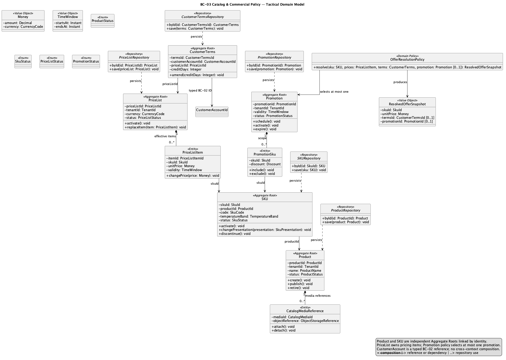
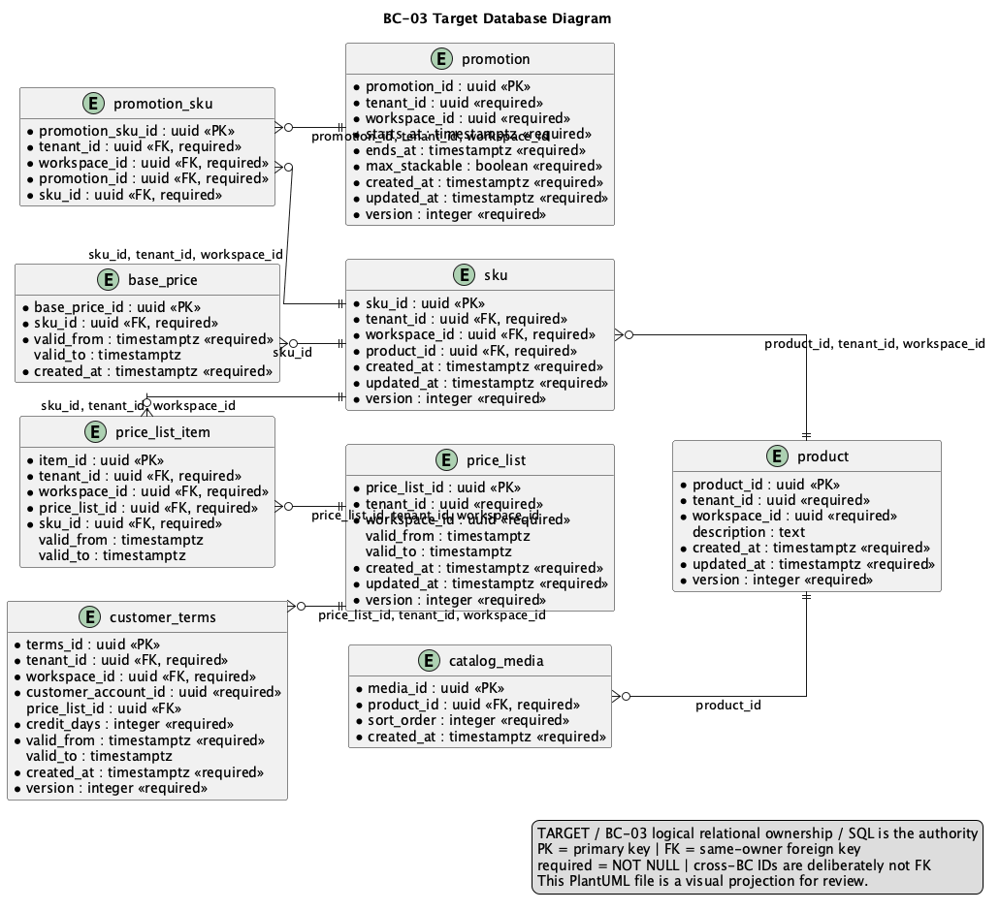

# 2.6.3. BC-03 — Catalog & Commercial Policy

`DOMAIN MODEL: TARGET / ACCEPTED`
`IMPLEMENTATION CROSSWALK: AS-IS VERIFIED / PARTIAL`

Canonical target: Blueprint `01-shared/domain/bounded-contexts/BC-03-catalog-commercial-policy/`.
Product, SKU, price, terms and promotions remain distinct. Downstream contexts
reference SKU identity/snapshots, not a Product object graph.

## 2.6.3.1 Domain Layer

| Aggregate/root | Boundary and invariant |
| :--- | :--- |
| `Product` | Merchandising identity and lifecycle; media/SKU references stay bounded |
| `SKU` | Independently addressable sellable identity, packaging and cold-chain policy |
| `PriceList` | Effective price items and validity windows |
| `CustomerTerms` | Terms eligibility for a referenced Customer Account |
| `Promotion` | One eligible transformation; promotions do not stack |

Target value objects include `Money`, `Currency`, `SkuId`, `Visibility`,
`CommercialSnapshot` and `ColdChainRequirement`. `PriceResolver`,
`OfferResolutionPolicy` and `PromotionStackingPolicy` are domain policy seams;
`ProductRepository` and `SkuRepository` own only this context's roots.
Authoritative price resolution revalidates at PR/SO decision; previews do not
reserve inventory or credit. Product != SKU.

## 2.6.3.2 Interface Layer

Target roles cover catalog product/SKU lifecycle, catalog query and effective
price/terms resolution. API responses are contracts, not persistence entities;
Mobile may cache safe projections but cannot establish price authority or cold
chain requirements. URI and DTO names beyond verified API evidence are left
open.

## 2.6.3.3 Application Layer

Target handlers manage Product, SKU, price lists, promotions and authoritative
offer resolution. They validate Tenant scope, effective intervals and policy
precedence. Idempotency/version semantics protect concurrent catalog changes;
authoritative snapshots cross into Sales Commitment as immutable data.

## 2.6.3.4 Infrastructure Layer

Target shared PostgreSQL ownership covers `product`, `sku`, `catalog_media`,
`price_list`, `price_list_item`, `base_price`, `customer_terms`, `promotion`
and `promotion_sku`. Object Storage bytes remain behind an application port.
No Product/SKU table is directly owned by Sales or Inventory; cross-BC IDs and
snapshots are used.

AS-IS anchor: API `catalogcommercialpolicy` domain/application/presentation
and persistence paths, including catalog management and pricing migrations.
Catalog query/product/SKU code is `AS-IS VERIFIED`; complete target separation
of policy roots and all lifecycle parity is `PARTIAL`; Mobile implementation
and runtime are `NOT EVIDENCED`.

## 2.6.3.5 Bounded Context Software Architecture Component Level Diagrams

The selected component family is `Nexa-API-CommercialInventory-TARGET`.
It groups API components for commercial and inventory concerns in the same API
container. Component grouping is not BC/container/deployment equivalence.

See [provenance](../../../../delivery-checklists/chapter-02-evidence-provenance.md) for Structurizr source,
export hash and target caveat.

## 2.6.3.6 Bounded Context Software Architecture Code Level Diagrams

### 2.6.3.6.1 Bounded Context Domain Layer Class Diagrams

Source: [domain-model.puml](../../../assets/chapter-2/tactical/BC-03/domain-model.puml).

### 2.6.3.6.2 Bounded Context Database Design Diagram

Source: [database-diagram.puml](../../../assets/chapter-2/tactical/BC-03/database-diagram.puml).
Diagram is a shared-PostgreSQL logical projection with target constraints;
canonical SQL remains authority.

## Crosswalk and open evidence

| Concern | Classification | Evidence boundary |
| :--- | :--- | :--- |
| Catalog/product/SKU/pricing implementation | `AS-IS VERIFIED` | API `catalogcommercialpolicy` at `origin/main` |
| Product != SKU and policy target | `TARGET / ACCEPTED` | Blueprint tactical model/data model |
| Complete target promotion/terms snapshot parity | `PARTIAL` | No inference from package names alone |
| Mobile authority, runtime and validación de producto | `NOT EVIDENCED` | API remains server authority |
