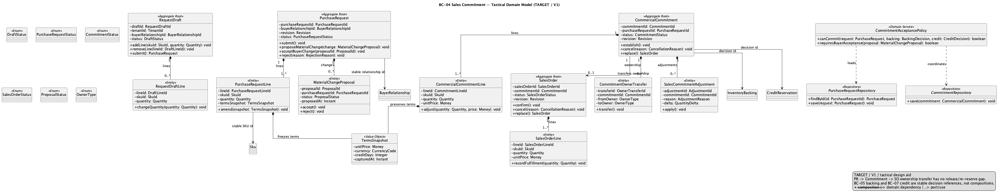
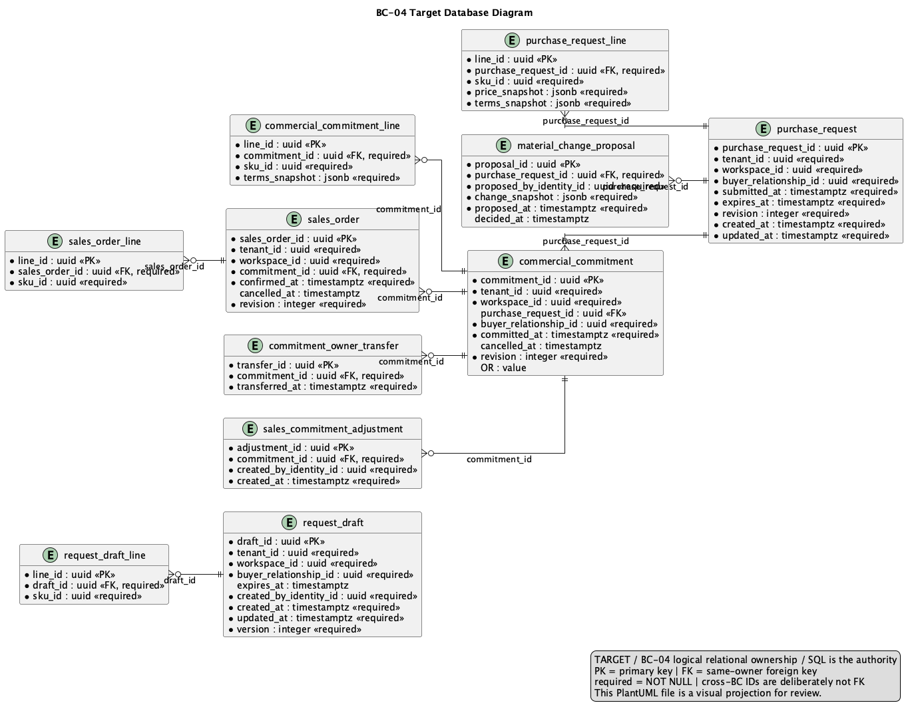

# 2.6.5. BC-04 — Sales Commitment

`DOMAIN MODEL: TARGET / ACCEPTED`
`IMPLEMENTATION CROSSWALK: AS-IS VERIFIED / PARTIAL`

Canonical target: Blueprint `01-shared/domain/bounded-contexts/BC-04-sales-commitment/`.
This Core Domain context owns buyer intent, Purchase Request, Commercial
Commitment and Sales Order. Draft, commitment, inventory backing and physical
allocation are different facts and authorities.

## 2.6.5.1 Domain Layer

| Aggregate/root | Boundary and invariant |
| :--- | :--- |
| `RequestDraft` | Editable intent; creates no commitment or reservation |
| `PurchaseRequest` | Submitted all-or-nothing intent with expiry and immutable snapshots |
| `CommercialCommitment` | Warehouse-neutral SKU demand with one explicit origin |
| `SalesOrder` | Confirmed commercial roll-up and lifecycle; no draft SO in V1 |

`RequestDraftLine`, `PurchaseRequestLine`, `CommitmentLine`,
`MaterialChangeProposal`, `CommercialSnapshot` and adjustment facts preserve
line/history boundaries. Value objects include `CommitmentId`, `SkuQuantity`,
`TermsSnapshot` and `OrderRevision`; `CommitmentAcceptancePolicy` and
`MaterialChangePolicy` coordinate domain decisions. Repositories own purchase
request and sales order roots.

Target invariants: PR submit establishes complete inventory backing and
applicable credit reservation before commit; `PURCHASE_REQUEST` origin requires
a real PR reference while `DIRECT_ORDER` has none; PR-to-SO transfers
commitment ownership without release/re-reserve; expiry is checked at
`now >= expiresAt`; material change requires buyer acceptance and
revalidation. SO completion is not payment confirmation.

## 2.6.5.2 Interface Layer

Target contracts express draft, submit, approve/convert, direct order, material
change and order query behavior. Exact endpoint names are not invented here.
Retry-sensitive commands require idempotency and stale mutable resources use
version/If-Match semantics where accepted. API authorization and decision state
remain authoritative; Mobile is only a future projection.

## 2.6.5.3 Application Layer

Target handlers coordinate catalog snapshot, buyer eligibility, inventory
backing and credit decision contracts within the required logical consistency
boundary. They preserve direct-order versus PR origin and use durable
idempotency. Integration events are emitted only after local commit; no
cross-context aggregate is loaded.

## 2.6.5.4 Infrastructure Layer

Target shared PostgreSQL ownership covers `request_draft`,
`request_draft_line`, `purchase_request`, `purchase_request_line`,
`material_change_proposal`, `commercial_commitment`,
`commercial_commitment_line`, `commitment_owner_transfer`,
`sales_commitment_adjustment`, `sales_order` and `sales_order_line`.
Inventory backing, physical allocation and credit reservation remain referenced
through explicit contracts/IDs, not direct table ownership.

AS-IS anchor: API `salescommitment` purchase-request, direct-order and sales
order domain/application/persistence paths plus idempotency/concurrency tests.
Existing PR/SO workflows are `AS-IS VERIFIED`; full target inventory/credit
atomicity and all lifecycle parity are `PARTIAL`; Mobile implementation and
runtime are `NOT EVIDENCED`.

## 2.6.5.5 Bounded Context Software Architecture Component Level Diagrams

`Nexa-API-CommercialInventory-TARGET` is the selected API component family for
commercial and inventory collaboration. It is one logical view within one API
container, not one container per BC.

The C4 source/export provenance and target caveat are in the [Chapter 2
register](../../../assets/chapter-2/provenance.md).

## 2.6.5.6 Bounded Context Software Architecture Code Level Diagrams

### 2.6.5.6.1 Bounded Context Domain Layer Class Diagrams

Source: [domain-model.puml](../../../assets/chapter-2/tactical/BC-04/domain-model.puml).

### 2.6.5.6.2 Bounded Context Database Design Diagram

Source: [database-diagram.puml](../../../assets/chapter-2/tactical/BC-04/database-diagram.puml).
The drawing is a logical projection of shared PostgreSQL; immutable snapshots,
PK/FK/unique/check constraints and ownership are defined by canonical target
SQL.

## Crosswalk and open evidence

| Concern | Classification | Evidence boundary |
| :--- | :--- | :--- |
| PR/direct-order/SO code and tests | `AS-IS VERIFIED` | API `salescommitment` at `origin/main` |
| Commitment/backing/credit target boundary | `TARGET / ACCEPTED` | Blueprint tactical model and data model |
| Complete atomic parity under all races | `PARTIAL` | Current code does not silently redefine target |
| Mobile implementation, runtime and Product Acceptance | `NOT EVIDENCED` | Mobile remains a planned projection |
