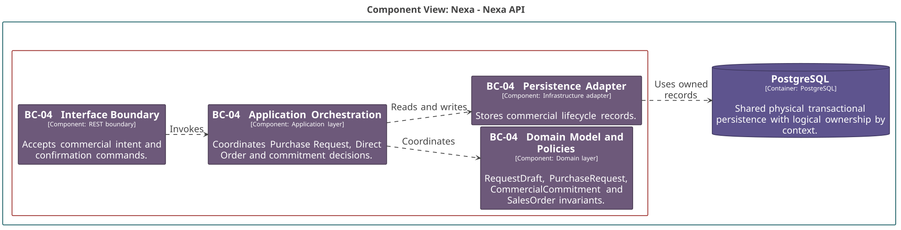
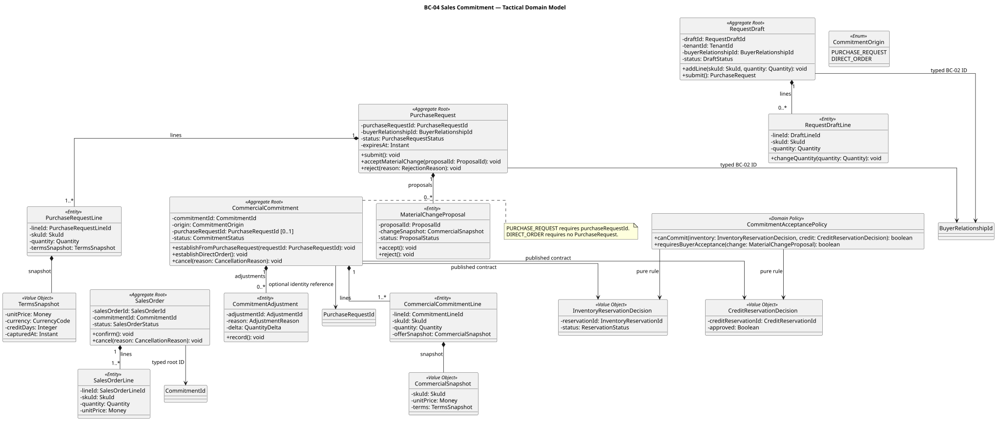
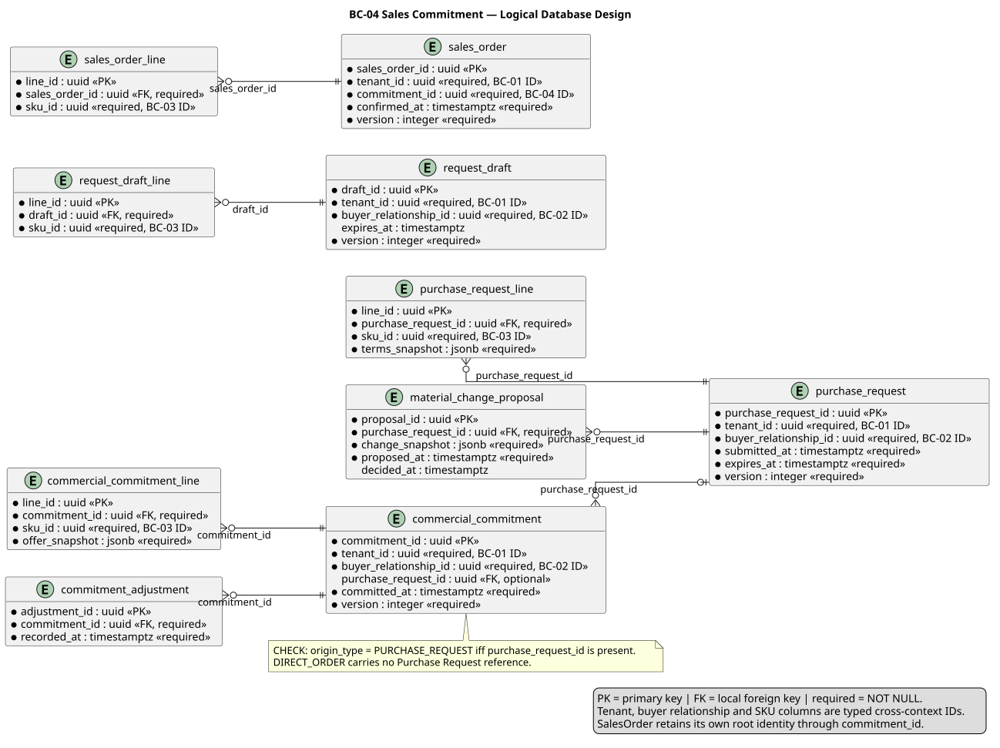

### 2.6.4. Bounded Context: Sales Commitment

BC-04 conserva intención comercial, compromiso y orden. RequestDraft,
PurchaseRequest, CommercialCommitment y SalesOrder son raíces independientes;
sus referencias usan identidad. BC-04 coordina contratos síncronos de BC-05 y
BC-07, sin cargar ni poseer sus aggregates. `ResolvedOfferSnapshot` llega de
BC-03 como contrato inmutable: BC-04 captura su decisión comercial, pero no lo
resuelve ni lo posee.

#### 2.6.4.1. Domain Layer

El dominio mantiene snapshots comerciales y reglas de transición.
`ResolvedOfferSnapshot` es input externo inmutable de BC-03; su representación
capturada en BC-04 no comparte ownership. Un Draft no crea otro root: prepara
datos de envío, y una Factory/Application Handler crea PurchaseRequest sin
composición entre roots.

| Clase | Categoría | Propósito | Atributos / inputs clave | Operaciones principales | Relaciones / ownership |
| :--- | :--- | :--- | :--- | :--- | :--- |
| `RequestDraft` | Aggregate Root | Mantener intención editable previa. | Draft, `BuyerRelationshipId`, líneas, status. | `addLine`, `prepareSubmission`. | Compone `RequestDraftLine`; produce datos, no PurchaseRequest. |
| `PurchaseRequest` | Aggregate Root | Mantener solicitud enviada y vencimiento. | request, `BuyerRelationshipId`, `expiresAt`, status. | `submit`, `acceptMaterialChange`, `reject`. | Compone líneas y propuestas. |
| `CommercialCommitment` | Aggregate Root | Mantener demanda comercial protegible. | commitment, origen, `PurchaseRequestId?`, status. | `establishFromPurchaseRequest`, `establishDirectOrder`, `cancel`. | Compone líneas/ajustes; decisiones externas tipadas. |
| `SalesOrder` | Aggregate Root | Mantener obligación confirmada. | order, `CommitmentId`, status. | `confirm`, `cancel`. | Compone líneas; referencia commitment por ID. |
| `RequestSubmissionData` | Value Object | Transportar datos válidos de Draft hacia construcción. | `BuyerRelationshipId`, líneas, `ResolvedOfferSnapshot`. | inmutable. | Consume contrato inmutable de BC-03; input de `PurchaseRequestFactory`. |
| `PurchaseRequestFactory` | Domain Factory | Construir PurchaseRequest desde datos ya validados. | `RequestSubmissionData`, expiración. | `create`. | No es propiedad de Draft. |
| `CommitmentAcceptancePolicy` | Domain Policy | Evaluar decisiones de stock y crédito ya traducidas. | `InventoryReservationDecision`, `CreditReservationDecision`. | `canCommit`, `requiresBuyerAcceptance`. | Pura; sin repositorio ni I/O. |
| `RequestDraftRepository`, `PurchaseRequestRepository` | Repository interfaces | Acceder a roots de intención y solicitud. | IDs y roots. | `byId`, `save`. | Implementados por PostgreSQL. |
| `CommercialCommitmentRepository`, `SalesOrderRepository` | Repository interfaces | Acceder a roots de compromiso y orden. | IDs y roots. | `byId`, `save`. | No persisten inventario ni crédito. |

#### 2.6.4.2. Interface Layer

La interfaz expresa acciones comerciales reales y conserva `Idempotency-Key`,
scope y versiones en el borde.

| Clase | Categoría | Propósito | Inputs clave | Operaciones principales | Colaboradores |
| :--- | :--- | :--- | :--- | :--- | :--- |
| `CommercialRequestController` | REST Controller | Gestionar Draft y PurchaseRequest. | actor, `BuyerRelationshipId`, líneas, versión, llave. | `submitPurchaseRequest`, `acceptMaterialChange`, `withdraw`. | Handlers de solicitud. |
| `SalesOrderController` | REST Controller | Gestionar orden directa y confirmación. | actor, commitment/order, versión, llave. | `confirmDirectOrder`, `confirmSalesOrder`, `cancel`. | Handlers comerciales. |

#### 2.6.4.3. Application Layer

Application coordina `ResolvedOfferSnapshot` inmutable de BC-03, elegibilidad
de BC-02 y decisiones síncronas de inventario/crédito. Cada root mantiene su
invariante propio.

| Clase | Categoría | Propósito | Inputs clave | Operaciones principales | Colaboradores |
| :--- | :--- | :--- | :--- | :--- | :--- |
| `SubmitPurchaseRequestCommandHandler` | Command Handler | Crear PurchaseRequest desde Draft preparado. | Draft, `ResolvedOfferSnapshot`, idempotencia, expiración. | `handle`. | `PurchaseRequestFactory`, BC-05/BC-07 contracts. |
| `ConfirmDirectOrderCommandHandler` | Command Handler | Confirmar ruta DIRECT_ORDER sin PurchaseRequest. | intención, `ResolvedOfferSnapshot`, decisiones requeridas. | `handle`. | `CommercialCommitmentRepository`, BC-05/BC-07. |
| `EstablishCommercialCommitmentCommandHandler` | Command Handler | Persistir demanda tras decisiones explícitas. | origen, líneas, inventory/credit decisions. | `handle`. | Commitment root y policy. |
| `ConfirmSalesOrderCommandHandler` | Command Handler | Confirmar SalesOrder desde Commitment admisible. | `CommitmentId`, versión, llave. | `handle`. | `SalesOrderRepository`, outbox. |
| `AcceptMaterialChangeCommandHandler` | Command Handler | Revalidar cambio material aceptado. | proposal, `ResolvedOfferSnapshot`, decisiones nuevas. | `handle`. | PurchaseRequest, BC-05 y BC-07. |

#### 2.6.4.4. Infrastructure Layer

Infrastructure implementa repositorios de lifecycle comercial y publicación
durable local; no escribe tablas de Inventory Availability ni Credit.

| Clase | Categoría | Propósito | Inputs / datos | Operaciones principales | Colaboradores |
| :--- | :--- | :--- | :--- | :--- | :--- |
| `PostgresRequestDraftRepository` | Repository implementation | Mapear Draft y líneas. | draft records. | `byId`, `save`. | `RequestDraftRepository`. |
| `PostgresPurchaseRequestRepository` | Repository implementation | Mapear solicitud, líneas y propuestas. | request records. | `byId`, `save`. | `PurchaseRequestRepository`. |
| `PostgresCommercialCommitmentRepository` | Repository implementation | Mapear commitment y ajustes. | commitment records. | `byId`, `save`. | `CommercialCommitmentRepository`. |
| `PostgresSalesOrderRepository` | Repository implementation | Mapear orden y líneas. | sales-order records. | `byId`, `save`. | `SalesOrderRepository`. |
| `CommercialCommitmentOutboxPublisher` | Outbox adapter | Persistir hecho comprometido en misma transacción. | facts locales, correlación. | `enqueue`. | Application y transporte posterior. |

#### 2.6.4.5. Bounded Context Software Architecture Component Level Diagrams

La vista C4 L3 muestra API comercial, aplicación de commitment, dominio y
persistencia. Sus contratos con BC-05 y BC-07 son síncronos y explícitos.

*Nota. Elaboración propia.*

#### 2.6.4.6. Bounded Context Software Architecture Code Level Diagrams

Los diagramas separan roots comerciales y el modelo relacional de origen.

##### 2.6.4.6.1. Bounded Context Domain Layer Class Diagrams

El UML evita una operación `RequestDraft.submit(): PurchaseRequest`, muestra
datos de envío y Factory sin ownership entre raíces independientes, y representa
`ResolvedOfferSnapshot` como contrato inmutable externo de BC-03.

*Nota. Elaboración propia.*

##### 2.6.4.6.2. Bounded Context Database Design Diagram

El modelo relacional expresa el CHECK de origen: `PURCHASE_REQUEST` exige
`purchase_request_id`; `DIRECT_ORDER` no lo contiene. El snapshot comercial se
captura localmente sin FK de ownership hacia BC-03; las cantidades se mantienen
positivas y las IDs de otros contexts no se convierten en ownership.

*Nota. Elaboración propia.*
