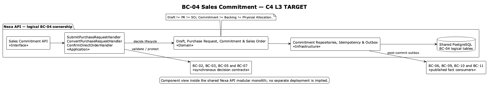

### 2.6.4. Bounded Context: Sales Commitment

This Core Domain context owns buyer intent, Purchase Request, Commercial
Commitment and Sales Order. Draft, commitment, inventory backing and physical
allocation are different facts and authorities.

#### 2.6.4.1. Domain Layer

| Aggregate/root | Boundary and invariant |
| :--- | :--- |
| `RequestDraft` | Editable intent; creates no commitment or reservation |
| `PurchaseRequest` | Submitted all-or-nothing intent with expiry and immutable snapshots |
| `CommercialCommitment` | Warehouse-neutral SKU demand with one explicit origin |
| `SalesOrder` | Confirmed commercial roll-up and lifecycle; no draft SO in initial scope |

`RequestDraftLine`, `PurchaseRequestLine`, `CommitmentLine`,
`MaterialChangeProposal`, `CommercialSnapshot` and adjustment facts preserve
line/history boundaries. Value objects include `CommitmentId`, `SkuQuantity`,
`TermsSnapshot` and `OrderRevision`; `CommitmentAcceptancePolicy` and
`MaterialChangePolicy` coordinate domain decisions. Repositories own purchase
request and sales order roots.

Invariantes de diseño: PR submit establishes complete inventory backing and
applicable credit reservation before commit; `PURCHASE_REQUEST` origin requires
a real PR reference while `DIRECT_ORDER` has none; PR-to-SO transfers
commitment ownership without release/re-reserve; expiry is checked at
`now >= expiresAt`; material change requires buyer acceptance and
revalidation. SO completion is not payment confirmation.

#### 2.6.4.2. Interface Layer

La Interface Layer expresa contratos para draft, submit, approve/convert, direct order, material
change and order query behavior. Exact endpoint names are not invented here.
Retry-sensitive commands require idempotency and stale mutable resources use
version/If-Match semantics where accepted. API authorization and decision state
remain authoritative; Mobile is only a planned projection.

#### 2.6.4.3. Application Layer

La Application Layer coordina el snapshot de catálogo, la elegibilidad de Buyer,
el respaldo de inventario y los contratos de decisión de crédito dentro del
límite lógico de consistencia requerido. They preserve direct-order versus PR origin and use durable
idempotency. Integration events are emitted only after local commit; no
cross-context aggregate is loaded.

#### 2.6.4.4. Infrastructure Layer

La Infrastructure Layer organiza la propiedad lógica en PostgreSQL compartido sobre `request_draft`,
`request_draft_line`, `purchase_request`, `purchase_request_line`,
`material_change_proposal`, `commercial_commitment`,
`commercial_commitment_line`, `commitment_owner_transfer`,
`sales_commitment_adjustment`, `sales_order` and `sales_order_line`.
Inventory backing, physical allocation and credit reservation remain referenced
through explicit contracts/IDs, not direct table ownership.

#### 2.6.4.5. Bounded Context Software Architecture Component Level Diagrams

La vista C4 L3 **TARGET** muestra componentes conceptuales de este contexto dentro de Nexa API. No equivale a un Bounded Context adicional, una base de datos independiente ni una unidad de despliegue.

#### 2.6.4.6. Bounded Context Software Architecture Code Level Diagrams

##### 2.6.4.6.1. Bounded Context Domain Layer Class Diagrams

##### 2.6.4.6.2. Bounded Context Database Design Diagram

The drawing is a logical projection of shared PostgreSQL; immutable snapshots,
PK/FK/unique/check constraints and ownership are defined by canonical SQL.
