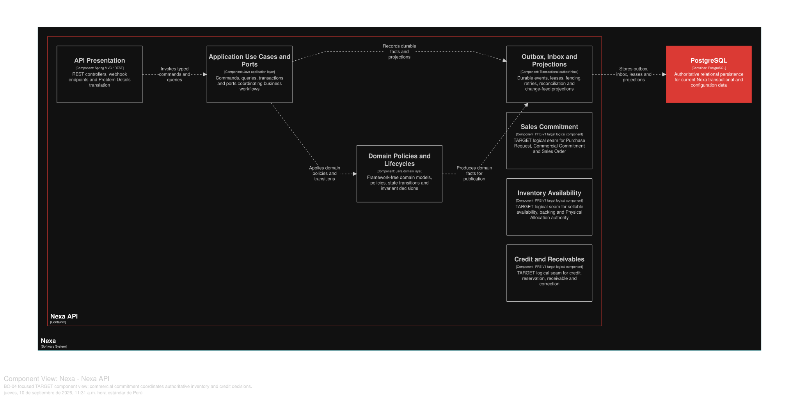

### 2.6.4. Bounded Context: Sales Commitment

Este contexto de Core Domain posee intención Buyer, Purchase Request,
Commercial Commitment y Sales Order. Draft, commitment, Inventory Reservation,
Warehouse Backing y Physical Allocation son hechos y autoridades distintos.

#### 2.6.4.1. Domain Layer

*Agregados y límites invariantes de BC-04.*
| Aggregate/root | Boundary and invariant |
| :--- | :--- |
| `RequestDraft` | Editable intent; creates no commitment or reservation |
| `PurchaseRequest` | Submitted all-or-nothing intent with expiry and immutable snapshots |
| `CommercialCommitment` | Warehouse-neutral SKU demand with one explicit origin |
| `SalesOrder` | Confirmed commercial roll-up and lifecycle; no draft SO in initial scope |

`RequestDraftLine`, `PurchaseRequestLine`, `CommitmentLine`,
`MaterialChangeProposal`, `CommercialSnapshot` y los hechos de ajuste
preservan límites de línea e historial. Los value objects incluyen
`CommitmentId`, `SkuQuantity`, `TermsSnapshot` y `OrderRevision`;
`CommitmentAcceptancePolicy` y `MaterialChangePolicy` coordinan decisiones de
dominio. Los Repository poseen los roots de Purchase Request y Sales Order.

Invariantes de diseño: enviar una PR establece Inventory Reservation completa,
Warehouse Backing determinista y la reserva de crédito aplicable antes del
commit; Physical Allocation permanece como una selección posterior de lotes
propiedad de Inventory para fulfillment. El origen `PURCHASE_REQUEST` requiere
una referencia PR real, mientras que `DIRECT_ORDER` no la tiene; PR-to-SO
transfiere propiedad de Commitment sin liberar ni reservar otra vez; la
expiración se comprueba con `now >= expiresAt`; un cambio material requiere
aceptación Buyer y revalidación. Completar una SO no confirma Payment.

#### 2.6.4.2. Interface Layer

La Interface Layer expresa contratos para draft, submit, approve/convert,
direct order, material change y consultas de pedido. Aquí no se inventan
endpoint names exactos. Los Command sensibles a reintentos requieren
idempotency y los recursos mutables obsoletos usan semántica version/If-Match
cuando corresponda. La autorización API y el estado de decisión permanecen
autoritativos; Mobile sólo es una proyección planificada.

#### 2.6.4.3. Application Layer

La Application Layer coordina el snapshot de catálogo, la elegibilidad de Buyer,
la Inventory Reservation, el Warehouse Backing y los contratos de decisión de
crédito dentro del límite lógico de consistencia requerido. Preserva el origen
direct-order frente a PR y usa idempotency durable. Los integration events se
emiten sólo después del commit local; no se carga un Aggregate de otro contexto.

#### 2.6.4.4. Infrastructure Layer

La Infrastructure Layer organiza la propiedad lógica en PostgreSQL compartido sobre `request_draft`,
`request_draft_line`, `purchase_request`, `purchase_request_line`,
`material_change_proposal`, `commercial_commitment`,
`commercial_commitment_line`, `commitment_owner_transfer`,
`sales_commitment_adjustment`, `sales_order` y `sales_order_line`. Inventory
Reservation, Warehouse Backing, Physical Allocation y la reserva de crédito se
referencian mediante contratos e ID explícitos, no mediante propiedad directa de
tablas.

#### 2.6.4.5. Bounded Context Software Architecture Component Level Diagrams

Las siguientes clases son especificaciones **TARGET**. Expresan una decisión
comercial atómica por contratos explícitos: no cargan agregados ajenos ni
convierten un Draft en Sales Order sin la transición aceptada.

*Clases TARGET por capa de BC-04*

| Capa | Clase | Tipo | Responsabilidad y límite de consistencia |
| --- | --- | --- | --- |
| Interface | `BuyerRequestController` | Controller | Recibe comandos de Draft y Purchase Request con `Idempotency-Key`; no confirma inventario localmente. |
| Interface | `SalesOrderController` | Controller | Expone consultas y transiciones comerciales autorizadas con versión cuando corresponde. |
| Interface | `SalesCommitmentConsumer` | Contract consumer | Recibe resultados explícitos de inventory/credit; no es un endpoint ni comparte agregados. |
| Application | `SubmitPurchaseRequestHandler` | Command handler | Coordina en un límite lógico la validación, Commitment, Inventory Reservation, Warehouse Backing y crédito antes del commit. |
| Application | `AcceptMaterialChangeHandler` | Command handler | Revalida precio, inventario y crédito tras aceptación Buyer; preserva el estado previo si falla. |
| Application | `ConvertPurchaseRequestHandler` | Command handler | Aplica CAS y guardia `now >= expiresAt`, transfiriendo el Commitment sin liberar y re-reservar. |
| Application | `ConfirmDirectOrderHandler` | Command handler | Confirma Direct Order con Commitment de origen explícito, sin fabricar Purchase Request. |
| Infrastructure | `PurchaseRequestRepositoryAdapter` | Repository implementation | Persiste PR, líneas y snapshots inmutables de BC-04. |
| Infrastructure | `CommercialCommitmentRepositoryAdapter` | Repository implementation | Conserva Commitment warehouse-neutral y su transferencia de titularidad. |
| Infrastructure | `InventoryAvailabilityPort` | Synchronous contract adapter | Solicita Inventory Reservation y Warehouse Backing a BC-05 por ID y resultado, sin mutar tablas de inventario. |
| Infrastructure | `CreditReservationPort` | Synchronous contract adapter | Solicita decisión de BC-07 sin apropiarse de Receivable o ledger. |
| Infrastructure | `SalesOutboxAdapter` | Outbox adapter | Publica hechos sólo después del commit local, con entrega al menos una vez. |

La vista C4 L3 **TARGET** muestra componentes conceptuales de este contexto dentro de Nexa API. No equivale a un Bounded Context adicional, una base de datos independiente ni una unidad de despliegue.

*Vista C4 L3 TARGET de BC-04 Sales Commitment.*

*Nota.* Exportación vectorial desde una vista Structurizr DSL enfocada en BC-04 Sales Commitment, dentro del único contenedor Nexa API. Es evidencia de diseño TARGET; no acredita implementación, runtime ni una unidad de despliegue independiente.

#### 2.6.4.6. Bounded Context Software Architecture Code Level Diagrams

##### 2.6.4.6.1. Bounded Context Domain Layer Class Diagrams

*Modelo de dominio táctico de BC-04 Sales Commitment.*

*Nota.* El diagrama se presenta como modelo de diseño, no como inventario de código.

##### 2.6.4.6.2. Bounded Context Database Design Diagram

*Proyección del diseño de base de datos de BC-04.*

*Nota.* El diagrama es una proyección lógica de PostgreSQL compartido; las instantáneas inmutables, las restricciones PK/FK/unique/check y la propiedad están definidas por el SQL canónico.
