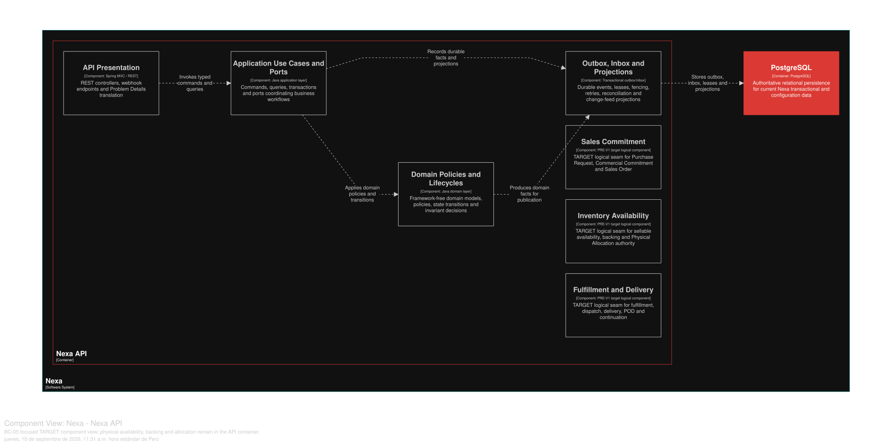

### 2.6.5. Bounded Context: Inventory Availability

This Core Domain context owns physical stock truth, sellable availability,
lot/expiry/disposition, Inventory Reservation, Warehouse Backing and Physical
Allocation. Safety Stock is a policy, not a reservation.

#### 2.6.5.1. Domain Layer

*Agregados y límites invariantes de BC-05.*
| Aggregate/root | Boundary and invariant |
| :--- | :--- |
| `InventoryPosition` | SKU + Warehouse quantity authority and sellable inputs |
| `InventoryLot` | Lot, expiry, disposition and physical quantity |
| `InventoryReservation` | Inventory-owned protection of Commercial Commitment demand; it does not select a Lot |
| `WarehouseBacking` | Deterministic distribution of an Inventory Reservation across eligible Warehouses |
| `PhysicalAllocation` | Selects lot quantities for a Fulfillment contract |
| `WarehouseTransfer` | Explicit `REQUESTED -> IN_TRANSIT -> RECEIVED` movement |

`Warehouse`, `SafetyStockPolicy`, `InventoryMovement`, `LotDisposition`,
`PhysicalAllocationLine` and adjustment/count facts support the roots. Value
objects include `SkuId`, `WarehouseId`, `LotId`, `Quantity`, `ExpiryDate` and
`Disposition`; policies include `SellableAvailabilityPolicy` and
`FEFOAllocationPolicy`. Movement/adjustment facts are append-only.

Invariante de diseño: Sellable Availability = usable on-hand − active Inventory
Reservations − Safety Stock, with each reservation counted once. Warehouse
Backing distributes that reservation without selecting physical lots. HOLD,
QUARANTINE, DAMAGED/WASTE, EXPIRED and IN_TRANSIT are not sellable. Allocation
cannot exceed reserved/backed or usable lot quantity. Scarce inventory uses
conditional updates, locks and version/CAS; no last-write-wins.

#### 2.6.5.2. Interface Layer

La Interface Layer cubre warehouse/lot receipt, availability, Inventory
Reservation, Warehouse Backing, allocation, transfer, adjustment and picking
inputs. URI/DTO names not present in verified API evidence remain open. Any
Mobile command is submitted to the server; local scans/evidence cannot
authorize allocation or mutate stock.

#### 2.6.5.3. Application Layer

La Application Layer coordina decisiones de disponibilidad, Inventory
Reservation, Warehouse Backing, asignación FEFO y transiciones de transferencia.
They enforce Tenant scope, deterministic
warehouse selection and idempotent movement commands. Fulfillment receives
stable allocation IDs; it does not write inventory tables directly.

#### 2.6.5.4. Infrastructure Layer

La Infrastructure Layer organiza la propiedad lógica en PostgreSQL compartido sobre `warehouse`, `safety_stock_policy`,
`inventory_lot`, `inventory_position`, `inventory_movement`, `lot_disposition`,
`inventory_reservation`, `inventory_reservation_line`, `warehouse_backing`,
`warehouse_backing_line`, `physical_allocation`,
`physical_allocation_line`, `warehouse_transfer`, `warehouse_transfer_line`
and `inventory_adjustment`. Tenant predicates and constraints stay in canonical
SQL. No physical database per BC is implied.

#### 2.6.5.5. Bounded Context Software Architecture Component Level Diagrams

Las siguientes clases son especificaciones **TARGET**. Protegen stock escaso
mediante contratos y concurrencia explícitos; `SafetyStock`,
`InventoryReservation`, `WarehouseBacking` y `PhysicalAllocation` no se tratan
como sinónimos.

*Clases TARGET por capa de BC-05*

| Capa | Clase | Tipo | Responsabilidad y límite de consistencia |
| --- | --- | --- | --- |
| Interface | `InventoryController` | Controller | Recibe comandos de disponibilidad, ajuste y disposición autorizados; no acepta una lectura Mobile como verdad final. |
| Interface | `WarehouseController` | Controller | Mantiene configuración de Warehouse y políticas bajo alcance Tenant. |
| Interface | `OperationsInventoryConsumer` | Consumer | Recibe trabajo o proyecciones de scan para Operations Mobile sin conceder asignación física. |
| Application | `CreateInventoryReservationHandler` | Command handler | Protege la demanda de Commercial Commitment dentro del límite lógico requerido con BC-04/BC-07, sin seleccionar lotes. |
| Application | `DistributeWarehouseBackingHandler` | Command handler | Distribuye la Inventory Reservation por Warehouse elegible de modo determinista y deja explícito cualquier shortage. |
| Application | `AllocatePhysicalStockHandler` | Command handler | Bloquea SKU/Warehouse/Lot en orden determinista y aplica FEFO sin seleccionar stock no vendible. |
| Application | `TransferInventoryHandler` | Command handler | Mantiene `REQUESTED`, `IN_TRANSIT` y `RECEIVED`, dejando el stock no vendible durante tránsito. |
| Application | `RecordDispositionHandler` | Command handler | Registra HOLD, quarentena o disposición con motivo, preservando hechos de inventario. |
| Infrastructure | `InventoryRepositoryAdapter` | Repository implementation | Persiste posición, lote y movimiento con CAS o actualización condicional. |
| Infrastructure | `InventoryReservationAdapter` | Repository implementation | Persiste la protección de demanda sin duplicar el descuento de Reservation en disponibilidad. |
| Infrastructure | `WarehouseBackingAdapter` | Repository implementation | Persiste la distribución por Warehouse sin convertirla en selección de Lot. |
| Infrastructure | `FEFOQueryAdapter` | Query adapter | Ordena lotes elegibles para la política FEFO sin incluir vencidos o en cuarentena. |
| Infrastructure | `TenantScopedTransactionPort` | Technical adapter | Fija alcance de RLS/worker y falla cerrado si éste es ambiguo. |
| Infrastructure | `InventoryOutboxAdapter` | Outbox adapter | Publica el hecho comprometido, no una transición provisional. |

La vista C4 L3 **TARGET** muestra componentes conceptuales de este contexto dentro de Nexa API. No equivale a un Bounded Context adicional, una base de datos independiente ni una unidad de despliegue.

*Vista C4 L3 TARGET de BC-05 Inventory Availability.*

*Nota.* Exportación vectorial desde una vista Structurizr DSL enfocada en BC-05 Inventory Availability, dentro del único contenedor Nexa API. Es evidencia de diseño TARGET; no acredita implementación, runtime ni una unidad de despliegue independiente.

#### 2.6.5.6. Bounded Context Software Architecture Code Level Diagrams

##### 2.6.5.6.1. Bounded Context Domain Layer Class Diagrams

*Modelo de dominio táctico de BC-05 Inventory Availability.*

*Nota.* El diagrama se presenta como modelo de diseño, no como inventario de código.

##### 2.6.5.6.2. Bounded Context Database Design Diagram

*Proyección del diseño de base de datos de BC-05.*

*Nota.* Es una proyección lógica de PostgreSQL compartido; el SQL canónico mantiene la autoridad sobre las restricciones PK/FK/unique/check y los detalles de RLS/alcance Tenant.
