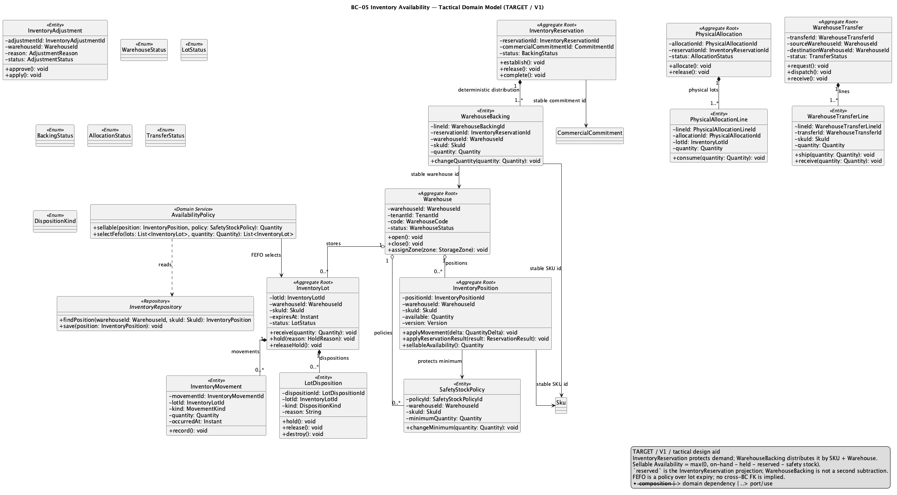
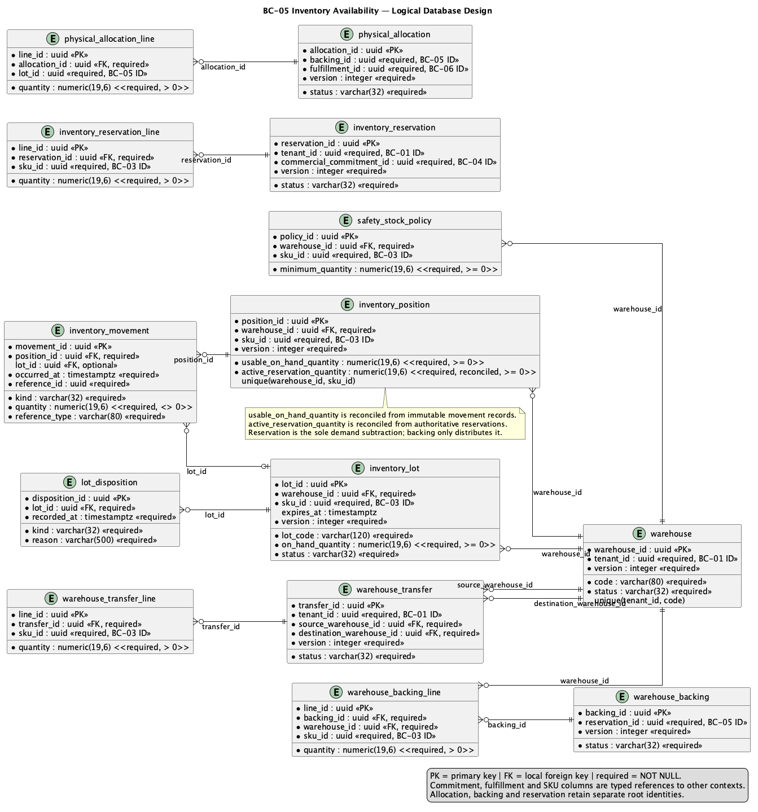

### 2.6.5. Bounded Context: Inventory Availability

This Core Domain context owns physical stock truth, sellable availability,
lot/expiry/disposition, inventory backing and Physical Allocation. Safety Stock
is a policy, not a reservation.

#### 2.6.5.1. Domain Layer

| Aggregate/root | Boundary and invariant |
| :--- | :--- |
| `InventoryPosition` | SKU + Warehouse quantity authority and sellable inputs |
| `InventoryLot` | Lot, expiry, disposition and physical quantity |
| `InventoryBacking` | Protects Commercial Commitment demand across eligible warehouses |
| `PhysicalAllocation` | Selects lot quantities for a Fulfillment contract |
| `WarehouseTransfer` | Explicit `REQUESTED -> IN_TRANSIT -> RECEIVED` movement |

`Warehouse`, `SafetyStockPolicy`, `InventoryMovement`, `LotDisposition`,
`PhysicalAllocationLine` and adjustment/count facts support the roots. Value
objects include `SkuId`, `WarehouseId`, `LotId`, `Quantity`, `ExpiryDate` and
`Disposition`; policies include `SellableAvailabilityPolicy` and
`FEFOAllocationPolicy`. Movement/adjustment facts are append-only.

Invariante de diseño: Sellable Availability = usable on-hand − active Commercial
Commitments − Safety Stock, with backing counted once. HOLD, QUARANTINE,
DAMAGED/WASTE, EXPIRED and IN_TRANSIT are not sellable. Allocation cannot
exceed committed/backed or usable lot quantity. Scarce inventory uses
conditional updates, locks and version/CAS; no last-write-wins.

#### 2.6.5.2. Interface Layer

La Interface Layer cubre warehouse/lot receipt, availability, backing,
allocation, transfer, adjustment and picking inputs. URI/DTO names not present
in verified API evidence remain open. Any Mobile command is submitted to the
server; local scans/evidence cannot authorize allocation or mutate stock.

#### 2.6.5.3. Application Layer

La Application Layer coordina decisiones de disponibilidad, respaldo de
commitments, asignación FEFO y transiciones de transferencia. They enforce Tenant scope, deterministic
warehouse selection and idempotent movement commands. Fulfillment receives
stable allocation IDs; it does not write inventory tables directly.

#### 2.6.5.4. Infrastructure Layer

La Infrastructure Layer organiza la propiedad lógica en PostgreSQL compartido sobre `warehouse`, `safety_stock_policy`,
`inventory_lot`, `inventory_position`, `inventory_movement`, `lot_disposition`,
`inventory_backing`, `inventory_backing_line`, `physical_allocation`,
`physical_allocation_line`, `warehouse_transfer`, `warehouse_transfer_line`
and `inventory_adjustment`. Tenant predicates and constraints stay in canonical
SQL. No physical database per BC is implied.

#### 2.6.5.5. Bounded Context Software Architecture Component Level Diagrams

La familia de componentes de Nexa API representa la colaboración lógica
mostrada dentro de una API compartida. No equivale a un Bounded Context
adicional, una base de datos independiente ni una unidad de despliegue.

#### 2.6.5.6. Bounded Context Software Architecture Code Level Diagrams

##### 2.6.5.6.1. Bounded Context Domain Layer Class Diagrams

Source: [domain-model.puml](../../../assets/chapter-2/tactical/BC-05/domain-model.puml).

##### 2.6.5.6.2. Bounded Context Database Design Diagram

Source: [database-diagram.puml](../../../assets/chapter-2/tactical/BC-05/database-diagram.puml).
It is a logical shared-PostgreSQL projection; canonical SQL remains the
authority for PK/FK/unique/check and RLS/tenant-scope details.
