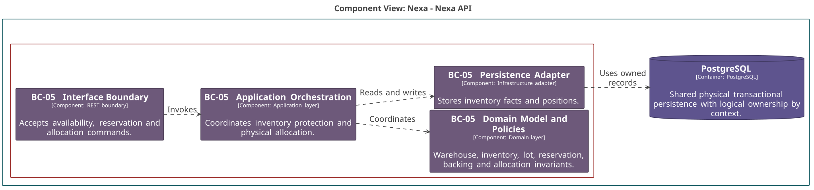
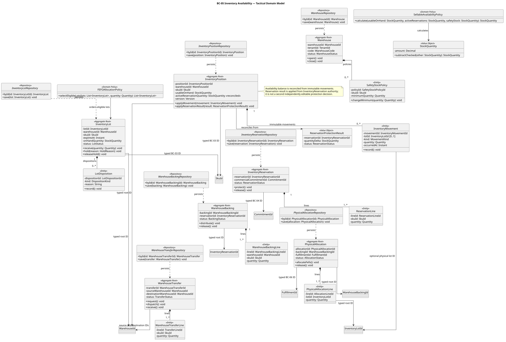
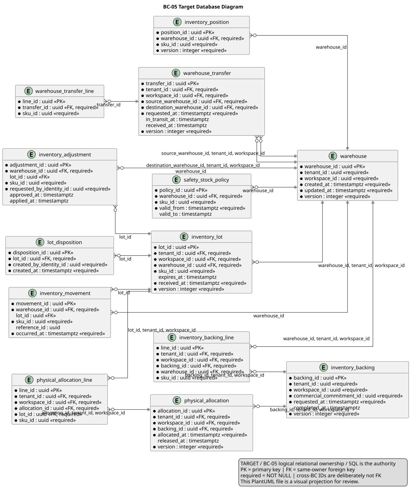

### 2.6.5. Bounded Context: Inventory Availability

BC-05 conserva stock físico, disponibilidad vendible y protección de demanda.
InventoryReservation, WarehouseBacking y PhysicalAllocation son decisiones
distintas. Sólo InventoryReservation autoriza crear/liberar protección; Backing
la distribuye y Allocation selecciona lotes sin descontar una segunda vez.

#### 2.6.5.1. Domain Layer

El dominio mantiene la fórmula `Sellable = usable physical stock - active
authoritative reservations - safety stock`. InventoryPosition conserva un saldo
reconciliado de reservas a partir de hechos de InventoryReservation, no una
segunda decisión independiente de `protect` o `release`.

| Clase | Categoría | Propósito | Atributos / inputs clave | Operaciones principales | Relaciones / ownership |
| :--- | :--- | :--- | :--- | :--- | :--- |
| `Warehouse` | Aggregate Root | Mantener ubicación operativa. | `WarehouseId`, `TenantId`, código, status. | `open`, `close`. | Compone `SafetyStockPolicy`. |
| `InventoryPosition` | Aggregate Root | Mantener saldo de disponibilidad por SKU/Warehouse. | `InventoryPositionId`, `SkuId`, `WarehouseId`, on-hand usable, `activeReservationQuantity` reconciliada, versión. | `applyMovement`, `applyReservationResult`. | Movimiento local; SKU y Warehouse por ID. |
| `InventoryLot` | Aggregate Root | Mantener cantidad y disposición física por lote. | `InventoryLotId`, `SkuId`, `WarehouseId`, expiración, on-hand, status. | `receive`, `hold`, `releaseHold`. | Compone `LotDisposition`. |
| `InventoryReservation` | Aggregate Root | Autorizar lifecycle de protección de demanda comercial. | `InventoryReservationId`, `CommitmentId`, líneas, status. | `protect`, `release`. | Compone `ReservationLine`; Commitment ID BC-04. |
| `WarehouseBacking` | Aggregate Root | Distribuir una Reservation entre Warehouse elegibles. | `WarehouseBackingId`, `InventoryReservationId`, líneas, status. | `distribute`, `release`. | No vuelve a descontar demanda. |
| `PhysicalAllocation` | Aggregate Root | Seleccionar lotes para Fulfillment. | `PhysicalAllocationId`, `WarehouseBackingId`, `FulfillmentId`, status. | `allocateFefo`, `release`. | Compone líneas de lote; no reserva demanda. |
| `WarehouseTransfer` | Aggregate Root | Mantener traslado físico explícito. | `WarehouseTransferId`, source/destination `WarehouseId`, líneas, status. | `request`, `dispatch`, `receive`. | IDs de Warehouse; in-transit no vendible. |
| `SellableAvailabilityPolicy`, `FEFOAllocationPolicy` | Domain Policies | Calcular sellable y ordenar lotes elegibles. | cantidades, safety stock, lotes. | `calculate`, `selectEligibleLots`. | Puras; no controlan fulfillment. |
| `WarehouseRepository`, `InventoryPositionRepository`, `InventoryLotRepository` | Repository interfaces | Cargar roots físicos independientes. | IDs y roots. | `byId`, `save`. | Implementaciones PostgreSQL. |
| `InventoryReservationRepository`, `WarehouseBackingRepository`, `PhysicalAllocationRepository`, `WarehouseTransferRepository` | Repository interfaces | Cargar decisiones de protección y ejecución. | IDs y roots. | `byId`, `save`. | Cada root conserva lifecycle propio. |

#### 2.6.5.2. Interface Layer

La interfaz acepta operaciones de disponibilidad y ejecución física con scope,
versiones e idempotencia. Un scan del cliente no es stock autoritativo.

| Clase | Categoría | Propósito | Inputs clave | Operaciones principales | Colaboradores |
| :--- | :--- | :--- | :--- | :--- | :--- |
| `InventoryAvailabilityController` | REST Controller | Exponer disponibilidad y movimientos autorizados. | actor, `SkuId`, `WarehouseId`, versión. | `getSellable`, `recordMovement`. | Query/command handlers. |
| `InventoryReservationController` | REST Controller | Recibir reserva y liberación desde contrato comercial. | `CommitmentId`, líneas, llave idempotente. | `reserve`, `release`. | Handlers de Reservation/Backing. |
| `PhysicalAllocationController` | REST Controller | Recibir selección física autorizada. | `WarehouseBackingId`, `FulfillmentId`, lotes, versión. | `allocate`, `releaseAllocation`. | Allocation handler. |
| `WarehouseTransferController` | REST Controller | Recibir lifecycle de traslado. | source/destination `WarehouseId`, líneas, versión. | `request`, `dispatch`, `receive`. | Transfer handler. |

#### 2.6.5.3. Application Layer

Application usa locks, actualizaciones condicionales e idempotencia para
escasez. Coordina contratos con BC-04 y BC-06 sin mutar sus tablas.

| Clase | Categoría | Propósito | Inputs clave | Operaciones principales | Colaboradores |
| :--- | :--- | :--- | :--- | :--- | :--- |
| `ReserveInventoryCommandHandler` | Command Handler | Crear InventoryReservation autoritativa. | `CommitmentId`, líneas, llave idempotente. | `handle`. | Reservation/position repositories; concurrencia. |
| `DistributeWarehouseBackingCommandHandler` | Command Handler | Distribuir reserva protegida. | `ReservationId`, Warehouse candidates. | `handle`. | Backing/position repositories. |
| `AllocatePhysicalInventoryCommandHandler` | Command Handler | Seleccionar lotes FEFO para Fulfillment. | `WarehouseBackingId`, `FulfillmentId`, lotes. | `handle`. | `FEFOAllocationPolicy`, Allocation repository. |
| `RecordInventoryMovementCommandHandler` | Command Handler | Registrar movimiento inmutable y reconciliar posición. | `InventoryLotId`, `InventoryPositionId`, cantidad, referencia. | `handle`. | Position/lot repositories. |
| `TransferWarehouseInventoryCommandHandler` | Command Handler | Ejecutar transición de traslado. | source/destination `WarehouseId`, líneas, versión. | `handle`. | Transfer y position repositories. |

#### 2.6.5.4. Infrastructure Layer

Infrastructure implementa repositories y mecanismos de concurrencia
persistente. El outbox publica hechos ya comprometidos; no transporta una
decisión pendiente.

| Clase | Categoría | Propósito | Inputs / datos | Operaciones principales | Colaboradores |
| :--- | :--- | :--- | :--- | :--- | :--- |
| `PostgresWarehouseRepository`, `PostgresInventoryPositionRepository`, `PostgresInventoryLotRepository` | Repository implementations | Mapear roots de ubicación, posición y lote. | warehouse/position/lot records. | `byId`, `save`. | Repositories Domain, PostgreSQL. |
| `PostgresInventoryReservationRepository`, `PostgresWarehouseBackingRepository` | Repository implementations | Mapear protección y su distribución. | reservation/backing records. | `byId`, `save`. | Repositories Domain. |
| `PostgresPhysicalAllocationRepository`, `PostgresWarehouseTransferRepository` | Repository implementations | Mapear allocation y traslados. | allocation/transfer records. | `byId`, `save`. | Repositories Domain. |
| `InventoryConcurrencyPersistenceSupport` | Persistence support | Aplicar locks ordenados, CAS y resultado de conflicto. | posición, versión, cantidad. | `lockPositions`, `conditionalUpdate`. | Handlers y PostgreSQL. |
| `InventoryOutboxPublisher` | Outbox adapter | Guardar facts de reserva/allocation/movement. | fact, correlación. | `enqueue`. | Aplicación y transporte posterior. |

#### 2.6.5.5. Bounded Context Software Architecture Component Level Diagrams

La vista C4 L3 muestra API de inventario, aplicación de protección, modelo y
persistencia con soporte de concurrencia. BC-04 solicita protección y BC-06
consume facts/contratos sin propiedad física.

*Nota. Elaboración propia.*

#### 2.6.5.6. Bounded Context Software Architecture Code Level Diagrams

Los diagramas distinguen stock, reserva, backing y allocation como roots con
responsabilidades separadas.

##### 2.6.5.6.1. Bounded Context Domain Layer Class Diagrams

El UML modela `InventoryReservation` como única autoridad de protection y hace
que `InventoryPosition` aplique resultados reconciliados de Reservation.

*Nota. Elaboración propia.*

##### 2.6.5.6.2. Bounded Context Database Design Diagram

El modelo relacional hace tenant-scoped `warehouse.code`, marca la cantidad de
reserva de posición como derivada/reconciliada y muestra constraints de cantidad
sin convertir IDs externos en FKs u ownership.

*Nota. Elaboración propia.*
