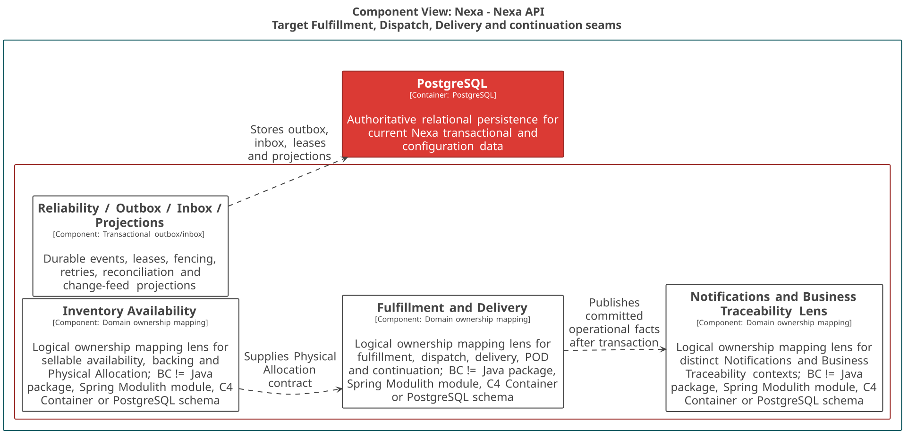
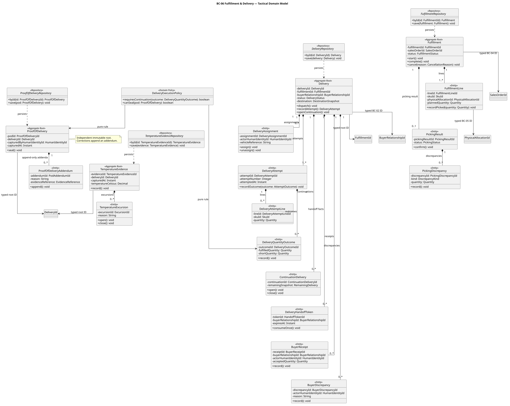
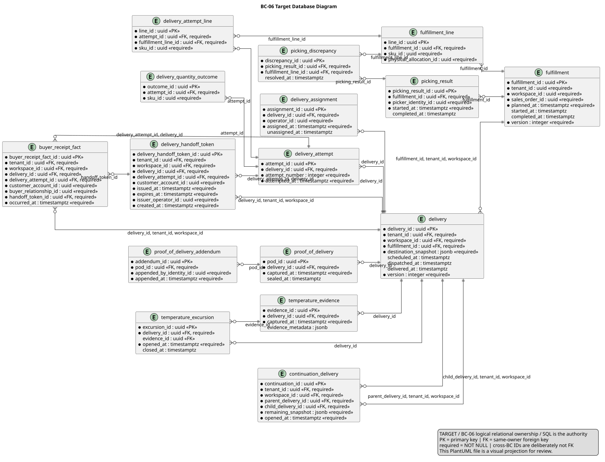

### 2.6.6. Bounded Context: Fulfillment & Delivery

BC-06 conserva ejecución de Fulfillment, Delivery, intentos, recepción y
evidencia. Fulfillment consume la identidad de PhysicalAllocation sin poseer
inventario. ProofOfDelivery y TemperatureEvidence son roots independientes
referenciados por Delivery ID, no hijos compuestos de Delivery.

#### 2.6.6.1. Domain Layer

El dominio conserva hechos históricos: un intento fallido sigue en la misma
Delivery y una entrega parcial crea ContinuationDelivery explícita. POD es
inmutable; sus correcciones se agregan como addenda.

| Clase | Categoría | Propósito | Atributos / inputs clave | Operaciones principales | Relaciones / ownership |
| :--- | :--- | :--- | :--- | :--- | :--- |
| `Fulfillment` | Aggregate Root | Organizar ejecución de SalesOrder. | `FulfillmentId`, `SalesOrderId`, líneas, status. | `start`, `complete`, `cancel`. | Compone líneas y picking result; cada línea referencia `PhysicalAllocationId` de BC-05. |
| `Delivery` | Aggregate Root | Mantener obligación, intentos y handoff. | `DeliveryId`, `FulfillmentId`, destino snapshot, status. | `dispatch`, `recordAttempt`, `openContinuation`. | Compone attempts, receipt/discrepancy y handoff facts; no posee BuyerRelationship. |
| `ProofOfDelivery` | Aggregate Root | Conservar evidencia sellada de entrega. | `ProofOfDeliveryId`, `DeliveryId`, `ActorHumanIdentityId`, capture time. | `seal`, `appendAddendum`. | Compone addenda; Delivery sólo por ID. |
| `TemperatureEvidence` | Aggregate Root | Conservar medición operativa de frío. | `TemperatureEvidenceId`, `DeliveryId`, temperatura, time. | `record`, `recordExcursion`. | Compone excursiones; Delivery sólo por ID. |
| `DeliveryAttempt`, `BuyerReceiptFact`, `BuyerDiscrepancy` | Entities | Mantener hechos de ejecución y recepción. | outcome, cantidades, actor, momento; `BuyerReceiptFact` porta `BuyerRelationshipId`. | `recordOutcome`, `record`. | Propiedad de `Delivery`; Buyer Relationship se identifica sólo en el hecho de receipt. |
| `DeliveryExecutionPolicy` | Domain Policy | Evaluar continuidad y sellado. | outcomes, POD cargado. | `requiresContinuation`, `canSeal`. | Pura; sin storage ni HTTP. |
| `FulfillmentRepository`, `DeliveryRepository` | Repository interfaces | Cargar roots de ejecución. | IDs y roots. | `byId`, `save`. | Implementaciones PostgreSQL. |
| `ProofOfDeliveryRepository`, `TemperatureEvidenceRepository` | Repository interfaces | Cargar evidencia con lifecycle propio. | IDs y roots. | `byId`, `save`. | No cargan Delivery como object graph. |

#### 2.6.6.2. Interface Layer

La interfaz recibe comandos de warehouse, delivery, POD y recepción. Valida
actor, scope e idempotencia sin asumir que un cliente Mobile sea autoridad.

| Clase | Categoría | Propósito | Inputs clave | Operaciones principales | Colaboradores |
| :--- | :--- | :--- | :--- | :--- | :--- |
| `FulfillmentController` | REST Controller | Gestionar inicio, preparación y picking. | actor, SalesOrder/Allocation IDs, versión. | `start`, `prepare`, `recordPicking`. | Handlers de Fulfillment. |
| `DeliveryController` | REST Controller | Gestionar lifecycle e intentos. | actor, delivery, outcome, llave. | `dispatch`, `recordAttempt`, `recordReceipt`, `recordDiscrepancy`. | Delivery handlers. |
| `ProofOfDeliveryController` | REST Controller | Capturar/sellar POD y temperatura. | actor, evidence metadata, versión. | `capturePod`, `sealPod`, `recordTemperature`. | Evidence handlers. |

#### 2.6.6.3. Application Layer

Application coordina facts publicados de SalesOrder/PhysicalAllocation sólo
cuando los contratos durables existen. Acceso a Object Storage queda detrás de
puertos y fuera de Domain.

| Clase | Categoría | Propósito | Inputs clave | Operaciones principales | Colaboradores |
| :--- | :--- | :--- | :--- | :--- | :--- |
| `StartFulfillmentCommandHandler` | Command Handler | Crear Fulfillment desde SalesOrder confirmado. | SalesOrder fact, allocation IDs, llave. | `handle`. | `FulfillmentRepository`. |
| `PrepareFulfillmentCommandHandler` | Command Handler | Registrar picking, packing y staging. | fulfillment, líneas, versión. | `handle`. | Fulfillment root y allocation contract. |
| `DispatchDeliveryCommandHandler` | Command Handler | Iniciar Delivery autorizada. | fulfillment, destino snapshot, assignment. | `handle`. | `DeliveryRepository`. |
| `RecordDeliveryAttemptCommandHandler` | Command Handler | Persistir resultado de intento. | delivery, outcome, cantidades, llave. | `handle`. | Delivery root y policy. |
| `CaptureProofOfDeliveryCommandHandler` | Command Handler | Capturar/sellar POD y evidencia de temperatura. | `DeliveryId`, metadata, actor. | `handle`. | POD/temperature repositories, storage port. |
| `RecordBuyerReceiptCommandHandler`, `RecordBuyerDiscrepancyCommandHandler` | Command Handlers | Registrar hechos Buyer sin borrar driver outcome. | delivery, `BuyerReceiptFact` con BuyerRelationship, actor, datos. | `handle`. | `DeliveryRepository`. |
| `SalesOrderConfirmedEventHandler`, `PhysicalAllocationPublishedEventHandler` | Event Handlers | Consumir hechos durables requeridos para ejecución. | published fact, deduplication key. | `handle`. | Inbox y Application. |

#### 2.6.6.4. Infrastructure Layer

Infrastructure implementa repositories, inbox/outbox y almacenamiento de bytes
fuera de PostgreSQL. Las URLs o bytes de evidencia no se vuelven públicos.

| Clase | Categoría | Propósito | Inputs / datos | Operaciones principales | Colaboradores |
| :--- | :--- | :--- | :--- | :--- | :--- |
| `PostgresFulfillmentRepository`, `PostgresDeliveryRepository` | Repository implementations | Mapear roots de ejecución. | fulfillment/delivery records. | `byId`, `save`. | Repositories Domain, PostgreSQL. |
| `PostgresProofOfDeliveryRepository`, `PostgresTemperatureEvidenceRepository` | Repository implementations | Mapear evidencia y addenda locales. | POD/temperature records. | `byId`, `save`. | Repositories Domain. |
| `FulfillmentFactInbox` | Inbox adapter | Deduplicar SalesOrder y PhysicalAllocation publicados. | event ID, consumer state. | `claim`, `complete`. | Event handlers. |
| `EvidenceObjectStorageAdapter` | Object-storage adapter | Guardar/leer bytes autorizados por referencia. | content stream, metadata. | `put`, `getAuthorizedReference`. | Application ports. |
| `FulfillmentDeliveryOutboxPublisher` | Outbox adapter | Publicar Delivery/POD facts comprometidos. | fact, correlación. | `enqueue`. | BC-09, BC-10 y BC-11 consumers. |

#### 2.6.6.5. Bounded Context Software Architecture Component Level Diagrams

La lente C4 TARGET de Fulfillment & Delivery sitúa los contratos de ejecución,
evidencia y persistencia sin convertir BC-06 en un componente o Container C4.
Los objetos de evidencia se integran mediante adapter, no desde Domain.

*Nota. Export canónico generado desde Blueprint Wave 3.*

#### 2.6.6.6. Bounded Context Software Architecture Code Level Diagrams

Los diagramas separan roots de ejecución y evidencia, con identidad tipada para
SalesOrder, Allocation y Delivery; BuyerRelationship aparece en
`BuyerReceiptFact`, no como ownership directo de Delivery.

##### 2.6.6.6.1. Bounded Context Domain Layer Class Diagrams

El UML evita composición de POD/TemperatureEvidence bajo Delivery y hace
explícitas líneas, attempts, receipts, discrepancies y addenda.

*Nota. Elaboración propia.*

##### 2.6.6.6.2. Bounded Context Database Design Diagram

El modelo relacional muestra FKs locales de child entities y mantiene `delivery_id`
en POD/TemperatureEvidence como referencia de identidad entre roots.

*Nota. Elaboración propia.*
