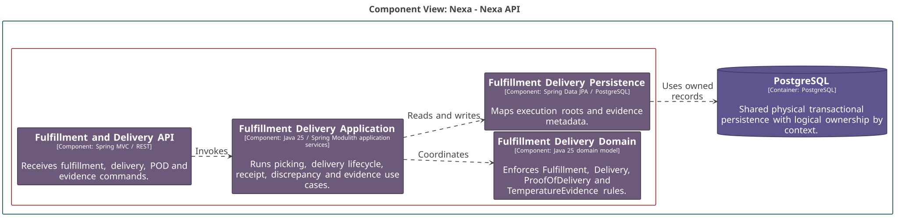

### 2.6.6. Bounded Context: Fulfillment & Delivery

BC-06 conserva la ejecución de fulfillment, intentos de entrega, recepción y
evidencia. Los resultados quedan registrados como hechos históricos.

#### 2.6.6.1. Canonical class dictionary

*Clases y responsabilidades de BC-06 por capa.*

| Layer | Class | Category | Purpose | Key Attributes / Inputs | Main Methods / Business Behavior | Relationships / Collaborators | Aggregate Owner / External References |
| :--- | :--- | :--- | :--- | :--- | :--- | :--- | :--- |
| Domain | Fulfillment | Aggregate Root | Organiza ejecución de una SalesOrder. | Fulfillment ID, sales order ID, status. | Start, complete and cancel. | Uses BC-04 order ID and BC-05 allocation IDs. | Owns FulfillmentLine and PickingResult. |
| Domain | Delivery | Aggregate Root | Mantiene obligación, asignación e intentos de entrega. | Delivery ID, fulfillment ID, buyer relationship ID, status. | Dispatch, record attempt and open continuation. | References Fulfillment and BuyerRelationship by ID. | Owns assignment, attempt, outcome, continuation, receipt and discrepancy facts. |
| Domain | ProofOfDelivery | Aggregate Root | Conserva evidencia sellada de una entrega. | POD ID, delivery ID, actor identity ID, captured time. | Seal and append correction evidence. | References Delivery by identity. | Owns ProofOfDeliveryAddendum; never belongs to Delivery. |
| Domain | TemperatureEvidence | Aggregate Root | Conserva una medición asociada a entrega. | Evidence ID, delivery ID, temperature, captured time. | Record evidence and excursion. | References Delivery by identity. | Owns TemperatureExcursion; never belongs to Delivery. |
| Domain | DeliveryAttempt | Entity | Registra un intento con su resultado. | Attempt number, time, outcome. | Record outcome. | Is local to Delivery. | Delivery owns attempt lines and quantity outcomes. |
| Domain | BuyerReceipt | Entity | Registra aceptación de cantidades por Buyer. | Buyer relationship ID, actor human identity ID, quantity. | Record receipt. | Uses BC-02 and BC-01 typed IDs. | Owned by Delivery. |
| Domain | BuyerDiscrepancy | Entity | Registra una diferencia declarada por Buyer. | Actor human identity ID, reason, time. | Record discrepancy. | Uses typed identity reference. | Owned by Delivery. |
| Domain | DeliveryExecutionPolicy | Domain Policy | Aplica reglas puras de continuidad y sellado. | Delivery outcome or POD. | Decide continuation and sealing conditions. | Receives loaded domain values. | No storage, provider or HTTP dependency. |
| Interface | BC-06 Interface Boundary | Interface component | Traduce comandos de fulfillment y entrega autorizados. | Actor, scope, version and command. | Rejects invalid or stale input. | Calls application orchestration. | Does not own inventory or documents. |
| Application | BC-06 Application Orchestration | Application component | Coordina picking, entrega, POD y evidencia. | Fulfillment or delivery command, typed references. | Preserves idempotency and historical facts. | Uses BC-05 allocation contract and publishes committed facts. | Performs storage access through ports, outside Domain. |
| Infrastructure | BC-06 Persistence Adapter | Infrastructure component | Persiste raíces y hechos locales. | Fulfillment, delivery and evidence records. | Maps aggregates and local entities. | PostgreSQL, object-storage adapter and local outbox. | Does not expose private evidence bytes as public URLs. |

Fulfillment consume la identidad de PhysicalAllocation sin adueñarse de
inventario. Un intento fallido permanece en la misma Delivery; una entrega
parcial crea una ContinuationDelivery para la cantidad restante. ProofOfDelivery
es inmutable y se corrige por addendum. BuyerRelationshipId y
ActorHumanIdentityId sustituyen cualquier referencia a buyer membership.

#### 2.6.6.2. Component and code-level diagrams

*Vista C4 L3 de BC-06 Fulfillment & Delivery.*

*Nota. Elaboración propia.*

*Modelo de dominio táctico de BC-06 Fulfillment & Delivery.*

*Nota. Elaboración propia.*

*Diseño lógico de base de datos de BC-06 Fulfillment & Delivery.*

*Nota. Elaboración propia.*
