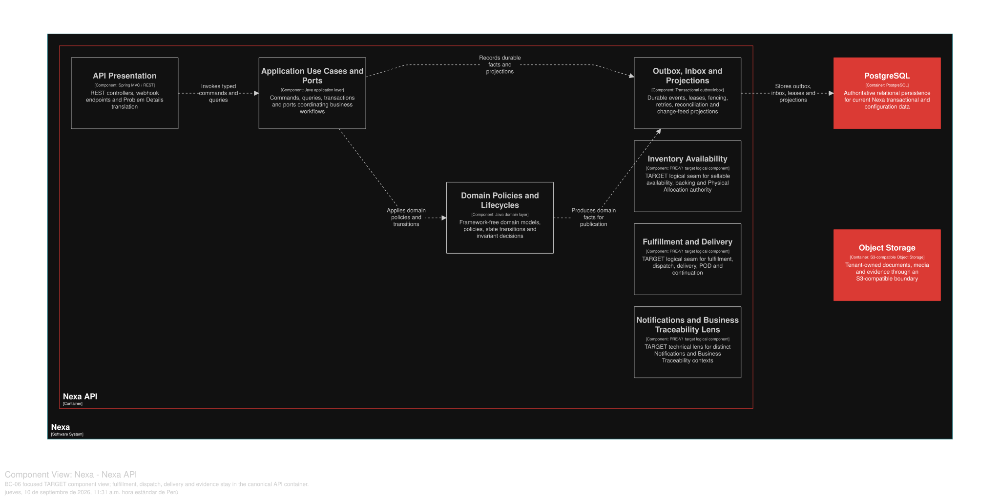

### 2.6.6. Bounded Context: Fulfillment & Delivery

Este contexto de Core Domain posee planes de ejecución, dispatch handoff,
delivery attempts, resultados de cantidad, recepción y evidencia de entrega.
Driver Outcome, Buyer Receipt, Proof of Delivery y Business Traceability
permanecen como hechos separados.

#### 2.6.6.1. Domain Layer

*Agregados y límites invariantes de BC-06.*
| Aggregate/root | Boundary and invariant |
| :--- | :--- |
| `Fulfillment` | Sales Order execution plan and picking/packing progression |
| `Delivery` | Delivery obligation, assignment, attempts and remaining quantity |
| `ProofOfDelivery` | Immutable delivery evidence; corrections are addenda |
| `TemperatureEvidence` | Manual reading/evidence and excursion decision input |

`FulfillmentLine`, `PickingResult`, `PickingDiscrepancy`, `DeliveryAssignment`,
`DeliveryAttempt`, `DeliveryQuantityOutcome`, `DeliveryHandoffToken`,
`BuyerReceiptFact`, `ProofOfDeliveryAddendum`, `TemperatureExcursion` y
`ContinuationDelivery` son Entity/hechos con ciclos de vida acotados. Los value
objects incluyen `DeliveryId`, `HandoffId`, `AttemptId`, `EvidenceRef`,
`GeoPoint` y `DeliveryQuantity`; las políticas incluyen
`PartialDeliveryPolicy` y `DeliveryLocationPrivacyPolicy`.

Invariantes de diseño: la autoridad de Allocation permanece en BC-05; los
intentos fallidos permanecen bajo una Delivery; una entrega parcial registra la
verdad entregada o rechazada y crea una sola continuación para la obligación
restante; POD es inmutable y se corrige mediante addendum; la evidencia de
temperatura es manual en el alcance inicial y una excursión coloca la cantidad
afectada en HOLD hasta una disposición explícita.

#### 2.6.6.2. Interface Layer

La Interface Layer cubre planificación de fulfillment, resultado de picking,
dispatch handoff, assignment, delivery attempt, outcome, Buyer Receipt, POD y
evidencia de temperatura. No se inventan nombres URI/DTO exactos. El servidor
autoriza toda transición crítica; Operations Mobile y Buyer Mobile son
proyecciones planificadas.

#### 2.6.6.3. Application Layer

La Application Layer coordina inicio, finalización o cancelación de fulfillment,
emisión y resolución de handoff, asignación e intento de entrega, continuidad
parcial, recepción y registro de evidencia. Idempotency, alcance Tenant,
metadatos de evidencia inmutables y resultados de conflicto son explícitos. Un
outbox/inbox durable apoya notificaciones y trazabilidad posteriores al commit.

#### 2.6.6.4. Infrastructure Layer

La Infrastructure Layer organiza la propiedad lógica en PostgreSQL compartido sobre `fulfillment`, `fulfillment_line`,
`picking_result`, `picking_discrepancy`, `delivery`, `delivery_assignment`,
`delivery_attempt`, `delivery_attempt_line`, `delivery_quantity_outcome`,
`delivery_handoff_token`, `buyer_receipt_fact`, `proof_of_delivery`,
`proof_of_delivery_addendum`, `temperature_evidence`,
`temperature_excursion` y `continuation_delivery`. `sales_order_id`,
`physical_allocation_id` e IDs de SKU/operator son referencias inter-BC sin
propiedad. Los bytes de Object usan ports de BC-09/Object Storage; no se
infiere una URL pública.

#### 2.6.6.5. Bounded Context Software Architecture Component Level Diagrams

Las siguientes clases son especificaciones **TARGET**. Mantienen separados
Dispatch Handoff, Driver Outcome, Buyer Receipt y Proof of Delivery; cada hecho
conserva su propio emisor e historia.

*Clases TARGET por capa de BC-06*

| Capa | Clase | Tipo | Responsabilidad y límite de consistencia |
| --- | --- | --- | --- |
| Interface | `FulfillmentController` | Controller | Traduce comandos de planificación, picking y empaquetado con autorización de servidor. |
| Interface | `DeliveryController` | Controller | Recibe asignación, intentos y outcomes sin confundirlos con la recepción Buyer. |
| Interface | `ProofOfDeliveryController` | Controller | Registra evidencia inmutable y sus addenda; no expone bytes privados directamente. |
| Interface | `DeliveryTrackingConsumer` | Consumer | Proyecta una vista autorizada para Portal/Mobile, sin convertirla en autoridad de ciclo de vida. |
| Application | `PlanFulfillmentHandler` | Command handler | Valida contrato de Physical Allocation de BC-05 antes de crear o avanzar Fulfillment. |
| Application | `ConfirmPickingHandler` | Command handler | Aplica idempotencia de scan, versión y discrepancia sin mutar inventario fuera del contrato. |
| Application | `FinalizeDeliveryAttemptHandler` | Command handler | Persiste outcome inmutable, conserva el mismo Delivery en falla y crea una sola Continuation Delivery si corresponde. |
| Application | `FinalizeProofOfDeliveryHandler` | Command handler | Verifica campos de política y registra referencia de evidencia antes de publicar el hecho comprometido. |
| Infrastructure | `FulfillmentRepositoryAdapter` | Repository implementation | Persiste fulfillment, líneas, picking y sus hechos bajo propiedad BC-06. |
| Infrastructure | `DeliveryRepositoryAdapter` | Repository implementation | Persiste Delivery, Assignment, Attempt y Continuation sin crear un Delivery por intento fallido. |
| Infrastructure | `ProofEvidenceObjectPort` | Storage adapter | Gestiona referencias autorizadas a Object Storage, no URLs públicas inferidas. |
| Infrastructure | `MapRoutingPort` | External ACL | Aísla navegación/ruta externa del dominio y evita afirmar tracking continuo. |
| Infrastructure | `FulfillmentOutboxAdapter` | Outbox adapter | Entrega hechos posteriores al commit a documentos, notificaciones y trazabilidad. |

La vista C4 L3 **TARGET** muestra componentes conceptuales de este contexto dentro de Nexa API. No equivale a un Bounded Context adicional, una base de datos independiente ni una unidad de despliegue.

*Vista C4 L3 TARGET de BC-06 Fulfillment & Delivery.*

*Nota.* Exportación vectorial desde una vista Structurizr DSL enfocada en BC-06 Fulfillment & Delivery, dentro del único contenedor Nexa API. Es evidencia de diseño TARGET; no acredita implementación, runtime ni una unidad de despliegue independiente.

#### 2.6.6.6. Bounded Context Software Architecture Code Level Diagrams

##### 2.6.6.6.1. Bounded Context Domain Layer Class Diagrams

*Modelo de dominio táctico de BC-06 Fulfillment & Delivery.*

*Nota.* El diagrama se presenta como modelo de diseño, no como inventario de código.

##### 2.6.6.6.2. Bounded Context Database Design Diagram

*Proyección del diseño de base de datos de BC-06.*

*Nota.* La propiedad lógica está en PostgreSQL compartido; el SQL canónico define las restricciones, el alcance Tenant y las referencias de evidencia.
