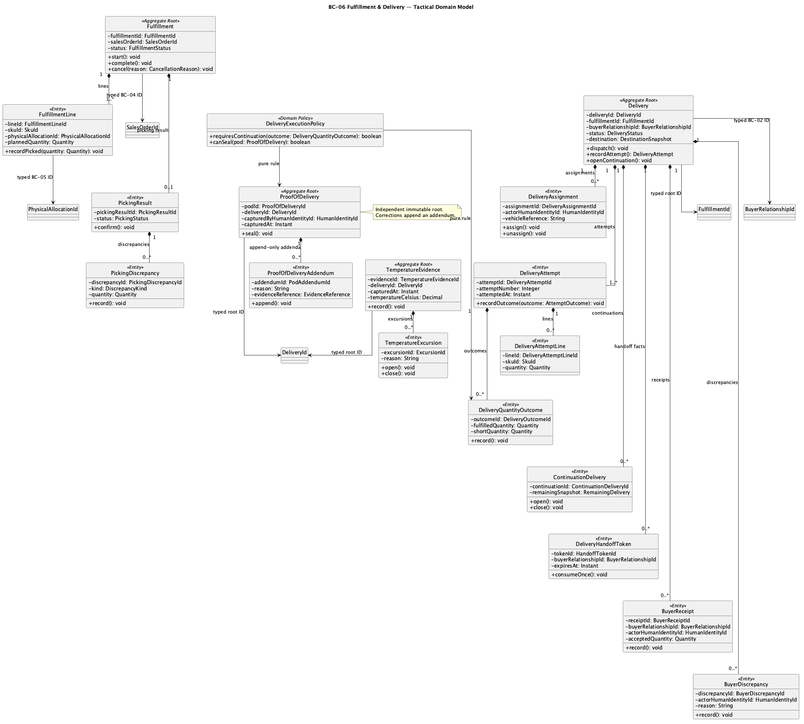
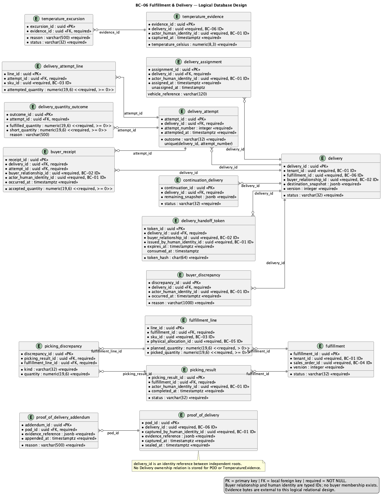

# 2.6.7. BC-06 — Fulfillment & Delivery

`DOMAIN MODEL: TARGET / ACCEPTED`
`IMPLEMENTATION CROSSWALK: AS-IS VERIFIED / PARTIAL`

Canonical target: Blueprint `01-shared/domain/bounded-contexts/BC-06-fulfillment-delivery/`.
This Core Domain context owns execution plans, dispatch handoff, delivery
attempts, quantity outcomes, receipt and delivery evidence. Driver outcome,
Buyer receipt, Proof of Delivery and Business Traceability remain separate
facts.

## 2.6.7.1 Domain Layer

| Aggregate/root | Boundary and invariant |
| :--- | :--- |
| `Fulfillment` | Sales Order execution plan and picking/packing progression |
| `Delivery` | Delivery obligation, assignment, attempts and remaining quantity |
| `ProofOfDelivery` | Immutable delivery evidence; corrections are addenda |
| `TemperatureEvidence` | Manual reading/evidence and excursion decision input |

`FulfillmentLine`, `PickingResult`, `PickingDiscrepancy`, `DeliveryAssignment`,
`DeliveryAttempt`, `DeliveryQuantityOutcome`, `DeliveryHandoffToken`,
`BuyerReceiptFact`, `ProofOfDeliveryAddendum`, `TemperatureExcursion` and
`ContinuationDelivery` are entities/facts with bounded lifecycles. Value
objects include `DeliveryId`, `HandoffId`, `AttemptId`, `EvidenceRef`,
`GeoPoint` and `DeliveryQuantity`; policies include `PartialDeliveryPolicy`
and `DeliveryLocationPrivacyPolicy`.

Target invariants: allocation authority stays BC-05; failed attempts remain
under one Delivery; partial delivery records actual delivered/rejected truth
and creates one continuation for remaining obligation; POD is immutable and
corrected by addendum; temperature evidence is manual V1 and excursion places
affected quantity on HOLD pending explicit disposition.

## 2.6.7.2 Interface Layer

Target contracts cover fulfillment planning, picking result, dispatch handoff,
assignment, delivery attempt, outcome, buyer receipt, POD and temperature
evidence. Exact URI/DTO names are not invented. The server authorizes every
critical transition; Operations Mobile and Buyer Mobile are future projections.

## 2.6.7.3 Application Layer

Target handlers coordinate fulfillment start/complete/cancel, handoff issue and
resolution, delivery assignment/attempt, partial continuation, receipt and
evidence registration. Idempotency, tenant scope, immutable evidence metadata
and conflict outcomes are explicit. Durable outbox/inbox supports downstream
notifications and traceability after commit.

## 2.6.7.4 Infrastructure Layer

Target shared PostgreSQL ownership covers `fulfillment`, `fulfillment_line`,
`picking_result`, `picking_discrepancy`, `delivery`, `delivery_assignment`,
`delivery_attempt`, `delivery_attempt_line`, `delivery_quantity_outcome`,
`delivery_handoff_token`, `buyer_receipt_fact`, `proof_of_delivery`,
`proof_of_delivery_addendum`, `temperature_evidence`,
`temperature_excursion` and `continuation_delivery`. `sales_order_id`,
`physical_allocation_id` and SKU/operator IDs are non-owning cross-BC refs.
Object bytes use BC-09/Object Storage ports; no public URL is inferred.

AS-IS anchor: API `fulfillmentdelivery` domain/application/persistence paths,
logistics migrations V18/V19/V81 and delivery contract ports. Fulfillment,
delivery, attempt, handoff and evidence code is `AS-IS VERIFIED`; full target
receipt/continuation/temperature semantics are `PARTIAL`; Mobile runtime,
device proof and Product Acceptance are `NOT EVIDENCED`.

## 2.6.7.5 Bounded Context Software Architecture Component Level Diagrams

The selected family is `Nexa-API-FulfillmentDelivery-TARGET`, a logical view
inside the single API container. It is not a delivery microservice or Mobile
BC.

Source/export provenance: [Chapter 2 register](../../../../delivery-checklists/chapter-02-evidence-provenance.md).

## 2.6.7.6 Bounded Context Software Architecture Code Level Diagrams

### 2.6.7.6.1 Bounded Context Domain Layer Class Diagrams

Source: [domain-model.puml](../../../assets/chapter-2/tactical/BC-06/domain-model.puml).

### 2.6.7.6.2 Bounded Context Database Design Diagram

Source: [database-diagram.puml](../../../assets/chapter-2/tactical/BC-06/database-diagram.puml).
Logical ownership is in shared PostgreSQL; canonical SQL defines constraints,
tenant scope and evidence references.

## Crosswalk and open evidence

| Concern | Classification | Evidence boundary |
| :--- | :--- | :--- |
| Fulfillment/delivery/attempt/handoff code | `AS-IS VERIFIED` | API `fulfillmentdelivery` at `origin/main` |
| Target receipt/POD/temperature/continuation boundaries | `TARGET / ACCEPTED` | Blueprint tactical model/data model |
| Full target lifecycle and runtime proof | `PARTIAL` | Existing code is not silently promoted to target parity |
| Native Mobile build/device/Product Acceptance | `NOT EVIDENCED` | Mobile remains planned/proposed |
