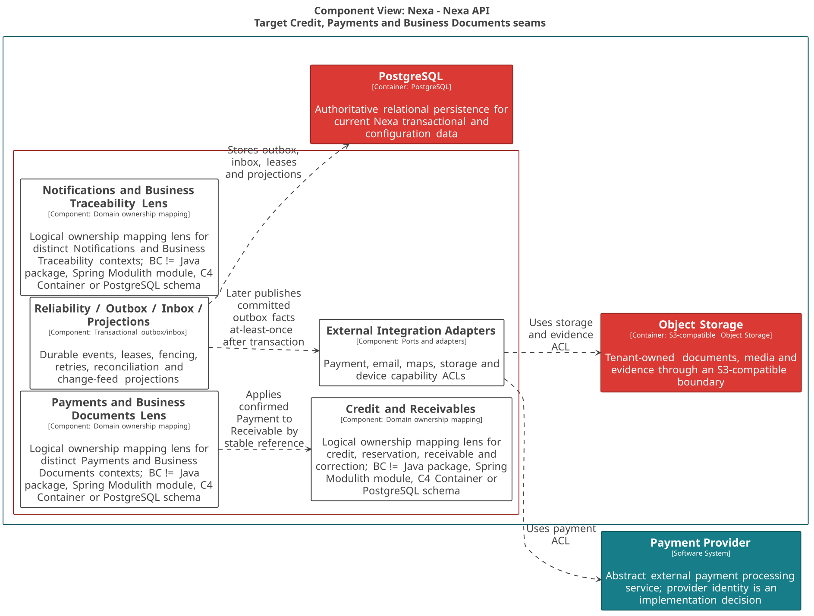
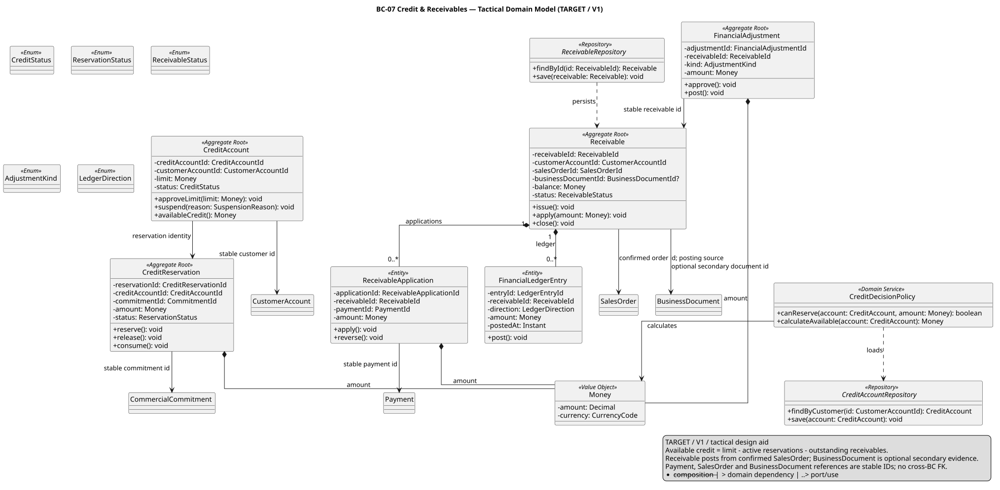
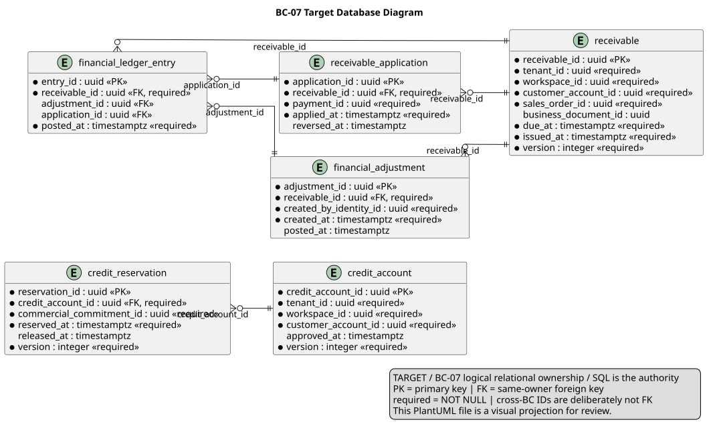

### 2.6.7. Bounded Context: Credit & Receivables

BC-07 conserva exposición crediticia, reservas y obligaciones por cobrar.
Payment es una autoridad distinta: Payment Confirmed no crea por sí mismo un
Receivable ni BC-07 importa un Payment Aggregate.

#### 2.6.7.1. Domain Layer

El dominio protege `Available Credit = Credit Limit - Active Credit
Reservations - Outstanding Receivable Balances`. Correcciones agregan evidencia
financiera y nunca reescriben obligación, pago o historial.

| Clase | Categoría | Propósito | Atributos / inputs clave | Operaciones principales | Relaciones / ownership |
| :--- | :--- | :--- | :--- | :--- | :--- |
| `CreditAccount` | Aggregate Root | Mantener límite y estado de crédito. | `CreditAccountId`, `CustomerAccountId`, límite, status. | `approveLimit`, `suspend`. | Customer ID tipado BC-02; no compone Reservation. |
| `CreditReservation` | Aggregate Root | Proteger crédito de fuente comercial. | `CreditReservationId`, `CreditAccountId`, `CommitmentId`, monto, status. | `reserve`, `release`, `consume`. | Lifecycle independiente; Commitment ID BC-04. |
| `Receivable` | Aggregate Root | Mantener obligación, saldo y vencimiento. | `ReceivableId`, `CustomerAccountId`, `SalesOrderId`, importes, status. | `issue`, `apply`, `close`. | Compone applications y ledger entries. |
| `FinancialAdjustment` | Aggregate Root | Conservar corrección explícita. | `FinancialAdjustmentId`, `ReceivableId`, tipo, monto, razón. | `approve`, `post`. | Referencia Receivable por ID; root independiente. |
| `ReceivableApplication` | Entity | Aplicar Payment confirmado a saldo. | application, `PaymentId`, monto. | `apply`, `reverse`. | Propiedad de Receivable; Payment ID BC-08. |
| `CreditExposurePolicy`, `ReceivableApplicationPolicy` | Domain Policies | Calcular exposición y evitar sobreaplicación. | saldo, reservas, montos. | `available`, `canApply`, `canReverse`. | Puras; sin proveedor. |
| `CreditAccountRepository`, `CreditReservationRepository` | Repository interfaces | Cargar roots de crédito. | IDs y roots. | `byId`, `save`. | Implementaciones PostgreSQL. |
| `ReceivableRepository`, `FinancialAdjustmentRepository` | Repository interfaces | Cargar obligación/ajuste independientes. | IDs y roots. | `byId`, `save`. | No persisten Payment. |

#### 2.6.7.2. Interface Layer

La interfaz recibe comandos de crédito y obligación con scope/versión; no
confirma callbacks de proveedor ni expone Payment como aggregate local.

| Clase | Categoría | Propósito | Inputs clave | Operaciones principales | Colaboradores |
| :--- | :--- | :--- | :--- | :--- | :--- |
| `CreditController` | REST Controller | Exponer límite y reserva de crédito. | actor, customer, commitment, monto, llave. | `approveLimit`, `reserve`, `release`. | Credit handlers. |
| `ReceivableController` | REST Controller | Exponer obligación y ajuste autorizado. | actor, SalesOrder/Receivable, versión. | `issue`, `applyPayment`, `postAdjustment`. | Receivable handlers. |

#### 2.6.7.3. Application Layer

Application coordina concurrencia de último crédito y consume Payment facts
durables mediante inbox. Nunca carga un Payment Aggregate ni hace I/O proveedor.

| Clase | Categoría | Propósito | Inputs clave | Operaciones principales | Colaboradores |
| :--- | :--- | :--- | :--- | :--- | :--- |
| `ReserveCreditCommandHandler` | Command Handler | Resolver y persistir reserva de crédito. | commitment, amount, llave idempotente. | `handle`. | Account/reservation repositories. |
| `ReleaseCreditReservationCommandHandler` | Command Handler | Liberar reserva por transición autorizada. | reservation, razón, versión. | `handle`. | `CreditReservationRepository`. |
| `IssueReceivableCommandHandler` | Command Handler | Emitir obligación al confirmar SalesOrder. | SalesOrder fact, customer, importe. | `handle`. | `ReceivableRepository`. |
| `ApplyConfirmedPaymentCommandHandler` | Command Handler | Aplicar Payment fact a saldo. | `PaymentId`, receivable, amount, llave. | `handle`. | Receivable root y policy. |
| `PostFinancialAdjustmentCommandHandler` | Command Handler | Registrar corrección explícita. | receivable, tipo, razón, actor. | `handle`. | `FinancialAdjustmentRepository`. |
| `PaymentConfirmedEventHandler` | Event Handler | Consumir Payment fact deduplicado. | fact publicado, event ID. | `handle`. | Inbox y apply handler. |

#### 2.6.7.4. Infrastructure Layer

Infrastructure implementa persistencia de roots, deduplicación de facts y
publicación durable de consecuencias locales.

| Clase | Categoría | Propósito | Inputs / datos | Operaciones principales | Colaboradores |
| :--- | :--- | :--- | :--- | :--- | :--- |
| `PostgresCreditAccountRepository`, `PostgresCreditReservationRepository` | Repository implementations | Mapear crédito y reservas. | credit records. | `byId`, `save`. | Repositories Domain, PostgreSQL. |
| `PostgresReceivableRepository`, `PostgresFinancialAdjustmentRepository` | Repository implementations | Mapear obligación, applications y ajustes. | receivable records. | `byId`, `save`. | Repositories Domain. |
| `PaymentFactInbox` | Inbox adapter | Deduplicar Payment facts entregados al menos una vez. | event ID, status. | `claim`, `complete`. | `PaymentConfirmedEventHandler`. |
| `CreditReceivablesOutboxPublisher` | Outbox adapter | Guardar facts de receivable/adjustment comprometidos. | fact, correlación. | `enqueue`. | BC-09, BC-10, BC-11. |

#### 2.6.7.5. Bounded Context Software Architecture Component Level Diagrams

La lente C4 TARGET de Credit, Payment & Documents sitúa la exposición y los
contratos con Payment. BC-08 conserva la autoridad de pago; BC-07 no se
convierte en un componente o Container C4.

*Nota. Export canónico generado desde Blueprint Wave 3.*

#### 2.6.7.6. Bounded Context Software Architecture Code Level Diagrams

Los diagramas conservan CreditReservation y FinancialAdjustment como roots
independientes y Payment como ID externo.

##### 2.6.7.6.1. Bounded Context Domain Layer Class Diagrams

El UML presenta repositories de los cuatro roots y políticas puras de exposición
y aplicación.

*Nota. Elaboración propia.*

##### 2.6.7.6.2. Bounded Context Database Design Diagram

El modelo relacional marca importes positivos/no negativos y conserva Payment,
SalesOrder, BusinessDocument y Customer como referencias tipadas externas.

*Nota. Elaboración propia.*
