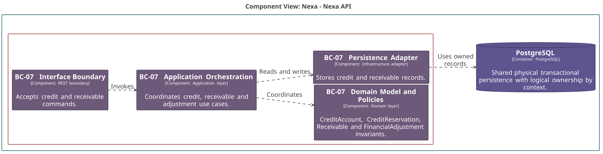

### 2.6.7. Bounded Context: Credit & Receivables

BC-07 conserva exposición crediticia, reservas y obligaciones por cobrar.
Payment es una autoridad distinta: Payment Confirmed no crea por sí mismo un
Receivable.

#### 2.6.7.1. Canonical class dictionary

*Clases y responsabilidades de BC-07 por capa.*

| Layer | Class | Category | Purpose | Key Attributes / Inputs | Main Methods / Business Behavior | Relationships / Collaborators | Aggregate Owner / External References |
| :--- | :--- | :--- | :--- | :--- | :--- | :--- | :--- |
| Domain | CreditAccount | Aggregate Root | Mantiene límite y estado de crédito de un cliente. | Credit account ID, customer account ID, limit, status. | Approve limit and suspend. | References BC-02 customer by ID. | No CreditReservation composition. |
| Domain | CreditReservation | Aggregate Root | Protege crédito para una fuente comercial. | Reservation ID, credit account ID, commitment ID, amount, status. | Reserve, release and consume once. | References account and BC-04 commitment by ID. | Independent lifecycle. |
| Domain | Receivable | Aggregate Root | Registra obligación, saldo y vencimiento. | Receivable ID, customer account ID, sales order ID, balances, status. | Issue, apply and close. | References BC-02 account and BC-04 order IDs. | Owns ReceivableApplication and FinancialLedgerEntry. |
| Domain | FinancialAdjustment | Aggregate Root | Registra una corrección financiera explícita. | Adjustment ID, receivable ID, kind, money, reason. | Approve and post. | References Receivable by ID. | Independent root; it does not rewrite receivable history. |
| Domain | ReceivableApplication | Entity | Aplica un Payment confirmado a un saldo. | Application ID, payment ID, money. | Apply and reverse. | Uses BC-08 Payment ID. | Owned by Receivable. |
| Domain | CreditExposurePolicy | Domain Policy | Calcula crédito disponible. | Credit limit, active reservations, outstanding receivables. | Produces available credit. | Pure calculation over loaded values. | No payment provider or repository dependency. |
| Domain | ReceivableApplicationPolicy | Domain Policy | Evita sobreaplicación y reverso inválido. | Balance and application amount. | Evaluates application and reversal. | Uses ReceivableApplication value. | Pure rule. |
| Interface | BC-07 Interface Boundary | Interface component | Traduce comandos y consultas financieras autorizadas. | Actor, scope, version and command. | Rejects invalid or stale input. | Calls application orchestration. | Does not confirm payments. |
| Application | BC-07 Application Orchestration | Application component | Coordina reserva, obligación, aplicación y corrección. | Commercial commitment or confirmed payment fact. | Uses idempotency and concurrency controls. | Consumes BC-08 facts by Payment ID. | Does not load Payment aggregate. |
| Infrastructure | BC-07 Persistence Adapter | Infrastructure component | Persiste raíces y hechos financieros. | Credit, receivable and ledger records. | Maps local ownership. | PostgreSQL and local outbox. | Does not own Payment data. |

Available Credit = Credit Limit − Active Credit Reservations − Outstanding
Receivable Balances. La aplicación protege el último crédito mediante
concurrencia explícita. Una aplicación no supera el saldo y una corrección
agrega evidencia financiera sin editar la obligación original.

#### 2.6.7.2. Component and code-level diagrams

*Vista C4 L3 de BC-07 Credit & Receivables.*

*Nota. Elaboración propia.*

*Modelo de dominio táctico de BC-07 Credit & Receivables.*

*Nota. Elaboración propia.*

*Diseño lógico de base de datos de BC-07 Credit & Receivables.*

*Nota. Elaboración propia.*
