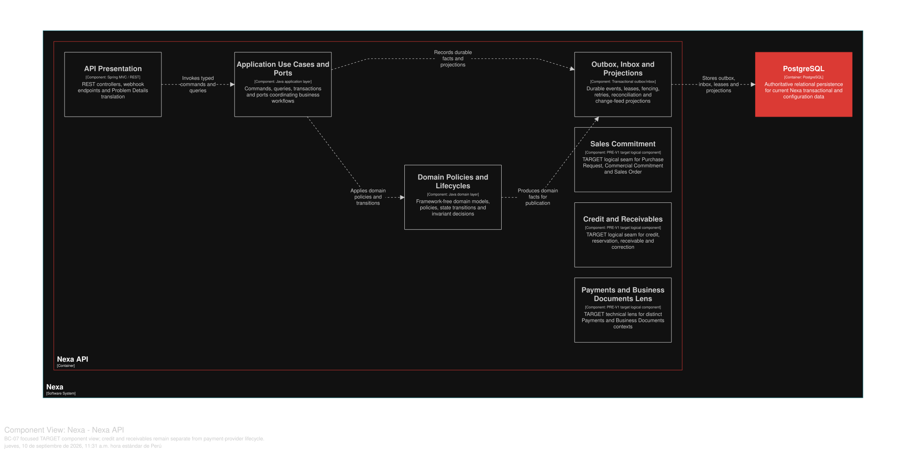

### 2.6.7. Bounded Context: Credit & Receivables

This context owns credit exposure, reservation and Receivable authority.
Payment is a separate context; Payment Confirmed is not a Receivable.

#### 2.6.7.1. Domain Layer

*Agregados y límites invariantes de BC-07.*
| Aggregate/root | Boundary and invariant |
| :--- | :--- |
| `CreditAccount` | Limit, exposure and reservation policy for one Customer Account |
| `CreditReservation` | Active protection for one commercial source; released/converted once |
| `Receivable` | Posted obligation, balance and due state |
| `FinancialAdjustment` | Explicit correction with reason and actor |

`ReceivableApplication` belongs to financial authority and references Payment
by ID. Value objects include `CreditAmount`, `AvailableCredit`, `Terms` and
`AdjustmentReason`; policies include `CreditDecisionPolicy` and
`DoubleCountPreventionPolicy`. Repositories own CreditAccount and Receivable
roots.

Invariante de diseño: Available Credit = Credit Limit − Active Credit Reservations
− Outstanding Receivable Balances. Credit purchase reserves at PR submission;
direct order reserves in the same logical confirmation; credit/net Receivable
posts at SO confirmation. Applications cannot over-apply or double-apply;
corrections preserve original facts. Buyer sees safe projections, not internal
risk policy.

#### 2.6.7.2. Interface Layer

La Interface Layer cubre credit exposure, reservation, receivable posting,
payment application and explicit financial adjustment. Exact routes and DTOs
remain unclaimed where absent from API evidence. Capability authorization and
Tenant scope are server-side; external payment provider data enters through
BC-08 contracts.

#### 2.6.7.3. Application Layer

La Application Layer evalúa y reserva crédito, registra Receivable, aplica o
revierte referencias de Payment y registra ajustes. Application boundaries coordinate BC-08
without a cross-context aggregate. Idempotency and concurrency protect last
credit; committed facts feed documents/notifications/traceability after commit.

#### 2.6.7.4. Infrastructure Layer

La Infrastructure Layer organiza la propiedad lógica en PostgreSQL compartido sobre `credit_account`,
`credit_reservation`, `receivable`, `receivable_application`,
`financial_adjustment` and `financial_ledger_entry`. Payment and Sales Order
identifiers are non-owning references. Tenant predicates, monetary checks and
history rules remain in canonical SQL; no physical BC database is asserted.

#### 2.6.7.5. Bounded Context Software Architecture Component Level Diagrams

Las siguientes clases son especificaciones **TARGET**. Preservan que Payment y
Receivable son autoridades distintas, y que la corrección financiera agrega un
hecho en vez de reescribir la obligación original.

*Clases TARGET por capa de BC-07*

| Capa | Clase | Tipo | Responsabilidad y límite de consistencia |
| --- | --- | --- | --- |
| Interface | `CreditExposureController` | Controller | Presenta exposición y decisiones permitidas sin revelar política interna a un Buyer. |
| Interface | `ReceivablesController` | Controller | Expone historial financiero autorizado, no la confirmación de un proveedor de pagos. |
| Interface | `CreditReservationPort` | Contract interface | Recibe la solicitud síncrona de BC-04; no es una ruta REST inventada. |
| Interface | `ReceivableProjectionConsumer` | Consumer | Proyecta información segura para Platform, Portal o Mobile. |
| Application | `EvaluateCreditHandler` | Application service | Calcula crédito disponible bajo bloqueo/CAS sobre cuenta y reservas activas. |
| Application | `EstablishCreditReservationHandler` | Command handler | Protege crédito en submit PR o confirmación Direct Order con idempotencia durable. |
| Application | `PostReceivableHandler` | Command handler | Publica obligación crédito/net en confirmación de Sales Order, no universalmente en entrega o factura. |
| Application | `ApplyPaymentToReceivableHandler` | Command handler | Consume un Payment confirmado por ID y evita sobreaplicar o duplicar la aplicación. |
| Application | `RecordFinancialAdjustmentHandler` | Command handler | Añade ajuste explícito, actor y razón conservando ledger e importe original. |
| Infrastructure | `CreditAccountRepositoryAdapter` | Repository implementation | Persiste cuenta y reserva con restricciones monetarias y alcance Tenant. |
| Infrastructure | `ReceivableRepositoryAdapter` | Repository implementation | Persiste obligación, aplicaciones y ledger sin poseer Payment. |
| Infrastructure | `PaymentFactPort` | Contract adapter | Consume el resultado proveedor-neutral de BC-08 por contrato explícito. |
| Infrastructure | `CreditOutboxAdapter` | Outbox adapter | Emite hechos de reserva y obligación sólo al finalizar la transacción. |

La vista C4 L3 **TARGET** muestra componentes conceptuales de este contexto dentro de Nexa API. No equivale a un Bounded Context adicional, una base de datos independiente ni una unidad de despliegue.

*Vista C4 L3 TARGET de BC-07 Credit & Receivables.*

*Nota.* Exportación vectorial desde una vista Structurizr DSL enfocada en BC-07 Credit & Receivables, dentro del único contenedor Nexa API. Es evidencia de diseño TARGET; no acredita implementación, runtime ni una unidad de despliegue independiente.

#### 2.6.7.6. Bounded Context Software Architecture Code Level Diagrams

##### 2.6.7.6.1. Bounded Context Domain Layer Class Diagrams

*Modelo de dominio táctico de BC-07 Credit & Receivables.*

*Nota.* El diagrama se presenta como modelo de diseño, no como inventario de código.

##### 2.6.7.6.2. Bounded Context Database Design Diagram

*Proyección del diseño de base de datos de BC-07.*

*Nota.* Es una proyección lógica de PostgreSQL compartido con restricciones y alcance Tenant; el SQL canónico mantiene la autoridad.
