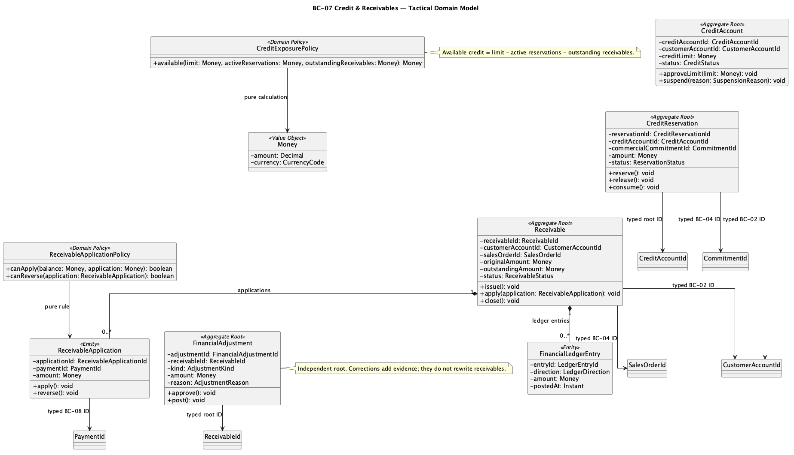
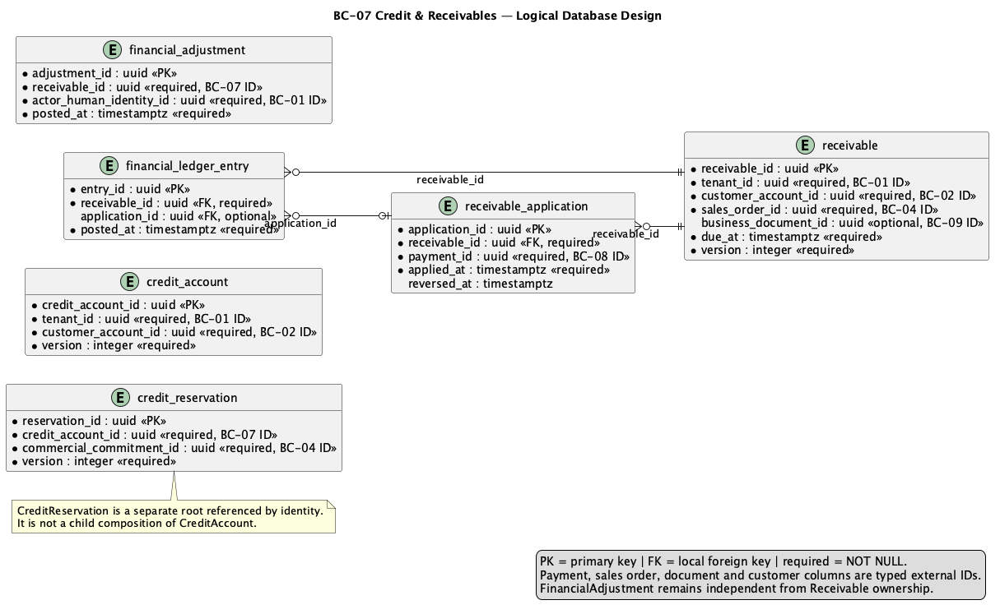

### 2.6.7. Bounded Context: Credit & Receivables

This context owns credit exposure, reservation and Receivable authority.
Payment is a separate context; Payment Confirmed is not a Receivable.

#### 2.6.7.1. Domain Layer

| Aggregate/root | Boundary and invariant |
| :--- | :--- |
| `CreditAccount` | Limit, exposure and reservation policy for one Customer Account |
| `CreditReservation` | Active protection for one commercial source; released/converted once |
| `Receivable` | Posted obligation, balance and due state |
| `FinancialAdjustment` | Explicit correction with reason and actor |

`ReceivableApplication` belongs to financial authority and references Payment
by ID. Value objects include `CreditAmount`, `AvailableCredit`, `Terms` and
`AdjustmentReason`; policies include `CreditDecisionPolicy` and
`DoubleCountPreventionPolicy`. Repositories own CreditAccount and Receivable
roots.

Invariante de diseño: Available Credit = Credit Limit − Active Credit Reservations
− Outstanding Receivable Balances. Credit purchase reserves at PR submission;
direct order reserves in the same logical confirmation; credit/net Receivable
posts at SO confirmation. Applications cannot over-apply or double-apply;
corrections preserve original facts. Buyer sees safe projections, not internal
risk policy.

#### 2.6.7.2. Interface Layer

La Interface Layer cubre credit exposure, reservation, receivable posting,
payment application and explicit financial adjustment. Exact routes and DTOs
remain unclaimed where absent from API evidence. Capability authorization and
Tenant scope are server-side; external payment provider data enters through
BC-08 contracts.

#### 2.6.7.3. Application Layer

La Application Layer evalúa y reserva crédito, registra Receivable, aplica o
revierte referencias de Payment y registra ajustes. Application boundaries coordinate BC-08
without a cross-context aggregate. Idempotency and concurrency protect last
credit; committed facts feed documents/notifications/traceability after commit.

#### 2.6.7.4. Infrastructure Layer

La Infrastructure Layer organiza la propiedad lógica en PostgreSQL compartido sobre `credit_account`,
`credit_reservation`, `receivable`, `receivable_application`,
`financial_adjustment` and `financial_ledger_entry`. Payment and Sales Order
identifiers are non-owning references. Tenant predicates, monetary checks and
history rules remain in canonical SQL; no physical BC database is asserted.

#### 2.6.7.5. Bounded Context Software Architecture Component Level Diagrams

La familia de componentes de Nexa API representa la colaboración lógica
mostrada dentro de una API compartida. No equivale a un Bounded Context
adicional, una base de datos independiente ni una unidad de despliegue.

#### 2.6.7.6. Bounded Context Software Architecture Code Level Diagrams

##### 2.6.7.6.1. Bounded Context Domain Layer Class Diagrams

Source: [domain-model.puml](../../../assets/chapter-2/tactical/BC-07/domain-model.puml).

##### 2.6.7.6.2. Bounded Context Database Design Diagram

Source: [database-diagram.puml](../../../assets/chapter-2/tactical/BC-07/database-diagram.puml).
This is a logical projection of shared PostgreSQL with constraints and
tenant scope; canonical SQL remains authority.
