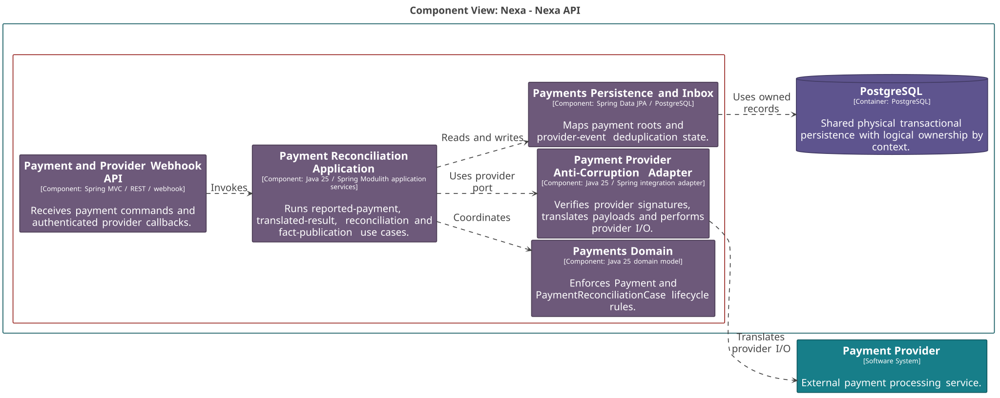
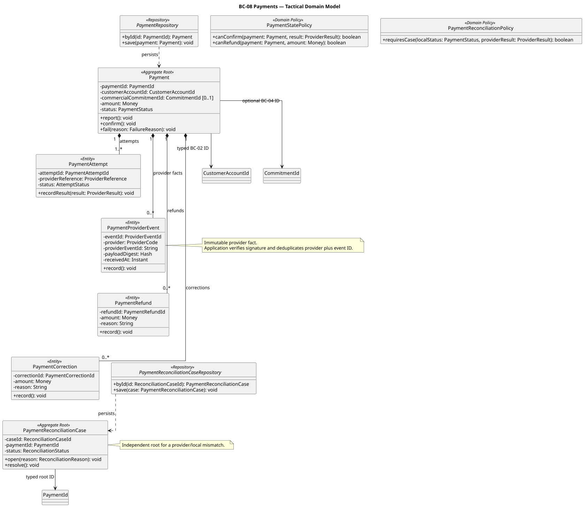
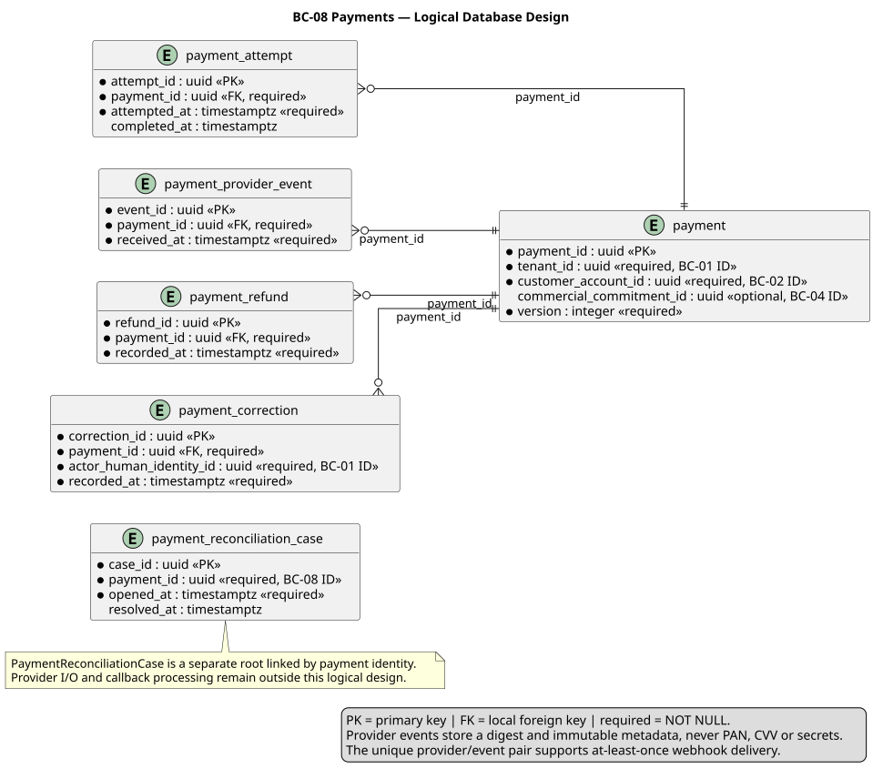

### 2.6.8. Bounded Context: Payments

BC-08 conserva Payment independiente de proveedor, intentos y conciliación.
Payment Reported y Payment Confirmed son estados distintos. La verificación
criptográfica, HTTP, inbox y deduplicación técnica pertenecen a Infrastructure/
Application, no al Domain.

#### 2.6.8.1. Domain Layer

El dominio recibe sólo hechos de proveedor ya traducidos. `PaymentProviderEvent`
es Entity de Payment; el inbox técnico permanece fuera de Domain.
`PaymentReconciliationCase` conserva lifecycle independiente para discrepancias.

| Clase | Categoría | Propósito | Atributos / inputs clave | Operaciones principales | Relaciones / ownership |
| :--- | :--- | :--- | :--- | :--- | :--- |
| `Payment` | Aggregate Root | Mantener estado autoritativo de pago. | `PaymentId`, `CustomerAccountId`, `CommitmentId?`, money, status. | `report`, `confirm`, `fail`. | Compone attempts, provider facts, refunds/corrections. |
| `PaymentReconciliationCase` | Aggregate Root | Mantener discrepancia local/proveedor. | case, `PaymentId`, razón, status. | `open`, `resolve`. | Payment por ID; lifecycle propio. |
| `PaymentAttempt` | Entity | Conservar resultado de intento. | provider reference, status, momento. | `recordResult`. | Propiedad de Payment. |
| `PaymentProviderEvent` | Entity | Conservar callback traducido e inmutable. | provider, event ID, digest, tiempo. | `record`. | Propiedad de Payment; uniqueness técnica en Infrastructure. |
| `PaymentRefund`, `PaymentCorrection` | Entities | Conservar reversión/corrección explícita. | monto, razón, actor cuando aplica. | `record`. | Propiedad de Payment. |
| `PaymentStatePolicy`, `PaymentReconciliationPolicy` | Domain Policies | Evaluar transición y necesidad de caso. | estado, resultado traducido, money. | `canConfirm`, `canRefund`, `requiresCase`. | Puras; sin provider I/O. |
| `PaymentRepository`, `PaymentReconciliationCaseRepository` | Repository interfaces | Cargar roots de pago y conciliación. | IDs y roots. | `byId`, `save`. | Implementaciones PostgreSQL. |

#### 2.6.8.2. Interface Layer

La interfaz separa comandos de pago de callbacks externos. El webhook recibe
payload no confiable; no puede declarar un Payment Confirmed directamente.

| Clase | Categoría | Propósito | Inputs clave | Operaciones principales | Colaboradores |
| :--- | :--- | :--- | :--- | :--- | :--- |
| `PaymentController` | REST Controller | Recibir reporte/inicio y consultas de pago. | actor, payment command, `Idempotency-Key`. | `reportPayment`, `initiatePayment`, `getPayment`. | Payment handlers. |
| `PaymentProviderWebhookController` | Webhook Controller | Recibir callback de proveedor. | headers, payload, provider ID. | `receiveProviderCallback`. | Signature verifier e inbox. |

#### 2.6.8.3. Application Layer

Application traduce resultado, deduplica técnicamente y finaliza con fencing.
I/O proveedor ocurre fuera de transacción larga; después publica sólo facts de
pago comprometidos.

| Clase | Categoría | Propósito | Inputs clave | Operaciones principales | Colaboradores |
| :--- | :--- | :--- | :--- | :--- | :--- |
| `ReportPaymentCommandHandler` | Command Handler | Registrar pago reportado. | customer, amount, commitment opcional, llave. | `handle`. | `PaymentRepository`. |
| `InitiatePaymentCommandHandler` | Command Handler | Persistir intención antes de provider I/O. | payment, method, llave. | `handle`. | Payment repository y provider port. |
| `HandleTranslatedProviderResultCommandHandler` | Command Handler | Aplicar resultado ya autenticado/deduplicado. | translated result, event ID, versión. | `handle`. | Payment root y state policy. |
| `ReconcilePaymentCommandHandler` | Command Handler | Abrir/resolver caso de discrepancia. | payment, resultado, razón. | `handle`. | Reconciliation repository/policy. |
| `PublishPaymentFactCommandHandler` | Application Service | Publicar Payment facts confirmados. | payment fact, correlación. | `publish`. | Outbox y consumidores. |

#### 2.6.8.4. Infrastructure Layer

Infrastructure verifica firma, traduce proveedor con ACL, mantiene inbox y
persiste roots. Nunca almacena PAN, CVV ni secretos en el modelo.

| Clase | Categoría | Propósito | Inputs / datos | Operaciones principales | Colaboradores |
| :--- | :--- | :--- | :--- | :--- | :--- |
| `PostgresPaymentRepository` | Repository implementation | Mapear Payment y child facts. | payment records. | `byId`, `save`. | `PaymentRepository`, PostgreSQL. |
| `PostgresPaymentReconciliationCaseRepository` | Repository implementation | Mapear case independiente. | reconciliation records. | `byId`, `save`. | `PaymentReconciliationCaseRepository`. |
| `PaymentProviderAntiCorruptionAdapter` | Provider adapter | Traducir contratos externos a resultado provider-neutral. | provider request/response. | `initiate`, `translate`. | Application port. |
| `WebhookSignatureVerifier` | Security adapter | Verificar autenticidad del callback. | headers, payload, provider config. | `verify`. | Webhook controller. |
| `PaymentProviderEventInbox` | Inbox adapter | Deduplicar par provider/event antes de aplicación. | provider/event ID, digest. | `claim`, `complete`. | Webhook/application handlers. |
| `PaymentOutboxPublisher` | Outbox adapter | Persistir Payment facts comprometidos. | fact, correlación. | `enqueue`. | BC-07, BC-09, BC-10, BC-11. |

#### 2.6.8.5. Bounded Context Software Architecture Component Level Diagrams

La vista C4 L3 separa API/webhook, aplicación de pago, modelo, persistencia e
ACL de proveedor. La label hacia BC-09 publica Payment facts, no document facts.

*Nota. Elaboración propia.*

#### 2.6.8.6. Bounded Context Software Architecture Code Level Diagrams

Los diagramas limitan Domain a roots, entities y políticas de pago sin HTTP,
envelopes de transporte o DTOs de proveedor.

##### 2.6.8.6.1. Bounded Context Domain Layer Class Diagrams

El UML muestra `PaymentProviderEvent` como Entity local y repositories para
Payment/PaymentReconciliationCase, no como integración técnica del Domain.

*Nota. Elaboración propia.*

##### 2.6.8.6.2. Bounded Context Database Design Diagram

El modelo relacional conserva `unique(provider_code, provider_event_id)` para
at-least-once delivery y columnas de digest sin datos sensibles de pago.

*Nota. Elaboración propia.*
