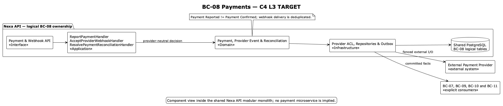

### 2.6.8. Bounded Context: Payments

This context owns provider-neutral Payment facts, attempts, callbacks, refunds,
corrections and reconciliation. Payment Reported is not Payment Confirmed.

#### 2.6.8.1. Domain Layer

| Aggregate/root | Boundary and invariant |
| :--- | :--- |
| `Payment` | Intent/report/confirmation lifecycle and immutable monetary facts |
| `PaymentProviderEvent` | Verified callback identity and preserved payload metadata |
| `PaymentReconciliationCase` | Provider success/local failure or uncertain outcome |

`PaymentAttempt`, `PaymentRefund` and `PaymentCorrection` are Payment-owned
facts. Value objects include `PaymentId`, `ProviderReference`, `Money` and
`PaymentStatus`; policies include provider callback verification and payment
reconciliation. Payment application to Receivable is an explicit BC-07 port.

Invariantes de diseño: PREPAID needs Payment Confirmed before SO confirmation and
physical fulfillment; IMMEDIATE may confirm SO first and becomes due. Webhooks
are at-least-once and dedupe `(provider, eventId)`; provider success/local SO
failure becomes `UNALLOCATED / RECONCILIATION_REQUIRED`; payment history is
immutable and refund/correction is explicit. PAN, CVV and secrets are never
stored.

#### 2.6.8.2. Interface Layer

La Interface Layer cubre payment intent/report/status, provider callback,
refund/correction and reconciliation. Exact routes not verified in API are not
invented. The webhook edge verifies provider signatures and deduplication;
clients consume server status and cannot declare confirmation.

#### 2.6.8.3. Application Layer

La Application Layer inicia trabajo con proveedor, acepta callbacks, confirma o
reconcilia, solicita reembolsos y expone estado seguro. External I/O occurs outside long DB
transactions; local intent/attempt state is fenced and idempotent. BC-07
application coordination references Receivable by ID.

#### 2.6.8.4. Infrastructure Layer

La Infrastructure Layer organiza la propiedad lógica en PostgreSQL compartido sobre `payment`, `payment_attempt`,
`payment_provider_event`, `payment_refund`, `payment_correction` and
`payment_reconciliation_case`. Provider payload metadata is immutable and
secret-free. Stripe/provider adapters are ACLs; physical PostgreSQL remains
shared and no payment microservice is inferred.

#### 2.6.8.5. Bounded Context Software Architecture Component Level Diagrams

Las siguientes clases son especificaciones **TARGET**. Separan el ingreso de
proveedor de la decisión de negocio y modelan callbacks como mensajes al menos
una vez, nunca como confirmación automática del cliente.

*Clases TARGET por capa de BC-08*

| Capa | Clase | Tipo | Responsabilidad y límite de consistencia |
| --- | --- | --- | --- |
| Interface | `PaymentController` | Controller | Recibe intent, reporte y consulta de estado con idempotencia; el cliente no declara Payment Confirmed. |
| Interface | `PaymentWebhookController` | Webhook controller | Verifica firma y traduce callback del proveedor antes de llegar a aplicación. |
| Interface | `PaymentProjectionConsumer` | Consumer | Proyecta estado seguro a Platform, Portal o Mobile sin exponer secretos. |
| Application | `ReportPaymentHandler` | Command handler | Registra intención o reporte con alcance y referencia segura. |
| Application | `InitiateProviderPaymentHandler` | Application service | Persiste/asegura intención, hace I/O fuera de transacción larga y finaliza de forma cercada. |
| Application | `AcceptProviderWebhookHandler` | Event handler | Deduplica `(provider,eventId)`, procesa una transición de Payment y abre reconciliación si existe incertidumbre. |
| Application | `RequestRefundHandler` | Command handler | Inicia reverso explícito sin borrar Payment ni su historial. |
| Application | `ResolvePaymentReconciliationHandler` | Command handler | Cierra caso visible de resultado proveedor/local incongruente. |
| Infrastructure | `PaymentRepositoryAdapter` | Repository implementation | Persiste Payment, attempts y casos de reconciliación en PostgreSQL compartido. |
| Infrastructure | `StripePaymentProviderAdapter` | Provider ACL | Traduce proveedor concreto a contrato neutral y mantiene reemplazable la integración. |
| Infrastructure | `ProviderWebhookInboxAdapter` | Inbox adapter | Conserva deduplicación, lease y reintento de callbacks al menos una vez. |
| Infrastructure | `PaymentOutboxAdapter` | Outbox adapter | Publica `PaymentConfirmed` únicamente después del commit local. |

La vista C4 L3 **TARGET** muestra componentes conceptuales de este contexto dentro de Nexa API. No equivale a un Bounded Context adicional, una base de datos independiente ni una unidad de despliegue.

#### 2.6.8.6. Bounded Context Software Architecture Code Level Diagrams

##### 2.6.8.6.1. Bounded Context Domain Layer Class Diagrams

##### 2.6.8.6.2. Bounded Context Database Design Diagram

The drawing is a logical shared-PostgreSQL projection; keys and
provider-event dedupe remain defined by canonical SQL.
