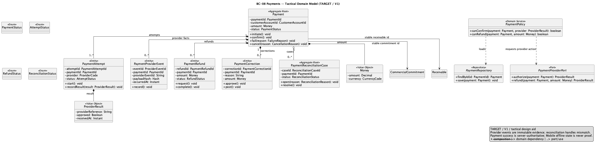
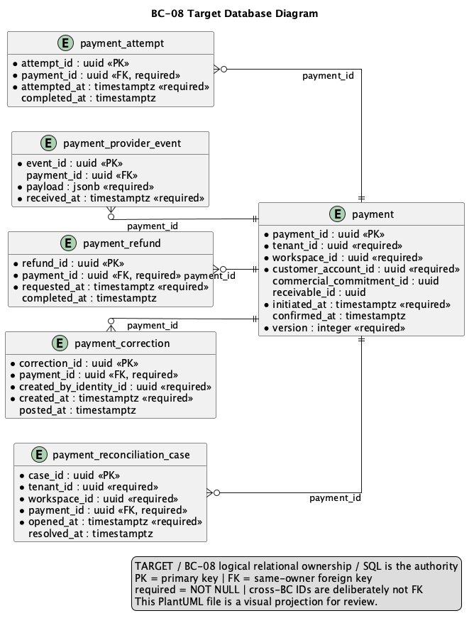

# 2.6.9. BC-08 — Payments

`DOMAIN MODEL: TARGET / ACCEPTED`
`IMPLEMENTATION CROSSWALK: AS-IS VERIFIED / PARTIAL`

Canonical target: Blueprint `01-shared/domain/bounded-contexts/BC-08-payments/`.
This context owns provider-neutral Payment facts, attempts, callbacks, refunds,
corrections and reconciliation. Payment Reported is not Payment Confirmed.

## 2.6.9.1 Domain Layer

| Aggregate/root | Boundary and invariant |
| :--- | :--- |
| `Payment` | Intent/report/confirmation lifecycle and immutable monetary facts |
| `PaymentProviderEvent` | Verified callback identity and preserved payload metadata |
| `PaymentReconciliationCase` | Provider success/local failure or uncertain outcome |

`PaymentAttempt`, `PaymentRefund` and `PaymentCorrection` are Payment-owned
facts. Value objects include `PaymentId`, `ProviderReference`, `Money` and
`PaymentStatus`; policies include provider callback verification and payment
reconciliation. Payment application to Receivable is an explicit BC-07 port.

Target invariants: PREPAID needs Payment Confirmed before SO confirmation and
physical fulfillment; IMMEDIATE may confirm SO first and becomes due. Webhooks
are at-least-once and dedupe `(provider, eventId)`; provider success/local SO
failure becomes `UNALLOCATED / RECONCILIATION_REQUIRED`; payment history is
immutable and refund/correction is explicit. PAN, CVV and secrets are never
stored.

## 2.6.9.2 Interface Layer

Target contracts cover payment intent/report/status, provider callback,
refund/correction and reconciliation. Exact routes not verified in API are not
invented. The webhook edge verifies provider signatures and deduplication;
clients consume server status and cannot declare confirmation.

## 2.6.9.3 Application Layer

Target handlers initiate provider work, accept callbacks, confirm/reconcile,
request refunds and expose safe status. External I/O occurs outside long DB
transactions; local intent/attempt state is fenced and idempotent. BC-07
application coordination references Receivable by ID.

## 2.6.9.4 Infrastructure Layer

Target shared PostgreSQL ownership covers `payment`, `payment_attempt`,
`payment_provider_event`, `payment_refund`, `payment_correction` and
`payment_reconciliation_case`. Provider payload metadata is immutable and
secret-free. Stripe/provider adapters are ACLs; physical PostgreSQL remains
shared and no payment microservice is inferred.

AS-IS anchor: API `payments` domain/application/Stripe/presentation paths,
provider configuration, tests and migrations V43/V59. Payment/attempt/provider
callback code is `AS-IS VERIFIED`; provider-neutral reconciliation and all
failure compensation is `PARTIAL`; Mobile payment workflow/runtime and Product
Acceptance are `NOT EVIDENCED`.

## 2.6.9.5 Bounded Context Software Architecture Component Level Diagrams

`Nexa-API-CreditPaymentDocuments-TARGET` is the selected API component family.
It is a logical view across three BC concerns inside one API container, not a
physical deployment boundary.

Source/export provenance: [Chapter 2 register](../../../assets/chapter-2/provenance.md).

## 2.6.9.6 Bounded Context Software Architecture Code Level Diagrams

### 2.6.9.6.1 Bounded Context Domain Layer Class Diagrams

Source: [domain-model.puml](../../../assets/chapter-2/tactical/BC-08/domain-model.puml).

### 2.6.9.6.2 Bounded Context Database Design Diagram

Source: [database-diagram.puml](../../../assets/chapter-2/tactical/BC-08/database-diagram.puml).
The drawing is a logical shared-PostgreSQL projection; target keys and
provider-event dedupe remain defined by canonical SQL.

## Crosswalk and open evidence

| Concern | Classification | Evidence boundary |
| :--- | :--- | :--- |
| Payment/attempt/Stripe callback code | `AS-IS VERIFIED` | API `payments` at `origin/main` |
| Payment Reported != Payment Confirmed target | `TARGET / ACCEPTED` | Blueprint tactical model/data model |
| Reconciliation/compensation closure | `PARTIAL` | Existing provider path does not prove all target cases |
| Mobile payment implementation and Product Acceptance | `NOT EVIDENCED` | Mobile is indirect planned projection |
