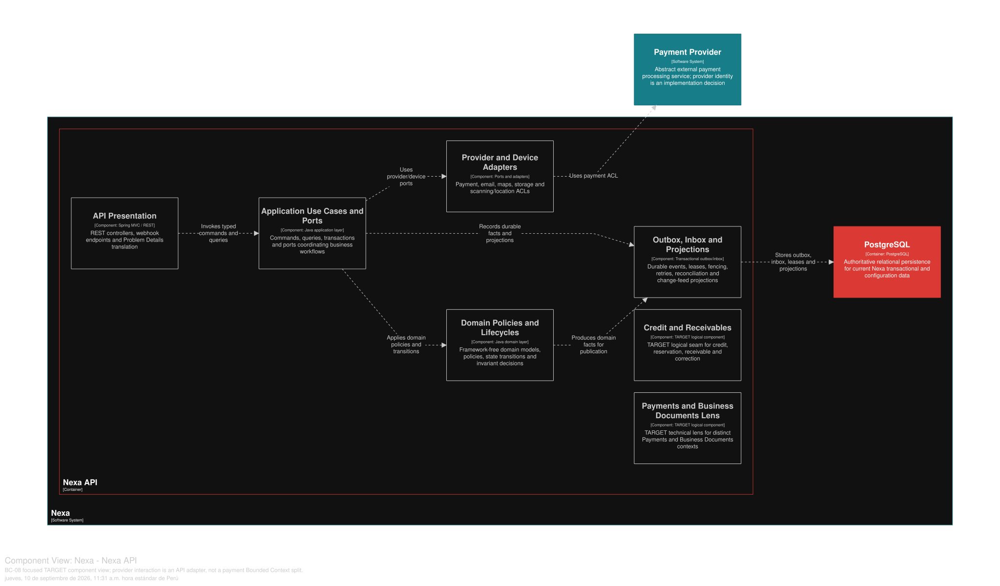

### 2.6.8. Bounded Context: Payments

Este contexto posee los hechos de Payment independientes del proveedor, los
intentos, callbacks, reembolsos, correcciones y conciliación. Payment Reported
no equivale a Payment Confirmed.

#### 2.6.8.1. Domain Layer

*Agregados y límites invariantes de BC-08.*
| Aggregate/raíz | Límite e invariante |
| :--- | :--- |
| `Payment` | Ciclo de vida de intent, reporte y confirmación, y hechos monetarios inmutables |
| `PaymentProviderEvent` | Identidad verificada de callback y metadatos preservados del payload |
| `PaymentReconciliationCase` | Éxito del proveedor con fallo local o resultado incierto |

`PaymentAttempt`, `PaymentRefund` y `PaymentCorrection` son hechos propiedad de
Payment. Los Value Objects incluyen `PaymentId`, `ProviderReference`, `Money` y
`PaymentStatus`; las políticas incluyen la verificación de callbacks del
proveedor y la conciliación de pagos. La aplicación de Payment a Receivable es
un puerto explícito de BC-07.

Invariantes de diseño: PREPAID requiere Payment Confirmed antes de la
confirmación de la SO y del fulfillment físico; IMMEDIATE puede confirmar primero
la SO y pasa a estar pendiente de pago. Los webhooks son al menos una vez y
deduplican `(provider, eventId)`; el éxito del proveedor con fallo local de SO
se convierte en `UNALLOCATED / RECONCILIATION_REQUIRED`; el historial de pagos
es inmutable y el reembolso o la corrección son explícitos. PAN, CVV y secretos
nunca se almacenan.

#### 2.6.8.2. Interface Layer

La Interface Layer cubre el intent, reporte y estado de Payment, el callback del
proveedor, el reembolso o corrección y la conciliación. No se inventan rutas
exactas no verificadas en la API. El borde del webhook verifica firmas y
deduplicación del proveedor; los clientes consumen el estado del servidor y no
pueden declarar una confirmación.

#### 2.6.8.3. Application Layer

La Application Layer inicia el trabajo con el proveedor, acepta callbacks,
confirma o concilia, solicita reembolsos y expone estado seguro. El I/O externo
ocurre fuera de transacciones largas de base de datos; el estado local de intent
e intento se protege con fencing e idempotencia. La coordinación de Application
con BC-07 referencia Receivable por ID.

#### 2.6.8.4. Infrastructure Layer

La Infrastructure Layer organiza la propiedad lógica en PostgreSQL compartido
sobre `payment`, `payment_attempt`, `payment_provider_event`, `payment_refund`,
`payment_correction` y `payment_reconciliation_case`. Los metadatos del payload
del proveedor son inmutables y no contienen secretos. Los adaptadores de Stripe
o de otros proveedores son ACL; PostgreSQL físico continúa compartido y no se
infiere un microservicio de pagos.

#### 2.6.8.5. Bounded Context Software Architecture Component Level Diagrams

Las siguientes clases son especificaciones **TARGET**. Separan el ingreso de
proveedor de la decisión de negocio y modelan callbacks como mensajes al menos
una vez, nunca como confirmación automática del cliente.

*Clases TARGET por capa de BC-08*

| Capa | Clase | Tipo | Responsabilidad y límite de consistencia |
| --- | --- | --- | --- |
| Interface | `PaymentController` | Controller | Recibe intent, reporte y consulta de estado con idempotencia; el cliente no declara Payment Confirmed. |
| Interface | `PaymentWebhookController` | Webhook controller | Verifica firma y traduce callback del proveedor antes de llegar a aplicación. |
| Interface | `PaymentProjectionConsumer` | Consumer | Proyecta estado seguro a Platform, Portal o Mobile sin exponer secretos. |
| Application | `ReportPaymentHandler` | Command handler | Registra intención o reporte con alcance y referencia segura. |
| Application | `InitiateProviderPaymentHandler` | Application service | Persiste/asegura intención, hace I/O fuera de transacción larga y finaliza de forma cercada. |
| Application | `AcceptProviderWebhookHandler` | Event handler | Deduplica `(provider,eventId)`, procesa una transición de Payment y abre reconciliación si existe incertidumbre. |
| Application | `RequestRefundHandler` | Command handler | Inicia reverso explícito sin borrar Payment ni su historial. |
| Application | `ResolvePaymentReconciliationHandler` | Command handler | Cierra caso visible de resultado proveedor/local incongruente. |
| Infrastructure | `PaymentRepositoryAdapter` | Repository implementation | Persiste Payment, attempts y casos de reconciliación en PostgreSQL compartido. |
| Infrastructure | `StripePaymentProviderAdapter` | Provider ACL | Traduce proveedor concreto a contrato neutral y mantiene reemplazable la integración. |
| Infrastructure | `ProviderWebhookInboxAdapter` | Inbox adapter | Conserva deduplicación, lease y reintento de callbacks al menos una vez. |
| Infrastructure | `PaymentOutboxAdapter` | Outbox adapter | Publica `PaymentConfirmed` únicamente después del commit local. |

La vista C4 L3 **TARGET** muestra componentes conceptuales de este contexto dentro de Nexa API. No equivale a un Bounded Context adicional, una base de datos independiente ni una unidad de despliegue.

*Vista C4 L3 TARGET de BC-08 Payments.*

*Nota.* Exportación vectorial desde una vista Structurizr DSL enfocada en BC-08 Payments, dentro del único contenedor Nexa API. Es evidencia de diseño TARGET; no acredita implementación, runtime ni una unidad de despliegue independiente.

#### 2.6.8.6. Bounded Context Software Architecture Code Level Diagrams

##### 2.6.8.6.1. Bounded Context Domain Layer Class Diagrams

*Modelo de dominio táctico de BC-08 Payments.*

*Nota.* El diagrama se presenta como modelo de diseño, no como inventario de código.

##### 2.6.8.6.2. Bounded Context Database Design Diagram

*Proyección del diseño de base de datos de BC-08.*

*Nota.* El diagrama es una proyección lógica de PostgreSQL compartido; las claves y la deduplicación de eventos del proveedor están definidas por el SQL canónico.
