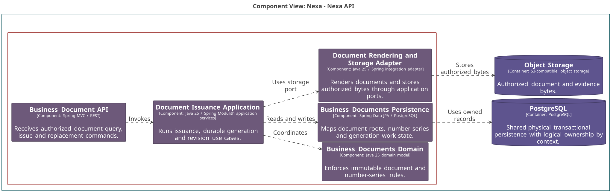

### 2.6.9. Bounded Context: Business Documents

BC-09 conserva documentos de negocio, numeración, snapshots y metadatos de
archivo. No posee Sales, Payment, Delivery ni bytes de Object Storage.

#### 2.6.9.1. Canonical class dictionary

*Clases y responsabilidades de BC-09 por capa.*

| Layer | Class | Category | Purpose | Key Attributes / Inputs | Main Methods / Business Behavior | Relationships / Collaborators | Aggregate Owner / External References |
| :--- | :--- | :--- | :--- | :--- | :--- | :--- | :--- |
| Domain | BusinessDocument | Aggregate Root | Conserva un documento y su emisión. | Document ID, series ID, type, status, source reference. | Issue and supersede. | References source facts by typed IDs. | Owns snapshot lines, revisions and storage metadata. |
| Domain | DocumentNumberSeries | Aggregate Root | Mantiene una serie de numeración. | Series ID, tenant ID, type, next number. | Reserve number. | Used by BusinessDocument through identity. | Independent lifecycle. |
| Domain | DocumentSnapshotLine | Entity | Conserva una línea inmutable de snapshot. | SKU ID, description, quantity and price. | Preserves issued data. | Uses BC-03 SKU ID. | Owned by BusinessDocument. |
| Domain | DocumentRevision | Entity | Conserva una revisión o reemplazo sellado. | Revision number and snapshot hash. | Seal revision. | Uses local document identity. | Owned by BusinessDocument. |
| Domain | ObjectStorageReference | Entity | Conserva metadatos controlados del artefacto. | Object key, content type, length and hash. | Attach metadata. | Does not load bytes. | Owned by BusinessDocument; storage is external. |
| Domain | DocumentIssuePolicy | Domain Policy | Evalúa si un snapshot puede emitirse. | Revision and number series values. | Decide issuance. | Pure values loaded by application. | No renderer or Object Storage dependency. |
| Interface | BC-09 Interface Boundary | Interface component | Traduce solicitudes y consultas autorizadas. | Actor, scope, document command. | Rejects invalid input. | Calls application orchestration. | Does not reveal object bytes. |
| Application | DocumentGenerationRequest | Application work item | Mantiene trabajo durable e idempotente de generación. | Document ID, idempotency key and work status. | Claim, render and complete with fencing. | Uses document ID and application storage port. | Not an Aggregate Root. |
| Application | BC-09 Application Orchestration | Application component | Coordina emisión, reemplazo y generación. | Source snapshot and document command. | Persists intent before external render or storage work. | Uses typed facts from source contexts. | Does not own source aggregates. |
| Infrastructure | BC-09 Persistence and Storage Adapters | Infrastructure component | Persiste metadatos y ejecuta I/O de archivos. | Document records and object bytes. | Maps records and calls authorized storage adapter. | PostgreSQL, renderer and Object Storage. | Domain does not invoke adapters. |

Un documento emitido no se modifica. La corrección crea una revisión o un
documento reemplazante vinculado. DocumentGenerationRequest es trabajo de
aplicación; ObjectStorageReference contiene sólo metadatos. Commercial Invoice
no se presenta como documento fiscal por defecto.

#### 2.6.9.2. Component and code-level diagrams

*Vista C4 L3 de BC-09 Business Documents.*

*Nota. Elaboración propia.*

*Modelo de dominio táctico de BC-09 Business Documents.*

*Nota. Elaboración propia.*

*Diseño lógico de base de datos de BC-09 Business Documents.*

*Nota. Elaboración propia.*
