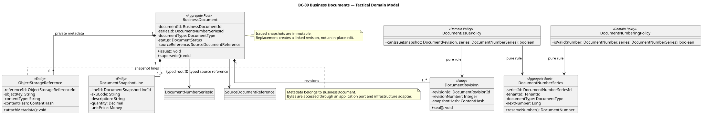
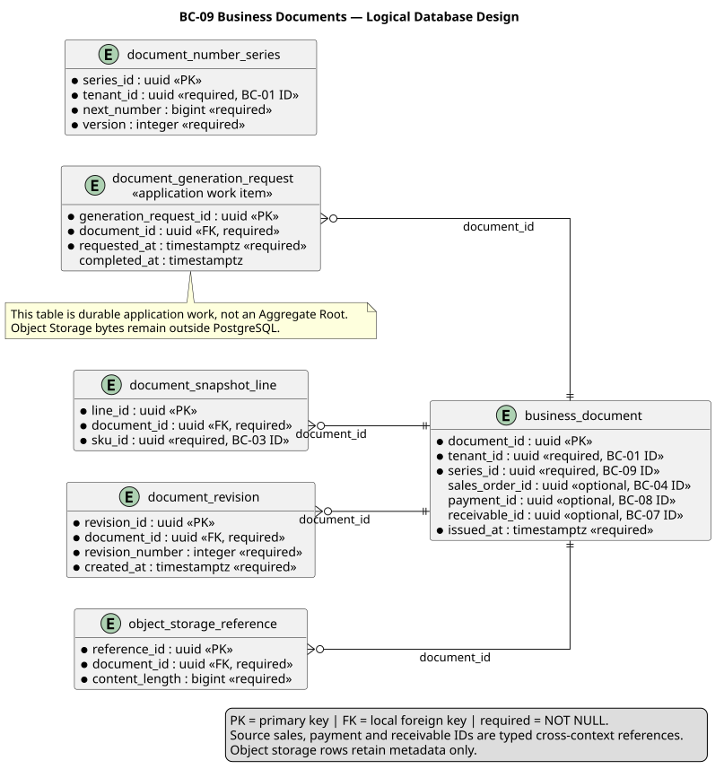

### 2.6.9. Bounded Context: Business Documents

BC-09 conserva documentos de negocio, numeración, snapshots y metadatos de
archivo. No posee Sales, Payment, Delivery ni bytes de Object Storage.
`DocumentGenerationRequest` es trabajo durable de Application, no Aggregate
Root.

#### 2.6.9.1. Domain Layer

El dominio preserva historia documental inmutable. Una corrección crea revisión
o reemplazo vinculado; Commercial Invoice de Nexa no se presenta como documento
fiscal SUNAT por defecto.

| Clase | Categoría | Propósito | Atributos / inputs clave | Operaciones principales | Relaciones / ownership |
| :--- | :--- | :--- | :--- | :--- | :--- |
| `BusinessDocument` | Aggregate Root | Mantener documento emitido y snapshot. | `BusinessDocumentId`, `DocumentNumberSeriesId`, tipo, status, `SourceDocumentReference`. | `issue`, `supersede`. | Compone líneas, revisiones y metadata storage. |
| `DocumentNumberSeries` | Aggregate Root | Mantener serie y número siguiente. | `DocumentNumberSeriesId`, `TenantId`, type, code, next number, versión. | `reserveNumber`. | Root independiente con concurrencia persistente. |
| `DocumentSnapshotLine` | Entity | Conservar línea inmutable de documento. | SKU code, descripción, cantidad, precio. | preservación. | Propiedad de BusinessDocument. |
| `DocumentRevision` | Entity | Conservar revisión/reemplazo sellado. | número, hash, momento. | `seal`. | Propiedad de BusinessDocument. |
| `ObjectStorageReference` | Entity | Conservar metadata de artefacto. | object key, media type, length, hash. | `attachMetadata`. | Propiedad de BusinessDocument; bytes externos. |
| `DocumentIssuePolicy`, `DocumentNumberingPolicy` | Domain Policies | Validar emisión y número. | snapshot, serie, number. | `canIssue`, `isValid`. | Puras; no renderer/storage. |
| `BusinessDocumentRepository`, `DocumentNumberSeriesRepository` | Repository interfaces | Cargar roots de documento y serie. | IDs y roots. | `byId`, `save`. | Implementaciones PostgreSQL. |

#### 2.6.9.2. Interface Layer

La interfaz recibe comandos/query de documento autorizados y no expone bytes
sin control de objeto.

| Clase | Categoría | Propósito | Inputs clave | Operaciones principales | Colaboradores |
| :--- | :--- | :--- | :--- | :--- | :--- |
| `BusinessDocumentController` | REST Controller | Exponer issue, generate, replace y query. | actor, source fact, document, versión, llave. | `issue`, `generate`, `replace`, `get`. | Document handlers. |

#### 2.6.9.3. Application Layer

Application toma snapshots de source facts autorizados, reserva número en forma
concurrente y persiste intención antes de renderer/storage I/O.

| Clase | Categoría | Propósito | Inputs clave | Operaciones principales | Colaboradores |
| :--- | :--- | :--- | :--- | :--- | :--- |
| `IssueBusinessDocumentCommandHandler` | Command Handler | Emitir documento desde snapshot válido. | source fact, tipo, serie, llave. | `handle`. | Document/series repositories y policy. |
| `GenerateBusinessDocumentCommandHandler` | Command Handler | Crear trabajo durable de generación. | `DocumentId`, idempotency key. | `handle`. | `DocumentGenerationWorkRepository`. |
| `DocumentGenerationRequest` | Application work item | Mantener intención durable e idempotente de generación. | `DocumentId`, idempotency key, status, fencing token. | `claim`, `complete`. | No es Aggregate Root; persiste mediante el application port. |
| `DocumentGenerationWorkRepository` | Application Port | Definir persistencia y claim del trabajo durable de generación. | work item, document, status. | `claim`, `complete`. | Implementado por `PostgresDocumentGenerationWorkRepository`. |
| `ReplaceBusinessDocumentCommandHandler` | Command Handler | Crear revisión/reemplazo vinculado. | documento, snapshot, razón. | `handle`. | `BusinessDocumentRepository`. |
| `DeliveryDocumentFactEventHandler` | Event Handler | Consumir Delivery/POD fact documental. | fact publicado, event ID. | `handle`. | Inbox y issue handler. |
| `ReceivableDocumentFactEventHandler`, `PaymentDocumentFactEventHandler` | Event Handlers | Consumir source facts financieros reales. | fact publicado, event ID. | `handle`. | Inbox y issue handler. |

#### 2.6.9.4. Infrastructure Layer

Infrastructure implementa repositories, renderer, Object Storage y work queue
durable. Bloqueo/CAS de serie evita que emisiones concurrentes tomen mismo
número.

| Clase | Categoría | Propósito | Inputs / datos | Operaciones principales | Colaboradores |
| :--- | :--- | :--- | :--- | :--- | :--- |
| `PostgresBusinessDocumentRepository` | Repository implementation | Mapear documento, snapshots y revisiones. | document records. | `byId`, `save`. | `BusinessDocumentRepository`, PostgreSQL. |
| `PostgresDocumentNumberSeriesRepository` | Repository implementation | Mapear serie con lock/CAS de número. | series record, versión. | `byId`, `save`, `reserveLocked`. | `DocumentNumberSeriesRepository`. |
| `PostgresDocumentGenerationWorkRepository` | Repository implementation | Persistir/claim work idempotente y fenced. | work item, document, status. | `claim`, `complete`. | `DocumentGenerationWorkRepository`, PostgreSQL. |
| `DocumentRendererAdapter` | Renderer adapter | Transformar snapshot en bytes de documento. | immutable snapshot. | `render`. | Application port. |
| `DocumentObjectStorageAdapter` | Object-storage adapter | Guardar bytes y devolver metadata controlada. | content stream, metadata. | `put`, `getAuthorizedReference`. | `ObjectStorageReference`. |

#### 2.6.9.5. Bounded Context Software Architecture Component Level Diagrams

La lente C4 TARGET de Credit, Payment & Documents sitúa emisión documental,
persistencia y adapter de renderer/storage. Los source facts no transfieren
ownership; BC-09 no se convierte en un componente o Container C4.

*Nota. Export canónico generado desde Blueprint Wave 3.*

#### 2.6.9.6. Bounded Context Software Architecture Code Level Diagrams

Los diagramas representan modelo de dominio y diseño relacional, incluido el
trabajo durable que Application administra.

##### 2.6.9.6.1. Bounded Context Domain Layer Class Diagrams

El UML muestra BusinessDocument y DocumentNumberSeries como roots separados,
con metadata de storage local y repositories explícitos.

*Nota. Elaboración propia.*

##### 2.6.9.6.2. Bounded Context Database Design Diagram

El modelo relacional muestra `UNIQUE (tenant_id, workspace_id, document_type,
series_code)` y `UNIQUE (tenant_id, document_type, document_number)`;
`next_number` se reserva con control de versión/lock y no por un contador no
protegido.

*Nota. Elaboración propia.*
