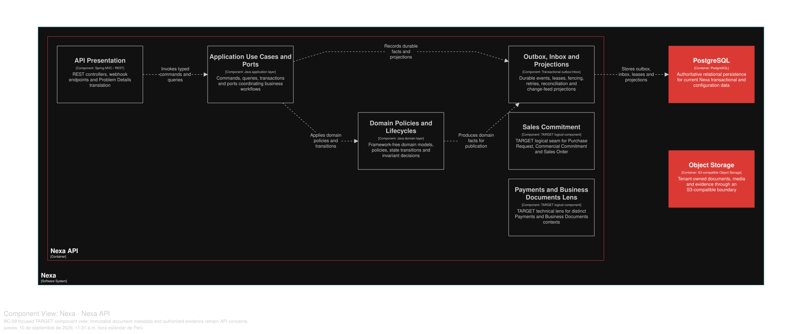

### 2.6.9. Bounded Context: Business Documents

This context owns issued document identity, numbering, immutable snapshots,
generation intent and private Object Storage references. It does not own Sales,
Payment, Delivery or fiscal authority.

#### 2.6.9.1. Domain Layer

| Aggregate/root | Boundary and invariant |
| :--- | :--- |
| `BusinessDocument` | Requested/issued/replaced snapshot and availability metadata |
| `DocumentNumberSeries` | Scoped numbering allocation |
| `DocumentGenerationRequest` | Retryable generation intent with idempotency/lease |
| `ObjectStorageReference` | Metadata for private bytes outside PostgreSQL |

`DocumentSnapshotLine`, `DocumentRevision` and `EvidenceReference` preserve
immutable history. Value objects include `DocumentId`, `DocumentNumber`,
`DocumentType`, `IssuedSnapshot`, `StorageReference` and `ContentHash`.
`DocumentNumberingPolicy` and `DocumentIssuePolicy` validate source snapshots;
`BusinessDocumentRepository` owns document state.

Invariantes de diseño: issued documents never mutate; corrections link a new
revision/replacement; Commercial Invoice is not automatically a SUNAT fiscal
document; PostgreSQL stores metadata/snapshots while Object Storage holds
private bytes; numbering and generation are idempotent and sequence gaps are
explicit.

#### 2.6.9.2. Interface Layer

La Interface Layer cubre document request, availability, authorized metadata/
download and evidence reference. Exact routes are not invented. Authorization
is API-side; Portal and planned Mobile surfaces receive safe projections and
never access public object URLs by inference.

#### 2.6.9.3. Application Layer

La Application Layer solicita y emite documentos, reemplaza o corrige mediante
revisiones vinculadas, registra metadatos de evidencia y reintenta generación
con leases/fencing.
Source snapshots are read through explicit contracts; issuance commits metadata
and durable intent before external rendering/storage work.

#### 2.6.9.4. Infrastructure Layer

La Infrastructure Layer organiza la propiedad lógica en PostgreSQL compartido sobre `document_number_series`,
`business_document`, `document_snapshot_line`, `document_revision`,
`object_storage_reference` and `document_generation_request`. Object Storage
bytes use an application port. Document renderer/scanner adapters are external
ACLs; no database blob or fiscal integration is inferred.

**Clases TARGET por capa de BC-09.** Los nombres siguientes concretan responsabilidades previstas; no implican endpoints, proveedores ni implementación ya disponible.

| Capa | Clase / componente TARGET | Responsabilidad |
|---|---|---|
| Interface | `BusinessDocumentController` | Recibe comandos y consultas de documentos sin exponer entidades de persistencia. |
| Interface | `DocumentGenerationConsumer` | Consume hechos publicados que justifican solicitar una generación documental. |
| Interface | `DocumentAvailabilityConsumer` | Publica al borde de interfaz la disponibilidad de un artefacto ya emitido. |
| Application | `RequestBusinessDocumentHandler` | Valida la solicitud idempotente y fija el snapshot de origen que será trazable. |
| Application | `IssueBusinessDocumentHandler` | Coordina emisión, versionado y publicación del hecho de documento emitido. |
| Application | `ReplaceBusinessDocumentHandler` | Gestiona una sustitución explícita sin reescribir la evidencia histórica. |
| Application | `RegisterEvidenceReferenceHandler` | Registra referencias de evidencia bajo las reglas de retención del contexto. |
| Application | `RetryDocumentGenerationHandler` | Reintenta una generación fallida con una clave de deduplicación estable. |
| Infrastructure | `BusinessDocumentRepositoryAdapter` | Persiste metadatos, versiones y referencias del documento. |
| Infrastructure | `DocumentRendererAdapter` | Adapta el renderizado técnico a un contrato de aplicación. |
| Infrastructure | `ObjectStorageAdapter` | Guarda el binario fuera del agregado y devuelve una referencia controlada. |
| Infrastructure | `DocumentGenerationWorker` | Ejecuta trabajo diferido después del commit, sin I/O externo en la transacción de solicitud. |
| Infrastructure | `DocumentOutboxAdapter` | Publica hechos comprometidos mediante outbox durable. |

#### 2.6.9.5. Bounded Context Software Architecture Component Level Diagrams

La vista C4 L3 **TARGET** muestra componentes conceptuales de este contexto dentro de Nexa API. No equivale a un Bounded Context adicional, una base de datos independiente ni una unidad de despliegue.

*Vista C4 L3 TARGET de BC-09 Business Documents.*

*Nota.* Exportación vectorial desde una vista Structurizr DSL enfocada en BC-09 Business Documents, dentro del único contenedor Nexa API. Es evidencia de diseño TARGET; no acredita implementación, runtime ni una unidad de despliegue independiente.

#### 2.6.9.6. Bounded Context Software Architecture Code Level Diagrams

##### 2.6.9.6.1. Bounded Context Domain Layer Class Diagrams

##### 2.6.9.6.2. Bounded Context Database Design Diagram

This is a logical shared-PostgreSQL projection; bytes stay in Object Storage
behind authorization and canonical SQL defines constraints.
