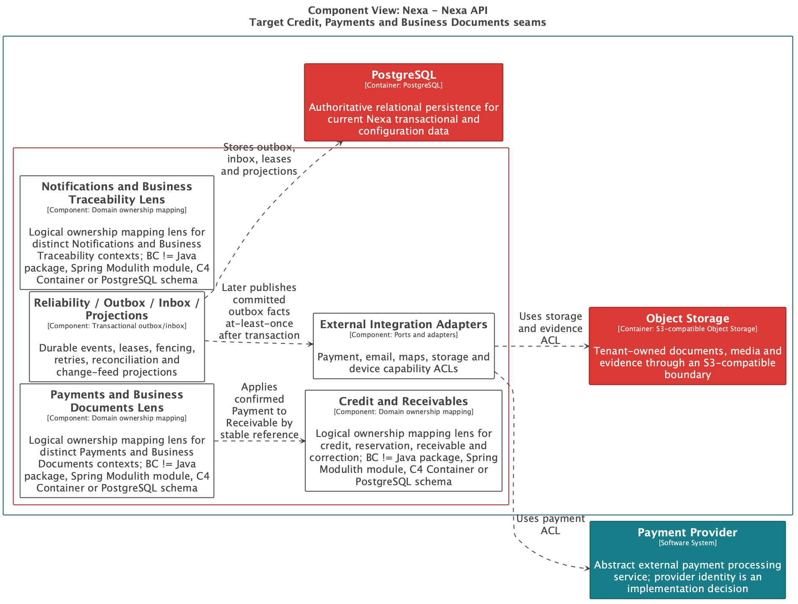
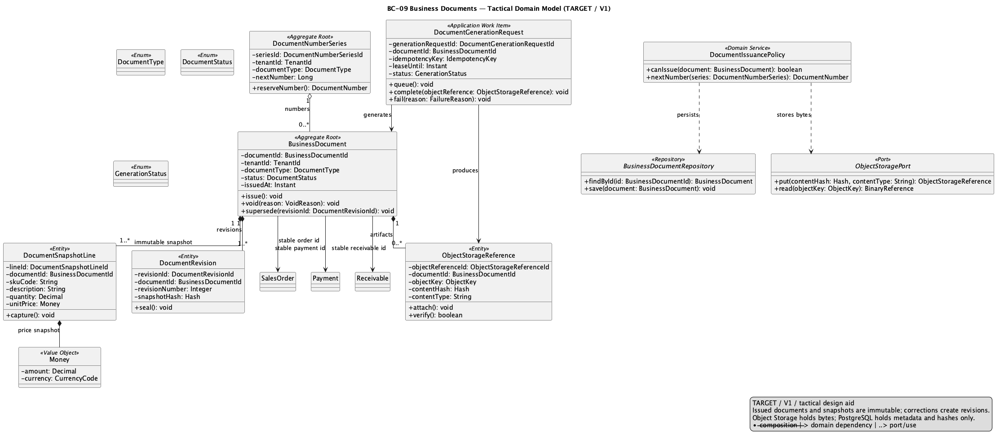
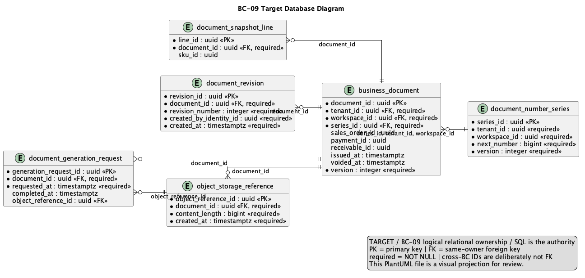

# 2.6.10. BC-09 — Business Documents

`DOMAIN MODEL: TARGET / ACCEPTED`
`IMPLEMENTATION CROSSWALK: AS-IS VERIFIED / PARTIAL`

Canonical target: Blueprint `01-shared/domain/bounded-contexts/BC-09-business-documents/`.
This context owns issued document identity, numbering, immutable snapshots,
generation intent and private Object Storage references. It does not own Sales,
Payment, Delivery or fiscal authority.

## 2.6.10.1 Domain Layer

| Aggregate/root | Boundary and invariant |
| :--- | :--- |
| `BusinessDocument` | Requested/issued/replaced snapshot and availability metadata |
| `DocumentNumberSeries` | Scoped numbering allocation |
| `DocumentGenerationRequest` | Retryable generation intent with idempotency/lease |
| `ObjectStorageReference` | Metadata for private bytes outside PostgreSQL |

`DocumentSnapshotLine`, `DocumentRevision` and `EvidenceReference` preserve
immutable history. Value objects include `DocumentId`, `DocumentNumber`,
`DocumentType`, `IssuedSnapshot`, `StorageReference` and `ContentHash`.
`DocumentNumberingPolicy` and `DocumentIssuePolicy` validate source snapshots;
`BusinessDocumentRepository` owns document state.

Target invariants: issued documents never mutate; corrections link a new
revision/replacement; Commercial Invoice is not automatically a SUNAT fiscal
document; PostgreSQL stores metadata/snapshots while Object Storage holds
private bytes; numbering and generation are idempotent and sequence gaps are
explicit.

## 2.6.10.2 Interface Layer

Target contracts cover document request, availability, authorized metadata/
download and evidence reference. Exact routes are not invented. Authorization
is API-side; Portal and planned Mobile surfaces receive safe projections and
never access public object URLs by inference.

## 2.6.10.3 Application Layer

Target handlers request and issue documents, replace/correct through linked
revisions, register evidence metadata and retry generation with leases/fencing.
Source snapshots are read through explicit contracts; issuance commits metadata
and durable intent before external rendering/storage work.

## 2.6.10.4 Infrastructure Layer

Target shared PostgreSQL ownership covers `document_number_series`,
`business_document`, `document_snapshot_line`, `document_revision`,
`object_storage_reference` and `document_generation_request`. Object Storage
bytes use an application port. Document renderer/scanner adapters are external
ACLs; no database blob or fiscal integration is inferred.

AS-IS anchor: API `businessdocuments` domain/application/persistence/rendering/
storage/presentation paths and migration V42. Document metadata, rendering and
storage references are `AS-IS VERIFIED`; immutable revision and complete
generation recovery are `PARTIAL`; Mobile runtime, fiscal authority and
Product Acceptance are `NOT EVIDENCED`.

## 2.6.10.5 Bounded Context Software Architecture Component Level Diagrams

The selected component family is `Nexa-API-CreditPaymentDocuments-TARGET`.
It shows document components logically colocated with credit/payment in one API
container; it is not a document microservice or separate database.

Source/export provenance: [Chapter 2 register](../../../../delivery-checklists/chapter-02-evidence-provenance.md).

## 2.6.10.6 Bounded Context Software Architecture Code Level Diagrams

### 2.6.10.6.1 Bounded Context Domain Layer Class Diagrams

Source: [domain-model.puml](../../../assets/chapter-2/tactical/BC-09/domain-model.puml).

### 2.6.10.6.2 Bounded Context Database Design Diagram

Source: [database-diagram.puml](../../../assets/chapter-2/tactical/BC-09/database-diagram.puml).
This is a logical shared-PostgreSQL projection; bytes stay in Object Storage
behind authorization and canonical SQL defines target constraints.

## Crosswalk and open evidence

| Concern | Classification | Evidence boundary |
| :--- | :--- | :--- |
| Business document/render/storage implementation | `AS-IS VERIFIED` | API `businessdocuments` and V42 at `origin/main` |
| Immutable target document/revision authority | `TARGET / ACCEPTED` | Blueprint tactical model/data model |
| Full generation/retry/fiscal parity | `PARTIAL` | Existing renderer does not prove all target behavior |
| Mobile download/evidence runtime and Product Acceptance | `NOT EVIDENCED` | Mobile is a planned projection |
