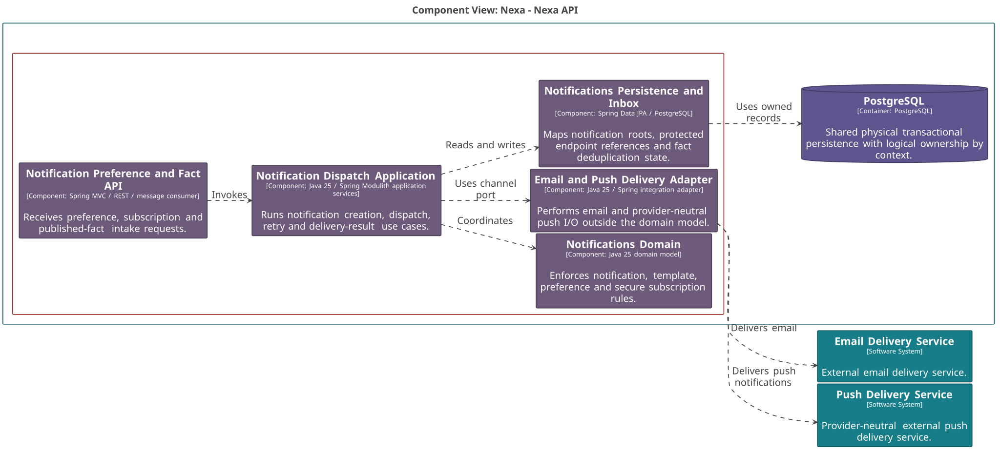
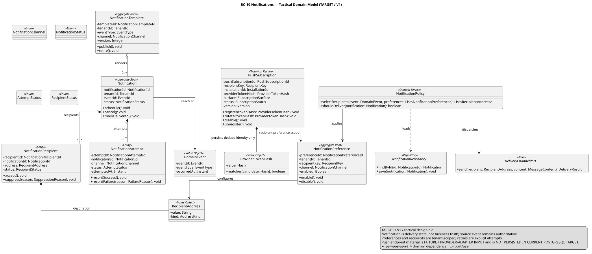
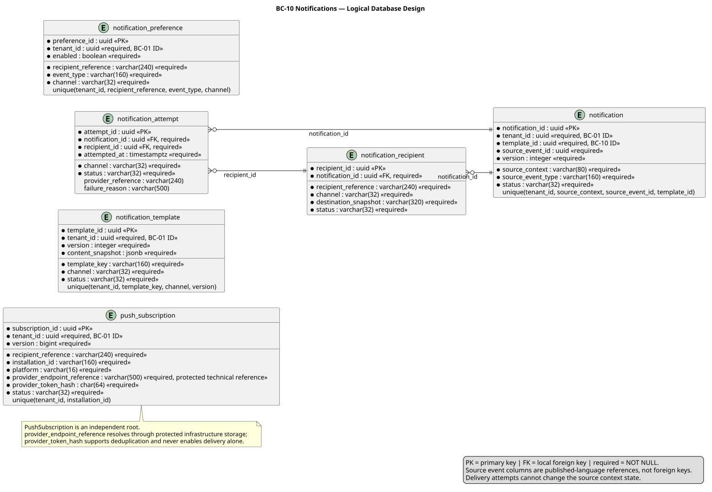

### 2.6.10. Bounded Context: Notifications

BC-10 conserva intención, preferencias, suscripciones y estados de entrega. Un
intento o fallo nunca modifica el hecho de negocio fuente. La suscripción push
mantiene una referencia técnica protegida y hash de deduplicación; Domain no
conoce token crudo ni ejecuta I/O de email/push.

#### 2.6.10.1. Domain Layer

El dominio recibe una `BusinessFactReference` ya traducida desde Application.
`PublishedBusinessFact` y sus envelopes son contratos de integración, no tipos
del Domain Layer.

| Clase | Categoría | Propósito | Atributos / inputs clave | Operaciones principales | Relaciones / ownership |
| :--- | :--- | :--- | :--- | :--- | :--- |
| `Notification` | Aggregate Root | Mantener intención y estado de entrega. | `NotificationId`, `NotificationTemplateId`, `BusinessFactReference`, status. | `schedule`, `cancel`. | Compone recipients y attempts. |
| `NotificationTemplate` | Aggregate Root | Mantener contenido versionado por canal. | `NotificationTemplateId`, template key, channel, version, status. | `publish`, `retire`. | Root independiente. |
| `NotificationPreference` | Aggregate Root | Mantener preferencia recipient/event/channel. | `NotificationPreferenceId`, `RecipientReference`, channel, enabled. | `enable`, `disable`. | Root independiente. |
| `PushSubscription` | Aggregate Root | Mantener suscripción de entrega provider-neutral. | `PushSubscriptionId`, `RecipientReference`, `InstallationId`, `SecureEndpointReference`, `ProviderTokenHash`, status. | `register`, `rotateEndpoint`, `disable`. | Root independiente; no token crudo. |
| `BusinessFactReference` | Value Object | Identificar hecho fuente sin importar aggregate. | event ID, source context, type. | inmutable. | Usado por Notification. |
| `NotificationRecipient`, `NotificationAttempt` | Entities | Conservar destino resuelto e intentos. | recipient, channel, destination snapshot, outcome. | `suppress`, `recordResult`. | Propiedad de Notification. |
| `ChannelSelectionPolicy`, `RetryPolicy` | Domain Policies | Elegir canal permitido y próximo retry. | preference, channels, attempt. | `choose`, `nextAttempt`. | Puras; sin provider. |
| `NotificationRepository`, `NotificationTemplateRepository` | Repository interfaces | Cargar notification/template independientemente. | IDs y roots. | `byId`, `save`. | Implementaciones PostgreSQL. |
| `NotificationPreferenceRepository`, `PushSubscriptionRepository` | Repository interfaces | Cargar preference/subscription independientemente. | IDs y roots. | `byId`, `save`. | Endpoint protegido en Infrastructure. |

#### 2.6.10.2. Interface Layer

La interfaz recibe preferencias y suscripciones, y consume hechos publicados en
un borde separado. Ningún request de cliente decide estado de negocio fuente.

| Clase | Categoría | Propósito | Inputs clave | Operaciones principales | Colaboradores |
| :--- | :--- | :--- | :--- | :--- | :--- |
| `NotificationPreferenceController` | REST Controller | Gestionar preferencia por evento/canal. | actor, recipient, preference, versión. | `enable`, `disable`. | Preference handler. |
| `PushSubscriptionController` | REST Controller | Registrar/retirar endpoint de push autorizado. | actor, installation, protected endpoint input. | `register`, `disable`. | Subscription handler y protected store. |
| `BusinessFactConsumer` | Message Consumer | Recibir published business facts. | integration contract, event ID. | `consume`. | Inbox y event handler. |

#### 2.6.10.3. Application Layer

Application traduce fact publicado a referencia de dominio, deduplica, coordina
intención, dispatch y retry. I/O de delivery permanece tras el puerto técnico.

| Clase | Categoría | Propósito | Inputs clave | Operaciones principales | Colaboradores |
| :--- | :--- | :--- | :--- | :--- | :--- |
| `CreateNotificationCommandHandler` | Command Handler | Crear intención desde fact y preferencias. | `PublishedBusinessFact`, recipient, template. | `handle`. | Notification/preference repositories. |
| `DispatchNotificationCommandHandler` | Command Handler | Reclamar y despachar intento. | `NotificationId`, attempt, fencing token. | `handle`. | Delivery port, notification repository. |
| `RecordNotificationDeliveryResultCommandHandler` | Command Handler | Registrar resultado de adapter. | attempt, provider outcome, versión. | `handle`. | Notification root. |
| `RetryNotificationCommandHandler` | Command Handler | Programar próximo retry permitido. | notification, last attempt. | `handle`. | `RetryPolicy`. |
| `SetNotificationPreferenceCommandHandler`, `RegisterPushSubscriptionCommandHandler` | Command Handlers | Mantener configuración del destinatario. | preference/subscription input, actor, scope. | `handle`. | Preference/subscription repositories. |
| `PublishedBusinessFactEventHandler` | Event Handler | Coordinar deduplicación y creación. | fact publicado, event ID. | `handle`. | Inbox y create handler. |

#### 2.6.10.4. Infrastructure Layer

Infrastructure conserva endpoint protegido fuera del modelo de dominio, hash de
deduplicación, inbox/outbox y adapters de email/push provider-neutral.

| Clase | Categoría | Propósito | Inputs / datos | Operaciones principales | Colaboradores |
| :--- | :--- | :--- | :--- | :--- | :--- |
| `PostgresNotificationRepository`, `PostgresNotificationTemplateRepository` | Repository implementations | Mapear notification/template y children. | notification records. | `byId`, `save`. | Repositories Domain, PostgreSQL. |
| `PostgresNotificationPreferenceRepository`, `PostgresPushSubscriptionRepository` | Repository implementations | Mapear preference/subscription sin token crudo. | preference/subscription records. | `byId`, `save`. | Repositories Domain. |
| `ProtectedPushEndpointStore` | Protected technical store | Cifrar o referenciar endpoint de proveedor en reposo. | provider endpoint, access policy. | `store`, `resolveForDelivery`. | `SecureEndpointReference`, push adapter. |
| `NotificationFactInbox` | Inbox adapter | Deduplicar published business facts. | event ID, consumer state. | `claim`, `complete`. | Event handler. |
| `EmailDeliveryAdapter`, `PushProviderAdapter` | Delivery adapters | Ejecutar I/O por canal fuera de Domain. | resolved destination, rendered message. | `send`. | Dispatch handler. |
| `NotificationOutboxPublisher` | Outbox adapter | Publicar outcomes comprometidos. | outcome fact, correlación. | `enqueue`. | BC-11. |

#### 2.6.10.5. Bounded Context Software Architecture Component Level Diagrams

La vista C4 L3 hace visible API/preference/fact intake, dispatch application,
dominio, persistencia+inbox y adapters de email/push. Componentes no representan
clases Java individuales.

*Nota. Elaboración propia.*

#### 2.6.10.6. Bounded Context Software Architecture Code Level Diagrams

Los diagramas evitan `IntegrationEventEnvelope` en Domain y muestran sólo
referencia semántica segura al hecho fuente.

##### 2.6.10.6.1. Bounded Context Domain Layer Class Diagrams

El UML representa endpoint protegido mediante `SecureEndpointReference` y
`ProviderTokenHash`; entrega real queda fuera de Domain.

*Nota. Elaboración propia.*

##### 2.6.10.6.2. Bounded Context Database Design Diagram

El diagrama conserva `provider_endpoint_reference` protegido más
`provider_token_hash`, y hace única la instalación por Tenant para impedir
duplicación sin guardar token crudo.

*Nota. Elaboración propia.*
