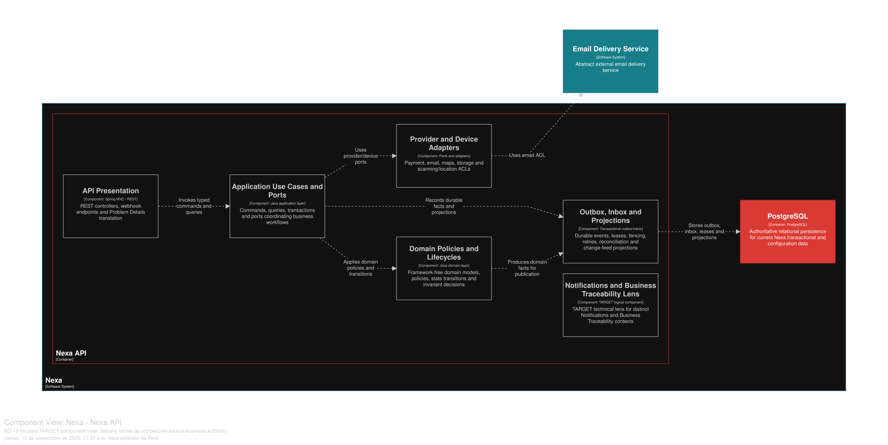
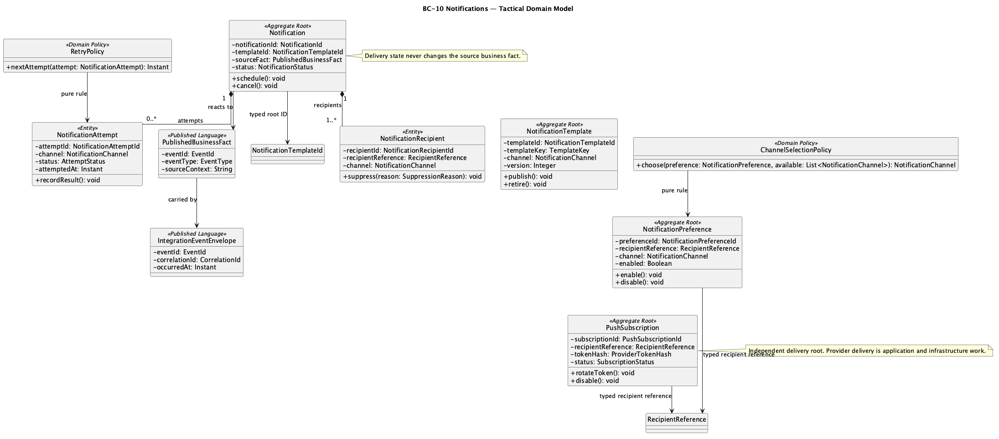
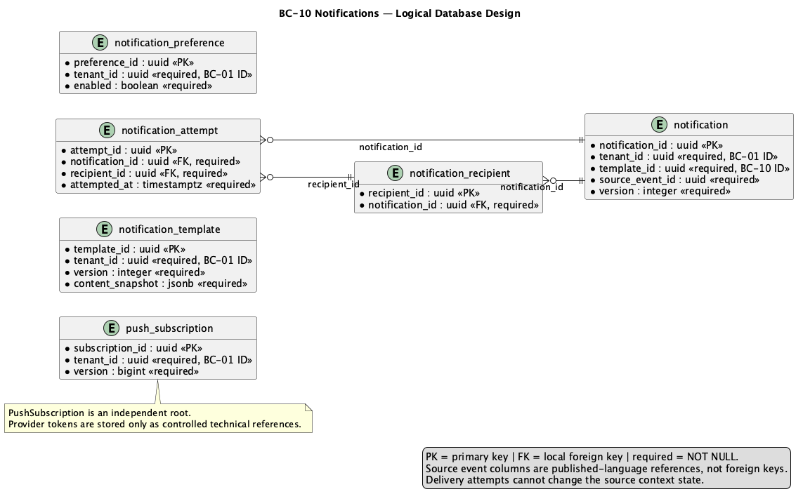

### 2.6.10. Bounded Context: Notifications

This context owns notification intent, recipient/channel policy, in-app/email
delivery and retry facts. Notification failure never changes source business
state. Mobile delivery is a projection, not a Mobile BC.

#### 2.6.10.1. Domain Layer

| Aggregate/root | Boundary and invariant |
| :--- | :--- |
| `Notification` | Intent, recipient/channel selection and lifecycle |
| `NotificationTemplate` | Versioned channel template/content policy |
| `NotificationPreference` | Recipient/channel preference and suppression |
| `PushSubscription` | Recipient/device delivery record, not a Mobile aggregate |

`NotificationRecipient` and `NotificationAttempt` are notification-owned
facts. Value objects include `NotificationId`, `TemplateKey`, `Channel`,
`DeliveryStatus` and `RecipientReference`; `ChannelSelectionPolicy` and
`RetryPolicy` are domain services. Initial-scope channels are in-app and email; WhatsApp
is external/manual.

Invariantes de diseño: delivery is at-least-once with visible deduped attempts;
retry/terminal failure never mutates PR, SO, Payment or Delivery; payloads
exclude secrets/unnecessary PII; subscription rotation and invalid-token
handling remain technical delivery behavior.

#### 2.6.10.2. Interface Layer

La Interface Layer cubre notification read/preferences, notification intent,
channel status, subscription lifecycle and worker callbacks. Exact routes or
provider DTOs absent from API evidence are not invented. Source facts enter
through durable outbox/inbox; client acknowledgment is not source confirmation.

#### 2.6.10.3. Application Layer

La Application Layer consume hechos de origen, persiste intención de notificación,
elige destinatario/canal, despacha, reintenta y proyecta una vista in-app. Lease/fencing,
idempotency and bounded backoff protect duplicate delivery. Source business
state remains owned by its origin BC.

#### 2.6.10.4. Infrastructure Layer

La Infrastructure Layer organiza la propiedad lógica en PostgreSQL compartido sobre `notification_template`,
`notification`, `notification_recipient`, `notification_preference`,
`notification_attempt` and `push_subscription`. Provider adapters remain ACLs;
no provider or third channel is assumed. Technical outbox/inbox persistence is
shared infrastructure, not a new BC.

**Clases TARGET por capa de BC-10.** Los nombres siguientes concretan responsabilidades previstas; no implican endpoints, canales ni proveedores ya implementados.

| Capa | Clase / componente TARGET | Responsabilidad |
|---|---|---|
| Interface | `NotificationController` | Expone operaciones de consulta y preferencia sin decidir reglas de negocio. |
| Interface | `NotificationDeliveryConsumer` | Recibe hechos comprometidos que habilitan una entrega al destinatario. |
| Interface | `NotificationProjectionConsumer` | Materializa vistas de notificación sin convertirse en autoridad sobre el hecho origen. |
| Application | `CreateNotificationCandidateHandler` | Convierte un hecho elegible en un candidato deduplicable y auditable. |
| Application | `DispatchNotificationHandler` | Orquesta la entrega por canal usando preferencias resueltas por contrato. |
| Application | `RetryNotificationDeliveryHandler` | Programa un reintento acotado sin duplicar una entrega aceptada. |
| Application | `ManageNotificationPreferenceHandler` | Cambia preferencias explícitas del destinatario bajo su alcance autorizado. |
| Application | `ProjectNotificationHandler` | Actualiza la proyección de lectura a partir de hechos ya comprometidos. |
| Infrastructure | `NotificationRepositoryAdapter` | Persiste candidatos, intentos, preferencias y estados de entrega. |
| Infrastructure | `EmailDeliveryAdapter` | Implementa el puerto de entrega por correo sin filtrar secretos o PII innecesaria. |
| Infrastructure | `InAppNotificationAdapter` | Implementa el canal interno de notificaciones de la plataforma. |
| Infrastructure | `NotificationOutboxWorker` | Publica y consume trabajo durable con semántica al-menos-una-vez. |

#### 2.6.10.5. Bounded Context Software Architecture Component Level Diagrams

La vista C4 L3 **TARGET** muestra componentes conceptuales de este contexto dentro de Nexa API. No equivale a un Bounded Context adicional, una base de datos independiente ni una unidad de despliegue.

*Vista C4 L3 TARGET de BC-10 Notifications.*

*Nota.* Exportación vectorial desde una vista Structurizr DSL enfocada en BC-10 Notifications, dentro del único contenedor Nexa API. Es evidencia de diseño TARGET; no acredita implementación, runtime ni una unidad de despliegue independiente.

#### 2.6.10.6. Bounded Context Software Architecture Code Level Diagrams

##### 2.6.10.6.1. Bounded Context Domain Layer Class Diagrams

##### 2.6.10.6.2. Bounded Context Database Design Diagram

This is shared-PostgreSQL logical ownership with delivery constraints;
it does not imply a Mobile database or push provider deployment.
