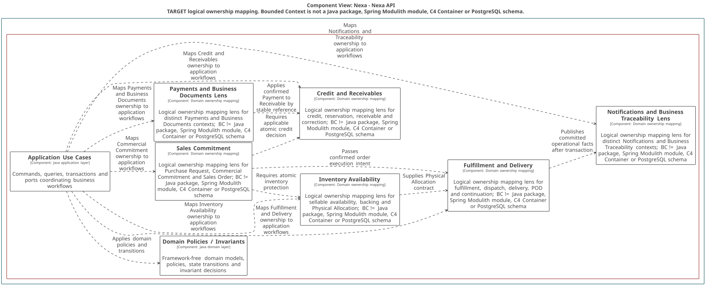

### 2.6.10. Bounded Context: Notifications

BC-10 conserva intención, preferencias, registro técnico de suscripción y
estados de entrega. Un intento o fallo nunca modifica el hecho de negocio
fuente. El TARGET PostgreSQL actual de suscripción push conserva sólo
`provider_token_hash` para deduplicación/lifecycle; Domain no conoce token crudo
ni ejecuta I/O de email o de un provider push futuro.

#### 2.6.10.1. Domain Layer

El dominio recibe una `BusinessFactReference` ya traducida desde Application.
`PublishedBusinessFact` y sus envelopes son contratos de integración, no tipos
del Domain Layer.

| Clase | Categoría | Propósito | Atributos / inputs clave | Operaciones principales | Relaciones / ownership |
| :--- | :--- | :--- | :--- | :--- | :--- |
| `Notification` | Aggregate Root | Mantener intención y estado de entrega. | `NotificationId`, `NotificationTemplateId`, `BusinessFactReference`, status. | `schedule`, `cancel`. | Compone recipients y attempts. |
| `NotificationTemplate` | Aggregate Root | Mantener contenido versionado por canal. | `NotificationTemplateId`, template key, channel, version, status. | `publish`, `retire`. | Root independiente. |
| `NotificationPreference` | Aggregate Root | Mantener preferencia recipient/event/channel. | `NotificationPreferenceId`, `RecipientReference`, channel, enabled. | `enable`, `disable`. | Root independiente. |
| `PushSubscription` | Entity / technical application record | Mantener registro provider-neutral de instalación. | `PushSubscriptionId`, `RecipientReference`, `InstallationId`, `ProviderTokenHash`, status. | `register`, `rotate`, `disable`. | Registro técnico interno; no Aggregate Root ni decisión de canal de negocio. |
| `BusinessFactReference` | Value Object | Identificar hecho fuente sin importar aggregate. | event ID, source context, type. | inmutable. | Usado por Notification. |
| `NotificationRecipient`, `NotificationAttempt` | Entities | Conservar destino resuelto e intentos. | recipient, channel, destination snapshot, outcome. | `suppress`, `recordResult`. | Propiedad de Notification. |
| `ChannelSelectionPolicy`, `RetryPolicy` | Domain Policies | Elegir canal permitido y próximo retry. | preference, channels, attempt. | `choose`, `nextAttempt`. | Puras; sin provider. |
| `NotificationRepository`, `NotificationTemplateRepository` | Repository interfaces | Cargar notification/template independientemente. | IDs y roots. | `byId`, `save`. | Implementaciones PostgreSQL. |
| `NotificationPreferenceRepository` | Repository interface | Cargar el root de preferencia independientemente. | IDs y root. | `byId`, `save`. | PushSubscription usa un store técnico de hash/lifecycle de Infrastructure. |

#### 2.6.10.2. Interface Layer

La interfaz recibe preferencias y suscripciones, y consume hechos publicados en
un borde separado. Ningún request de cliente decide estado de negocio fuente.

| Clase | Categoría | Propósito | Inputs clave | Operaciones principales | Colaboradores |
| :--- | :--- | :--- | :--- | :--- | :--- |
| `NotificationPreferenceController` | REST Controller | Gestionar preferencia por evento/canal. | actor, recipient, preference, versión. | `enable`, `disable`. | Preference handler. |
| `PushSubscriptionController` | REST Controller | Registrar/retirar suscripción autorizada. | actor, installation, input transitorio de registro. | `register`, `disable`. | Subscription handler y store técnico de hash/lifecycle. |
| `BusinessFactConsumer` | Message Consumer | Recibir published business facts. | integration contract, event ID. | `consume`. | Inbox y event handler. |

#### 2.6.10.3. Application Layer

Application traduce fact publicado a referencia de dominio, deduplica, coordina
intención, dispatch y retry. I/O de delivery permanece tras el puerto técnico.

| Clase | Categoría | Propósito | Inputs clave | Operaciones principales | Colaboradores |
| :--- | :--- | :--- | :--- | :--- | :--- |
| `CreateNotificationCommandHandler` | Command Handler | Crear intención desde fact y preferencias. | `PublishedBusinessFact`, recipient, template. | `handle`. | Notification/preference repositories. |
| `DispatchNotificationCommandHandler` | Command Handler | Reclamar y despachar intento. | `NotificationId`, attempt, fencing token. | `handle`. | Delivery port, notification repository. |
| `RecordNotificationDeliveryResultCommandHandler` | Command Handler | Registrar resultado de adapter. | attempt, provider outcome, versión. | `handle`. | Notification root. |
| `RetryNotificationCommandHandler` | Command Handler | Programar próximo retry permitido. | notification, last attempt. | `handle`. | `RetryPolicy`. |
| `SetNotificationPreferenceCommandHandler`, `RegisterPushSubscriptionCommandHandler` | Command Handlers | Mantener preferencia y registro técnico del destinatario. | preference/subscription input, actor, scope. | `handle`. | Preference repository y store técnico de hash/lifecycle. |
| `PublishedBusinessFactEventHandler` | Event Handler | Coordinar deduplicación y creación. | fact publicado, event ID. | `handle`. | Inbox y create handler. |

#### 2.6.10.4. Infrastructure Layer

Infrastructure conserva el hash de deduplicación/lifecycle, inbox/outbox y el
adapter de email V1; no acepta un provider push externo. El material de
endpoint es **FUTURE / PROVIDER-ADAPTER INPUT** y **NOT PERSISTED IN CURRENT
POSTGRESQL TARGET**.

| Clase | Categoría | Propósito | Inputs / datos | Operaciones principales | Colaboradores |
| :--- | :--- | :--- | :--- | :--- | :--- |
| `PostgresNotificationRepository`, `PostgresNotificationTemplateRepository` | Repository implementations | Mapear notification/template y children. | notification records. | `byId`, `save`. | Repositories Domain, PostgreSQL. |
| `PostgresNotificationPreferenceRepository`, `PostgresPushSubscriptionStore` | Repository implementation / technical store | Mapear preference root y registro técnico sin token crudo. | preference/subscription records con `provider_token_hash`. | `byId`, `save`. | Repository Domain y store técnico de hash/lifecycle. |
| `NotificationFactInbox` | Inbox adapter | Deduplicar published business facts. | event ID, consumer state. | `claim`, `complete`. | Event handler. |
| `EmailDeliveryAdapter` | Delivery adapter | Ejecutar I/O de email fuera de Domain. | resolved destination, rendered message. | `send`. | Dispatch handler; ningún provider push está aceptado en V1. |
| `NotificationOutboxPublisher` | Outbox adapter | Publicar outcomes comprometidos. | outcome fact, correlación. | `enqueue`. | BC-11. |

#### 2.6.10.5. Bounded Context Software Architecture Component Level Diagrams

La lente C4 TARGET de Domain Ownership Mapping sitúa preferencias, facts y
proyecciones de BC-10 sin convertirlo en un componente o Container C4. Ningún
provider push externo ni canal Product adicional está aceptado en V1.

*Nota. Export canónico generado desde Blueprint Wave 3.*

#### 2.6.10.6. Bounded Context Software Architecture Code Level Diagrams

Los diagramas evitan `IntegrationEventEnvelope` en Domain y muestran sólo
referencia semántica segura al hecho fuente.

##### 2.6.10.6.1. Bounded Context Domain Layer Class Diagrams

El UML representa `ProviderTokenHash`; `PushSubscription` es un registro
técnico y la entrega real queda fuera de Domain. Material de endpoint es
**FUTURE / PROVIDER-ADAPTER INPUT** y **NOT PERSISTED IN CURRENT POSTGRESQL
TARGET**.

*Nota. Elaboración propia.*

##### 2.6.10.6.2. Bounded Context Database Design Diagram

El diagrama conserva `provider_token_hash` y hace única la instalación por
Tenant para impedir duplicación sin guardar token crudo. No existe
`provider_endpoint_reference` en el TARGET PostgreSQL actual.

*Nota. Elaboración propia.*
