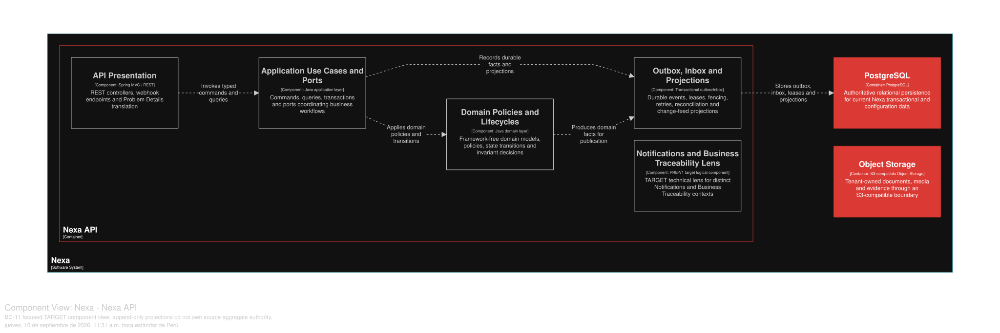

### 2.6.11. Bounded Context: Business Traceability

Este contexto de apoyo posee los hechos de negocio append-only y las referencias
de evidencia; los BC de origen mantienen la autoridad de sus Aggregate. Business
Traceability no es Security Audit, Notification ni una reconstrucción de los
Aggregate de origen.

#### 2.6.11.1. Domain Layer

`BusinessTraceabilityRecord` es un Aggregate/root liviano y append-only.
Almacena Tenant, Workspace opcional, tipo de evento, referencia de sujeto,
actor, momento, motivo, correlación y metadatos seguros de evidencia.
`TraceabilityEvidenceReference` es un hecho hijo; los bytes de Object Storage
permanecen externos.

Los Value Objects son `BusinessObjectReference`, `ActorReference`,
`CorrelationId`, `Reason`, `FactId`, `SourceReference` y `TimelineEntry`. Los
servicios de dominio son `TraceabilityProjectionPolicy` y
`SensitivePayloadPolicy`. `BusinessFactRepository` sólo admite append/query.
Las correcciones agregan hechos nuevos; no reescriben el historial.

Invariantes de diseño: los records tienen alcance Tenant y son append-only; las
transiciones significativas conservan actor, momento, motivo, correlación y
evidencia cuando corresponde; el fallo de una proyección es reproducible y no
revierte el commit de origen; Security Audit mantiene su autoridad y retención
separadas, y ningún almacén recibe secretos ni credenciales de pago sin tratar.

#### 2.6.11.2. Interface Layer

La Interface Layer cubre la línea de tiempo y consulta de negocio autorizadas,
el append de hechos, la referencia de evidencia y la proyección de metadatos
seguros. No se inventan nombres URI ni DTO exactos. Los consumidores reciben
referencias a hechos de origen; no pueden mutar los Aggregate de origen ni
inferir autoridad a partir de una proyección de línea de tiempo.

#### 2.6.11.3. Application Layer

La Application Layer valida el scope, normaliza metadatos seguros, agrega hechos
de origen, ingiere hechos de outbox/inbox y construye líneas de tiempo
autorizadas. Dedupe/replay mantiene visible la propagación al menos una vez. Los
metadatos sensibles pueden redactarse o ponerse en cuarentena; Business
Traceability no se convierte en un almacén general de eventos.

#### 2.6.11.4. Infrastructure Layer

La Infrastructure Layer organiza la propiedad lógica en PostgreSQL compartido
sobre `business_traceability_record` y `traceability_evidence_reference`. Los
ID de sujeto entre BC, los ID de evento y los ID de correlación son referencias
sin propiedad. Los metadatos de evidencia pueden apuntar mediante puertos de
BC-09 u Object Storage; SQL canónico define el alcance Tenant y las restricciones
append-only. No se infiere una base de datos separada de Security Audit.

*Clases TARGET por capa de BC-11.*

Los nombres siguientes concretan responsabilidades previstas; no implican endpoints ni convierten este contexto en propietario de hechos ajenos.

| Capa | Clase / componente TARGET | Responsabilidad |
|---|---|---|
| Interface | `TraceabilityViewerController` | Entrega consultas autorizadas de trazabilidad de negocio, manteniendo filtros de tenant y sensibilidad. |
| Interface | `BusinessTimelineController` | Expone la línea de tiempo como proyección de lectura, no como mutación del hecho origen. |
| Interface | `BusinessTraceabilityProjectionConsumer` | Consume hechos publicados para actualizar una timeline de negocio, sin convertirse en Security Audit. |
| Application | `TraceBusinessFactHandler` | Acepta un hecho comprometido y conserva su correlación, causalidad y procedencia. |
| Application | `ProjectBusinessTimelineHandler` | Construye una línea de tiempo ordenada sin alterar el estado del contexto emisor. |
| Application | `AppendEvidenceReferenceHandler` | Vincula evidencia inmutable por referencia y bajo autorización explícita. |
| Application | `ProtectSensitivePayloadHandler` | Minimiza y protege cargas sensibles antes de persistir la proyección de trazabilidad. |
| Infrastructure | `BusinessFactRepositoryAdapter` | Persiste hechos, correlaciones y metadatos de consulta propios de BC-11. |
| Infrastructure | `TraceabilityInboxAdapter` | Deduplica hechos recibidos con semántica al-menos-una-vez. |
| Infrastructure | `TraceabilityOutboxAdapter` | Publica hechos propios ya comprometidos mediante outbox durable. |
| Infrastructure | `EvidenceReferenceAdapter` | Resuelve referencias de evidencia sin copiar ni mutar el registro histórico de origen. |

#### 2.6.11.5. Bounded Context Software Architecture Component Level Diagrams

La vista C4 L3 **TARGET** muestra componentes conceptuales de este contexto dentro de Nexa API. No equivale a un Bounded Context adicional, una base de datos independiente ni una unidad de despliegue.

*Vista C4 L3 TARGET de BC-11 Business Traceability.*

*Nota.* Exportación vectorial desde una vista Structurizr DSL enfocada en BC-11 Business Traceability, dentro del único contenedor Nexa API. Es evidencia de diseño TARGET; no acredita implementación, runtime ni una unidad de despliegue independiente.

#### 2.6.11.6. Bounded Context Software Architecture Code Level Diagrams

##### 2.6.11.6.1. Bounded Context Domain Layer Class Diagrams

*Modelo de dominio táctico de BC-11 Business Traceability.*

*Nota.* El diagrama se presenta como modelo de diseño, no como inventario de código.

##### 2.6.11.6.2. Bounded Context Database Design Diagram

*Proyección del diseño de base de datos de BC-11.*

*Nota.* El diagrama es una proyección lógica de PostgreSQL compartido; las restricciones de solo adición y alcance Tenant permanecen definidas por el SQL canónico.
