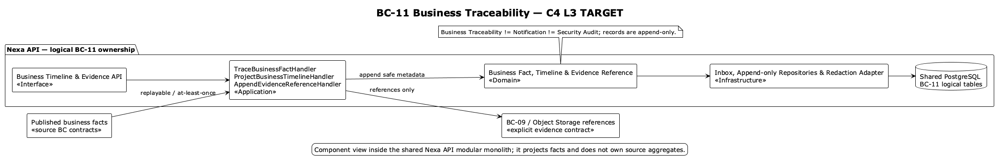

### 2.6.11. Bounded Context: Business Traceability

This supporting context owns append-only business facts and evidence references;
source BCs retain aggregate authority. Business Traceability is not Security
Audit, Notification or a reconstruction of source aggregates.

#### 2.6.11.1. Domain Layer

`BusinessTraceabilityRecord` is a lightweight append-only aggregate/root. It
stores Tenant/optional Workspace, event type, subject reference, actor, time,
reason, correlation and safe evidence metadata. `TraceabilityEvidenceReference`
is a child fact; Object Storage bytes remain external.

Value objects are `BusinessObjectReference`, `ActorReference`, `CorrelationId`,
`Reason`, `FactId`, `SourceReference` and `TimelineEntry`. Domain services are
`TraceabilityProjectionPolicy` and `SensitivePayloadPolicy`. The
`BusinessFactRepository` supports append/query only. Corrections append new
facts; they do not rewrite history.

Invariantes de diseño: records are tenant-scoped and append-only; significant
transitions retain actor/time/reason/correlation/evidence where relevant;
projection failure is replayable and does not roll back source commit; security
audit retains its separate authority/retention and neither store receives
secrets or raw payment credentials.

#### 2.6.11.2. Interface Layer

La Interface Layer cubre authorized business timeline/query, append fact,
evidence-reference and safe metadata projection. Exact URI/DTO names are not
invented. Consumers receive references to source facts; they cannot mutate
source aggregates or infer authority from a timeline projection.

#### 2.6.11.3. Application Layer

La Application Layer valida scope, normaliza metadatos seguros, agrega hechos de
origen, ingiere hechos de outbox/inbox y construye timelines autorizados. Dedupe/replay keeps
at-least-once propagation visible. Sensitive metadata may be redacted or
quarantined; traceability does not become a general-purpose event store.

#### 2.6.11.4. Infrastructure Layer

La Infrastructure Layer organiza la propiedad lógica en PostgreSQL compartido sobre `business_traceability_record` and
`traceability_evidence_reference`. Cross-BC subject IDs, event IDs and
correlation IDs are non-owning references. Evidence metadata can point through
BC-09/Object Storage ports; canonical SQL defines tenant scope and append-only
constraints. No separate audit database is inferred.

**Clases TARGET por capa de BC-11.** Los nombres siguientes concretan responsabilidades previstas; no implican endpoints ni convierten este contexto en propietario de hechos ajenos.

| Capa | Clase / componente TARGET | Responsabilidad |
|---|---|---|
| Interface | `AuditViewerController` | Entrega consultas autorizadas de trazabilidad, manteniendo filtros de tenant y sensibilidad. |
| Interface | `BusinessTimelineController` | Expone la línea de tiempo como proyección de lectura, no como mutación del hecho origen. |
| Interface | `TraceabilityProjectionConsumer` | Consume hechos publicados para actualizar vistas locales de auditoría. |
| Application | `TraceBusinessFactHandler` | Acepta un hecho comprometido y conserva su correlación, causalidad y procedencia. |
| Application | `ProjectBusinessTimelineHandler` | Construye una línea de tiempo ordenada sin alterar el estado del contexto emisor. |
| Application | `AppendEvidenceReferenceHandler` | Vincula evidencia inmutable por referencia y bajo autorización explícita. |
| Application | `ProtectSensitivePayloadHandler` | Minimiza y protege cargas sensibles antes de persistir la proyección de auditoría. |
| Infrastructure | `BusinessFactRepositoryAdapter` | Persiste hechos, correlaciones y metadatos de consulta propios de BC-11. |
| Infrastructure | `TraceabilityInboxAdapter` | Deduplica hechos recibidos con semántica al-menos-una-vez. |
| Infrastructure | `TraceabilityOutboxAdapter` | Publica hechos propios ya comprometidos mediante outbox durable. |
| Infrastructure | `EvidenceReferenceAdapter` | Resuelve referencias de evidencia sin copiar ni mutar el registro histórico de origen. |

#### 2.6.11.5. Bounded Context Software Architecture Component Level Diagrams

La vista C4 L3 **TARGET** muestra componentes conceptuales de este contexto dentro de Nexa API. No equivale a un Bounded Context adicional, una base de datos independiente ni una unidad de despliegue.

#### 2.6.11.6. Bounded Context Software Architecture Code Level Diagrams

##### 2.6.11.6.1. Bounded Context Domain Layer Class Diagrams

##### 2.6.11.6.2. Bounded Context Database Design Diagram

The drawing is a logical projection of shared PostgreSQL; append-only and
tenant-scope constraints remain canonical SQL concerns.
