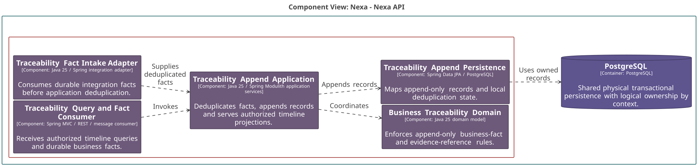
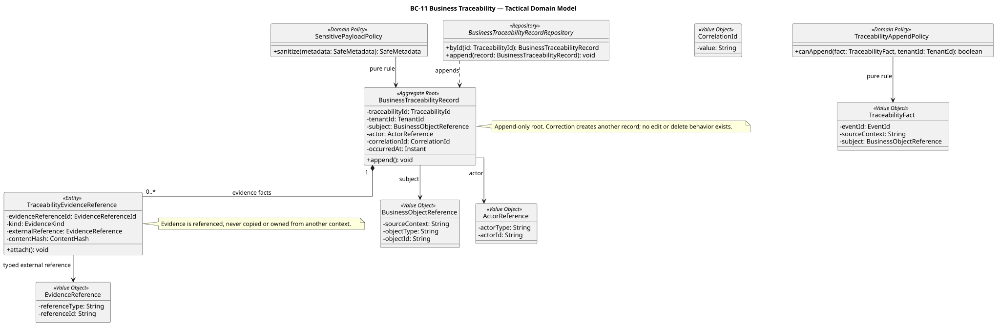
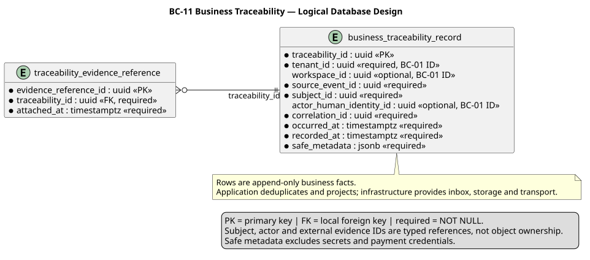

### 2.6.11. Bounded Context: Business Traceability

BC-11 conserva una línea de hechos de negocio y referencias de evidencia. Los
contextos emisores conservan la autoridad de sus propios agregados.

#### 2.6.11.1. Canonical class dictionary

*Clases y responsabilidades de BC-11 por capa.*

| Layer | Class | Category | Purpose | Key Attributes / Inputs | Main Methods / Business Behavior | Relationships / Collaborators | Aggregate Owner / External References |
| :--- | :--- | :--- | :--- | :--- | :--- | :--- | :--- |
| Domain | BusinessTraceabilityRecord | Aggregate Root | Conserva un hecho de trazabilidad. | Traceability ID, tenant ID, subject, actor, correlation and time. | Append only. | Receives published business facts as values. | Owns TraceabilityEvidenceReference. |
| Domain | TraceabilityEvidenceReference | Entity | Conserva una referencia a evidencia. | Kind, external reference and content hash. | Attach reference. | Points to a typed external reference. | Owned by BusinessTraceabilityRecord; no byte ownership. |
| Domain | BusinessObjectReference | Value Object | Identifica un sujeto de negocio entre contextos. | Source context, type and ID. | Preserves stable identity. | Used by record and PublishedBusinessFact. | Never loads the source object. |
| Domain | ActorReference | Value Object | Identifica actor o sistema. | Actor type and ID. | Preserves attribution. | Typed identity reference. | Local immutable value. |
| Domain | PublishedBusinessFact | Published Language | Representa un hecho comprometido de origen. | Event ID, source context and subject. | Carries fact metadata. | Travels in IntegrationEventEnvelope. | Does not transfer source ownership. |
| Domain | TraceabilityAppendPolicy | Domain Policy | Valida un append en alcance Tenant. | Published fact and tenant ID. | Decide if append is admissible. | Pure values supplied by application. | No inbox, storage or transport dependency. |
| Domain | SensitivePayloadPolicy | Domain Policy | Minimiza metadatos antes de persistirlos. | Safe metadata. | Sanitize metadata. | Pure values supplied by application. | No secret storage. |
| Interface | BC-11 Interface Boundary | Interface component | Traduce consultas y hechos entrantes autorizados. | Actor, tenant scope and fact envelope. | Rejects invalid scope. | Calls application orchestration. | Does not mutate source contexts. |
| Application | BC-11 Application Orchestration | Application component | Deduplica, agrega y proyecta trazabilidad. | Integration envelope, safe metadata and reference. | Appends fact and builds authorized projections. | Uses source context IDs and local append contract. | Does not reconstruct source aggregates. |
| Infrastructure | BC-11 Inbox, Persistence and Transport Adapters | Infrastructure component | Persiste hechos y soporta entrega al menos una vez. | Inbox record, append record and transport message. | Deduplicate, append and project. | PostgreSQL, inbox, storage reference and outbox. | No foreign object ownership. |

BusinessTraceabilityRecord es append-only. Una corrección agrega otro hecho, no
edita ni elimina el anterior. La deduplicación, el append y la proyección se
coordinan en Application; Infrastructure proporciona inbox, almacenamiento y
transporte.

#### 2.6.11.2. Component and code-level diagrams

*Vista C4 L3 de BC-11 Business Traceability.*

*Nota. Elaboración propia.*

*Modelo de dominio táctico de BC-11 Business Traceability.*

*Nota. Elaboración propia.*

*Diseño lógico de base de datos de BC-11 Business Traceability.*

*Nota. Elaboración propia.*
