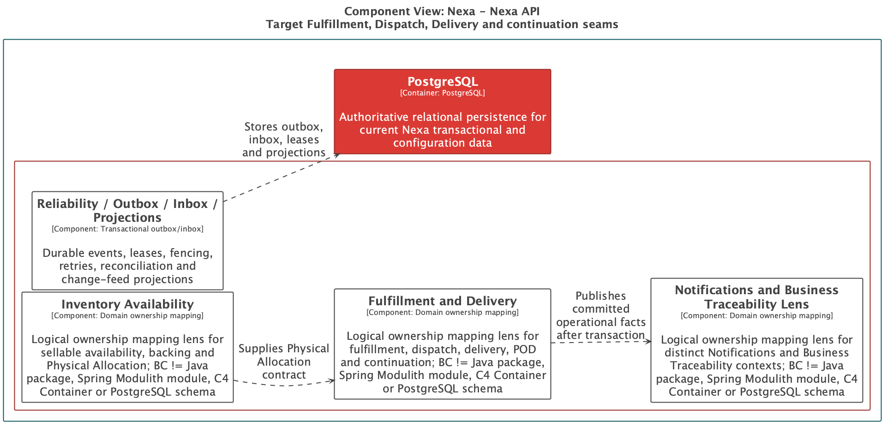
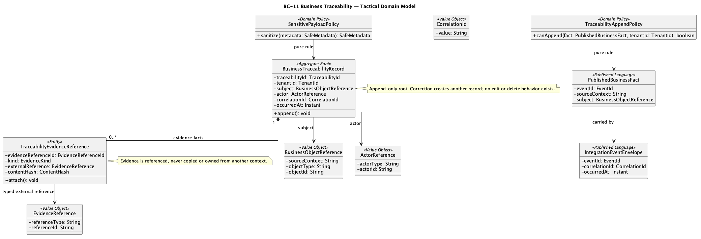
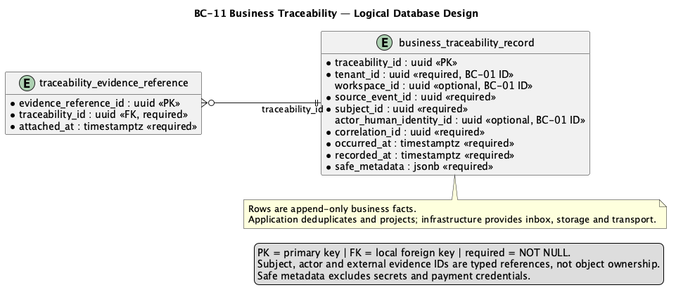

# 2.6.12. BC-11 — Business Traceability

`DOMAIN MODEL: TARGET / ACCEPTED`
`IMPLEMENTATION CROSSWALK: AS-IS VERIFIED / PARTIAL`

Canonical target: Blueprint `01-shared/domain/bounded-contexts/BC-11-business-traceability/`.
This supporting context owns append-only business facts and evidence references;
source BCs retain aggregate authority. Business Traceability is not Security
Audit, Notification or a reconstruction of source aggregates.

## 2.6.12.1 Domain Layer

`BusinessTraceabilityRecord` is a lightweight append-only aggregate/root. It
stores Tenant/optional Workspace, event type, subject reference, actor, time,
reason, correlation and safe evidence metadata. `TraceabilityEvidenceReference`
is a child fact; Object Storage bytes remain external.

Value objects are `BusinessObjectReference`, `ActorReference`, `CorrelationId`,
`Reason`, `FactId`, `SourceReference` and `TimelineEntry`. Domain services are
`TraceabilityProjectionPolicy` and `SensitivePayloadPolicy`. The
`BusinessFactRepository` supports append/query only. Corrections append new
facts; they do not rewrite history.

Target invariants: records are tenant-scoped and append-only; significant
transitions retain actor/time/reason/correlation/evidence where relevant;
projection failure is replayable and does not roll back source commit; security
audit retains its separate authority/retention and neither store receives
secrets or raw payment credentials.

## 2.6.12.2 Interface Layer

Target contracts cover authorized business timeline/query, append fact,
evidence-reference and safe metadata projection. Exact URI/DTO names are not
invented. Consumers receive references to source facts; they cannot mutate
source aggregates or infer authority from a timeline projection.

## 2.6.12.3 Application Layer

Target handlers validate scope, normalize safe metadata, append source facts,
ingest outbox/inbox facts and build authorized timelines. Dedupe/replay keeps
at-least-once propagation visible. Sensitive metadata may be redacted or
quarantined; traceability does not become a general-purpose event store.

## 2.6.12.4 Infrastructure Layer

Target shared PostgreSQL ownership covers `business_traceability_record` and
`traceability_evidence_reference`. Cross-BC subject IDs, event IDs and
correlation IDs are non-owning references. Evidence metadata can point through
BC-09/Object Storage ports; canonical SQL defines tenant scope and append-only
constraints. No separate audit database is inferred.

AS-IS anchor: API `businesstraceability` audit viewer/service/adapter paths,
`audit.event` migrations and integration outbox/change-feed evidence at
`origin/main`. Audit read/append evidence is `AS-IS VERIFIED`; explicit
business-vs-security separation and complete cross-context replay are `PARTIAL`;
Mobile timeline implementation, runtime and Product Acceptance are `NOT EVIDENCED`.

## 2.6.12.5 Bounded Context Software Architecture Component Level Diagrams

`Nexa-API-FulfillmentDelivery-TARGET` is the selected target component family
for the delivery/traceability collaboration. The family view remains inside
one API container; BC-11 is not an audit deployment unit.

This is target component evidence only. Structurizr source/export provenance is
in the [Chapter 2 register](../../../../delivery-checklists/chapter-02-evidence-provenance.md).

## 2.6.12.6 Bounded Context Software Architecture Code Level Diagrams

### 2.6.12.6.1 Bounded Context Domain Layer Class Diagrams

Source: [domain-model.puml](../../../assets/chapter-2/tactical/BC-11/domain-model.puml).

### 2.6.12.6.2 Bounded Context Database Design Diagram

Source: [database-diagram.puml](../../../assets/chapter-2/tactical/BC-11/database-diagram.puml).
The drawing is a logical projection of shared PostgreSQL; append-only and
tenant-scope constraints remain canonical SQL concerns.

## Crosswalk and open evidence

| Concern | Classification | Evidence boundary |
| :--- | :--- | :--- |
| Audit viewer/append evidence and outbox | `AS-IS VERIFIED` | API `businesstraceability` at `origin/main` |
| Business Traceability target boundary | `TARGET / ACCEPTED` | Blueprint tactical model/data model |
| Full cross-context timeline/replay and security split | `PARTIAL` | Existing audit evidence does not prove complete target closure |
| Mobile timeline runtime and Product Acceptance | `NOT EVIDENCED` | Mobile remains planned projection |
