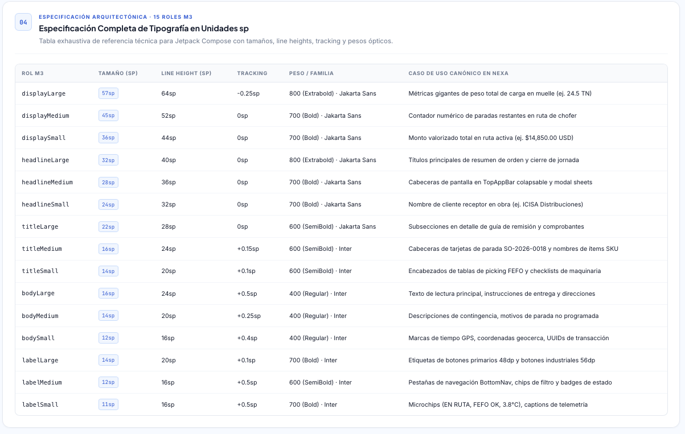
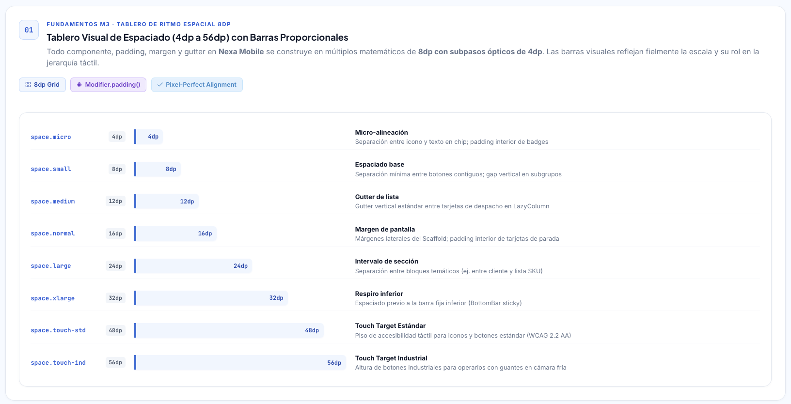
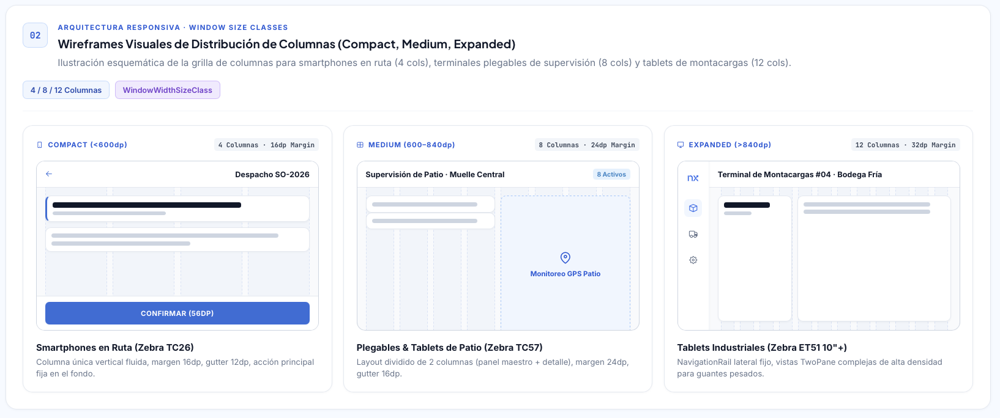
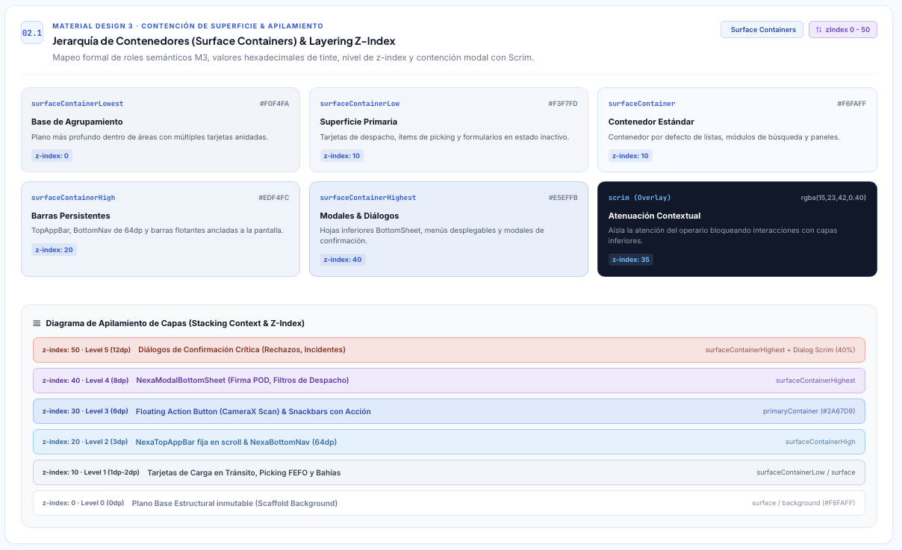
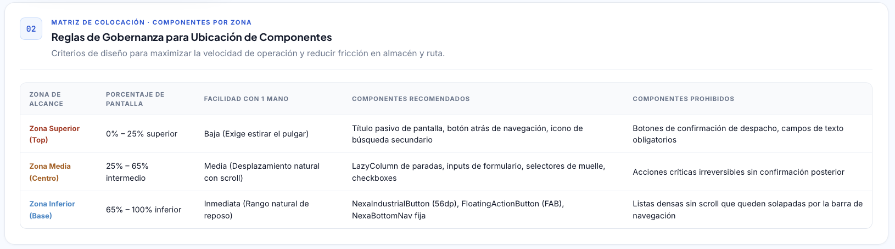

# Capítulo III: Diseño UI/UX de la solución

## 3.1. Diseño de producto

### 3.1.1. Guías de estilo

#### 3.1.1.1. Guías generales de estilo

Las guías de estilo articulan una identidad reconocible para el sitio público, los clientes web y las aplicaciones móviles. Definen criterios de composición, lectura y comunicación; cada superficie puede variar en densidad y organización para responder a su tarea.

Las figuras y los valores describen criterios de diseño; la comprobación de su aplicación se registra en las pruebas de las interfaces.

##### Identidad visual y marca

La identidad de Nexa combina azul, tonos slate y superficies claras para ordenar el contenido y dar énfasis a las acciones. El identificador de marca debe conservar su proporción, área de protección y legibilidad; no se estira, inclina, redibuja como texto ni se coloca sobre un fondo que lo vuelva difícil de distinguir.

En Website, la marca acompaña la orientación sobre el servicio y su propuesta de valor. En los clientes web y móviles, su presencia deja espacio a la tarea principal y mantiene continuidad visual al revisar una compra o completar una operación. Las fotografías e ilustraciones deben aportar contexto; el color y los adornos no sustituyen una jerarquía clara.

##### Color y significado

El azul identifica la marca y puede destacar acciones primarias. Los tonos slate y las superficies claras organizan el fondo, las tarjetas, el texto y los divisores. Los roles semánticos deben expresar la función del elemento; una pantalla no debe depender de valores cromáticos aislados.

| Función visual | Aplicación | Señal complementaria |
| --- | --- | --- |
| Identidad y acción | Marca, enlaces y acción primaria | Etiqueta o texto que nombre la acción |
| Superficie | Fondo general, agrupaciones y contenido destacado | Espaciado, borde o separación |
| Texto y división | Lectura, jerarquía, límites y foco | Etiquetas y estructura consistente |
| Información y éxito | Contexto, avance o confirmación | Mensaje que indique qué se informó o confirmó |
| Atención y peligro | Revisión, bloqueo o consecuencia importante | Descripción de la causa y de la alternativa disponible |
| Cadena de frío | Temperatura o condición de conservación | Valor, unidad y estado expresados también en texto |

La escala tonal de Slate sirve para explorar relaciones entre superficies y niveles de texto. Los estados no se comunican solo mediante color: iconos, etiquetas, forma y posición pueden reforzar su significado.

##### Tipografía y jerarquía de lectura

Plus Jakarta Sans se reserva para títulos y encabezados; Inter, para cuerpo, controles y mensajes; una familia monoespaciada del sistema puede distinguir identificadores y valores técnicos. En la referencia Mobile las medidas se expresan en sp para considerar el escalado de texto del sistema.

La jerarquía debe orientar la lectura antes de aumentar la densidad. Los títulos introducen el contexto, las etiquetas permanecen vinculadas a sus controles y los datos técnicos no se reducen hasta perder legibilidad. Se prefiere el reflujo del contenido a truncar información necesaria; los identificadores extensos pueden partirse o mostrarse en un detalle.

*Matriz de roles tipográficos que ilustra tamaños, interlineados, pesos y familias de referencia.*

##### Espaciado y composición adaptable

La referencia espacial Mobile parte de incrementos de 8 dp y contempla medios pasos de 4 dp. Los espacios pequeños ordenan elementos relacionados; los mayores separan grupos y secciones. Estos incrementos ayudan a mantener un ritmo consistente sin forzar una composición rígida.

*Escala visual de espaciado y dianas propuestas para contextos de uso distintos.*

La organización de columnas responde al ancho disponible. En una ventana compacta suele favorecerse una columna; en tamaños medios pueden presentarse agrupaciones relacionadas; en ventanas expandidas se puede distribuir información en paneles o columnas, siempre que la comparación sea útil y la navegación siga siendo clara. La cantidad de columnas, márgenes y separación debe ajustarse al contenido y no al modelo comercial del dispositivo.

*Composiciones esquemáticas que comparan alternativas de distribución según el ancho.*

##### Superficies y elevación

Las superficies expresan agrupación y relación. El fondo establece el plano general; las tarjetas y contenedores delimitan conjuntos de información; menús, diálogos y paneles temporales pueden distinguirse mediante una combinación moderada de tono, borde y elevación.

La profundidad visual debe ayudar a entender qué contenido pertenece a una acción o se superpone temporalmente. No toda tarjeta necesita sombra y ninguna sombra debe ser la única señal de separación. En las referencias Mobile, los nombres de contenedores Material 3 describen una posible organización tonal; su aplicación concreta depende de la superficie.

*Esquema de relaciones visuales entre planos, barras persistentes y capas temporales.*

##### Ergonomía táctil y alcance

En Mobile, la diana de interacción incluye toda el área activable, no solo el icono o el texto visible. Los valores de 48 dp para controles generales y 56 dp para controles ampliados en escenarios industriales se conservan como objetivos de diseño. El espacio entre dianas también debe permitir distinguir controles vecinos.

La ubicación de acciones considera el alcance, la frecuencia de uso y las consecuencias de una selección. La zona superior puede reservarse para contexto y navegación; la zona media, para consulta y exploración; la inferior, para acciones frecuentes cuando el flujo lo permita. Una acción destructiva o crítica requiere una presentación que haga visible su efecto y reduzca activaciones accidentales. La ergonomía no determina permisos ni transiciones de negocio.

*Zonas de alcance y ubicaciones recomendadas para componentes táctiles.*

##### Componentes, estados y retroalimentación

Cada componente debe mantener relación clara entre apariencia, contenido y estado. Las barras conservan el contexto y las acciones globales; los botones nombran una acción; las tarjetas agrupan información relacionada; los campos mantienen próximos su etiqueta, valor, ayuda y error; las etiquetas de estado explican la condición que resumen.

Cuando aplique, la interfaz debe distinguir disponibilidad, carga, confirmación, espera, error, solo lectura, falta de permiso y conflicto. La retroalimentación explica qué ocurrió, qué significa y qué opción está disponible a continuación. Un indicador visual de conectividad no acredita persistencia local ni sincronización; un color o una animación tampoco deben ser la única señal de un cambio.

##### Tono de voz y contenido

El tono se define en cuatro dimensiones, con una comunicación sobria que
facilita comprender y completar tareas comerciales y logísticas.

*Dimensiones del tono de voz de Nexa.*

| Dimensión | Posición | Aplicación |
| --- | --- | --- |
| Humor | Serio | Evitar bromas en errores, confirmaciones y operaciones importantes. |
| Formalidad | Profesional y directo | Usar términos comprensibles y acciones concretas, sin lenguaje ceremonioso. |
| Respeto | Respetuoso | Explicar restricciones sin culpar ni descalificar a la persona. |
| Entusiasmo | Sereno y confiable | Comunicar avances y alertas sin exagerar resultados ni generar alarma innecesaria. |

Estas decisiones se aplican mediante cuatro cualidades de redacción:

- **Clara:** nombra el objeto y su estado con frases directas y vocabulario comprensible.
- **Precisa:** conserva los términos del dominio y distingue estados, cantidades, unidades y tiempos sin crear equivalencias ambiguas.
- **Serena:** informa sin culpar, exagerar la urgencia ni ocultar una restricción.
- **Orientadora:** explica la siguiente acción disponible y, cuando sea relevante, su consecuencia o el motivo por el que no está disponible.

Las etiquetas deben ser breves, pero no eliminar contexto necesario. Los errores describen la causa conocida y una forma segura de continuar cuando exista. La expansión del texto y las variantes lingüísticas se consideran al diseñar: títulos, nombres, direcciones, motivos y mensajes no deben depender de una longitud fija. La guía no establece por sí sola idiomas ni contenido legal.

##### Aplicación a las superficies

La identidad se mantiene común y la jerarquía responde al propósito de cada superficie.

| Superficie | Énfasis de lectura |
| --- | --- |
| Website | Orientación, propuesta de valor y confianza |
| Clientes web | Contexto de trabajo, estado y acciones permitidas |
| Experiencia de compra | Producto, disponibilidad, precio y consecuencias antes de confirmar |
| Mobile | Continuidad de la tarea, estado actual y acción disponible |

La densidad cambia con el ancho, el contexto y la tarea; no debe fragmentar la identidad ni mezclar responsabilidades. Las mismas reglas de contenido, color y jerarquía se aplican a Mobile para Operations y Buyer, aunque cada flujo conserva sus propios datos, actores y decisiones.

##### Accesibilidad y revisión

La revisión de una superficie debe comprobar que los contrastes se calculen sobre las combinaciones finales de contenido y fondo; que el estado no dependa únicamente del color; que los controles tengan nombre comprensible, foco visible y ayuda asociada; y que la interacción se conserve al aumentar el texto, cambiar la orientación o utilizar un mecanismo de entrada asistido.

En Mobile se revisan el área táctil efectiva, el espacio entre controles y el reflujo en anchos compactos. En Website y clientes web se comprueban también navegación con teclado, orden de lectura y adaptación de columnas. El movimiento debe respetar la preferencia de reducir animaciones sin ocultar el estado o la posibilidad de recuperación.

Estas guías proporcionan criterios visuales y de comunicación para desarrollar y revisar las superficies de Nexa. Cada pantalla requiere comprobar su contenido, estados y comportamiento en el contexto donde se utilice.
