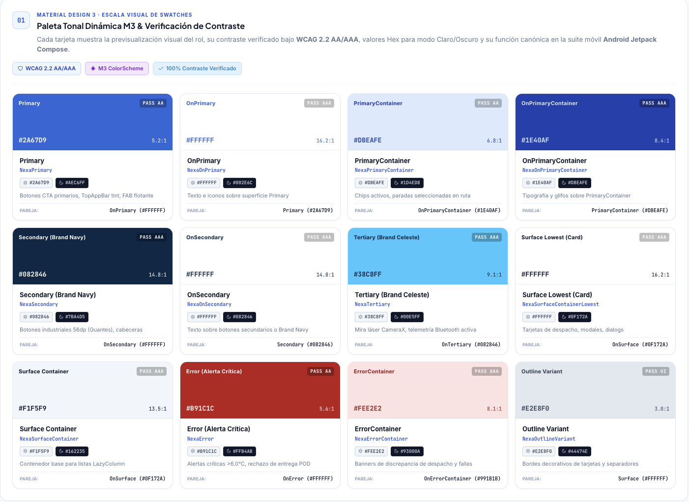
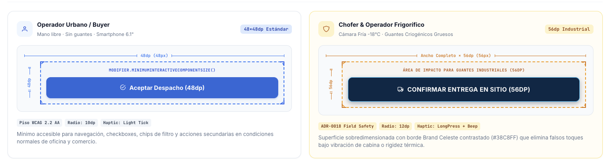

# Chapter III: Solution UI/UX Design

## 3.1 Product Design

### 3.1.1 Style Guidelines

#### 3.1.1.1 General Style Guidelines

La guía propone una jerarquía visual común para Website, Operations Mobile y Buyer Mobile; cada superficie prioriza el contenido y las acciones de su tarea. Estas referencias describen los criterios de diseño de las interfaces.

El color identifica acciones, superficies y estados. Una condición informativa, correcta, pendiente o crítica debe tener también una etiqueta y una forma reconocible; en cadena de frío, el valor y su unidad acompañan a la señal cromática.

*Matriz de roles tonales y valores de contraste de referencia.*

Plus Jakarta Sans se reserva para títulos y encabezados; Inter, para cuerpo, controles y mensajes. Los identificadores técnicos pueden usar tipografía monoespaciada. En Mobile, la referencia de tamaños en sp permite considerar la escala de texto del sistema. El contenido necesario debe refluir antes que truncarse.

*Roles tipográficos, tamaños y pesos propuestos para lectura móvil.*

La escala espacial usa incrementos de 8 dp y pasos de 4 dp para ajustes finos. Márgenes, separaciones y grupos responden al contenido; la distribución pasa de una columna en ventanas compactas a agrupaciones o paneles cuando el ancho disponible los hace útiles.

*Escala visual de espaciado propuesta para composición móvil.*

*Alternativas de columnas para tamaños compactos, medios y expandidos.*

Los controles conservan un área táctil completa y distinguible de los controles vecinos. La referencia compara 48 dp para acciones generales y 56 dp para acciones de uso industrial; la medida efectiva debe comprobarse en las vistas finales.

*Comparación visual de áreas táctiles objetivo para el diseño de controles.*

La ubicación de acciones considera alcance y frecuencia: el contexto puede permanecer arriba, la consulta en la zona media y las acciones frecuentes en una zona accesible cuando el recorrido lo permita. Las acciones de consecuencia importante requieren identificación clara y separación de destinos pasivos.

*Zonas de alcance propuestas para priorizar contexto, exploración y acción.*

Las superficies agrupan contenido y hacen visible la relación entre el plano base, las tarjetas y las capas temporales. La elevación y los bordes complementan la separación; ninguna sombra ni animación reemplaza el estado, el foco o el texto.

*Esquema de superficies, barras persistentes y capas temporales.*

El tono orienta etiquetas, instrucciones y recuperación en cuatro dimensiones:

| Dimensión | Dirección | Aplicación |
| --- | --- | --- |
| Fun / Serious | Serious | Describir acciones y resultados sin bromas. |
| Formal / Casual | Profesional y directo | Usar verbos concretos y términos consistentes. |
| Respectful / Irreverent | Respectful | Explicar restricciones sin culpar a la persona. |
| Enthusiastic / Serene | Serene y claro | Informar avances sin exagerar resultados ni alarmas. |

El criterio del curso solicita English (`en_US`) como idioma predeterminado de la interfaz, los mensajes y la documentación del producto. Spanish (`es_419`) puede acompañarlo como localización.
