# Chapter III: Solution UI/UX Design

## 3.1 Product Design

### 3.1.1 Style Guidelines

#### 3.1.1.1 General Style Guidelines

Esta guía reúne criterios y referencias visuales para la identidad, el color, la tipografía, el espaciado, la ergonomía, las superficies, la composición adaptable y la comunicación en las superficies Nexa. Las figuras y tablas apoyan la revisión de coherencia entre marca, contenido y controles.

Para Operations Mobile en Android, Material 3 orienta la jerarquía de superficies, los roles de color y la relación entre títulos, contenido y acciones. La guía organiza estos criterios mediante Primary, Surface y Error, una escala de lectura y separación entre controles. El texto y las etiquetas acompañan los estados para que su significado no dependa únicamente del color; la composición adaptable conserva esa jerarquía al cambiar el espacio disponible.

Las láminas definen referencias de diseño y ejemplos de composición; las especificaciones describen las propuestas visuales presentadas.

**Identidad visual institucional:**

*Figura 3.1*\
*Identidad visual institucional de Nexa: logotipo horizontal.*\

*Nota.* Logotipo vectorial horizontal. La paleta mostrada para la identidad incluye Azul Nexa #2A67D9 / #2563EB.

**Variantes móviles:**

Las variantes del isotipo presentan alternativas de contraste entre glifo y fondo para composiciones móviles.

*Figura 3.2*\
*Variantes del isotipo para aplicaciones móviles Nexa.*\

| Variante Regular (Símbolo Blanco sobre Fondo Azul) | Variante Invertida (Símbolo Azul sobre Fondo Blanco) |
| :---: | :---: |
|  |  |

*Nota.* Las variantes usan fondo #2563EB con glifo #FFFFFF, y fondo #FFFFFF con glifo #2563EB, respectivamente.

*Figura 3.3*\
*Resumen visual de lockups, variantes del isotipo y monograma.*\

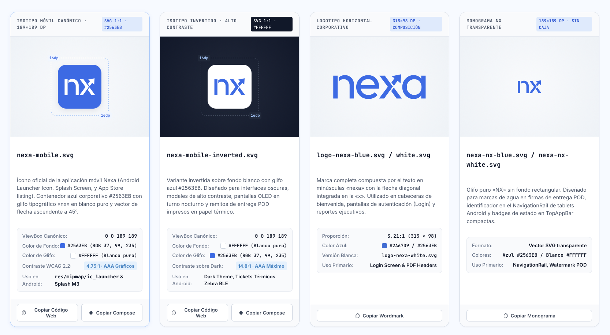

*Figura 3.4*\
*Ejemplos visuales de usos permitidos y no permitidos de la marca.*\

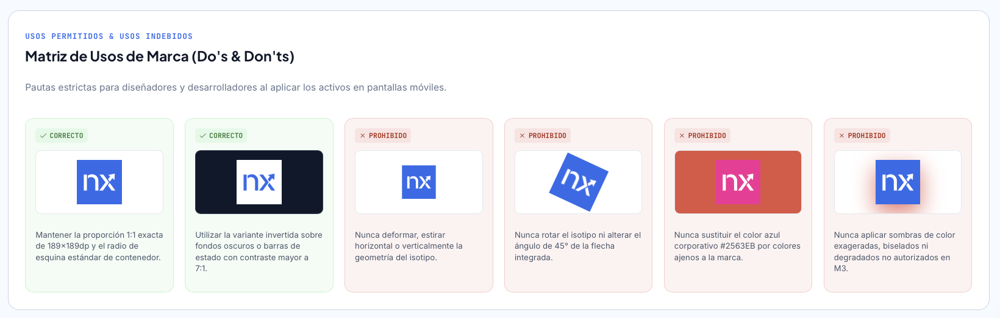

*Figura 3.5*\
*Referencia visual de implementación de activos de marca en Android.*\

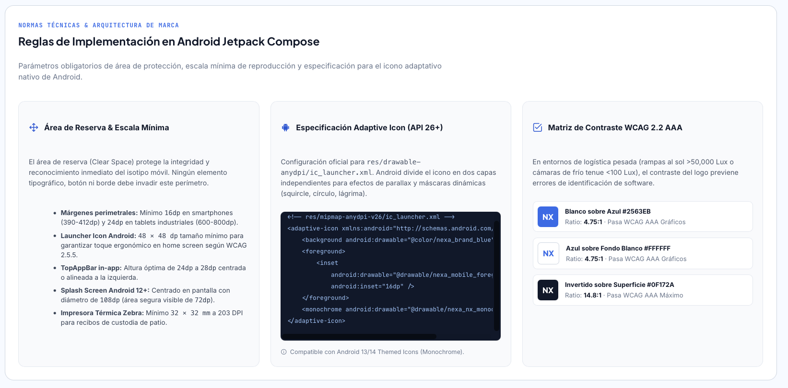

| Activo de marca mostrado | Dimensión de referencia | Área libre indicada |
| :--- | :---: | :---: |
| Isotipo móvil sobre fondo azul | 189 × 189 dp | 16 dp en smartphone |
| Isotipo móvil invertido | 189 × 189 dp | 16 dp en smartphone |
| Lockup horizontal | 315 × 98 dp | 16 dp en smartphone; 24 dp en tableta industrial |
| Monograma sin contenedor | 189 × 189 dp | 16 dp en smartphone; 24 dp en tableta industrial |
| Icono de launcher | 48 × 48 dp | La lámina lo presenta como tamaño mínimo de aplicación |

*Nota.* Dimensiones y áreas libres transcritas de las láminas de marca; describen tamaños de composición de referencia.

**Criterios de uso del isotipo:**

- Mantener la proporción y los rasgos del archivo vectorial al incorporarlo en una composición.
- Separar el isotipo de otros elementos para conservar su lectura visual.
- Elegir una variante que se distinga con claridad sobre el fondo utilizado.

**Paleta cromática y roles visuales:**

La paleta agrupa colores de marca, superficies y estados visuales. El color debe acompañarse de etiquetas, texto o una jerarquía reconocible para comunicar información.

| Rol de referencia | Valor Hex | Uso visual de referencia |
| :--- | :---: | :--- |
| **Primary** | #2563EB | Acciones destacadas y elementos de identidad. |
| **Primary Container** | #DBEAFE | Fondos suaves para agrupar contenido relacionado. |
| **Secondary** | #0284C7 | Acentos cromáticos en componentes o gráficos. |
| **Surface** | #FFFFFF | Superficies de contenido. |
| **Surface Container** | #F8FAFC | Fondo neutral para organizar áreas de contenido. |
| **Outline** | #E2E8F0 | Bordes y separadores. |
| **Error** | #DC2626 | Señales visuales de error. |
| **Warning** | #D97706 | Señales visuales de advertencia. |
| **Success** | #16A34A | Señales visuales de confirmación. |
| **Foreground** | #0F172A | Texto y elementos en primer plano. |

*Figura 3.6*\
*Roles de color, pares visuales y contraste mostrados en la paleta de referencia.*\

La lámina de paleta muestra las combinaciones siguientes. Para esta tabla, la relación se recalculó a partir de los valores hexadecimales indicados, en vez de tomar las cifras impresas dentro de la imagen.

| Color de texto | Color de fondo | Relación recalculada | Referencia para texto normal |
| :---: | :---: | :---: | :--- |
| #FFFFFF | #2A67D9 | 5.20:1 | Supera 4.5:1 |
| #1E40AF | #DBEAFE | 7.15:1 | Supera 4.5:1 |
| #FFFFFF | #082846 | 14.98:1 | Supera 4.5:1 |
| #38C8FF | #002E5F | 6.99:1 | Supera 4.5:1 |
| #FFFFFF | #0F172A | 17.85:1 | Supera 4.5:1 |
| #F1F5F9 | #162235 | 14.58:1 | Supera 4.5:1 |
| #FFFFFF | #B91C1C | 6.47:1 | Supera 4.5:1 |
| #FEE2E2 | #93000A | 7.66:1 | Supera 4.5:1 |

*Nota.* La relación mínima de 4.5:1 para texto normal corresponde al criterio 1.4.3, nivel AA, de [WCAG 2.2](https://www.w3.org/WAI/WCAG22/Understanding/contrast-minimum.html). La tabla cuantifica estos pares cromáticos de referencia; la evaluación de otros textos, tamaños y componentes requiere considerar cada composición.

*Figura 3.7*\
*Escala neutral Slate presentada para superficies, divisores y texto.*\

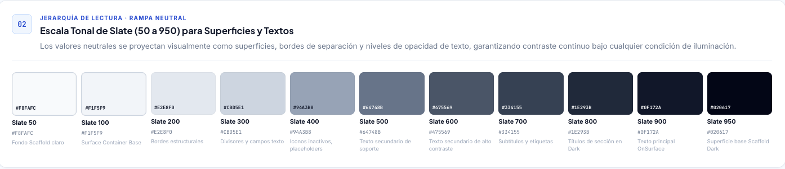

*Figura 3.8*\
*Familias cromáticas de referencia para estados semánticos.*\

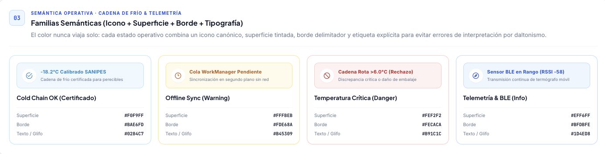

*Figura 3.9*\
*Señalización visual de estados mediante color, icono y etiqueta.*\

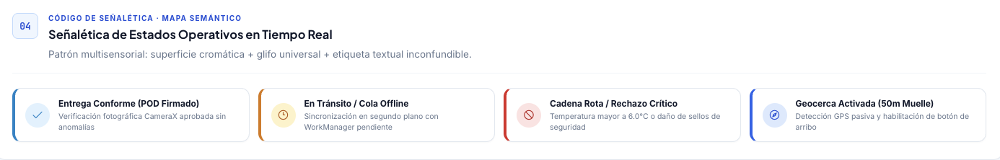

*Figura 3.10*\
*Escala visual de contenedores de superficie.*\

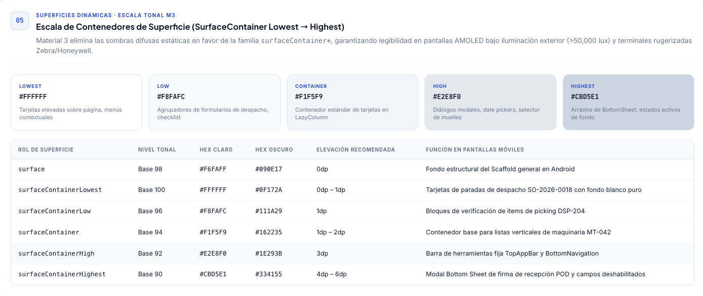

*Figura 3.11*\
*Matriz de roles y tokens de color mostrados para Android.*\

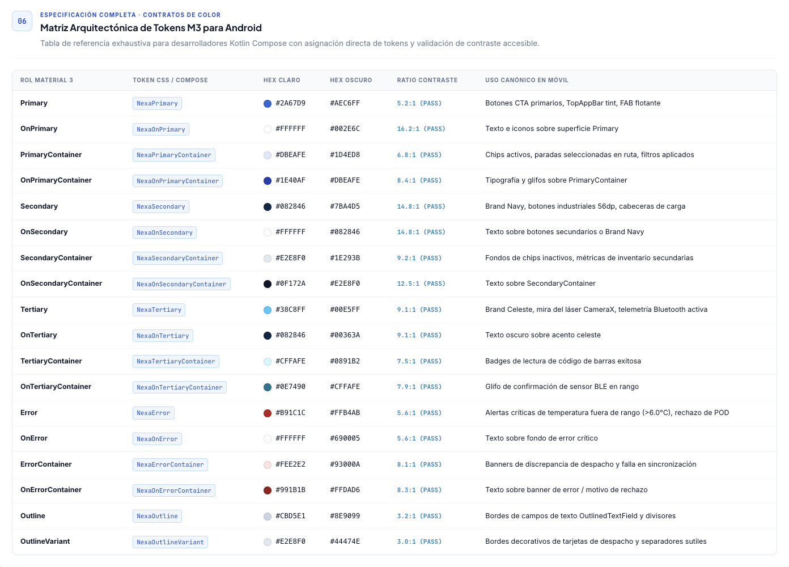

**Tipografía y jerarquía:**

La tipografía organiza la lectura y diferencia títulos, subtítulos, contenido y etiquetas. Una escala coherente facilita reconocer la importancia relativa de cada elemento y debe admitir las preferencias de tamaño de texto disponibles en la superficie. Las láminas muestran roles de Display, Headline, Title, Body y Label, además de tamaños en sp, interlineado, espaciado entre letras, peso y familia tipográfica como atributos de referencia.

*Figura 3.12*\
*Especificación visual de roles tipográficos M3 en unidades sp.*\

*Figura 3.13*\
*Matriz visual de roles tipográficos y variaciones de presentación.*\

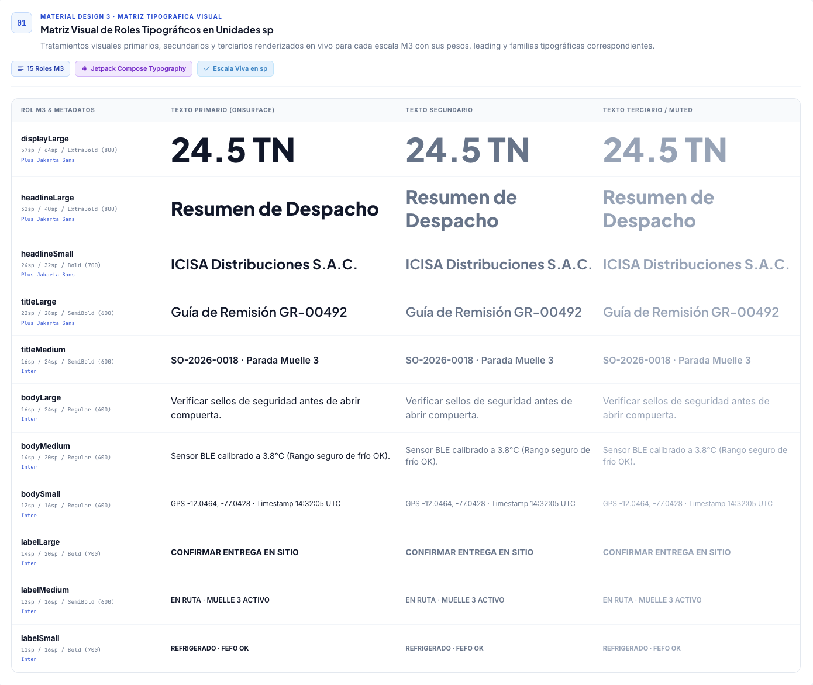

*Figura 3.14*\
*Ejemplo visual de escalado de texto para distintos tamaños de lectura.*\

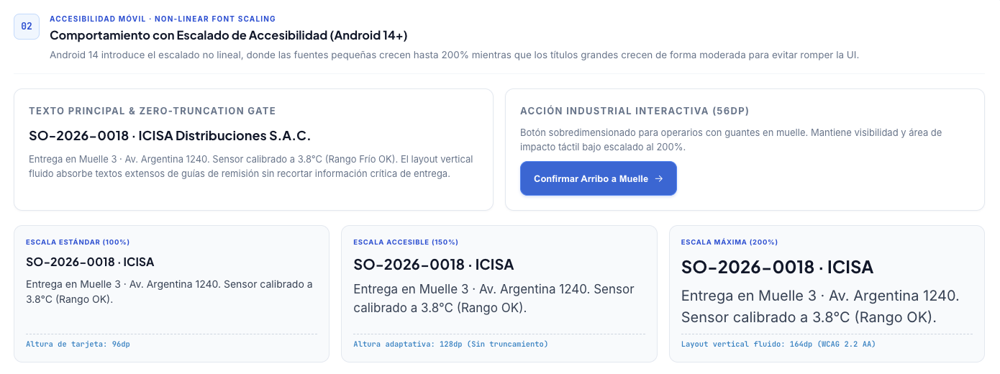

*Figura 3.15*\
*Previsualización de texto sobre combinaciones de color de referencia.*\

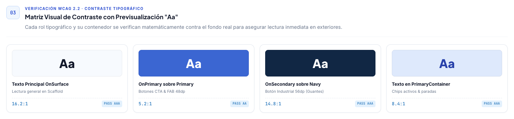

*Figura 3.16*\
*Matriz tipográfica con roles, tamaños, interlineado, tracking y peso.*\

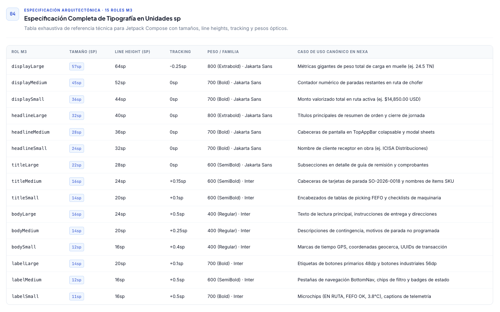

| Rol tipográfico | Tamaño | Interlineado | Tracking | Peso | Familia | Uso mostrado |
| :--- | :---: | :---: | :---: | :--- | :--- | :--- |
| displayLarge | 57 sp | 64 sp | −0.25 sp | 800 ExtraBold | Jakarta Sans | Titulares de mayor jerarquía |
| displayMedium | 45 sp | 52 sp | 0 sp | 700 Bold | Jakarta Sans | Titulares destacados |
| displaySmall | 36 sp | 44 sp | 0 sp | 700 Bold | Jakarta Sans | Titulares compactos |
| headlineLarge | 32 sp | 40 sp | 0 sp | 800 ExtraBold | Jakarta Sans | Encabezado principal |
| headlineMedium | 28 sp | 36 sp | 0 sp | 700 Bold | Jakarta Sans | Encabezado de sección |
| headlineSmall | 24 sp | 32 sp | 0 sp | 700 Bold | Jakarta Sans | Encabezado secundario |
| titleLarge | 22 sp | 28 sp | 0 sp | 600 SemiBold | Jakarta Sans | Título de pantalla o bloque |
| titleMedium | 16 sp | 24 sp | +0.15 sp | 600 SemiBold | Inter | Título de componente |
| titleSmall | 14 sp | 20 sp | +0.1 sp | 600 SemiBold | Inter | Título compacto |
| bodyLarge | 16 sp | 24 sp | +0.5 sp | 400 Regular | Inter | Texto de lectura principal |
| bodyMedium | 14 sp | 20 sp | +0.25 sp | 400 Regular | Inter | Texto de lectura secundaria |
| bodySmall | 12 sp | 16 sp | +0.4 sp | 400 Regular | Inter | Texto auxiliar |
| labelLarge | 14 sp | 20 sp | +0.1 sp | 700 Bold | Inter | Etiquetas y acciones destacadas |
| labelMedium | 12 sp | 16 sp | +0.5 sp | 600 SemiBold | Inter | Etiquetas de controles |
| labelSmall | 11 sp | 16 sp | +0.5 sp | 700 Bold | Inter | Etiquetas compactas |

*Nota.* La lámina especifica Jakarta Sans para Display, Headline y `titleLarge`, e Inter para `titleMedium`, `titleSmall`, Body y Label. Tamaño, interlineado y tracking se expresan en sp, tal como aparecen en la referencia.

**Espaciado y composición:**

El espaciado organiza los grupos de contenido, la distancia entre controles y los márgenes de pantalla. Las referencias visuales muestran una escala con subdivisiones de 4 dp y valores de 8 dp, junto con usos para microalineación, separación entre controles, listas, márgenes, intervalos y áreas táctiles.

*Figura 3.17*\
*Escala visual de espaciado para la composición móvil.*\

*Figura 3.18*\
*Barras proporcionales para comparar valores de espaciado.*\

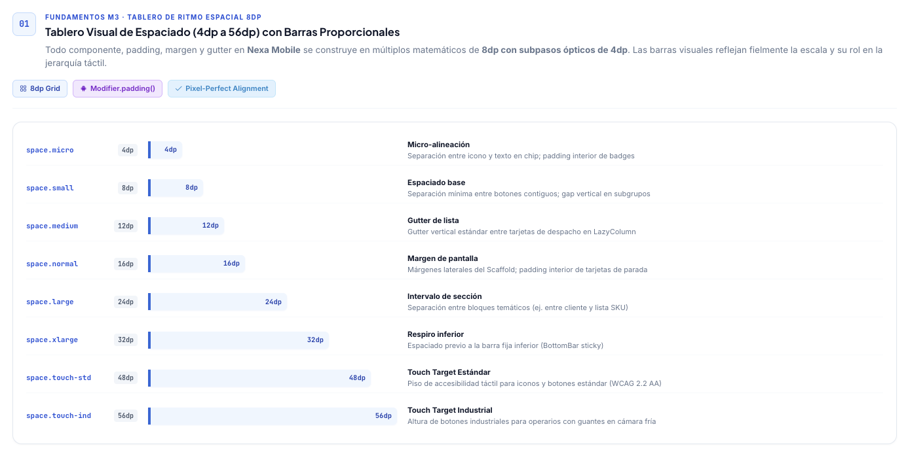

| Token de referencia | Valor mostrado | Uso ilustrado |
| :--- | :---: | :--- |
| space.micro | 4 dp | Separación entre icono y texto o padding de insignias. |
| space.small | 8 dp | Separación entre controles próximos. |
| space.medium | 12 dp | Gutter entre tarjetas en una lista. |
| space.normal | 16 dp | Márgenes laterales y padding de tarjetas. |
| space.large | 24 dp | Separación entre grupos temáticos. |
| space.xlarge | 32 dp | Espacio previo a una barra inferior fija. |
| space.touch-std | 48 dp | Altura de referencia para controles estándar. |
| space.touch-ind | 56 dp | Altura de referencia para controles en ejemplos industriales. |

*Figura 3.19*\
*Matriz de tokens de espaciado y equivalencias visuales.*\

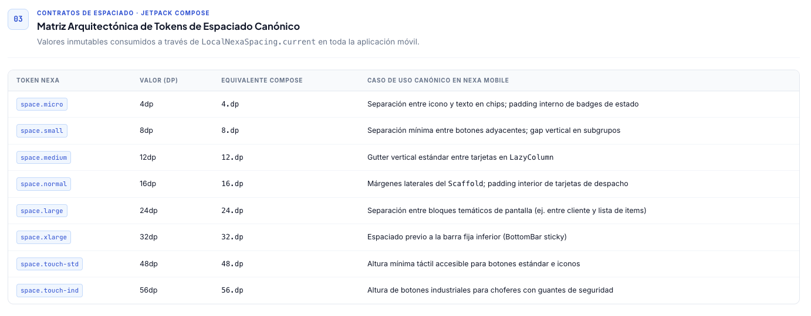

**Distribución adaptable y superficies:**

Organizar el contenido de modo que la jerarquía y las relaciones entre elementos sigan siendo comprensibles al variar el ancho disponible. La composición puede cambiar para aprovechar el espacio sin alterar el significado del contenido. Las referencias comparan ventanas compactas, medianas y expandidas, márgenes y gutters, y distribuciones de una o varias columnas.

*Figura 3.20*\
*Distribuciones de columnas para distintos anchos de ventana.*\

*Figura 3.21*\
*Wireframes de referencia para composiciones compactas, medianas y expandidas.*\

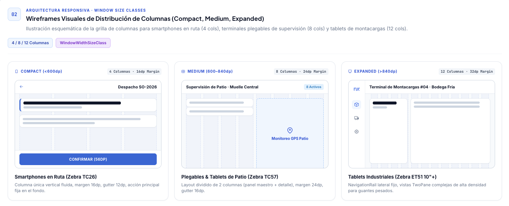

*Figura 3.22*\
*Matriz de columnas, márgenes y gutters adaptativos.*\

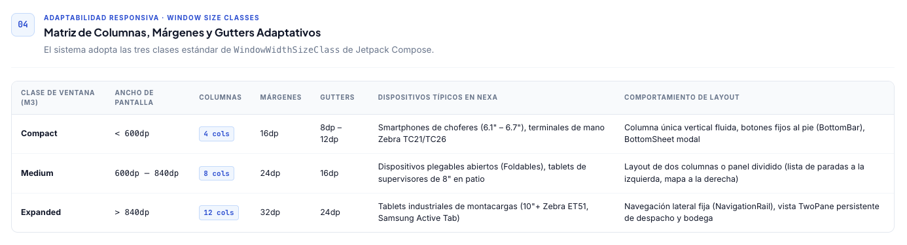

| Ancho de ventana mostrado | Columnas | Margen lateral | Gutter | Composición de referencia |
| :--- | :---: | :---: | :---: | :--- |
| Compacto: menos de 600 dp | 4 | 16 dp | 8–12 dp | Una columna de contenido para teléfono |
| Mediano: 600–840 dp | 8 | 24 dp | 16 dp | Distribución intermedia para tableta o ventana amplia |
| Expandido: más de 840 dp | 12 | 32 dp | 24 dp | Varias columnas y paneles simultáneos |

*Nota.* Los rangos y medidas resumen la matriz de columnas y los wireframes ilustrados; son puntos de referencia para componer cada ancho.

*Figura 3.23*\
*Composición de referencia para un teléfono compacto en una tarea de Operations Mobile.*\

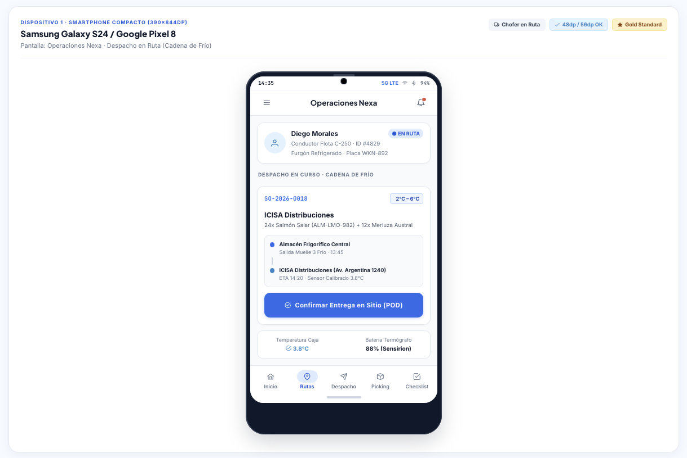

*Figura 3.24*\
*Composición de referencia de catálogo mayorista para smartphone.*\

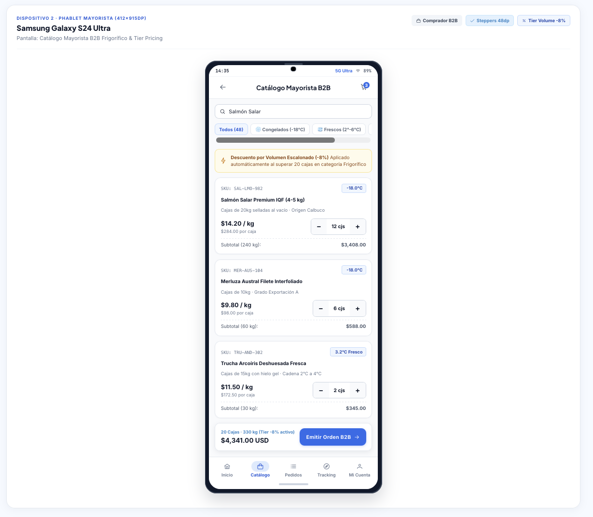

*Figura 3.25*\
*Composición de inspección mostrada en un terminal portátil rugerizado.*\

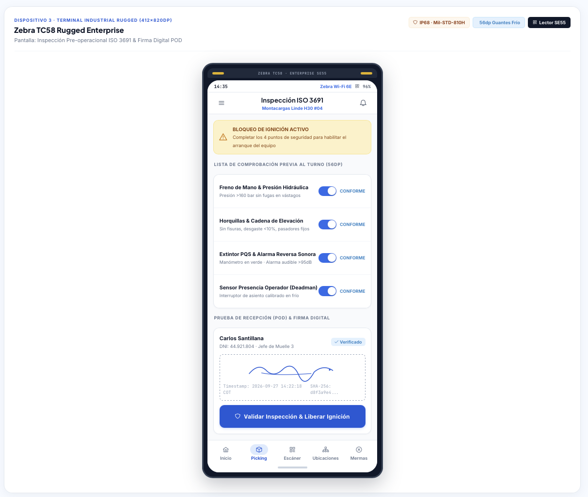

*Figura 3.26*\
*Tablero de despacho ilustrado para una tableta industrial.*\

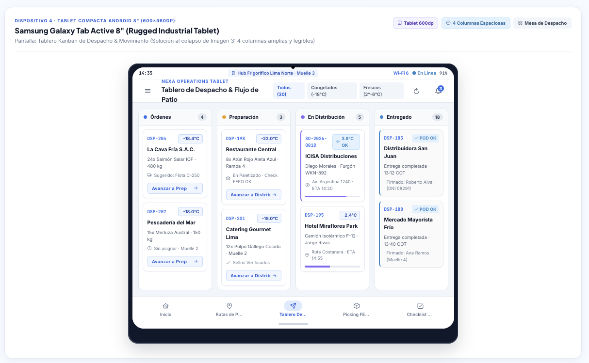

*Figura 3.27*\
*Consola de dos paneles ilustrada para una tableta expandida.*\

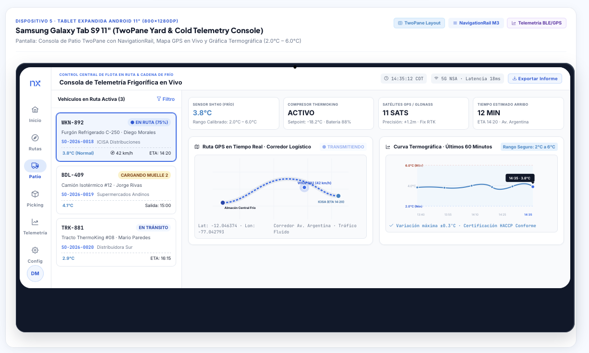

*Figura 3.28*\
*Composición de dos paneles ilustrada para un dispositivo plegable.*\

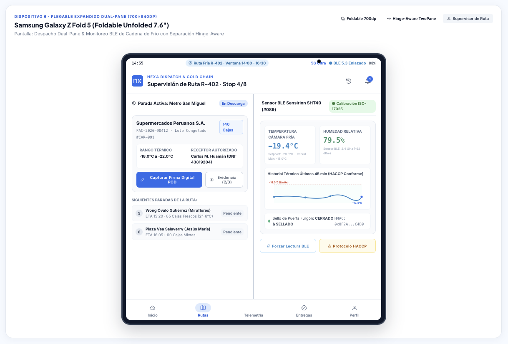

**Interacción táctil y alcance:**

Al diseñar una superficie táctil, considerar el tamaño y la separación de los elementos interactivos, su jerarquía y la comodidad de acceso. La ubicación de las acciones debe responder a la tarea y al contexto de uso representados en cada diseño. Las referencias visuales comparan áreas de 48 dp y 56 dp, ubican controles en zonas superior, media e inferior y presentan ejemplos de respuesta háptica.

*Figura 3.29*\
*Comparación visual de objetivos táctiles estándar e industriales.*\

*Figura 3.30*\
*Comparación de áreas táctiles de 48 dp y 56 dp en dos contextos ilustrados.*\

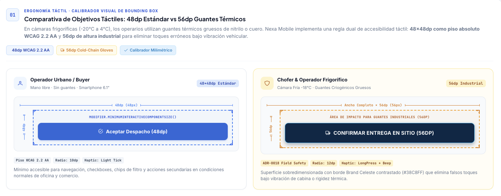

*Figura 3.31*\
*Matriz de objetivos y retroalimentación háptica por escenario ilustrado.*\

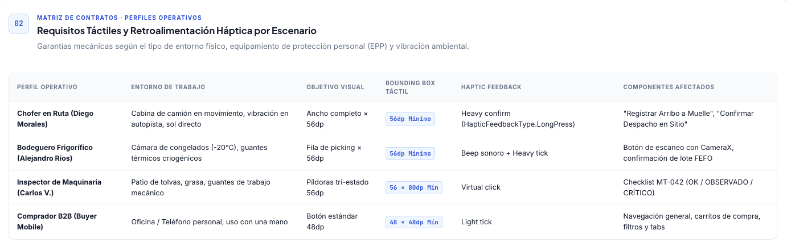

| Escenario de la lámina | Objetivo de control mostrado | Respuesta háptica ilustrada | Ejemplo de acción o componente |
| :--- | :---: | :--- | :--- |
| Conducción de rutas | 56 dp de ancho mínimo | `HeavyConfirm` o `LongPress` | Registrar arribo a muelle; confirmar despacho en sitio |
| Almacén de frío | 56 dp de ancho mínimo | Señal sonora y `HeavyTick` | Escaneo con cámara; consulta de FEFO |
| Inspección de maquinaria | 56 × 80 dp para control triestado | Clic virtual | Estados de checklist: OK, observado y crítico |
| Compra B2B | 48 × 48 dp | `LightTick` | Navegación, carrito, filtros y pestañas |

*Nota.* Los escenarios y nombres de respuesta reproducen ejemplos de la matriz háptica; cada fila vincula contexto, área táctil, señal y acción presentada.

*Figura 3.32*\
*Zonas de alcance para interacción móvil con una mano.*\

*Figura 3.33*\
*Zonas de alcance con ejemplos de contexto, lectura y acción.*\

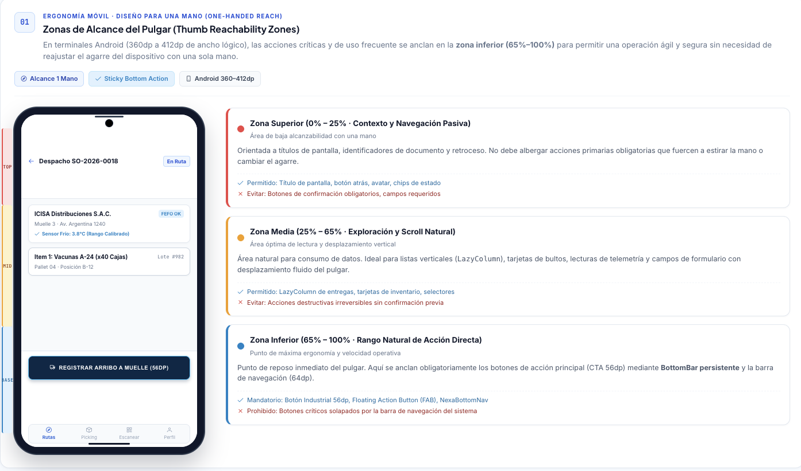

*Figura 3.34*\
*Distribución ilustrativa de componentes por zona de alcance.*\

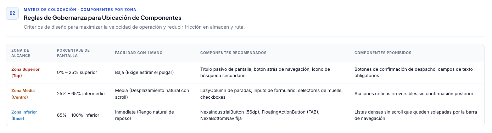

**Superficies y elevación:**

Las superficies organizan grupos de contenido y distinguen capas temporales o persistentes. Las láminas presentan contenedores, tintes, elevaciones y superposición como recursos de composición; sus valores internos se conservan en las imágenes como especificaciones visuales de referencia.

*Figura 3.35*\
*Jerarquía visual de contenedores y superposición de capas.*\

*Figura 3.36*\
*Muestrario visual de niveles de elevación y tinte tonal.*\

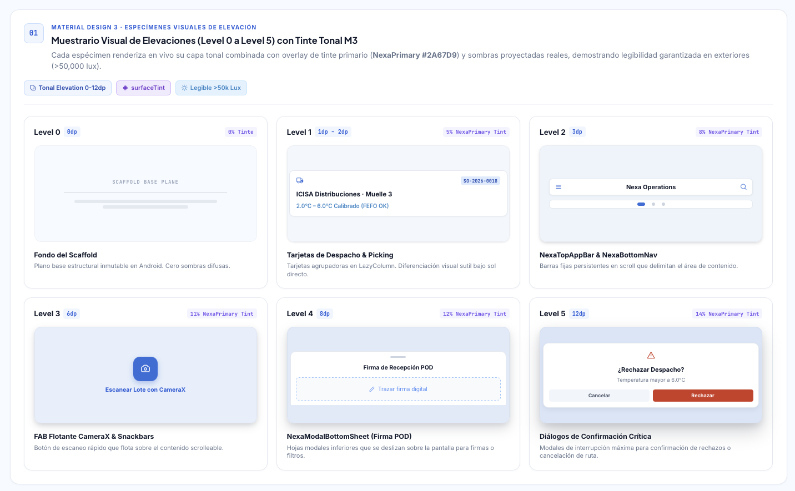

*Figura 3.37*\
*Ejemplos de elevación aplicados a tarjetas, barras y diálogos.*\

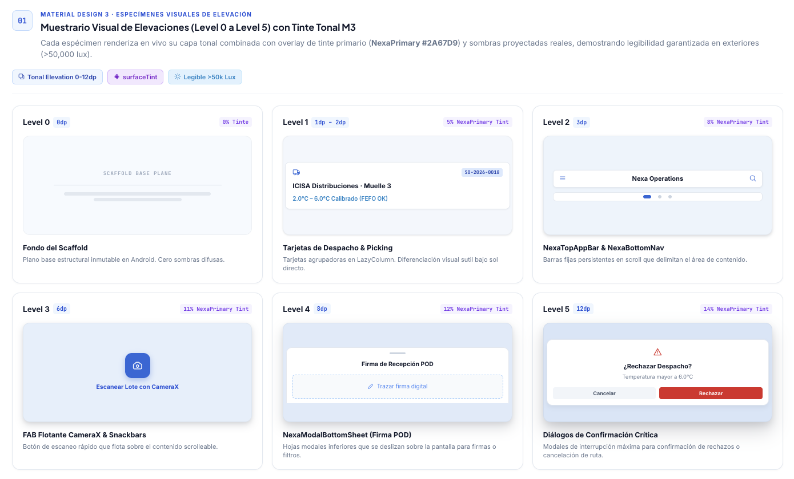

*Figura 3.38*\
*Matriz de niveles, tintes y sombras de referencia.*\

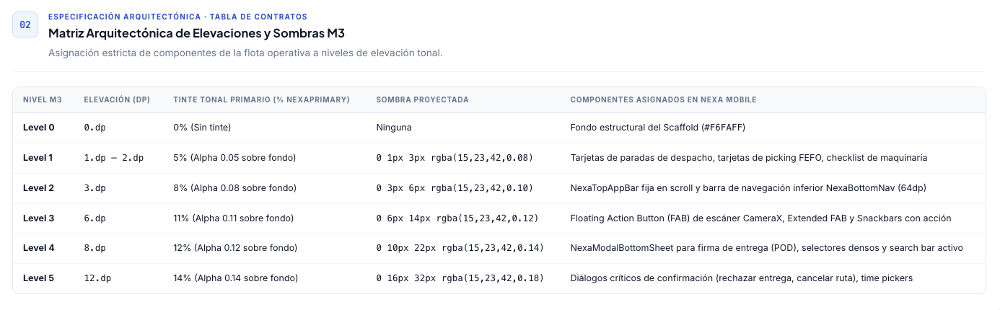

| Nivel | Elevación mostrada | Tinte de superficie | Sombra mostrada |
| :---: | :---: | :---: | :--- |
| L0 | 0 dp | 0 % | Ninguna |
| L1 | 1–2 dp | 5 % | `0 1px 3px rgba(15,23,42,0.08)` |
| L2 | 3 dp | 8 % | `0 3px 6px rgba(15,23,42,0.10)` |
| L3 | 6 dp | 11 % | `0 6px 14px rgba(15,23,42,0.12)` |
| L4 | 8 dp | 12 % | `0 10px 22px rgba(15,23,42,0.14)` |
| L5 | 12 dp | 14 % | `0 16px 32px rgba(15,23,42,0.18)` |

La matriz de contenedores presenta además una secuencia cromática y de apilamiento: Lowest `#F0F4FA` en z0; Low `#F3F7FD` y Container `#F6FAFF` en z10; High `#EDF4FC` en z20; scrim `rgba(15,23,42,0.40)` en z35; Highest `#E5EFFB` en z40; y diálogo en z50.

*Nota.* Elevación, tinte, sombra y orden se expresan según las unidades y rótulos impresos en las matrices visuales.

*Figura 3.39*\
*Contenedores de superficie, orden visual y capas superpuestas.*\

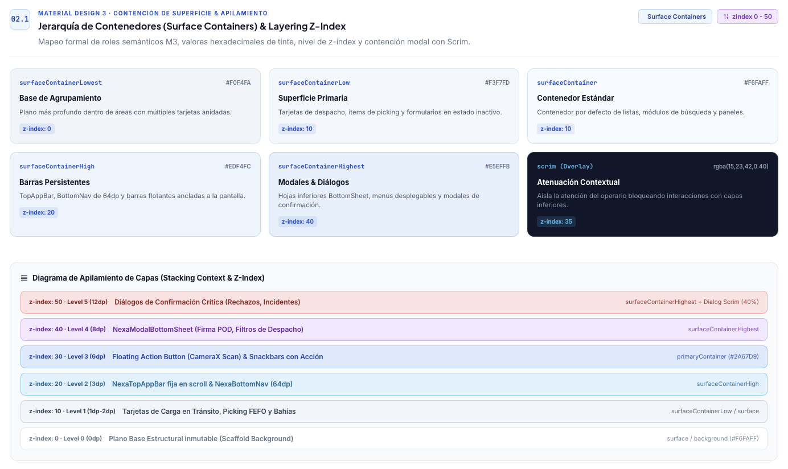

**Componentes móviles:**

Las siguientes láminas muestran composiciones de barras superiores e inferiores, formularios, controles de selección y tarjetas de despacho e inventario. Sus textos, estados y registros son contenido de ejemplo incluido en las referencias visuales.

*Figura 3.40*\
*Barra superior con título contextual y acciones.*\

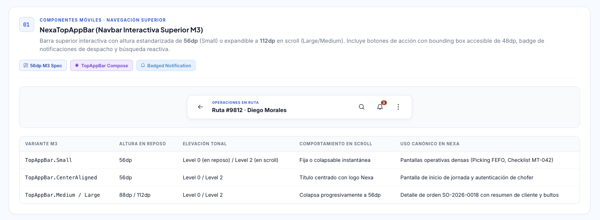

*Figura 3.41*\
*Barra inferior con destinos ilustrativos de navegación.*\

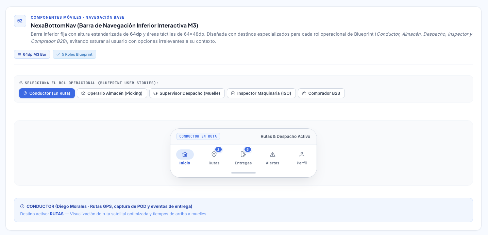

*Figura 3.42*\
*Campos y validación presentados en ejemplos de formularios móviles.*\

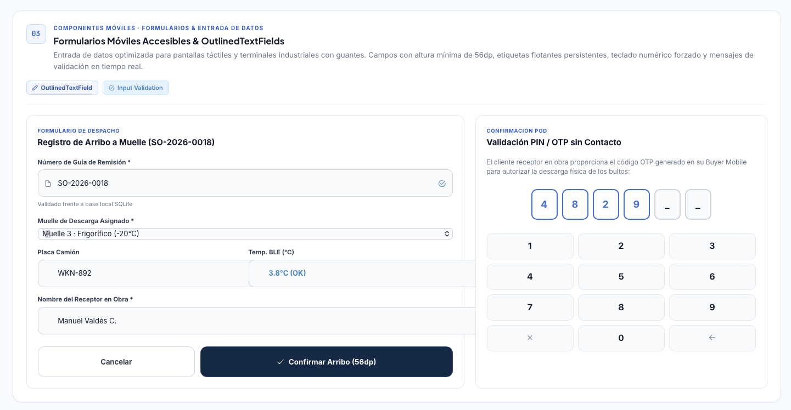

*Figura 3.43*\
*Estados de controles de selección, interruptores, casillas y chips.*\

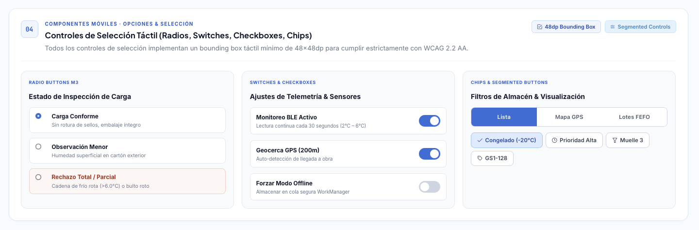

*Figura 3.44*\
*Tarjetas ilustrativas de despacho y movimiento de inventario.*\

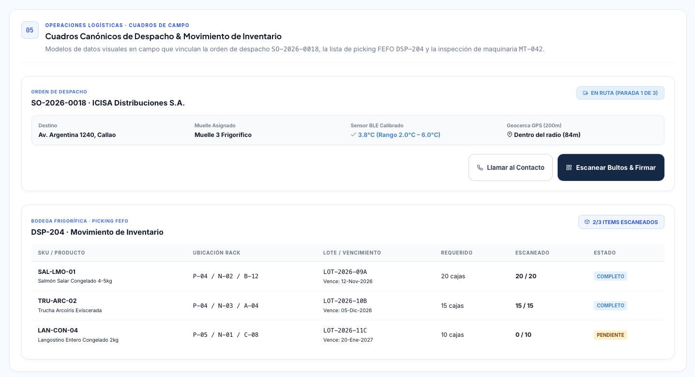

| Componente ilustrado | Dimensión o configuración mostrada | Estados o contenido representados |
| :--- | :--- | :--- |
| Top app bar pequeño y centrado | 56 dp de alto | Título contextual y acciones; área de acción de 48 dp |
| Top app bar mediano | 88 dp; colapsa a 56 dp | Transición de encabezado mediano a compacto |
| Top app bar grande | 112 dp; colapsa a 56 dp | Encabezado amplio con título contextual |
| Navegación inferior | 64 dp de alto | Cinco destinos ilustrativos |
| Campos de formulario | 56 dp de alto mínimo | Etiqueta y validación en línea; formulario de seis celdas OTP |
| Controles de selección | Área de 48 × 48 dp | Seleccionado, no seleccionado y error; radio, interruptor, casilla, chip y segmento |
| Tarjetas de despacho e inventario | Composición en tarjeta | Registros de ejemplo para despacho y movimiento de inventario |

*Nota.* La tabla recoge dimensiones, estados y ejemplos visibles en las láminas de componentes.

**Tono de comunicación:**

La redacción debe ser clara, respetuosa y consistente con el contexto de uso. Los siguientes criterios orientan la elección de tono en los textos de interfaz.

*Tabla 3.1*\
*Matriz de las Cuatro Dimensiones del Tono de Voz según Nielsen Norman Group para Nexa Mobile.*

| Dimensión | Dirección de tono | Orientación de redacción |
| :--- | :--- | :--- |
| **Divertido vs. Serio** | Serio | Priorizar claridad y evitar expresiones que resten importancia al mensaje. |
| **Formal vs. Casual** | Profesional y directo | Usar frases breves y términos comprensibles para el contexto. |
| **Respetuoso vs. Irreverente** | Respetuoso y empático | Informar con consideración y sin atribuir culpas. |
| **Entusiasta vs. Sereno** | Sereno y objetivo | Mantener un lenguaje equilibrado y concreto. |

**Internacionalización y ejemplos de microcopy:**

Los ejemplos en inglés y español permiten comparar tono, brevedad y claridad entre idiomas. Son propuestas de redacción para orientar la composición de mensajes.

*Tabla 3.2*\
*Guía de Microcopy Comparativa: Ejemplos de Aplicación por Escenario Operativo.*

| Contexto de redacción | Ejemplo en inglés | Ejemplo en español |
| :--- | :--- | :--- |
| **Información no disponible** | “This information is unavailable right now.” | “Esta información no está disponible ahora.” |
| **Revisión** | “Review the information before continuing.” | “Revisa la información antes de continuar.” |
| **Solicitud** | “We couldn’t complete the request.” | “No se pudo completar la solicitud.” |
| **Confirmación** | “Your request was received.” | “Recibimos tu solicitud.” |
