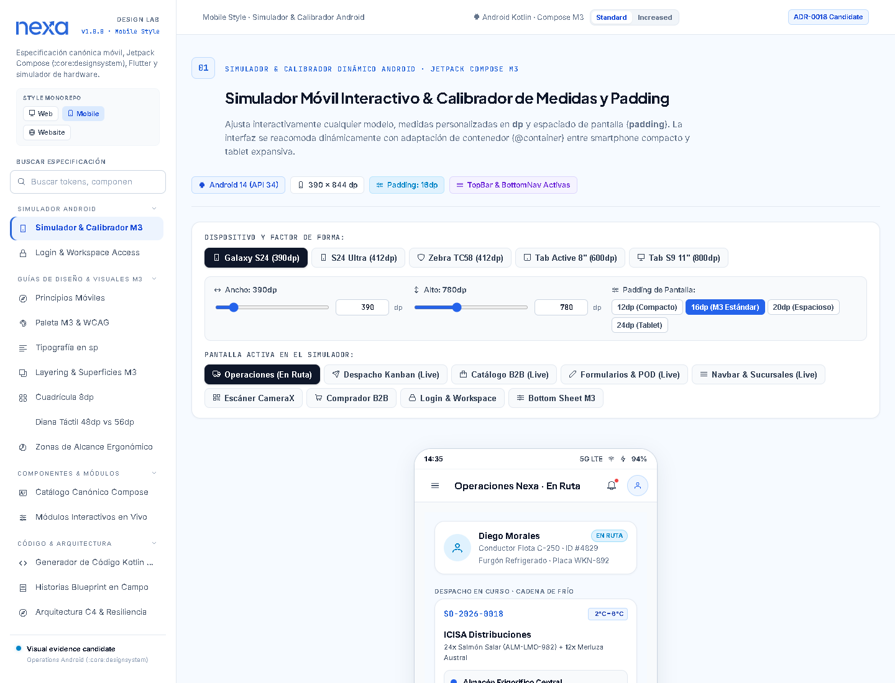
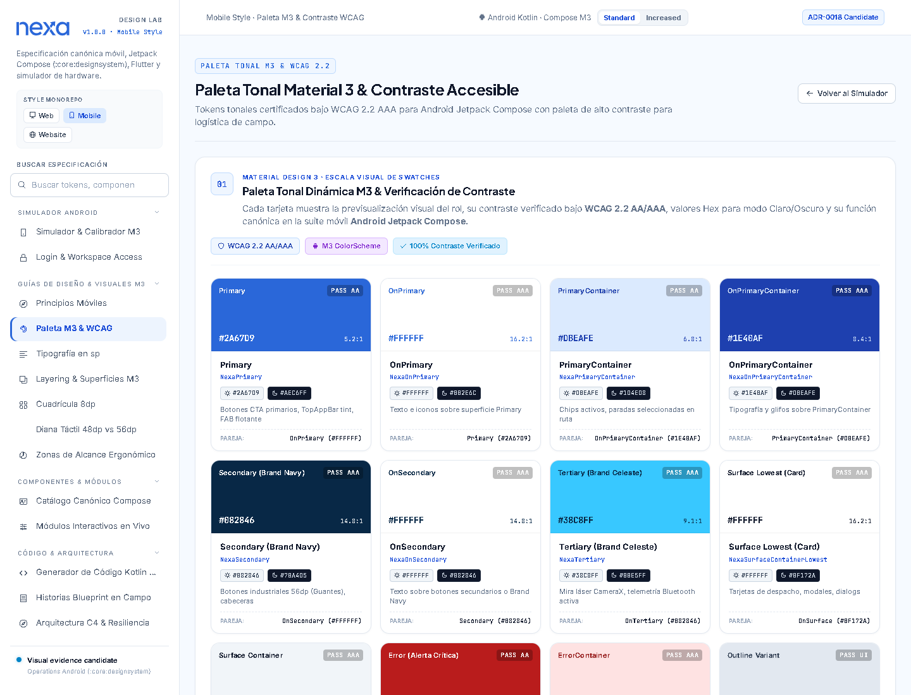
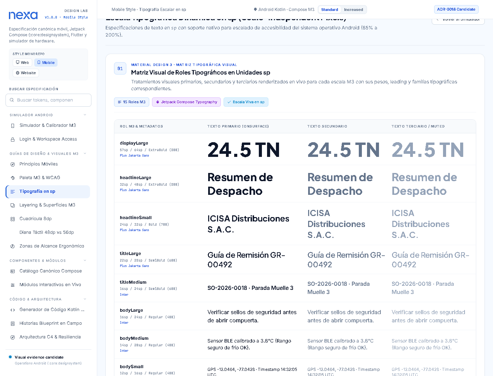
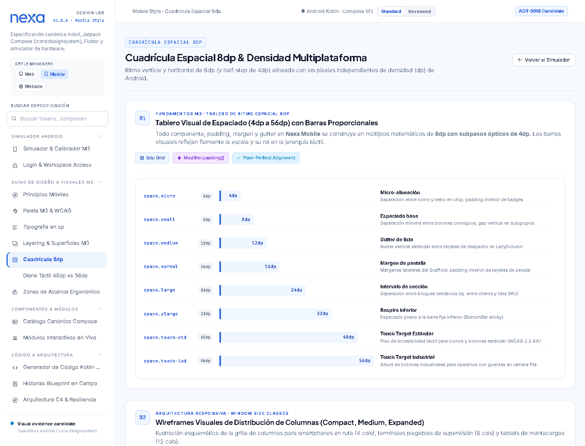
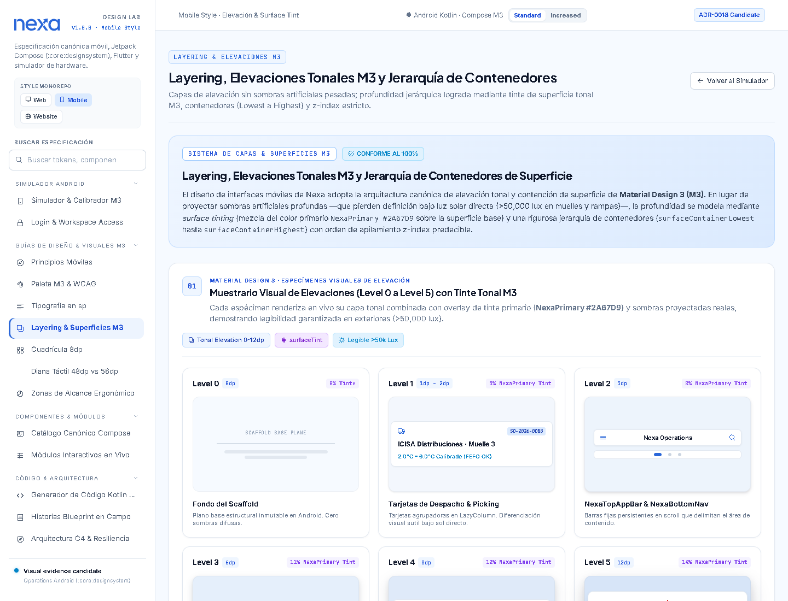
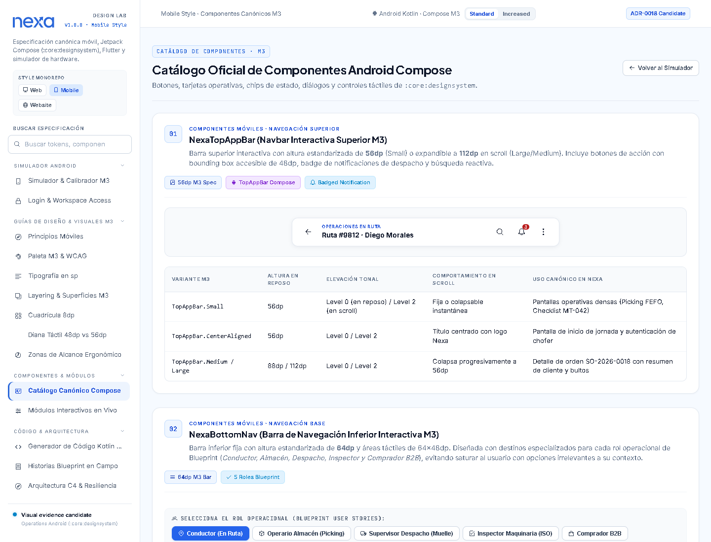
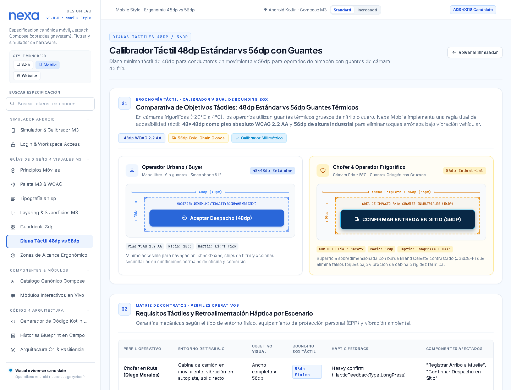
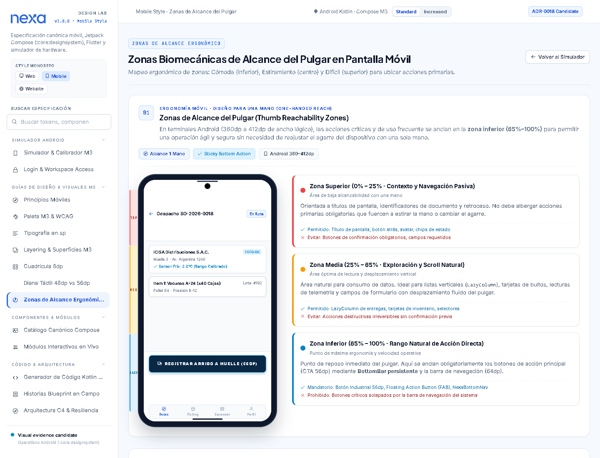
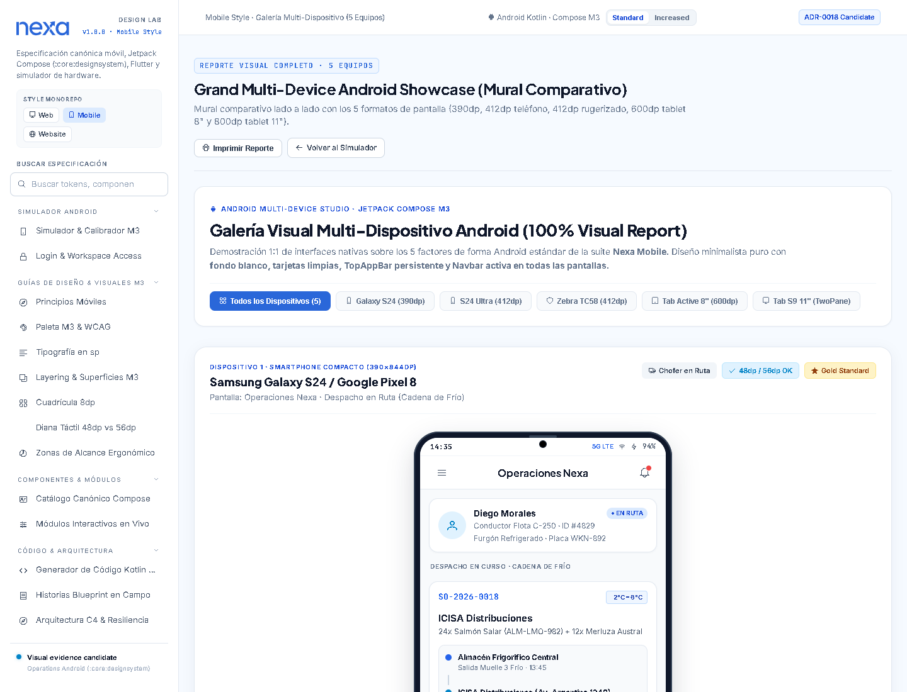

# Capítulo III: Diseño UI/UX de la solución

## 3.1. Diseño de producto

### 3.1.1. Guías de estilo

#### 3.1.1.1. Guías generales de estilo

Las guías de estilo establecen el lenguaje visual común de Nexa para que la
persona pueda reconocer la superficie, interpretar el estado de una operación y
decidir cuál es la siguiente acción segura. El objetivo no es uniformar todas
las pantallas, sino conservar una misma intención visual mientras cambia la
densidad de información entre el Website, el Platform, el Buyer Portal y las
futuras superficies Mobile.

##### Alcance y estado de la evidencia

Esta sección se redacta a partir de la guía visual móvil vigente, el sistema de
tokens compartido y las decisiones aceptadas de Nexa. Las capturas
incluidas muestran especímenes, escalas y composiciones de referencia. No
demuestran que exista una aplicación Mobile implementada, que una decisión de
producto haya sido validada con usuarios ni que se haya obtenido una
certificación de accesibilidad.

La documentación distingue cuatro niveles de certeza:

- **Fundación aceptada:** marca, identidad azul/slate, familias tipográficas,
  jerarquía semántica del color, apariencia clara y principios de accesibilidad.
- **Especificación visual propuesta:** cuadrícula de 8 dp, roles tipográficos en
  sp, dianas de 48/56 dp, zonas de alcance, barras persistentes y composiciones
  para distintos dispositivos.
- **Especimen ilustrativo:** pantallas de operaciones, Buyer, despacho,
  picking, entrega o inspección que ayudan a discutir composición y estados,
  pero no cierran contratos de negocio.
- **Pendiente de validación:** tecnología final, arquitectura Mobile,
  persistencia offline, autorización en ejecución, métricas de uso, prueba con
  personas y adopción de cada componente por las aplicaciones.

*La composición muestra un marco de dispositivo, navegación y contenido
operativo como referencia de diseño; no constituye una pantalla funcional de
Nexa Mobile.*

##### Identidad visual y marca

La identidad de Nexa se apoya en una combinación de azul y slate, con una
apariencia clara y superficies blancas para preservar la lectura de contenido
operativo y de producto. El identificador visual debe utilizar el recurso
canónico, conservar sus proporciones y mantener un área de protección
suficiente. No debe redibujarse en texto, comprimirse, estirarse, inclinarse ni
colocarse sobre una superficie que reduzca su legibilidad.

En una superficie móvil, la marca debe ocupar el espacio necesario para
identificar el contexto sin desplazar la tarea principal. El encabezado puede
mostrar el módulo, el contexto de trabajo y el estado de conectividad, pero no
debe convertir una operación urgente en una composición publicitaria. La
variante clara u oscura se selecciona según la superficie y el contraste
disponible.

La marca de Nexa es una fundación compartida; su uso en una pantalla de acceso,
un encabezado o un estado vacío no implica que exista un flujo de autenticación
Mobile aprobado. Los textos, roles y relaciones de acceso continúan sujetos a
las decisiones de producto.

##### Sistema de color y significado semántico

El color se organiza en tres capas: valores primitivos, roles semánticos y
tokens de componente. Las aplicaciones deben consumir roles que expresen la
función de la superficie —por ejemplo, texto principal, borde interactivo,
superficie de tarjeta o estado de advertencia— y no depender de un valor crudo
sin significado.

La base visual conserva los siguientes roles:

| Rol semántico | Aplicación | Regla de uso |
| --- | --- | --- |
| Identidad y acción | Marca, acción primaria y navegación activa | Reservar el mayor énfasis para la acción que permite avanzar. |
| Página y tarjeta | Canvas general y unidades de contenido | Mantener una base clara y separar grupos sin sobrecargar de sombras. |
| Texto y borde | Lectura, jerarquía, división y foco | Ajustar el contraste a la función; el texto secundario no debe parecer deshabilitado por accidente. |
| Información | Ayuda, contexto o estado informativo | Acompañar el tono con texto o icono que explique su significado. |
| Éxito | Confirmación o resultado favorable | Comunicar qué quedó confirmado y qué puede ocurrir después. |
| Atención | Riesgo, revisión o condición incompleta | Explicar la decisión pendiente y la consecuencia de continuar. |
| Peligro | Error, bloqueo o acción destructiva | Mostrar la consecuencia y una recuperación cuando exista. |
| Frío | Condición refrigerada o congelada | Mantener una leyenda textual; el color no debe ser la única señal del estado. |

La paleta azul y las familias semánticas deben conservar su significado entre
temas y superficies. Los estados del negocio no se definen solamente por su
color: una entrega, una reserva, una discrepancia o una lectura de temperatura
requieren texto, iconografía, forma o posición que hagan explícita la
interpretación.

*La figura documenta una referencia visual de color y contraste. Sus etiquetas
de cumplimiento son parte del espécimen y no sustituyen una evaluación
independiente en el producto final.*

##### Tipografía y jerarquía de lectura

La jerarquía tipográfica combina Plus Jakarta Sans para títulos y encabezados,
Inter para cuerpo, controles y mensajes, y una familia monoespaciada del sistema
para identificadores y valores técnicos. En la especificación móvil, las
medidas se expresan en sp para permitir que la configuración de texto del
dispositivo participe en el escalado. La elección tecnológica definitiva de
Mobile permanece abierta; por ello, estos valores se documentan como una
escala visual y no como un contrato de framework.

| Rol visual | Familia | Tamaño / interlineado | Peso | Uso orientativo |
| --- | --- | --- | --- | --- |
| `displayLarge` | Plus Jakarta Sans | 57 sp / 64 sp | 800 | Métrica o dato dominante cuando la tarea lo justifica. |
| `headlineLarge` | Plus Jakarta Sans | 32 sp / 40 sp | 800 | Título principal de una vista. |
| `headlineSmall` | Plus Jakarta Sans | 24 sp / 32 sp | 700 | Nombre de cliente, entidad o sección prioritaria. |
| `titleLarge` | Plus Jakarta Sans | 22 sp / 28 sp | 600 | Encabezado de una superficie o detalle. |
| `titleMedium` | Inter | 16 sp / 24 sp | 600 | Nombre de tarea, parada, producto o grupo. |
| `bodyLarge` | Inter | 16 sp / 24 sp | 400 | Instrucción, explicación o dirección principal. |
| `bodyMedium` | Inter | 14 sp / 20 sp | 400 | Descripción y contenido operativo habitual. |
| `bodySmall` | Inter | 12 sp / 16 sp | 400 | Metadatos y datos secundarios. |
| `labelLarge` | Inter | 14 sp / 20 sp | 700 | Acción primaria o etiqueta de control. |
| `labelMedium` | Inter | 12 sp / 16 sp | 600 | Pestañas, chips y estados compactos. |
| `labelSmall` | Inter | 11 sp / 16 sp | 700 | Telemetría o metadata de baja jerarquía. |

Los títulos deben anunciar el contexto antes de presentar el detalle. Las
etiquetas permanecen asociadas a su control y el texto técnico se diferencia
por su familia, no por reducirlo hasta hacerlo ilegible. El reflujo debe
preferirse a truncar información crítica; los identificadores largos pueden
partirse o exponerse en una vista de detalle.

*La matriz representa una escala tipográfica móvil y ejemplos de crecimiento
del contenido. La verificación en un dispositivo, una tecnología asistiva y
una aplicación implementada permanece pendiente.*

##### Espaciado y cuadrícula

La referencia móvil utiliza una cuadrícula base de 8 dp con medios pasos de
4 dp. La escala permite construir márgenes, separación entre controles,
insets de tarjetas y ritmo entre secciones sin introducir valores arbitrarios.

| Medida | Función de referencia |
| --- | --- |
| 4 dp | Microalineación entre icono, texto o elementos estrechamente relacionados. |
| 8 dp | Separación base entre controles o elementos de un mismo grupo. |
| 12 dp | Gutter de listas y separación intermedia. |
| 16 dp | Margen lateral de una pantalla compacta e inset de una tarjeta. |
| 24 dp | Separación entre bloques temáticos. |
| 32 dp | Respiro entre una sección y una acción fija. |
| 48 dp | Dato de interacción táctil estándar documentado. |
| 56 dp | Dato de interacción ampliada para escenarios industriales. |

La cuadrícula ordena, pero no debe forzar una composición rígida. El contenido
debe poder reordenarse, las listas deben crecer verticalmente y una tabla ancha
debe desplazarse localmente sin provocar desbordamiento de toda la página. Los
márgenes y gutters se deben revisar en 390 y 320 px para teléfonos, y en
anchos mayores cuando se utilicen tarjetas o columnas adaptativas.

*La composición ilustra el ritmo de espaciado y las alternativas de columnas;
no reemplaza el wireframe ni el contrato de una pantalla de producto.*

##### Geometría, superficies y elevación

La geometría es semántica. Los controles, las tarjetas, los paneles, los
overlays, los diálogos y las etiquetas compactas no necesitan compartir el
mismo radio. Los tokens actuales distinguen, entre otros, radios de control de
10 px, tarjeta de 16 px, panel de 18 px, diálogo de 24 px y píldora de 999 px.
Estos valores sirven como referencia de relación; no justifican redondear
uniformemente todas las superficies.

La apariencia clara utiliza un canvas frío, superficies estructurales blancas,
planos inset discretos y bordes sobrios. La elevación se reserva para comunicar
relación espacial: menús, diálogos, hojas inferiores y overlays temporales
pueden diferenciarse mediante tinte, borde y sombra moderada. Una tarjeta no
debe recibir una sombra únicamente para hacerla visible, y una sombra no debe
ser la única señal de separación.

*La figura muestra una jerarquía de superficies como referencia visual. La
profundidad no implica una decisión sobre navegación, persistencia o prioridad
de negocio.*

##### Iconografía y comunicación no cromática

Los iconos deben agregar significado, mantener una escala óptica consistente y
conservar un nombre accesible cuando sean interactivos. Un icono no sustituye
una etiqueta necesaria ni debe obligar a inferir una acción ambigua. La
selección, el error, el éxito, la advertencia y la conectividad deben poder
reconocerse aunque la persona no distinga los colores o no perciba el
movimiento.

En las superficies Mobile, el glifo visible puede ser menor que el área de
activación. La especificación táctil debe comprobar el área completa, la
separación entre objetivos vecinos, el foco visible y la respuesta ante toque
repetido. Si se utiliza una biblioteca de iconos en una futura implementación,
la biblioteca debe conservar esta semántica y no convertirse en una fuente de
ruido decorativo.

##### Componentes, variantes y estados

Los componentes deben documentarse como contratos de apariencia, contenido y
estado. La guía visual muestra botones, tarjetas operativas, chips, campos,
hojas inferiores, diálogos, barra superior y navegación inferior; son patrones
de referencia para componer tareas, no pantallas de negocio terminadas.

| Componente | Regla de diseño | Estados mínimos a resolver |
| --- | --- | --- |
| Barra superior | Mantener contexto, título y acciones globales sin competir con la tarea. | Normal, desplazada, menú abierto, notificaciones y foco. |
| Navegación inferior | Dar acceso a destinos frecuentes y conservar el destino activo con más de una señal. | Activa, inactiva, foco, destino restringido y badge informativo. |
| Botón | Diferenciar acción primaria, apoyo y acción destructiva. | Normal, presionado, foco, deshabilitado, cargando, éxito y error. |
| Tarjeta | Agrupar una unidad de información o tarea; evitar convertir todo en tarjetas. | Normal, seleccionada, expandida, vacía, obsoleta y con error. |
| Campo | Mantener etiqueta, valor, ayuda y error próximos al control. | Vacío, foco, completado, inválido, solo lectura y deshabilitado. |
| Chip o estado | Resumir una condición sin convertir el color en el mensaje. | Informativo, éxito, atención, peligro, seleccionado y pendiente. |
| Hoja o diálogo | Mostrar contenido temporal relacionado con la acción que lo originó. | Abierto, foco atrapado, carga, error, confirmación y cierre seguro. |

*El catálogo expone variantes y controles como especímenes. La adopción de un
componente requiere después contrato de datos, autorización, estados de
recuperación y revisión de accesibilidad en la superficie que lo consuma.*

##### Ergonomía táctil y zonas de alcance

La guía propone una diana mínima de 48 dp para controles táctiles y una altura
ampliada de 56 dp para escenarios industriales en los que puedan existir
guantes, vibración o menor precisión. Son reglas de diseño que deben medirse
en el área total del control, no solamente en el tamaño del icono o del texto.
La separación entre controles también forma parte de la prevención de toques
accidentales.

Las acciones frecuentes y críticas se sitúan preferentemente en la zona
inferior de una pantalla de teléfono, donde la persona puede alcanzarlas sin
reacomodar constantemente el dispositivo. Las acciones destructivas o de
anulación requieren una confirmación y una ubicación que reduzca activaciones
accidentales. La ubicación final depende del flujo, del rol y del riesgo de la
operación; la ergonomía por sí sola no decide la autorización.

*Las medidas representan una especificación ergonómica propuesta; no son
resultado de una prueba de campo ni de una certificación.*

*La distribución inferior, media y superior sirve para discutir alcance y
prioridad; no reemplaza la evaluación del flujo de Operations o Buyer.*

##### Diseño adaptable y formatos de dispositivo

La composición debe adaptarse a la anchura y al contexto de uso sin perder la
jerarquía. La guía visual utiliza como referencia un teléfono compacto de
390 dp, teléfonos de 412 dp y tabletas de 600 y 800 dp. Estos formatos ayudan a
examinar cambios de columnas, márgenes, barra inferior, tamaño de tarjeta y
densidad de información.

La adaptación no consiste en escalar una pantalla de teléfono hasta llenar una
tableta. En anchos compactos se prioriza una columna y un flujo vertical; en
anchos medios pueden aparecer agrupaciones adicionales; en superficies
expandidas se aprovecha el espacio para comparar información relacionada sin
duplicar acciones. Cada variante debe conservar la misma etiqueta, estado,
consecuencia y recuperación.

*El mural es una referencia comparativa de composición. La validación final
requiere capturas de la aplicación correspondiente, contexto de permisos,
contenido real y una revisión en los tamaños definidos.*

##### Accesibilidad e inclusión

La accesibilidad forma parte del contrato compartido de Nexa. Cada control
debe ser operable con el mecanismo de entrada disponible, tener un nombre
comprensible, conservar foco visible y asociar correctamente ayuda, valor y
error. La estructura semántica debe permanecer clara cuando aumenta el tamaño
del texto o cambia la orientación de la pantalla.

La revisión visual y funcional debe incluir, como mínimo:

- contraste adecuado para texto, controles, foco y estados;
- comunicación redundante mediante texto, iconografía, forma o posición;
- aumento de texto hasta 200 % sin pérdida de información crítica;
- reflujo y lectura en 390 y 320 px, además de los anchos de escritorio
  definidos para las demás superficies;
- foco, orden de lectura, etiquetas, diálogo, hoja inferior y mensajes de
  error asociados al control correcto;
- preferencia de movimiento reducido, conservando la causa, el estado final y
  la posibilidad de recuperación.

Las cifras o etiquetas de contraste visibles en los especímenes deben
interpretarse como evidencia de diseño candidata. No deben redactarse como
“certificación WCAG” mientras no exista una evaluación documentada con el
producto implementado, sus contenidos y sus estados reales.

##### Estados, retroalimentación y continuidad

Las superficies de Nexa deben hacer visible si una acción está disponible, en
proceso, confirmada, pendiente, rechazada o requiere intervención. La
retroalimentación debe responder tres preguntas: qué ocurrió, qué significa y
cuál es la siguiente acción segura. Un indicador de conectividad puede
comunicar el estado de la interfaz, pero no demuestra por sí mismo persistencia
local, sincronización ni operación offline.

Los estados de carga, vacío, error, validación, deshabilitado, solo lectura,
permiso denegado, obsoleto y conflicto deben definirse cuando sean aplicables.
Los reintentos no deben crear comandos duplicados ni presentar como confirmado
un resultado que continúa pendiente. La interfaz debe preservar el contexto y
la evidencia de la operación; una corrección visual no puede borrar un hecho
histórico.

El movimiento debe explicar una transición breve o mantener la continuidad de
una operación. Cuando la persona prefiera reducir movimiento, la información
debe permanecer disponible mediante orden, texto, foco y estado terminal. La
guía visual no cierra la arquitectura de sincronización ni convierte la
resiliencia propuesta en una capacidad implementada.

##### Contenido, tono e internacionalización

La comunicación debe ser directa, calmada y útil para la operación. Un mensaje
debe nombrar el objeto, expresar su estado actual y proponer la siguiente
acción segura. Los errores no deben culpar a la persona ni esconder la causa
de una restricción. Las etiquetas de estado deben conservar la semántica del
dominio y no inventar estados porque resulten visualmente convenientes.

La expansión de idioma debe considerarse desde el layout: los títulos,
etiquetas, nombres de clientes, direcciones, motivos y mensajes de error no
deben depender de una longitud fija. Antes de cerrar una interfaz se deben
revisar las traducciones acordadas para la superficie, el orden de lectura y
los cambios de tamaño sin eliminar información. La guía de estilo no fija por
sí sola una política de idiomas ni un contenido legal.

##### Aplicación a las superficies de Nexa

Las mismas fundaciones pueden expresarse con distinta densidad y prioridad:

| Superficie | Prioridad visual | Aplicación |
| --- | --- | --- |
| Website | Orientación y confianza | Explicar valor, contexto y siguiente decisión con baja fricción. |
| Platform | Eficiencia operativa | Priorizar contexto, estado, acción inmediata y recuperación en tareas repetitivas. |
| Buyer Portal | Confianza de compra | Mostrar producto, disponibilidad, precio, cambios y consecuencias antes de confirmar. |
| Operations Mobile | Continuidad de trabajo | Reducir desplazamientos innecesarios y hacer visibles tarea, excepción y resultado. |
| Buyer Mobile | Claridad y control | Mantener lectura de producto, cantidad, estado, entrega y discrepancia. |

La diferencia entre superficies debe responder al objetivo y al riesgo, no a
una fragmentación arbitraria de la identidad. La guía visual puede orientar una
composición de Operations o Buyer, pero no determina por sí sola el actor
autorizado, la transición de negocio, la persistencia, la política de entrega o
la aceptación de un flujo.

##### Criterios de adopción

Antes de considerar una pantalla Mobile lista para revisión, el equipo debe
comprobar que:

- consume roles semánticos y no valores cromáticos aislados;
- mantiene jerarquía tipográfica, ritmo espacial y geometría coherentes;
- ofrece dianas táctiles y separación suficiente para el escenario de uso;
- distingue acción, estado, consecuencia y recuperación;
- conserva etiquetas y significado al cambiar de tamaño o dispositivo;
- resuelve carga, vacío, error, deshabilitado, permiso, conflicto y reintento
  cuando correspondan;
- no presenta un espécimen visual como producto implementado o validado;
- registra la evidencia de viewport, contenido, permisos, versión y resultado
  de la revisión.

En este estado, las guías de estilo proporcionan una base visual y de
interacción para continuar con la arquitectura de información, los wireframes
y los artefactos Mobile posteriores. No cierran todavía la implementación de
Mobile ni la validación con usuarios; su función es reducir decisiones
inconsistentes y conservar la honestidad del reporte.
