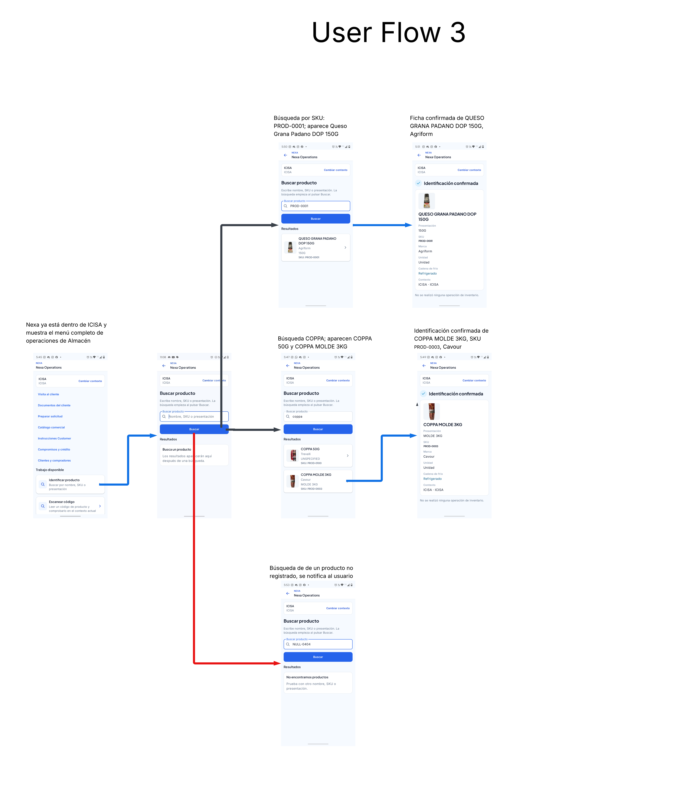

#### 3.1.2.4 Searching Systems

La búsqueda de producto ayuda a localizar un artículo durante una tarea de almacén. Su alcance es la consulta contextual que corresponde a esa tarea; no es un buscador global de todos los datos de un Tenant ni cruza Tenants. La interfaz mantiene explícito el contexto operativo y el servidor conserva la autoridad de acceso y resolución.

Un nombre o alias textual ayuda a localizar candidatos; no sustituye la identidad del catálogo. `Product` y `SKU` son conceptos distintos: Product agrupa información del artículo y SKU identifica la variante vendible. Un GTIN u otro `Physical Identifier` usa una resolución separada que debe conducir a exactamente un SKU; el resultado desconocido y el ambiguo se presentan por separado. Una coincidencia textual nunca confirma por sí misma una operación.

| Estado | Información que debe mostrarse | Acción disponible |
| --- | --- | --- |
| Inicial | Campo, términos aceptados y contexto | Escribir o iniciar la alternativa manual. |
| Cargando | Que la consulta sigue en curso | Esperar o cancelar cuando sea seguro. |
| Con resultados | Nombre, presentación, SKU y atributos distintivos | Abrir el detalle y verificar el artículo. |
| Sin resultados | Que el término no produjo coincidencias | Revisar nombre, SKU o contexto y volver a consultar. |
| Varias coincidencias | Atributos para distinguir cada artículo | Seleccionar explícitamente, sin elección automática. |
| Identificador desconocido o ambiguo | Que el GTIN o Physical Identifier no resolvió a un único SKU | Revisar el identificador o seleccionar entre resultados distinguibles. |
| Cámara no disponible | Estado del permiso y alternativa de búsqueda | Solicitar el permiso o continuar manualmente. |
| Consulta no disponible | Que la lectura no pudo completarse | Conservar término y contexto; consultar de nuevo cuando la lectura pueda repetirse de forma segura. |

Los resultados muestran los atributos disponibles que permiten distinguir variantes, como presentación, marca, unidad o condición de conservación. La cantidad, lote o vencimiento se asocia al contexto de inventario cuando forma parte de la tarea; no convierte el catálogo de productos en una búsqueda de stock transversal. Las capturas de User Flow Diagrams ilustran consulta textual, ficha de producto y alternativa manual; no añaden búsqueda dinámica global.

*User Flow 3: la secuencia distingue consulta por SKU, coincidencias por texto, apertura de la ficha y ausencia de resultados. Cada respuesta conduce a revisar el artículo o ajustar el término de búsqueda.*
