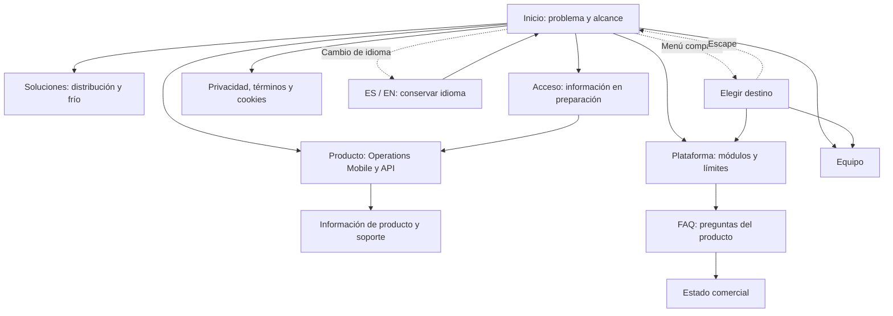

#### 3.1.2.5. Sistemas de navegación

##### Modelo de navegación

La navegación de Nexa debe conservar tres relaciones: dónde está la persona, qué tarea está realizando y qué resultado puede confirmar. Cada salto debe mantener suficiente contexto para que la persona pueda volver sin repetir un comando ni perder una evidencia.

| Superficie | Entrada principal | Recorrido prioritario | Recuperación |
| :--- | :--- | :--- | :--- |
| Website público | Página inicial, enlace compartido o buscador | Problema → solución → capacidad → evidencia o límite → CTA | Volver al grupo anterior, consultar FAQ o acceder a información legal. |
| Operations Mobile | Sesión y Workspace autorizados | Trabajo asignado → detalle → comando o evidencia → resultado → historial | Estado seguro ante sesión expirada, red fallida, duplicado o resultado incierto. |
| Buyer Mobile | Buyer Relationship y entrega autorizada | Atención de entrega → transferencia de responsabilidad → cantidades → receipt o discrepancy → historial | Mantener la entrega y mostrar la diferencia sin confirmar falsamente. |

Operations Mobile usa una vista inicial limitada por rol, una lista de trabajo asignado, el detalle de la tarea, el paso de comando o evidencia y el resultado o historial. Buyer Mobile usa una vista de atención de entrega, verificación de la transferencia, receipt e historial de discrepancias. La decisión de usar navegación por pestañas, lista, pila o enlaces contextuales debe responder a la cantidad de trabajo y al tamaño de viewport; no se fija una estructura visual que todavía no haya sido validada en wireframes.

##### Navegación pública y Landing Page

La Landing Page conduce desde el problema y el alcance del producto hacia la
información de solución, plataforma, preguntas frecuentes, estado comercial,
equipo, soluciones y acceso. El acceso descrito en este capítulo es
informativo; no se presenta como autenticación operativa.

La revisión disponible observó 16 páginas con respuesta HTTP 200, selector
ES/EN, navegación compacta y 96/123 observaciones de composición en 390,
1230 y 1440 píxeles CSS. Estas observaciones describen el corte revisado; no
demuestran publicación, accesibilidad completa, autenticación operativa ni
validación con usuarios. La revisión a 320 píxeles y otros navegadores queda
pendiente.

##### Reglas de continuidad

- Los enlaces profundos y las notificaciones deben volver a comprobar sesión, Tenant/Workspace y autorización de Buyer Relationship antes de abrir contenido protegido.
- La navegación hacia atrás debe retornar al último estado seguro y conservar los datos que la persona ya revisó.
- Volver no debe repetir un comando, enviar un receipt, crear un POD ni registrar una discrepancy.
- El cambio de contexto debe ser explícito y debe invalidar las vistas que ya no pertenecen al nuevo alcance.
- Una entrega, un intento y una evidencia deben conservar una identidad estable durante todo el flujo.
- Cuando una operación queda pendiente, la navegación debe permitir retomar ese estado sin presentarlo como completado.

##### Estados de fallo de navegación

Una sesión expirada, un contexto revocado, una red no disponible, una delivery desactualizada, un código de transferencia inválido y un resultado de command desconocido requieren destinos visibles y acciones de recuperación.

| Fallo | Destino seguro | Acción permitida |
| :--- | :--- | :--- |
| Sesión expirada | Pantalla de acceso o retorno controlado | Volver a autenticar y recuperar el contexto si continúa autorizado. |
| Workspace revocado | Selector o estado de acceso restringido | Elegir un workspace permitido; no mostrar datos protegidos anteriores. |
| Red no disponible | Vista actual con estado pendiente | Reintentar una solicitud segura o dejar el resultado sin confirmar. |
| Delivery desactualizada | Detalle con última versión confirmada | Actualizar antes de ejecutar un comando. |
| Código de transferencia inválido o expirado | Verificación con explicación del rechazo | Solicitar un código válido o abandonar sin crear confirmación. |
| Command desconocido o duplicado | Estado no resuelto con identidad del comando | Consultar el resultado antes de repetir; nunca duplicar silenciosamente. |

Un retry solo debe repetir una solicitud idempotente o mostrar el estado no resuelto; no debe duplicar silenciosamente un receipt, POD o discrepancy. El flowchart de navegación orienta el recorrido; el wireflow visual y la revisión en dispositivo físico se mantienen pendientes.
