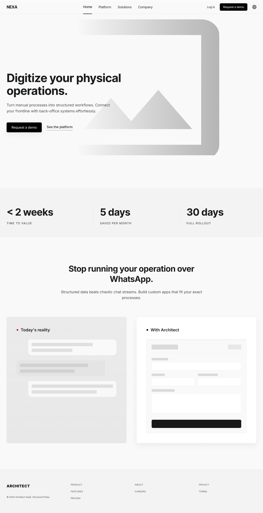
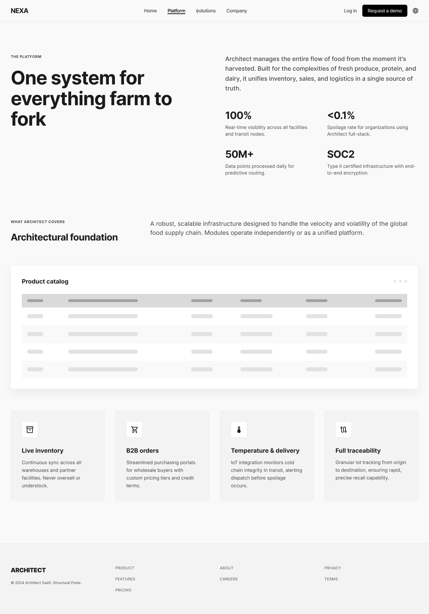
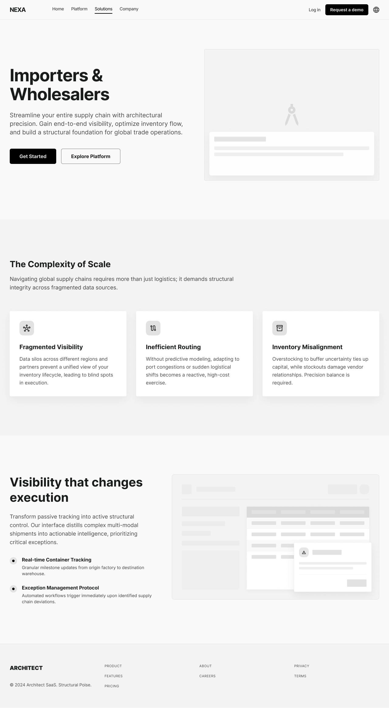
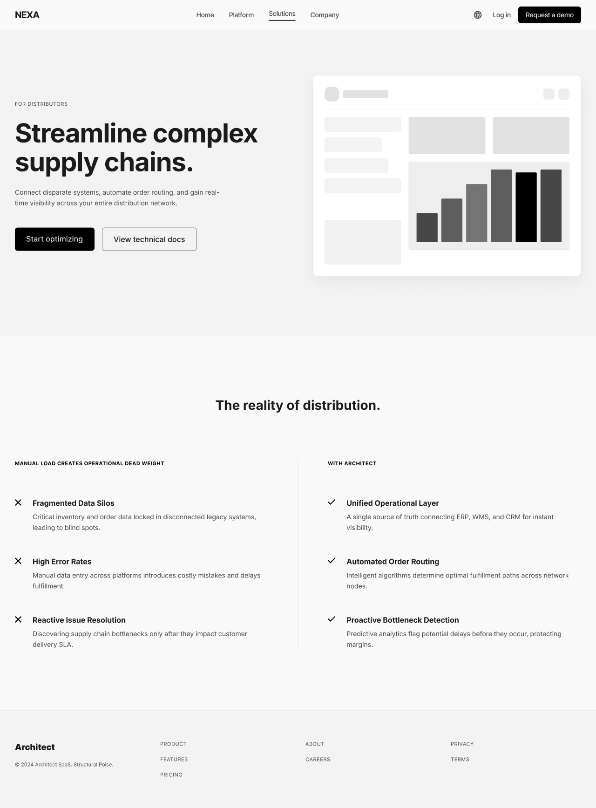
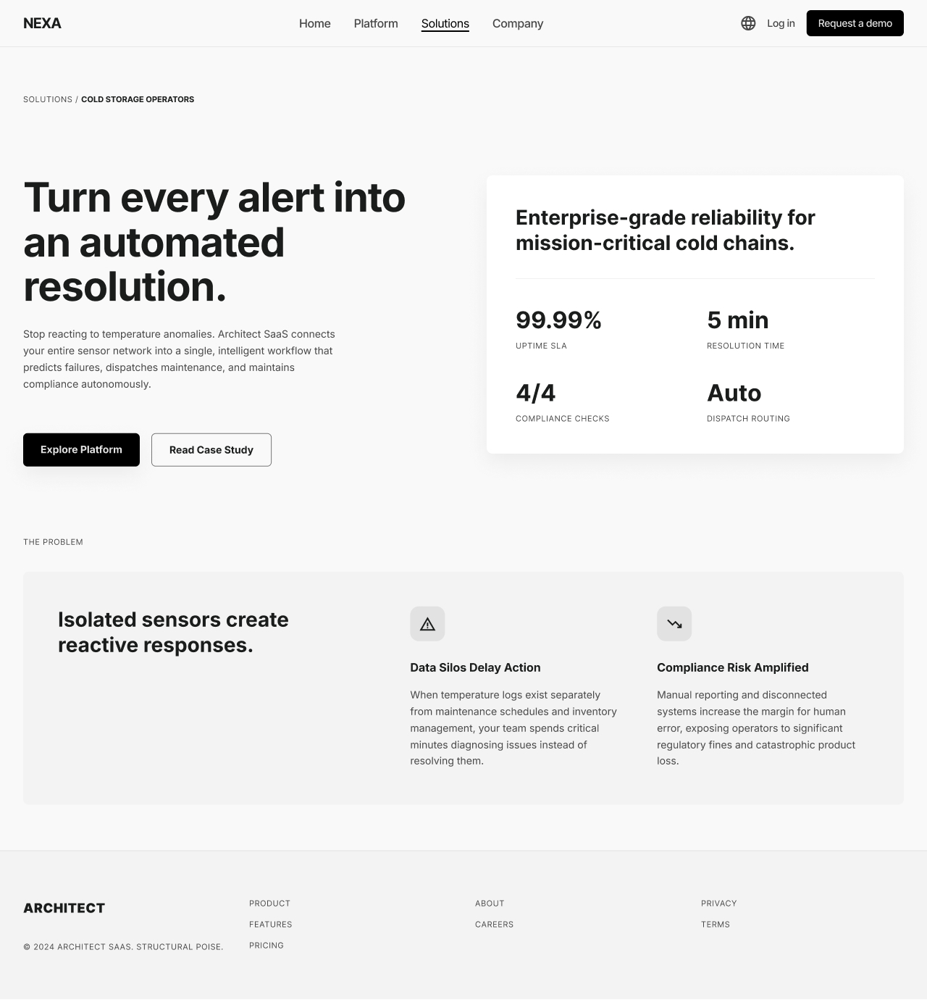
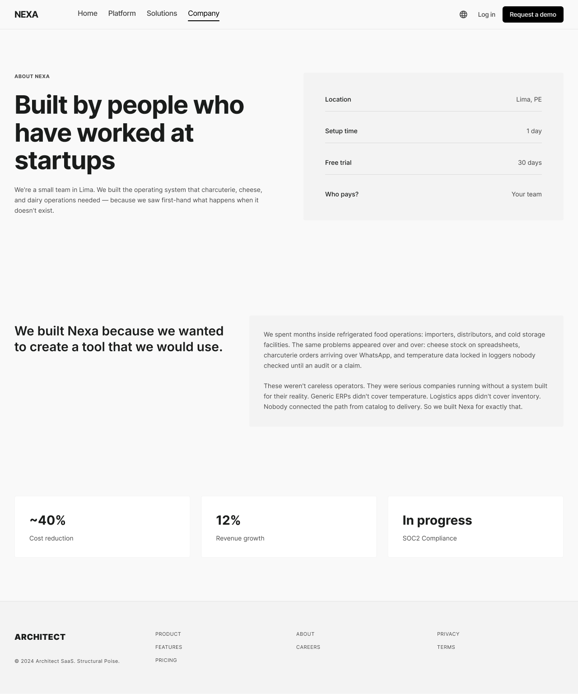
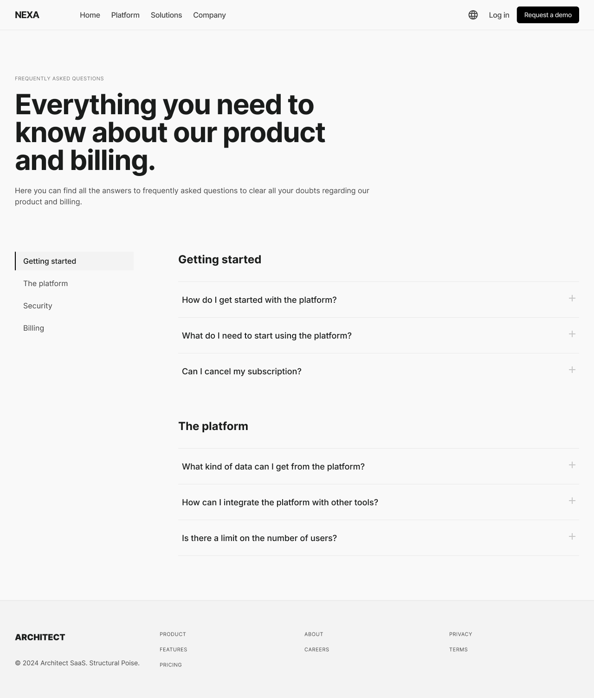

### 3.1.3. Diseño UI de la Landing Page

Los wireframes y mockups describen decisiones de diseño para las páginas
públicas y no documentan una implementación en ejecución.

#### 3.1.3.1. Wireframes de la Landing Page

##### Composición de escritorio

Las vistas de escritorio comparten una cabecera con la marca a la izquierda,
las rutas editoriales al centro y las opciones de idioma, acceso y contacto a
la derecha. La portada abre con una propuesta en dos columnas: el mensaje y
las acciones **Request a demo** y **See the platform** ocupan el lado
izquierdo, mientras un panel visual equilibra la composición. Una franja de
indicadores da paso a una comparación entre la operación actual y una
propuesta organizada; el pie cierra con enlaces editoriales e institucionales.

*Portada: propuesta de valor, acciones, franja de indicadores y comparación.*

La vista titulada **Platform** combina un encabezado amplio con texto
explicativo, indicadores de apoyo, una tabla de productos y cuatro tarjetas.
Esta secuencia conduce desde una descripción general hacia temas concretos
como inventario, pedidos, temperatura y trazabilidad.

*Platform: explicación general, tabla ilustrativa y tarjetas temáticas.*

Las páginas de segmento mantienen el hero en dos columnas y adaptan el resto
del recorrido a cada operación. La vista de importadores y mayoristas abre
con dos acciones y continúa con tres tarjetas de retos y un bloque de
seguimiento. La de distribuidores acompaña su titular con un panel gráfico y
contrasta la carga manual con una propuesta de trabajo coordinado. La página
de cámaras frías utiliza un panel de indicadores y un bloque sobre incidencias
para situar el tema antes de conducir a las acciones principales.

*Importadores y mayoristas: retos del segmento y seguimiento de operaciones.*

*Distribuidores: comparación entre carga manual y trabajo coordinado.*

*Cámaras frías: indicadores y explicación de incidencias operativas.*

La página **Company** organiza una presentación institucional, datos en filas,
un relato sobre el origen del producto y tarjetas de resumen. **FAQ** cambia
ese patrón por una lista lateral de categorías —inicio, plataforma, seguridad
y facturación— junto con preguntas plegables. Así, la primera página presenta
contexto, mientras la segunda permite localizar una consulta concreta.

*Company: contexto institucional, datos en filas y tarjetas de resumen.*

*FAQ: navegación por categorías y preguntas agrupadas por tema.*
