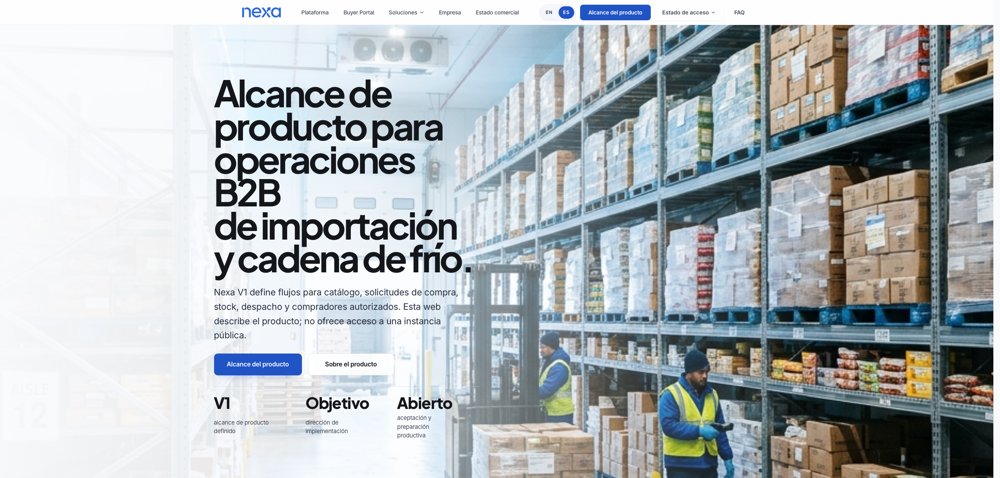

#### 3.1.3.2. Mock-ups de la Landing Page

La vista principal presenta a Nexa como una solución para operaciones B2B de
importación y cadena de frío. La composición reúne navegación, identidad de
marca, mensaje de valor y acciones principales sobre una imagen de almacén.
El título concentra la atención y los botones permiten continuar hacia la
información del producto.

*Figura. Diseño visual de la cabecera y la sección principal en escritorio.
La imagen proporcionada por el equipo conserva la composición original.*

*Decisiones de composición de la vista principal.*

| Elemento | Función en la experiencia |
| :--- | :--- |
| Cabecera | Mantener la marca visible y agrupar los accesos informativos. |
| Título principal | Comunicar el ámbito operativo del producto antes de mostrar detalles. |
| Imagen de almacén | Relacionar la propuesta con distribución, almacenamiento y cadena de frío. |
| Texto de apoyo | Explicar el alcance de la solución con una lectura breve. |
| Acciones principales | Distinguir la consulta del alcance de la información general del producto. |
| Color y tipografía | Jerarquizar contenido y acciones mediante el azul de Nexa y contraste legible. |

La referencia cubre la cabecera y la sección principal en escritorio. Los
estados del menú, foco, formularios y adaptación móvil requieren sus propias
vistas. La imagen documenta composición visual; el funcionamiento de enlaces
y la publicación del sitio se comprueban en la implementación.
