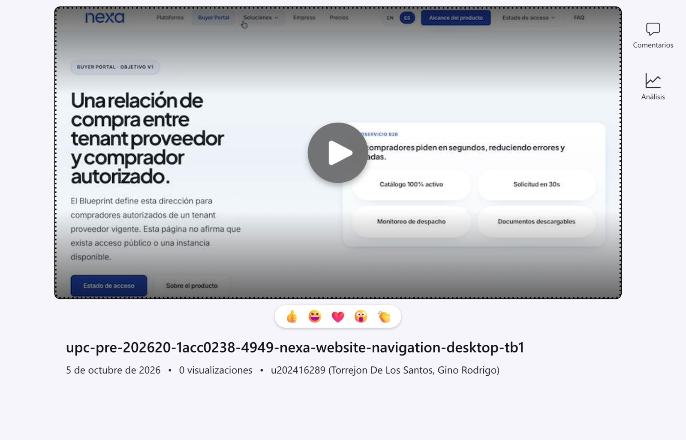
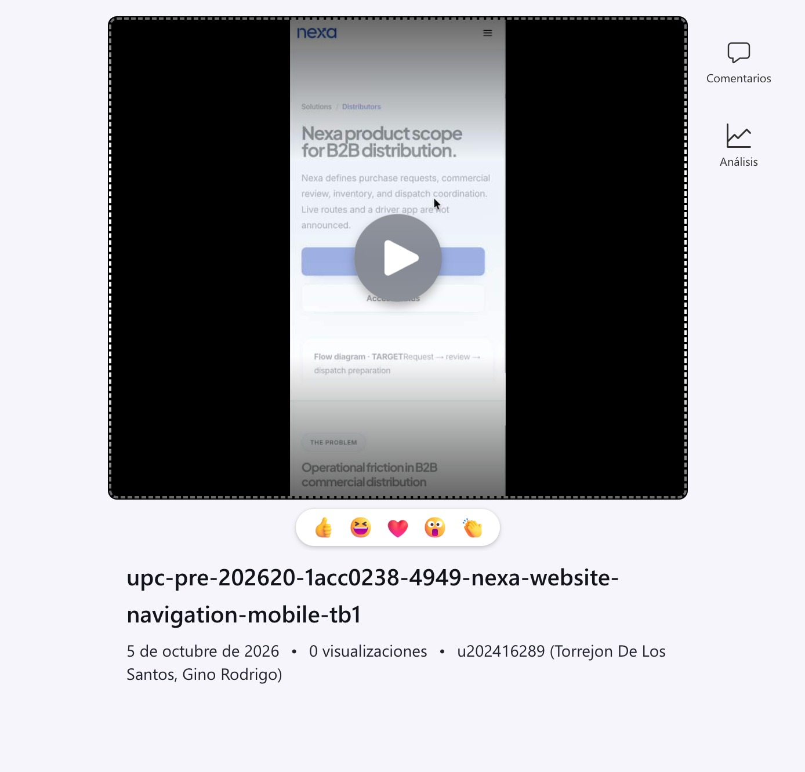

#### 3.1.3.2. Mockups de la Landing Page

##### Vistas de escritorio

*Hoja de mockups desktop: portada, rutas de producto y segmento, información institucional y páginas legales.*

La hoja reúne vistas para la portada, las páginas tituladas **Platform** y
**Buyer Portal**, el hub **Solutions** y sus rutas para importadores,
distribuidores y operadores de cámaras frías. También incluye Company,
Pricing, FAQ, información del producto y del equipo, y páginas legales. Estas
etiquetas nombran destinos editoriales del sitio representado. La cabecera
común, la selección de idioma y los estilos de hero, tarjetas y pie de página
mantienen continuidad entre las páginas.

En la portada, **Register workspace** acompaña la propuesta principal y
**View Plan Details** ofrece una lectura secundaria. Otras vistas repiten
**Register workspace** y **Login** como acciones destacadas. La jerarquía
visual orienta a la persona visitante desde la descripción del producto hacia
el registro, el acceso o la información de planes. Las páginas de segmento
conservan esa secuencia y cambian el mensaje inicial y las tarjetas de acuerdo
con su tema.

##### Vistas móviles

*Hoja de mockups móvil: composición vertical de las páginas públicas.*

En la hoja móvil, la cabecera se reduce a la marca y un menú compacto; los
heroes, descripciones, tarjetas y opciones de registro o acceso se disponen
en una columna. Los botones ocupan casi todo el ancho, y las páginas
institucionales y legales continúan debajo mediante desplazamiento vertical.
La propuesta conserva la jerarquía de las vistas amplias y reduce la cantidad
de elementos visibles a la vez: la navegación se pliega, las columnas se
apilan y cada página mantiene su título y acción principal.

**Prototipos web**

Las grabaciones siguientes presentan vistas previas de la navegación del sitio
en escritorio y móvil. Cada enlace abre la grabación indicada.

**Escritorio (2:03):** [Ver prototipo web de escritorio](https://upcedupe-my.sharepoint.com/:v:/g/personal/u202323040_upc_edu_pe/IQB3V3-kjOLFTKyjwHYRmSHYAbwyQ_QriEIgStDJDEOcvaY?e=sAnogm).

*Vista previa de la grabación del prototipo web en escritorio.*

**Móvil (2:03):** [Ver prototipo web móvil](https://upcedupe-my.sharepoint.com/:v:/g/personal/u202323040_upc_edu_pe/IQCuv9bkLBMeSLpqQVJMLH9vAXtshWb7EpDHY-Yb4vY9oS4?e=6OlkLx).

*Vista previa de la grabación del prototipo web en móvil.*

