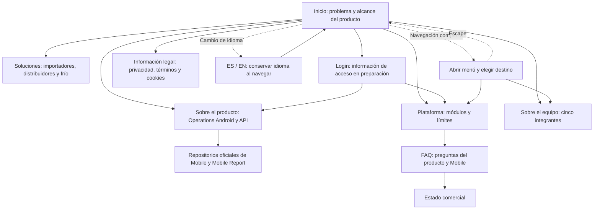

#### 3.1.3.3. Navegación y wireflow de la Landing Page Mobile

La Landing Page presenta Operations Mobile dentro del curso Aplicaciones para Dispositivos Móviles. Su recorrido ayuda a comprender el problema, el producto, el equipo y sus límites de disponibilidad. La entrada Login identifica el acceso futuro al servicio; en el candidato actual abre una página informativa y no un formulario de autenticación.

*Wireflow de navegación del candidato Mobile.*

El contenido académico identifica 1ACC0238, NRC 4949 y período 202620. Las páginas de producto y equipo describen la implementación Android/Kotlin/Jetpack Compose y los perfiles reportados, sin sustituir la validación con usuarios por afirmaciones de disponibilidad.

*Comportamiento comprobado del candidato local.*

| Elemento | Resultado observado | Límite |
| --- | --- | --- |
| Navegación y contenido | 16 páginas respondieron HTTP 200; archivos y anclas locales comprobados. | No demuestra publicación del candidato. |
| Idioma | Selector ES/EN y persistencia al navegar comprobados. | No constituye revisión lingüística exhaustiva. |
| Composición responsive | 96 observaciones DOM a 390, 1230 y 1440 píxeles CSS: sin desbordamiento documental ni imágenes cargadas rotas. | No se verificó reflujo final a 320 px ni todos los navegadores. |
| Menú compacto | Apertura y cierre con Escape comprobados; breakpoint CSS/JavaScript coherente. | Auditoría completa de foco y accesibilidad pendiente. |
| Destinos | FAQ desde Plataforma y estado comercial desde FAQ llegan a las páginas correspondientes. | No hay contratación comercial en este recorrido. |
| Acceso | Login lleva a la página informativa prevista. | El destino real de autenticación y la URL de hosting Mobile no se han definido en este corte. |

Estos resultados corresponden a la implementación local revisada el 2 de octubre de 2026. El Website heredado publicado y el candidato Mobile son cortes distintos. El wireflow documenta destinos y decisiones; los [wireframes](3.1.3.1-landing-page-wireframes.md) y [mock-ups](3.1.3.2-landing-page-mockups.md) conservan sus límites de evidencia visual.
