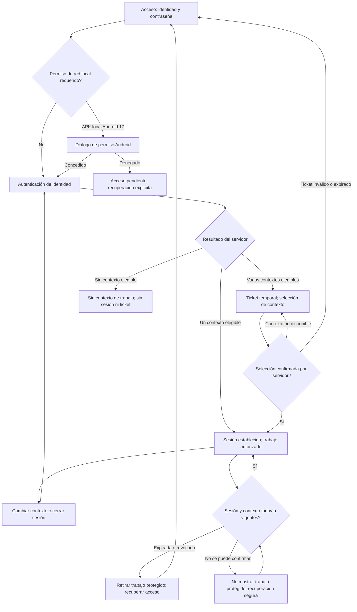
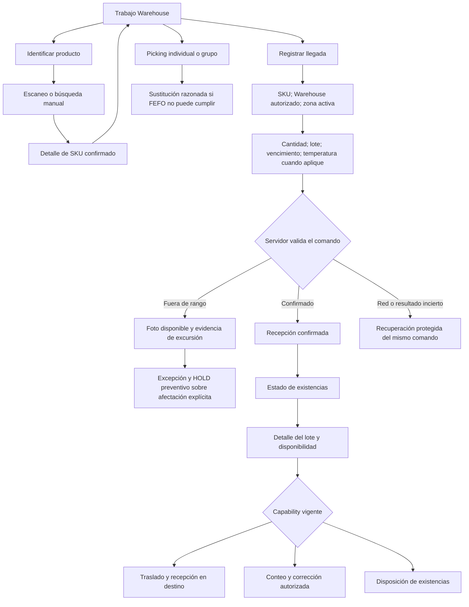
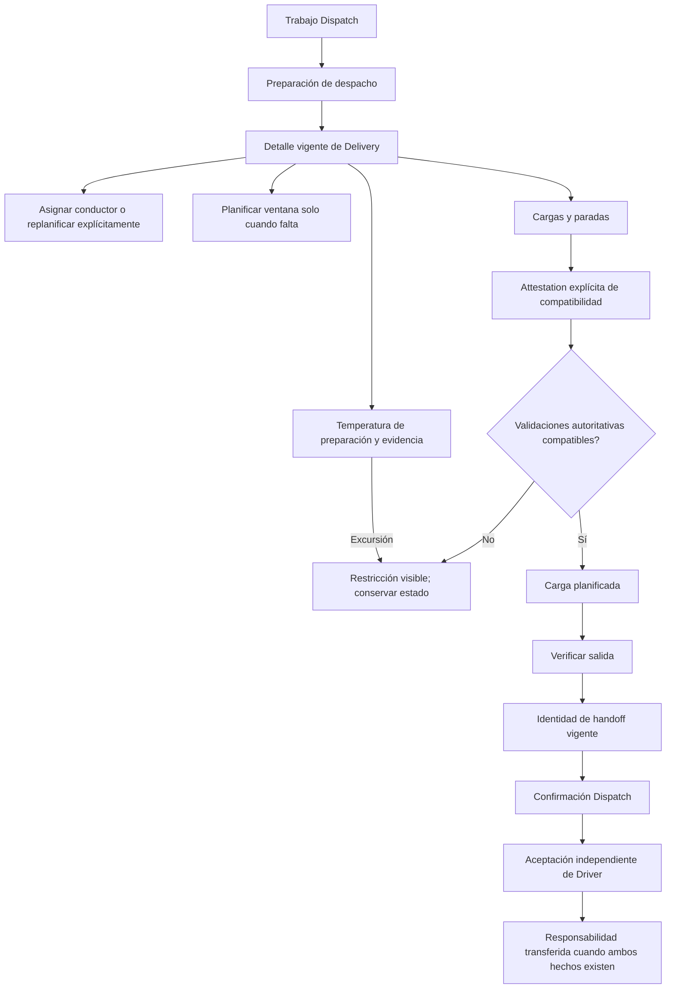
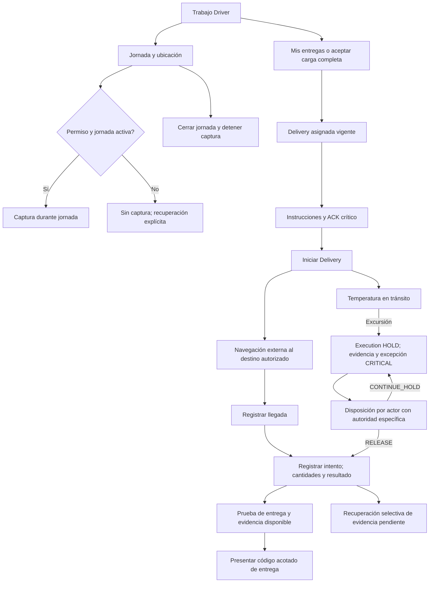
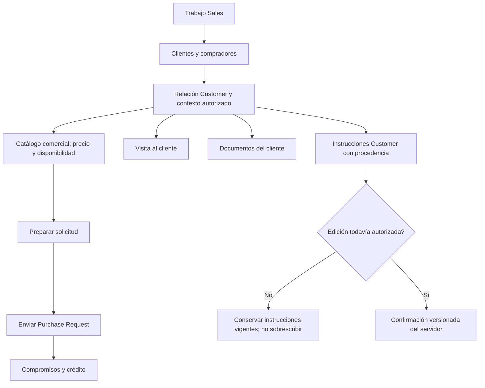
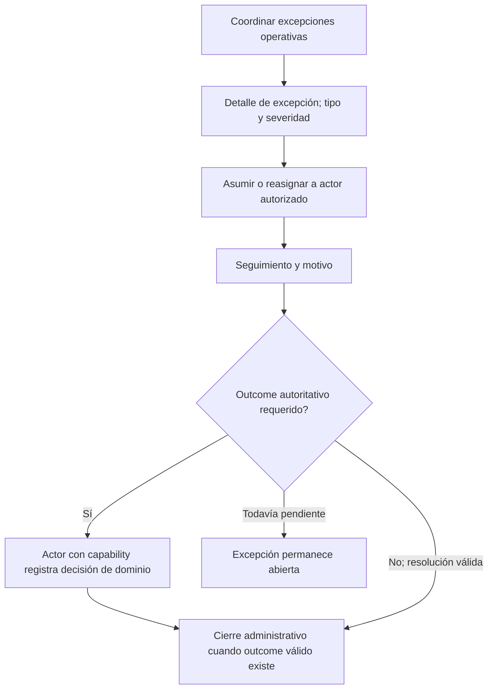

#### 3.1.4.2. Diagramas de wireflow de aplicaciones Mobile

El [mapa de navegación y flujos por trabajo](./3.1.4.6-mobile-navigation-and-flow-guide.md)
resume las entradas actuales de Owner, Sales, Warehouse, Logistics, Driver y
BOM; separa Buyer Mobile como recorrido planificado y enlaza cada rol con su
user flow detallado.

##### Especificación de wireflows

*Wireflows textuales previstos por objetivo de usuario.*

| Objetivo de usuario | Camino principal | Recuperación | Historias |
| :--- | :--- | :--- | :--- |
| Mariela, Diego y Carlos: retomar trabajo autorizado | Regresar → confirmar sesión → seleccionar contexto → trabajo permitido | Sesión expirada, revocada o no disponible → autenticación o estado seguro | MOB-US-001..003 |
| Mariela: registrar trabajo de almacén | Abrir asignación → identificar ítem → registrar hecho autorizado → resultado confirmado | Ítem desconocido, lote o vencimiento faltante, comando duplicado o red fallida → alternativa manual, reintento o pendiente | MOB-US-011..019 |
| Mariela y Dispatch: transferir una entrega preparada | Revisar trabajo → confirmar preparación → Dispatch Handoff → resultado visible | Preparación incompleta o transferencia duplicada → preservar estado previo y explicar excepción | MOB-US-020..025 |
| Diego: registrar evidencia de entrega | Abrir Delivery → navegación externa → intento o resultado → evidencia → código | Resultado parcial o rechazado, permiso denegado o carga fallida → estado no resuelto visible | MOB-US-026..034 |
| Carlos: confirmar recepción del comprador | Actualización → verificar código → confirmar cantidades → receipt o discrepancia | Código inválido, cantidades distintas o sin conexión → no confirmar falsamente la recepción | MOB-US-044, MOB-US-047..049 |

*Nota.* La tabla conserva la planificación original, incluida Buyer Mobile,
que permanece fuera de la implementación Operations descrita a continuación.

##### Wireflows de Operations Mobile — implementación Wave 4

Los nodos siguientes representan pantallas y transiciones del cliente Kotlin/Compose.
La visibilidad y ejecución dependen del contexto y de las capabilities vigentes;
un rol nominal no concede por sí solo una operación. Una ruta de recuperación no
implica un reintento automático de comandos inciertos. Los diagramas de Driver,
Dispatch y BOM describen las rutas implementadas; no declaran que todos sus
resultados de negocio hayan sido recorridos en la sesión de captura.

*Acceso y cambio de contexto — MOB-US-001..003.*

*Warehouse — identificación, recepción y existencias; MOB-US-011..019, 050..056 y 073.*

*Dispatch — preparación y traspaso; MOB-US-020..025 y 057..061.*

*Driver — jornada, ejecución y evidencia; MOB-US-026..029, 031..035 y 060..066.*

*Sales — actividad comercial; MOB-US-006..010, 063, 070 y 072.*

*BOM — coordinación sin reemplazar autoridad de dominio; MOB-US-005.*

La comunicación contextual Sales–Buyer conserva su autoridad separada; estos
wireflows no introducen chat Driver–Buyer. Buyer Receipt, Payment, POD y Delivery
result permanecen hechos distintos. Las capturas principales y su recorrido
observado se documentan junto a la evidencia de Sprint 2; un estado vacío también
se conserva como evidencia del contexto local, sin inventar una carga o excepción.

##### Pantallas observadas del recorrido local

*Pantalla de acceso Operations, API37, captura sin credenciales introducidas.*

Esta pantalla inicia los recorridos por rol. Las siguientes capturas registran
únicamente las pantallas efectivamente abiertas en la ejecución local; se
conserva su estado real y no se presenta un mock como una captura de ejecución.

*Warehouse: identificación confirmada por API, sin ejecutar inventario.*

*Warehouse: recepción de 1.25 unidades confirmada por el servidor.*

*Warehouse: lote recibido y restante físico devueltos por el servidor.*

El recorrido observado utiliza una cuenta Warehouse y datos de demostración locales.
El cliente identifica el SKU, registra una recepción con lote y zona autorizados y
consulta el lote devuelto por la API. Las imágenes corresponden al código productivo
Mobile `424d13c` (versión 0.4.0) y API `e754280`, con un harness optativo de instrumentación;
no constituyen aceptación de todos los caminos representados en los diagramas.
La captura de recepción se repitió después de corregir el espaciado de selección
de Warehouse y zona; la imagen conserva el estado real sin retoques.

*Sales: trabajo autorizado y formulario de visita sin confirmar.*

*Sales: búsqueda de catálogo comercial pendiente de seleccionar un Customer.*

*Logistics: trabajo autorizado y consultas operativas sin asignaciones disponibles.*

Las capturas Sales y Logistics proceden de pruebas nativas locales que validan
sesión/contexto vigentes, apertura de la ruta solicitada y regreso a trabajo
para abrir la segunda ruta. Sales muestra formularios aún sin confirmar: no
acredita una visita registrada ni una compra. Logistics usa una cuenta con
capabilities amplias de logística; la pantalla de entregas no demuestra el
principio de mínimo privilegio de una cuenta exclusivamente Driver. Los
estados vacíos de despacho y entregas se conservan sin fabricar asignaciones.

*BOM: acceso autorizado a la coordinación y lista actual de excepciones.*

La cuenta BOM aceptó su invitación y abrió el listado con los permisos vigentes
devueltos por el servidor. El recorrido nativo confirmó contexto activo, entrada
a coordinación y retorno mediante «Back». La lista estaba vacía: no se registró
asignación, resolución ni cierre de una excepción. Las capturas conservan ese
estado real. La prueba de navegación está versionada en
[7e3d4e3](https://github.com/nexa-suite/mobile/commit/7e3d4e37ec1edcd57b10531bf6bfc305d22bf669).

*Guía de reproducción de los caminos efectivamente observados.*

| Cuenta local | Camino observado | Resultado observado |
| :--- | :--- | :--- |
| Warehouse | Acceso, identificar SKU, registrar llegada, lote confirmado, existencias | Identificación sin mutación; recepción y lote confirmados por API. |
| Sales | Acceso, Visita al cliente, Volver, Catálogo comercial | Formularios accesibles; sin confirmar operaciones comerciales. |
| Logistics | Acceso, Preparación de despacho, Volver, Mis entregas | Consultas autorizadas sin resultados disponibles para esa cuenta. |
| BOM | Acceso, Coordinar excepciones operativas, Back, trabajo autorizado | Lista actual vacía; navegación y retorno confirmados sin resolver excepciones. |

Para recorrer estas rutas se utilizan credenciales locales privadas, un contexto
activo y las capabilities devueltas por el servidor. La guía conserva únicamente
los caminos ejecutados; los diagramas previos incluyen además alternativas
implementadas cuya aceptación operativa no queda demostrada por estas capturas.
